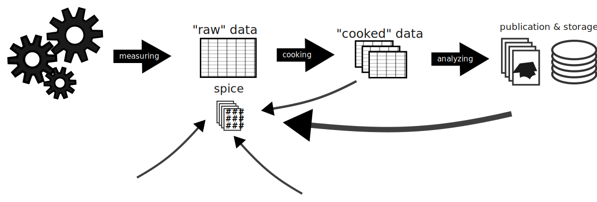

Core Concepts
=============

Frame, Scan, Proposal
---------------------

Nx5d expects its input data as N-dimensional arrays which have their
1st dimension as a raveled index for the current measurement frame
(the "current data point").

The assumption that data dimensions of arrays are stacked "from
slow to fast" is quite a general one. It is compatible with many
scientific data standards, including the
[Nexus format](https://nexusformat.org).
Nx5d is happy enough with a softer version: it requires only that the
outer dimension of every [scan](#scan-a-systematic-series-of-frames)
be the one that entails data
[frames](#frame-the-complete-result-of-one-measurement-step)
in the order they were measured.

The terms "frame", "scan" and "proposal" are at the core of Nx5d's data
model. While the typical scientist will most likely have heard or used
a variation of these, it is essential to unambiguously define them.

### Frame: the (complete) result of one measurement step

When one is performing measurements as a physicist, not only
the actual result like detector values matters. Additional data,
e.g. positioner motor values, temperatures, various voltages,
flow amounts etc, are also essential.

The complete set of values belonging to one measurement is
called a **frame** in Nx5d.


### Scan: a systematic series of frames

Typical measurements are performed by varying positioning parameters
(e.g. angles, temperatures, delay times, voltages...) in a systematic,
N-dimensional way, and recording a frame at every point of that
variation.

A **scan** is such collection of frames, bound together by the scope of
a specific trajectory through the parameter space.
It is thus a list of frames, i.e. a 1-dimensional collection, if
viewed through an engineer's glasses.
But to a physicist, a scan can be N-dimensional -- for instance if
various positioners are "scanned" in a rasterizing manner across the
parameter space. 

Nx5d expects to ingest its data in an engineer's view: as a bunch of
arrays with a 1-st dimension that needs to be collapsed (flattened)
with respect to the scanning through the parameter space, if the
scan was multi-dimensional.

Within a scan, every *frame* has an integer index, beginning with 0
and increasing strictly by 1, up to N-1 (with the total number of
frames being N).


### Proposal: collection of scans bound by scientific scope

A collection of scans is called a **proposal** in Nx5d.

The term "proposal" typically implies a specific scientific case,
or an organisation of data tied by topic requirements. Often
measurements are being performed within a limited time,
e.g. the few days of "beamtime".
How many scans make up a
proposal is application dependent, but several hundreds is typical
for X-ray diffraction.

With respect to the technical internals of Nx5d, we impose no such
restriction on a proposal's scope. But keeping to the smallest
useful scientific case simply is good scientific practice,
and with Nx5d being all about the *efficient* management
of [proposal-level metadata](), this common practice is highly
encouraged.

Other terms you might encounter for bunching scans together
could be "projects" or "sessions". However, the term "project" suggets
a much broader scope (possibly spanning months or years of research).
This can lead to confusion, as managing *projects* isn't primarily
Nx5d's primary usage scenario.

Within a proposal, every scan has an ID. The ID can be numerical
or string-based, but when all IDs of a proposal are sorted, their order
*must* represent the chronological order in which they were collected.
For example, timestamps or incrementing integers are valid scan IDs
for Nx5d; UUIDs are *not*.

## The Processing Model

### Proposal Scoped, Scan Based

The proposal structure needs to be acknowledged when
developing analysis automation.
Although Nx5d focuses on *scan based* processing, it is
designed to manage processing metadata on a *proposal
scoped* level.

A proposal may contain a large number of scans.
However, not every one is unique: they come in clusters
where subsequent scans are of similar **type**.
The number of *fundamentally different* scans in a proposal,
i.e. differing in type, is typically in the single-digit range.

To illustrate, below is an excerpt from the structure of
a real-life proposal, encompassing a total of 465 scans,
in various clusters:

| **scan** | **type**  | **t** | **no. frames** | **notes**                                |
|----------|-----------|-------|----------------|------------------------------------------|
| *...*    |           |       |                |                                          |
| *r0002*  | alignment | 1     | 200            | dly3=[0, 700]                            |
| *...*    |           |       |                |                                          |
| *r0005*  | alignment | 1     | 20             | x=[1, 11]                                |
| *r0006*  | alignment | 1     | 20             | z=[1.9, 3.9]                             |
| *...*    | ...       | ...   | ...            | ...                                      |
| *r0070*  | sRSM      | 1     | 150            | th=[53.3695, 58.3695] tth=[101.5, 111.5] |
| *r0071*  | sRSM      | 1     | 150            | th=[53.3695, 58.3695] tth=[101.5, 111.5] |
| *r0072*  | sRSM      | 1     | 150            | th=[53.3695, 58.3695] tth=[101.5, 111.5] |
| *r0073*  | sRSM      | 1     | 150            | th=[53.3695, 58.3695] tth=[101.5, 111.5] |
| *r0074*  | sRSM      | 1     | 150            | th=[53.3695, 58.3695] tth=[101.5, 111.5] |
| *r0075*  | sRSM      | 1     | 150            | th=[53.3695, 58.3695] tth=[101.5, 111.5] |
| *r0076*  | sRSM      | 1     | 150            | th=[53.3695, 58.3695] tth=[101.5, 111.5] |
| *r0077*  | rocking   | 1     | 20             | range=[54.3695, 58.3695]                 |
| *r0078*  | rocking   | 1     | 40             | range=[54.5695, 56.5695]                 |
| *r0079*  | rocking   | 1     | 40             | range=[54.6195, 56.6195]                 |
| *r0080*  | alignment | 2     | 50             | dmf=[-2000, 2000]                        |
| *...*    |           |       |                |                                          |
| *r0127*  | sRSM      | 40    | 40             | th=[52.75, 54.75] tth=[105.7, 109.7]     |
| *r0128*  | sRSM      | 40    | 40             | th=[52.75, 54.75] tth=[105.7, 109.7]     |
| *r0129*  | sRSM      | 40    | 40             | th=[52.75, 54.75] tth=[105.7, 109.7]     |
| *r0130*  | sRSM      | 40    | 40             | th=[52.75, 54.75] tth=[105.7, 109.7]     |
| *...*    | ...       | ...   | ...            | ...                                      |

### Two-Step Processing

We split the data processing in two distinct steps:
**cooking** and **analyzing**.

*Cooking* is the transformation of raw data into
**cooked data**. The main difference from raw is that
it's represented application's natural coordinate system.
Such a transformation is primarily an engineering task,
requiring no scientific context.

*Analyzing*, on the other hand, is the process of gaining
scientific insight. This is, in contrast, heavily tied to
a scientific context, and is an operation for which raw data
is utterly inadequate.

The boundary between the two processing steps is the
**decision boundary**. This is because cooking data requires
virtually no human decision-making (*"A well-trained monkey could do it!"*
<sup>- cheeky Nx5d devs</sup>). Meanwhile analyzing is *all about*
scientific decisions.

This doesn't imply that cooking is easier or simpler,
often quite to the contrary. But it's a more rewarding
target for automation than analyzing.

The main difficulty is that processing data is not a linear
process. Strictly one-way pipelines of the form
"measure -> cook -> analyze"
are unicorns. More commonly, processing requires at least some
degree of individually adjusted, case-specific processing metadata.
As illustrated below, sometimes that metadata is *also* a product
of a later processing step -- be it for reaasons intrinsical to
the experiment, or just out of engineering limitations of the day:



## The Spice Concept

### Spice Data Model

This kind of metadata, that is necessary for cooking but subject
to non-linear workflows, is what we call **spice**.
It is organized as a list of
key-value pairs where the keys are all strings, and the values are
JSON compatible data -- i.e. scalars, arrays, objects, all of these
possibly nested. In the context of a proposal, spice keys are
clustered together in **spice types**, i.e. sets of object
(or "dictionaries") with a given name.

Examples of such metadata include: offset corrections, initial
parameters for fits, boundaries for data filtering; but also purely
algorithmic settings like grid sizes and resolutions, reduction
strategies etc.

To convey an idea, here are two example types for spice at the
BESSY-II KMC3-XPP beamline:

- `exp_info`, describing the experimental X-ray diffraction
  geometry in an algorithm-agnostic way:
  ```python
  {
      "goniometerAxes": {"theta": "y-", "chi": "x+", "phi": "z+"},
      "detectorAxes": {"tth": "y-"},
      "detectorTARAlign": [0.0, 0.0, 0.0],
      "imageAxes": ["y+", "z-"],
      "imageSize": [195, 487],
      "imageCenter": [95, 244],
      "imageDistance": 481.0,
      "imageChannelSize": [0.172, 0.172],
      "sampleFaceUp": "z+",
      "beamDirection": [1, 0, 0],
      "sampleNormal": [0, 0, 1],
      "beamEnergy": 10000.0,
  }
  ```
  
- `offsets`, supplying additional corrections for the angles
  Chi, Phi, Theta and Omega (respectively 2-Theta):
  ```python
  {
      "chi": 0.0,
      "phi": 0.0,
      "theta": 0.0,
      "tth": 0.0
  }
  ```

Adequate management of spice, its defaults, and resulting values for
a particular scan, is crucial. This is the central point
of Nx5d's iterative data processing model.

### Editing Spice

There are several operations that we define for spice:

- **Seeding** is introducing a spice type to a
  proposal. After seeding, a spice type is available with its
  default seed values for every scan.
  
- **Viewing** is retrieving spice values
  with respect to a *view point*, i.e. a scan ID. For a freshly
  seeded spice type, all view points will yield the same value,
  but *anchoring* (see below) alters this behavior.

- **Anchoring** (also called **branching**) is 
  creating an *anchor point* at a specific scan ID, i.e. a
  permanent boundary for the propagation of updates to a spice
  type (see below).
  
- **Updating** is changing a spice value. Updates
  are always specified with respect to a view point, and
  propagate only between two adjacent anchor points -- or
  the corresponding boundary of the scan list in either
  direction, if no limiting anchor point is encountered.

Every spice operation is *timeless* with respect to the
raw data: i.e. it takes effect retroactively, for *all* scans
of a proposal, future and past.
This means that, once a spice operation has been performed,
processing steps (in particular cooking) performed in the past
need to be performed again.
  
To illustrate, for the earlier proposal example the full spice
database with anchor points looks like the following table:

| **anchor** | `offsets`                          | `exp_info`                   |
|------------|------------------------------------|------------------------------|
|            | initial: phi=0 chi=0 theta=0 tth=0 | initial: (values suppressed) |
| *r0043*    |                                    | beamEnergy=10207             |
| *r0047*    |                                    | beamEnergy=10000             |
| *r0058*    |                                    | beamEnergy=6800              |
| *r0118*    | theta=30                           | beamEnergy=10207             |
| *r0120*    | theta=1.5                          |                              |
| *r0164*    |                                    | beamEnergy=6800              |
| *r0226*    |                                    | beamEnergy=10207             |
| *r0238*    |                                    | beamEnergy=13614             |
| *r0279*    |                                    | beamEnergy=10000             |
| *r0412*    |                                    | beamEnergy=10207             |
| *r0431*    |                                    | beamEnergy=13614             |

Here we see the initial seeding of both types, then two subsequent anchor
points and updates (*r0118* and *r0120*) for `offsets`, and 10 anchor points
with modification to its "beamEnergy" parameter for `exp_info`.

This allows to address a very large number of scans, while still permitting
the propagation of *specific* settings to the exact scan they're required.

### Recipes

With the parameter model in place, the final step is actual data
processing: creating of cooking algorithms. To use the food metaphor
one last time, we call such algorithms **recipes**.

Every scan type of a proposal is mapped to a processing recipe.
The specifics of how this is done are left to the specific Nx5d backend.
But now that we have a proposal-scoped mechanism for settings management,
using it to define which algorith to use for cooking of which scan type
is encouraged, and is the default for backends shipped natively with Nx5d.

In A Nutshell
-------------

The Nx5d proposal model is shown "in a nutshell" in the image below.
The essential features shown are:

- the data is a collection of scans
- each scan has a specific collection of frames
- the exact structure of the frames (which arrays / dimensions) may
  differ from scan to scan, but are largely repetitive
- additional data, *spice*, is made available alongside scans
- each spice type in itself varies on a relatively slow scale
- eacn scan has access to a well-defined, but individual "view"
  of a spice blend, required for further processing.


This is how, at its core, Nx5d is an engine for management and
propagation of scan-level settings, through an elaborate system 
of proposal-level fallback mechanisms.
