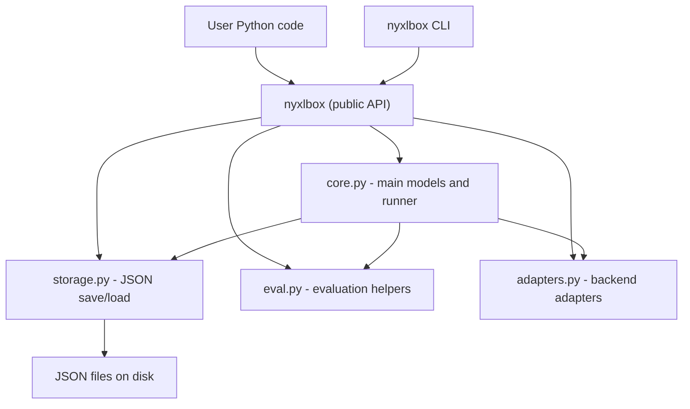

# NyxlBox
Lightweight framework for running and evaluating LLM-style experiments.

NyxlBox provides structured experiment definitions, adapters for model backends, JSON storage utilities, evaluation helpers, and a command line interface. It is designed to be simple, extensible, and suitable for reproducible model experimentation workflows.

---

## Features

- Typed experiment and result models using Pydantic
- Unified experiment runner for any callable model or adapter
- JSON storage for experiments and results
- Evaluation helpers such as exact match and substring checks
- Adapter system with FunctionAdapter
- Command line interface for running and evaluating experiments
- Full pytest test suite

---

## Architecture Overview

For more details see: docs/architecture.md

---

## Installation

NyxlBox requires Python 3.10 or newer.

### Create a virtual environment (recommended)

Windows (PowerShell):
python -m venv .venv
.\.venv\Scripts\activate

macOS / Linux:
python3 -m venv .venv
source .venv/bin/activate

### Install in editable mode (from source)

pip install -e .

Install optional development tools:
pip install -e .[dev]

---

## Quickstart

Create quickstart.py:

from nyxlbox import Experiment, PromptCase, run_experiment

def model(prompt: str) -> str:
    return prompt.upper()

experiment = Experiment(
    name="demo",
    model_name="uppercase",
    cases=[
        PromptCase(input_text="hello"),
        PromptCase(input_text="nyxlbox"),
    ],
)

results = run_experiment(experiment, model)

for item in results:
    print(item.case_id, "=>", item.output_text)

Run:
python quickstart.py

---

## Storage

from nyxlbox import (
    save_experiment, load_experiment,
    save_results, load_results
)

save_experiment(experiment, "exp.json")
loaded = load_experiment("exp.json")

save_results(results, "results.json")
loaded_results = load_results("results.json")

---

## Evaluation

from nyxlbox import evaluate_results, exact_match

gold_outputs = ["HELLO", "NYXLBOX"]

evaluated = evaluate_results(
    results=results,
    gold_outputs=gold_outputs,
    evaluators=[exact_match()],
)

for item in evaluated:
    metric = item.metrics[0]
    print(metric.name, metric.passed, metric.score)

---

## Adapters

from nyxlbox import FunctionAdapter, run_experiment, Experiment, PromptCase

def reverse_model(text: str) -> str:
    return text[::-1]

adapter = FunctionAdapter(reverse_model)

experiment = Experiment(
    name="reverse_demo",
    model_name="reverse",
    cases=[PromptCase(input_text="hello")]
)

results = run_experiment(experiment, adapter)
print(results[0].output_text)

---

## CLI

Run experiment:
nyxlbox run experiment.json --results results.json --model-kind upper

Evaluate:
nyxlbox eval results.json gold.json

Built in model kinds:
- echo
- upper
- reverse

---

## Project Structure

src/nyxlbox/
  core.py
  storage.py
  eval.py
  adapters.py
  cli.py
tests/
examples/
docs/architecture.md

---

## Development

pytest
python -m build

---

## License

Apache License 2.0
See LICENSE for details.
