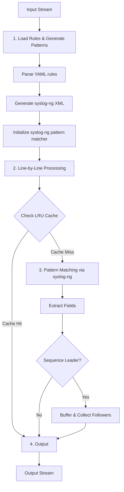

# How patterndb-yaml Works

Technical details of the log normalization algorithm.

## Core Algorithm

patterndb-yaml combines YAML-defined rules with [syslog-ng's](https://www.syslog-ng.com/technical-documents/doc/syslog-ng-open-source-edition/3.38/administration-guide/56#TOPIC-1829130) patterndb engine for pattern matching. The algorithm processes logs line-by-line with constant memory usage, making it suitable for files of any size.

### Architecture



### Processing Phases

**Initialization:**
- Parse YAML rules and generate syslog-ng XML patterns
- Initialize syslog-ng pattern matcher with temporary XML file
- Set up LRU cache (65,536 entries) and sequence buffers

**Per-Line Processing:**
- Strip ANSI escape codes
- Check LRU cache for identical lines (O(1) if cached)
- Match against syslog-ng patterns (first match wins)
- Extract fields and apply output template
- Buffer multi-line sequences if needed

**Finalization:**
- Flush buffered sequences
- Output statistics and clean up temporary files

## Key Concepts

### Pattern Matching

Pattern matching is performed by [syslog-ng's patterndb engine](https://syslog-ng.github.io/admin-guide/120_Parser/006_db_parser/000_Classifying_log_messages/001_How_pattern_matching_works), which uses a radix tree for efficient matching. patterndb-yaml generates syslog-ng XML from YAML rules, then applies **first-match-wins** rule ordering:

```python
for rule in rules:  # patterndb-yaml rule order
    if syslog_ng_matches(line, rule.pattern):  # syslog-ng engine
        return apply_template(rule.output, extracted_fields)
```

YAML pattern components map to syslog-ng patterns:
- **`text`** - Exact string match
- **`serialized`** - Special characters (tabs, newlines)
- **`field`** - Variable content extraction
- **`alternatives`** - Match any of several options

Fields extract text until the next delimiter or end of line. The NUMBER parser extracts only digits.

### ANSI Code Handling

Terminal colors and formatting are stripped before pattern matching to ensure patterns work correctly with colored output.

### LRU Caching

An LRU cache (65,536 entries) stores results for previously seen lines, providing O(1) lookups for repeated lines. This is effective for logs with repetitive content like health checks or periodic status messages.

### Multi-Line Sequences

Multi-line log entries (e.g., stack traces) are handled through sequence patterns with leaders and followers:

1. Detect sequence leader (rule with `sequence` configuration)
2. Buffer leader and matching follower lines
3. Flush buffer when non-matching line encountered or input ends

Sequences are buffered in memory and flushed as complete units.

## Rule Ordering

**First-match-wins** means rule order matters. Place specific patterns before general ones:

```yaml
# CORRECT - specific before general
rules:
  - name: specific_error
    pattern:
      - field: timestamp
      - text: " ERROR Connection failed"
    output: "[ERROR:CONNECTION]"

  - name: general_error  # Matches after specific patterns tried
    pattern:
      - field: timestamp
      - text: " ERROR "
    output: "[ERROR]"
```

If ordered incorrectly (general before specific), the specific pattern will never match.

## See Also

- **[Performance Guide](../guides/performance.md)** - Optimization strategies
- **[Basic Concepts](../getting-started/basic-concepts.md)** - User-focused overview
- **[syslog-ng Pattern Database](https://syslog-ng.github.io/admin-guide/120_Parser/006_db_parser/004_The_syslog-ng_patterndb_format/README)** - Underlying pattern matching engine
