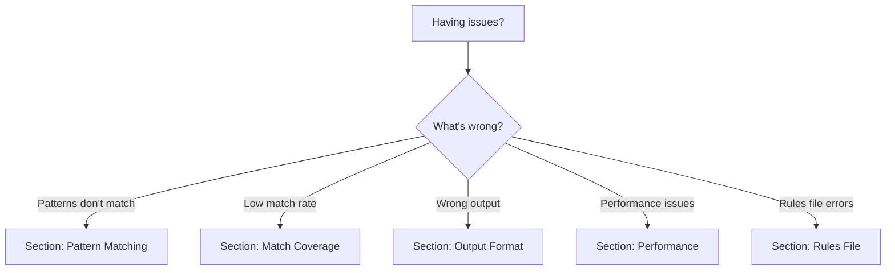

# Troubleshooting Guide

Solutions to common problems when using patterndb-yaml.

## Quick Diagnosis

Use this flowchart to identify your issue:



## Section 1: Pattern Matching Issues

### Problem: Pattern doesn't match expected lines

**Symptom**: Lines you expect to match are passing through unchanged

**Common causes**:

#### Cause 1: Extra whitespace

**Diagnosis**:
```bash
# Show hidden characters
cat -A input.log | head -5
```

**Solution**: Patterns must match whitespace exactly. Use `--explain` to see why patterns don't match:

```bash
patterndb-yaml --rules rules.yaml --explain test.log 2>&1 | \
    grep "No pattern matched"
```

**Example issue**:
```yaml
# Wrong: assumes single space
pattern:
  - text: "ERROR: "

# Input has tab:
# "ERROR:\tConnection failed"
```

**Fix**:
```yaml
# Match tab explicitly
pattern:
  - text: "ERROR:"
  - serialized: "\t"
  - field: message
```

#### Cause 2: Pattern order matters

**Diagnosis**: More specific pattern placed after general pattern

**Solution**: Reorder rules - put specific patterns BEFORE general ones

**Example issue**:
```yaml
rules:
  # General pattern catches everything first
  - name: generic_error
    pattern:
      - field: timestamp
      - text: " ERROR: "
      - field: message
    output: "[ERROR]"

  # Specific pattern never reached
  - name: connection_error
    pattern:
      - field: timestamp
      - text: " ERROR: Connection "
      - field: details
    output: "[ERROR:CONNECTION]"
```

**Fix**: Reverse the order:
```yaml
rules:
  # Specific first
  - name: connection_error
    pattern:
      - field: timestamp
      - text: " ERROR: Connection "
      - field: details
    output: "[ERROR:CONNECTION]"

  # General last
  - name: generic_error
    pattern:
      - field: timestamp
      - text: " ERROR: "
      - field: message
    output: "[ERROR]"
```

#### Cause 3: Field extraction consumes unexpected text

**Diagnosis**: Field without delimiter consumes rest of line

**Solution**: Add text component after field to delimit it

**Example issue**:
```yaml
# Bad: 'status' field consumes everything after it
pattern:
  - text: "Status: "
  - field: status

# Input: "Status: 200 OK"
# Field 'status' = "200 OK" (not just "200")
```

**Fix**:
```yaml
# Good: Delimit with space
pattern:
  - text: "Status: "
  - field: status_code
  - text: " "
  - field: status_text
```

### Problem: Pattern matches too much

**Symptom**: Pattern matching lines it shouldn't

**Diagnosis**: Pattern is too general

**Solution**: Add more specific text components

**Example**:
```yaml
# Too general - matches any line with timestamp
pattern:
  - field: timestamp
  - text: " "
  - field: message

# More specific - only matches ERROR lines
pattern:
  - field: timestamp
  - text: " ERROR: "
  - field: message
```

## Section 2: Match Coverage Issues

### Problem: Low match rate (< 95%)

**Symptom**: Statistics show low match percentage

**Diagnosis**:
```bash
# See which lines don't match
patterndb-yaml --rules rules.yaml --explain input.log 2>&1 | \
    grep "No pattern matched" | \
    head -20
```

**Solutions**:

#### Solution 1: Find common unmatched patterns

```bash
# Extract unmatched lines
patterndb-yaml --rules rules.yaml --explain input.log 2>&1 | \
    grep "Line.*No pattern" | \
    sed 's/.*Line //' | \
    sed 's/: No.*//' | \
    while read line_num; do
        sed -n "${line_num}p" input.log
    done > unmatched.log

# Look for patterns in unmatched lines
head -20 unmatched.log
```

#### Solution 2: Use statistics to identify gaps

```python
from patterndb_yaml import PatterndbYaml
from pathlib import Path

processor = PatterndbYaml(
    rules_path=Path("docs/guides/fixtures/rules.yaml")
)

with open("docs/guides/fixtures/input.log") as f:
    from io import StringIO
    output = StringIO()
    processor.process(f, output)

stats = processor.get_stats()
match_rate = stats['match_rate']

if match_rate < 95:
    print(f"WARNING: Only {match_rate:.1f}% of lines matched")
    unmatched = stats['lines_processed'] - stats['lines_matched']
    print(f"Missing patterns for {unmatched} lines")
```

### Problem: Match rate suddenly drops

**Symptom**: Previously high match rate drops after log format change

**Diagnosis**: Log format changed

**Solution**: Add new patterns for new format, keep old patterns for backward compatibility

```yaml
rules:
  # Old format (keep for backward compat)
  - name: old_format
    pattern:
      - field: timestamp
      - text: " [LOG] "
      - field: message
    output: "[{message}]"

  # New format (add for new logs)
  - name: new_format
    pattern:
      - field: timestamp
      - text: " | "
      - field: level
      - text: " | "
      - field: message
    output: "[{message}]"
```

## Section 3: Output Format Issues

### Problem: Output doesn't match expectations

**Symptom**: Normalized output looks wrong

**Diagnosis**: Field names in output template don't match pattern

**Solution**: Ensure output template uses exact field names from pattern

**Example issue**:
```yaml
pattern:
  - field: user_id  # Field name is 'user_id'
  - text: " "
  - field: action

output: "[USER:{userid}]"  # Wrong: 'userid' != 'user_id'
```

**Fix**:
```yaml
output: "[USER:{user_id}]"  # Correct: matches field name
```

### Problem: Extra fields appear in output

**Symptom**: Output includes fields you want to ignore

**Solution**: Don't include unwanted fields in output template

```yaml
pattern:
  - field: timestamp  # Extract but don't use
  - text: " "
  - field: message

output: "{message}"  # Don't include {timestamp}
```

## Section 4: Rules File Issues

### Problem: YAML syntax error

**Symptom**: Error message about YAML parsing

**Diagnosis**:
```bash
# Validate YAML syntax
python3 -c "import yaml; yaml.safe_load(open('rules.yaml'))"
```

**Common YAML mistakes**:

#### Mistake 1: Incorrect indentation

```yaml
# Wrong: inconsistent indentation
rules:
  - name: test
   pattern:  # Should be 4 spaces
```

#### Mistake 2: Missing quotes for special characters

```yaml
# Wrong: colon not quoted
output: [ERROR:CONNECTION]

# Right: quote strings with special chars
output: "[ERROR:CONNECTION]"
```

#### Mistake 3: List vs mapping confusion

```yaml
# Wrong: pattern should be list of dicts
pattern:
  field: timestamp
  text: " "

# Right: pattern is list
pattern:
  - field: timestamp
  - text: " "
```

### Problem: Rules file not found

**Symptom**: `FileNotFoundError: rules.yaml`

**Diagnosis**:
```bash
# Check file exists
ls -l rules.yaml

# Check current directory
pwd
```

**Solution**: Provide full path or ensure file is in current directory

```bash
# Relative path
patterndb-yaml --rules ./rules.yaml input.log

# Absolute path
patterndb-yaml --rules /path/to/rules.yaml input.log
```

## Section 5: Field Extraction Issues

### Problem: Field extracts wrong value

**Symptom**: Field contains unexpected data

**Diagnosis**: Field extraction is greedy - consumes until next delimiter

**Solution**: Add explicit delimiters

**Example issue**:
```yaml
# Input: "User: alice status: active"
pattern:
  - text: "User: "
  - field: username  # Extracts "alice status: active" - too much!
  - field: status    # Never gets to extract anything
```

**Fix**:
```yaml
# Add delimiter to stop username extraction
pattern:
  - text: "User: "
  - field: username
  - text: " status: "  # Delimiter stops username at "alice"
  - field: status      # Now extracts "active"
```

### Problem: NUMBER parser doesn't match

**Symptom**: Pattern with NUMBER parser fails to match

**Diagnosis**: Input contains non-numeric characters

**Solution**: Ensure field contains only digits

```yaml
# Input: "Count: 42 items"
pattern:
  - text: "Count: "
  - field: count
    parser: NUMBER  # Matches "42"
  - text: " items"  # Required delimiter
```

## Getting Help

### Before Asking for Help

Gather this information:

1. **patterndb-yaml version**:
   ```bash
   patterndb-yaml --version
   ```

2. **Command used**:
   ```bash
   # Include full command with all options
   patterndb-yaml --rules rules.yaml --explain input.log
   ```

3. **Sample input** (first 20 lines):
   ```bash
   head -20 input.log
   ```

4. **Expected vs actual output**:
   - What you expected to happen
   - What actually happened

5. **Statistics**:
   ```bash
   patterndb-yaml --rules rules.yaml --stats-format json input.log 2>&1
   ```

6. **Explain output** (for pattern matching issues):
   ```bash
   patterndb-yaml --rules rules.yaml --explain input.log 2>&1 | head -50
   ```

### Where to Get Help

- **GitHub Issues**: https://github.com/JeffreyUrban/patterndb-yaml/issues
- **Documentation**: https://patterndb-yaml.readthedocs.io
- **Examples**: Check [Common Patterns](./common-patterns.md)

## Common Error Messages

### Error: "Invalid YAML in rules file"

**Cause**: YAML syntax error

**Solution**: Validate YAML syntax:
```bash
python3 -c "import yaml; print(yaml.safe_load(open('rules.yaml')))"
```

### Error: "Pattern component missing required field"

**Cause**: Pattern component lacks required key (e.g., `field`, `text`)

**Solution**: Each component needs one of: `field`, `text`, `serialized`, or `alternatives`

```yaml
# Wrong
pattern:
  - timestamp  # Missing key

# Right
pattern:
  - field: timestamp
```

### Error: "Output template references undefined field"

**Cause**: Output template uses field not in pattern

**Solution**: Only use fields defined in pattern

```yaml
pattern:
  - field: user
  - text: " "
  - field: action

output: "[{user}:{action}]"  # OK: both fields defined
# output: "[{user}:{status}]"  # ERROR: 'status' not defined
```

## Debugging Workflow

1. **Start with explain mode**:
   ```bash
   patterndb-yaml --rules rules.yaml --explain test.log 2>&1 | less
   ```

2. **Check match rate**:
   ```bash
   patterndb-yaml --rules rules.yaml --stats-format json test.log 2> stats.json
   jq '.match_rate' stats.json
   ```

3. **Find unmatched lines**:
   ```bash
   patterndb-yaml --rules rules.yaml --explain test.log 2>&1 | \
       grep "No pattern matched"
   ```

4. **Test single pattern**:
   Create a rules file with just one pattern to test it in isolation

5. **Verify output**:
   ```bash
   patterndb-yaml --rules rules.yaml test.log --quiet | head -20
   ```

## See Also

- [Common Patterns](./common-patterns.md) - Pattern examples
- [Rules Documentation](../features/rules/rules.md) - Complete syntax
- [Performance Guide](./performance.md) - Optimization tips
- [Basic Concepts](../getting-started/basic-concepts.md) - How it works
