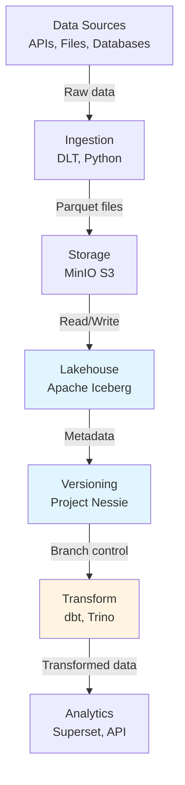

# Part 1: What is a Data Lakehouse? Understanding Modern Data Architecture

## The Problem We're Solving

Traditional data pipelines have a fundamental problem: **they force you to choose**.

Either you have:
- **A Data Lake**: cheap, flexible storage but chaotic and hard to query
- **A Data Warehouse**: organized, fast queries but rigid and expensive

Phlo solves this by combining the best of both worlds into a **lakehouse**.

## The Three Eras of Data Architecture

### Era 1: The Data Warehouse (1990s-2010s)
- Structured SQL queries
- Fast analytics
- Problem: Expensive, rigid schema, can't scale easily

### Era 2: The Data Lake (2010s-2020s)
- Store raw data cheaply in object storage
- Flexible schema
- Problem: "Swamp" syndrome—data is disorganized, hard to query, poor governance

### Era 3: The Data Lakehouse (2020s+)
- **Open table formats** (Apache Iceberg) provide structure on top of cheap object storage
- Git-like versioning (Project Nessie) for data governance
- ACID transactions and schema enforcement
- Query engines (Trino, DuckDB) for analytics
- **Result**: Lake economics + warehouse reliability

## What Makes Phlo a Lakehouse?

```
Traditional Warehouse    vs    Phlo Lakehouse
─────────────────────          ──────────────────
Closed format                  Apache Iceberg (open)
Vendor lock-in                 S3-compatible storage
Single query engine            Trino, DuckDB, Spark
No versioning                  Git-like branching
Expensive storage              MinIO object storage
Rigid schemas                  Schema evolution
```

## The Phlo Stack at a Glance



## Key Concepts Explained

### 1. Apache Iceberg (Table Format)

Imagine you're storing data in a filing cabinet. A table format is the **file organization system** that lets you:

```
Instead of:
s3://lake/
  entry-001.parquet
  entry-002.parquet
  (which file is current?)

Iceberg provides:
s3://lake/entries/
  metadata/
    v1.metadata.json      ← "This is the current version"
    snap-123.avro         ← "What changed in this snapshot"
  data/
    part-001.parquet      ← "Actual data files"
    part-002.parquet
```

**Benefits**:
- ACID transactions (consistent reads/writes)
- Time travel (query data as it was on Oct 15)
- Schema evolution (change structure without rewriting data)
- Hidden partitioning (faster queries automatically)

### 2. Project Nessie (Git for Data)

Just like Git tracks code changes, Nessie tracks data changes:

```bash
# Create a dev branch to test transformations
nessie branch create dev

# Work on dev independently
SELECT * FROM iceberg.bronze.entries (branch: dev)

# Validate, then merge to main
nessie merge dev -> main
```

**Why it matters**:
- Dev/test/prod data isolation
- Atomic multi-table commits
- Reproducibility (tag versions)
- Rollback if something breaks

### 3. Trino (Query Engine)

A distributed SQL query engine that understands Iceberg tables:

```sql
-- Trino queries Iceberg tables natively
SET SESSION iceberg.nessie_reference_name = 'main';

SELECT 
  date_trunc('hour', reading_timestamp) as hour,
  avg(glucose_mg_dl) as avg_glucose
FROM iceberg.silver.fct_glucose_readings
WHERE reading_date = DATE '2024-10-15'
GROUP BY 1
ORDER BY 1 DESC;
```

### 4. dbt (Transform)

SQL-based data transformation with version control and testing:

```sql
-- dbt model: silver/fct_glucose_readings.sql
SELECT
  entry_id,
  glucose_mg_dl,
  reading_timestamp,
  CASE 
    WHEN glucose_mg_dl < 70 THEN 'hypoglycemia'
    WHEN glucose_mg_dl <= 180 THEN 'in_range'
    ELSE 'hyperglycemia'
  END as glucose_category
FROM {{ ref('stg_glucose_entries') }}
```

dbt handles:
- SQL execution and dependencies
- Data quality tests
- Documentation generation
- Lineage tracking

### 5. Dagster (Orchestration)

Declarative asset orchestration that tracks what data depends on what:

```python
import phlo

@phlo.ingestion(
    table_name="glucose_entries",
    unique_key="_id",
    validation_schema=RawGlucoseEntries,
    group="nightscout",
    cron="0 */1 * * *",
)
def glucose_entries(partition_date: str):
    """Ingest Nightscout data daily with automatic DLT + Iceberg merge"""
    # Return DLT source - decorator handles staging, validation, merge
    return rest_api(...)

@asset
def dbt_transform(dbt: DbtCliResource) -> None:
    """Run dbt models on latest data"""
    # Execute transformations

@asset(deps=[glucose_entries, dbt_transform])
def publish_marts() -> None:
    """Publish marts to Postgres after ingestion and transform"""
    # Copy data to marts
```

## The Data Flow in Phlo

```
1. INGEST
   ┌─────────────────────┐
   │ Nightscout API      │
   │ (glucose data)      │
   └──────────┬──────────┘
              │
              ↓ (DLT + PyIceberg)
   ┌─────────────────────────────────┐
   │ S3 Staging (MinIO)              │ ← Temporary parquet files
   └──────────┬──────────────────────┘
              │
              ↓ (Merge with dedup)
   ┌──────────────────────────────────────┐
   │ Iceberg Table: raw.glucose_entries   │ ← Immutable, ACID
   │ Branch: main (production)            │
   └──────────┬───────────────────────────┘

2. TRANSFORM
              ↓ (dbt + Trino)
   ┌──────────────────────────────────────┐
   │ Iceberg Table: bronze.stg_entries    │ ← Type conversions
   └──────────┬───────────────────────────┘
              │
              ↓
   ┌──────────────────────────────────────┐
   │ Iceberg Table: silver.fct_readings   │ ← Business logic
   └──────────┬───────────────────────────┘
              │
              ↓
   ┌──────────────────────────────────────┐
   │ Iceberg Table: gold.dim_date         │ ← Dimensions
   └──────────┬───────────────────────────┘

3. PUBLISH
              ↓ (Trino → Postgres)
   ┌──────────────────────────────────────┐
   │ Postgres: marts.mrt_glucose_overview │ ← Fast for BI
   └──────────┬───────────────────────────┘
              │
              ↓ (SQL queries)
   ┌──────────────────────────────────────┐
   │ Superset Dashboard                   │ ← Visualization
   └──────────────────────────────────────┘
```

## Why This Matters (Real Benefits)

| Problem | Traditional | Phlo Solution |
|---------|-------------|------------------|
| Data costs | High (warehouse fees) | Low (S3 storage) |
| Query speed | Fast | Fast (Trino optimization) |
| Schema changes | Painful rewrites | Easy evolution |
| Governance | Manual processes | Git-like branching |
| Vendor lock-in | Yes (Snowflake, Redshift) | No (open formats) |
| Time travel | Not available | Query any past state |
| Data quality | Ad-hoc testing | Built-in (Iceberg snapshots) |

## What You'll Learn in This Series

This blog series walks through:

1. **Part 1** (this): Architecture overview
2. **Part 2**: Setting up Phlo locally
3. **Part 3**: Apache Iceberg table format
4. **Part 4**: Project Nessie versioning
5. **Part 5**: Data ingestion with DLT and PyIceberg
6. **Part 6**: Transform with dbt and Trino
7. **Part 7**: Orchestration with Dagster
8. **Part 8**: Real-world example (glucose monitoring)
9. **Part 9**: Data quality with Pandera
10. **Part 10**: Metadata and governance with OpenMetadata
11. **Part 11**: Observability and monitoring
12. **Part 12**: Production deployment and scaling

Each post includes hands-on examples and code you can run.

## Next Steps

Ready to build? In Part 2, we'll:
- Clone the Phlo repository
- Set up Docker and dependencies
- Start all services with one command
- Run your first data pipeline

**Next**: [Part 2: Getting Started—Setup Guide](02-setup-guide.md)
