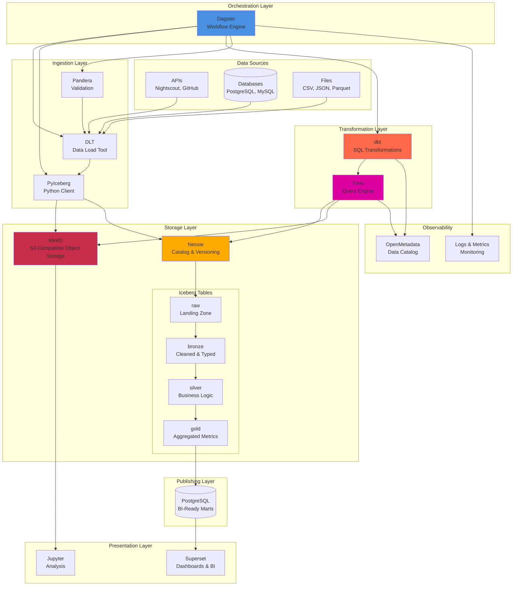

# Phlo Blog Series: Modern Data Engineering

A comprehensive, hands-on guide to building a production-ready data lakehouse using Phlo.

This 12-part series walks through:
- Fundamental concepts of data lakehouses
- Setting up Phlo step-by-step
- Understanding Apache Iceberg and Project Nessie
- Data ingestion patterns
- SQL transformations with dbt
- Orchestration with Dagster
- Data quality and testing
- Real-world end-to-end example
- Metadata and governance
- Observability and monitoring
- Production deployment

Each post includes:
- Clear explanations of concepts
- Code examples you can run
- Diagrams and visualizations
- Hands-on exercises
- References to actual Phlo code

## 5-Minute Quick Start

Want to see it in action immediately? Run this:

```bash
# Clone and start
git clone https://github.com/iamgp/lakehousekit.git phlo
cd phlo
cp .env.example .env
make up

# Wait 2-3 minutes for services to start, then visit:
# - Dagster UI: http://localhost:3000
# - MinIO (storage): http://localhost:9001 (minioadmin/minioadmin123)
# - Superset (dashboards): http://localhost:8088 (admin/admin)

# Materialize your first data pipeline
# In Dagster UI, click "Materialize all" on the asset graph
```

That's it! You now have a working data lakehouse with real glucose data flowing through bronze/silver/gold layers into dashboards.

For detailed setup instructions, see [Part 2: Getting Started](02-setup-guide.md).

## Prerequisites

**System Requirements:**
- **Minimum**: 4 GB RAM, Docker, 10 GB disk space
- **Comfortable**: 8 GB RAM, 2+ CPU cores
- **Optimal**: 16+ GB RAM, 4+ CPU cores, SSD

**Skills:**
- **Required**: Basic SQL knowledge, command line comfort
- **Helpful**: Python familiarity, Docker basics
- **Optional**: Data engineering experience (we'll teach you!)

**Software:**
- Docker & Docker Compose (required)
- Git (required)
- Python 3.11+ with uv (optional, for local development)
- A code editor (VSCode, PyCharm, etc.)

Don't worry if you're missing some skills - the series is designed to teach you as you go!

## Blog Posts

| # | Title | Topics | Time |
|---|-------|--------|------|
| 1 | [What is a Data Lakehouse?](01-intro-data-lakehouse.md) | Architecture, Iceberg, Nessie, overview | 15 min |
| 2 | [Getting Started—Setup Guide](02-setup-guide.md) | Installation, services, first pipeline | 50 min |
| 3 | [Apache Iceberg—Table Format](03-apache-iceberg-explained.md) | Snapshots, schema evolution, time travel | 20 min |
| 4 | [Project Nessie—Git for Data](04-project-nessie-versioning.md) | Branching, versioning, governance | 15 min |
| 5 | [Data Ingestion Patterns](05-data-ingestion.md) | DLT, PyIceberg, merge strategies, validation | 22 min |
| 6 | [dbt Transformations](06-dbt-transformations.md) | Models, testing, layers, best practices | 22 min |
| 7 | [Dagster Orchestration](07-orchestration-dagster.md) | Assets, partitions, scheduling, monitoring | 20 min |
| 8 | [Real-World Example](08-real-world-example.md) | Complete glucose pipeline, end-to-end | 25 min |
| 9 | [Data Quality with Pandera](09-data-quality-with-pandera.md) | Schemas, validation, asset checks | 20 min |
| 10 | [Metadata and Governance](10-metadata-governance.md) | OpenMetadata, data contracts, schema evolution | 25 min |
| 11 | [Observability and Monitoring](11-observability-monitoring.md) | Metrics, alerting, lineage, debugging | 25 min |
| 12 | [Production Deployment](12-production-deployment.md) | Infrastructure config, Kubernetes, HA, scaling | 35 min |
| 13 | [Extending Phlo with Plugins](13-plugin-system.md) | Custom sources, quality checks, transforms | 20 min |

**Total content**: ~8,000 lines, 275+ KB of educational material
**Estimated reading time**: 4.5-6 hours (complete series)

## Phlo Architecture

Here's how all the pieces fit together:



**Key Components:**
- **Dagster**: Orchestrates everything, schedules pipelines, monitors assets
- **DLT + PyIceberg**: Two-step ingestion pattern (stage → merge)
- **MinIO + Nessie**: S3-compatible storage with Git-like versioning
- **Apache Iceberg**: Open table format with ACID, time travel, schema evolution
- **dbt**: SQL transformations with testing and documentation
- **Trino**: Distributed query engine for analytics
- **OpenMetadata**: Data catalog for discovery and lineage

## Learning Paths

### Path 1: Complete Beginner
**Goal**: Understand data lakehouses from scratch

1. Read [Part 1](01-intro-data-lakehouse.md) (architecture concepts)
2. Follow [Part 2](02-setup-guide.md) setup (hands-on)
3. Skim [Part 8](08-real-world-example.md) (see it working)
4. Deep dive [Parts 3-7](03-apache-iceberg-explained.md) (technical details)
5. Skim [Part 9](09-data-quality-with-pandera.md) (why validation matters)

**Time**: 2-3 hours reading + setup

### Path 2: Data Engineer
**Goal**: Learn new tools and patterns

1. Skim [Part 1](01-intro-data-lakehouse.md) (context)
2. [Part 2](02-setup-guide.md) setup
3. [Part 3](03-apache-iceberg-explained.md) (Iceberg deep dive)
4. [Part 4](04-project-nessie-versioning.md) (Nessie concepts)
5. [Parts 5-7](05-data-ingestion.md) (implementation)
6. [Part 8](08-real-world-example.md) (patterns)
7. [Part 9](09-data-quality-with-pandera.md) (validation)
8. [Part 11](11-observability-monitoring.md) (monitoring)

**Time**: 3 hours reading + hands-on

### Path 3: Architect/Decision Maker
**Goal**: Evaluate Phlo for your organization

1. [Part 1](01-intro-data-lakehouse.md) (comparison to alternatives)
2. [Part 3](03-apache-iceberg-explained.md) (open standards benefits)
3. [Part 4](04-project-nessie-versioning.md) (governance story)
4. [Part 8](08-real-world-example.md) (production patterns)
5. [Part 10](10-metadata-governance.md) (governance and compliance)
6. [Part 12](12-production-deployment.md) (scaling and HA)
7. [Architecture Guide](../reference/architecture.md) (deployment options)

**Time**: 2 hours reading

## Key Topics by Post

### Data Architecture
- [Part 1](01-intro-data-lakehouse.md): Overview of lakehouse concept
- [Part 3](03-apache-iceberg-explained.md): Table format innovation
- [Part 4](04-project-nessie-versioning.md): Git-like data versioning

### Getting Started
- [Part 2](02-setup-guide.md): Installation and first run

### Technical Implementation
- [Part 5](05-data-ingestion.md): Ingestion patterns with DLT and PyIceberg
- [Part 6](06-dbt-transformations.md): SQL transformations and testing
- [Part 7](07-orchestration-dagster.md): Scheduling and asset management
- [Part 8](08-real-world-example.md): Complete end-to-end pipeline

### Data Quality and Governance
- [Part 9](09-data-quality-with-pandera.md): Schema validation and the `@phlo.quality` decorator
- [Part 10](10-metadata-governance.md): Data catalog, contracts, and schema evolution
- [Part 11](11-observability-monitoring.md): Metrics, alerting, lineage, and debugging
- [Part 12](12-production-deployment.md): Scaling and high availability

### Extensibility
- [Part 13](13-plugin-system.md): Building custom sources, quality checks, and transforms

## Tools Reference

Each tool has dedicated coverage:

| Tool | Posts | Key Topics |
|------|-------|-----------|
| **Apache Iceberg** | 1, 3, 5, 8 | Snapshots, time travel, schema evolution |
| **Project Nessie** | 1, 4, 8 | Branching, merging, versioning |
| **DLT** | 5, 8 | Data staging, schema normalization |
| **PyIceberg** | 5, 8 | Iceberg operations, table management |
| **dbt** | 1, 6, 8 | Transformations, testing, documentation |
| **Dagster** | 1, 7, 8 | Orchestration, partitions, scheduling |
| **Trino** | 1, 3, 5, 6 | Query engine, Iceberg integration |
| **MinIO** | 1, 2 | Object storage setup and config |
| **Postgres** | 2, 6, 8 | Marts, metadata, BI integration |
| **Superset** | 2, 8 | Dashboarding, visualization |
| **Pandera** | 5, 9 | Schema validation, data quality |
| **OpenMetadata** | 10 | Data catalog, lineage, governance |

## Hands-On Sections

These posts include runnable code and exercises:

- **Part 2**: [Service access and first pipeline](02-setup-guide.md#step-5-first-data-ingestion)
- **Part 3**: [Explore snapshots](03-apache-iceberg-explained.md#hands-on-explore-snapshots)
- **Part 4**: [Query different branches](04-project-nessie-versioning.md#hands-on-explore-nessie)
- **Part 5**: [Trace an ingestion](05-data-ingestion.md#hands-on-trace-an-ingestion)
- **Part 6**: [Run dbt transforms](06-dbt-transformations.md#hands-on-run-dbt-transforms)
- **Part 7**: [Materialize assets](07-orchestration-dagster.md#running-pipelines-manually)
- **Part 8**: [Complete pipeline walk-through](08-real-world-example.md#step-1-understanding-the-api)
- **Part 9**: [Set up Pandera validation](09-data-quality-with-pandera.md#layer-1-pandera-schemas-ingestion)
- **Part 10**: [Query OpenMetadata catalog](10-metadata-governance.md#setting-up-trino-data-source)
- **Part 11**: [Create monitoring dashboards](11-observability-monitoring.md#dashboards-visualizing-health)
- **Part 12**: [Deploy to Kubernetes](12-production-deployment.md#step-5-kubernetes-deployment)

## Common Questions Answered

- **"Do I need to understand Iceberg?"** → Yes, [Part 3](03-apache-iceberg-explained.md) explains why it matters and how it's different
- **"Can I skip dbt and use Python instead?"** → You could, but [Part 6](06-dbt-transformations.md) explains why SQL via dbt is better
- **"How does this compare to Snowflake/Databricks?"** → [Part 1](01-intro-data-lakehouse.md) compares. Key: open-source, no vendor lock-in
- **"Is this production-ready?"** → Yes, see [Part 12](12-production-deployment.md) and [Architecture Guide](../reference/architecture.md)
- **"Can I ingest from databases, not just APIs?"** → Yes, [Part 5](05-data-ingestion.md#handling-different-data-sources) covers the pattern
- **"How do I ensure data quality?"** → [Part 9](09-data-quality-with-pandera.md) covers three validation layers
- **"How do I discover and catalog my data?"** → [Part 10](10-metadata-governance.md) covers OpenMetadata integration
- **"Is my pipeline actually running?"** → [Part 11](11-observability-monitoring.md) covers monitoring and alerts
- **"How do I scale to millions of rows?"** → [Part 12](12-production-deployment.md) covers scaling strategies

## What You'll Build

By the end of this series, you'll have:

- A running lakehouse with Iceberg tables
- Data flowing from an API to dashboards
- Transformations in multiple layers (bronze/silver/gold)
- Data quality checks
- Complete audit trail via versioning
- Operational monitoring and alerts

Plus, knowledge to:
- Add more data sources
- Scale to millions of rows
- Deploy to production
- Implement advanced analytics

## Hands-On Requirements

To follow along:

- **Minimum**: 4 GB RAM, Docker, 10 GB disk space
- **Comfortable**: 8 GB RAM, local development tools (uv, git)
- **Optimal**: 16+ GB RAM, multiple CPU cores, SSD

Most sections can run on minimum spec, just slower.

## Next Steps After This Series

1. **Extend the example**: Add more data sources (GitHub, Fitbit, weather)
2. **Advanced analytics**: Anomaly detection, forecasting
3. **Production deployment**: Kubernetes, cloud migration
4. **Compliance**: Data governance, PII handling, retention policies
5. **ML integration**: Train models on Phlo data

See the main [docs](../index.md) for references and advanced guides.

## Contributing

Find issues in these posts? Want to add examples?

- Check [AGENTS.md](../../AGENTS.md) for contribution guidelines
- Issues and corrections are welcome
- Real-world examples especially appreciated

## Resources

- **Iceberg Docs**: https://iceberg.apache.org/docs/
- **Nessie Docs**: https://projectnessie.org/docs/
- **dbt Docs**: https://docs.getdbt.com/
- **Dagster Docs**: https://docs.dagster.io/
- **Trino Docs**: https://trino.io/docs/current/
- **OpenMetadata Docs**: https://docs.open-metadata.org/

## License

This blog series is part of Phlo, MIT License.

---

**Ready to start?** Begin with [Part 1: What is a Data Lakehouse?](01-intro-data-lakehouse.md)
