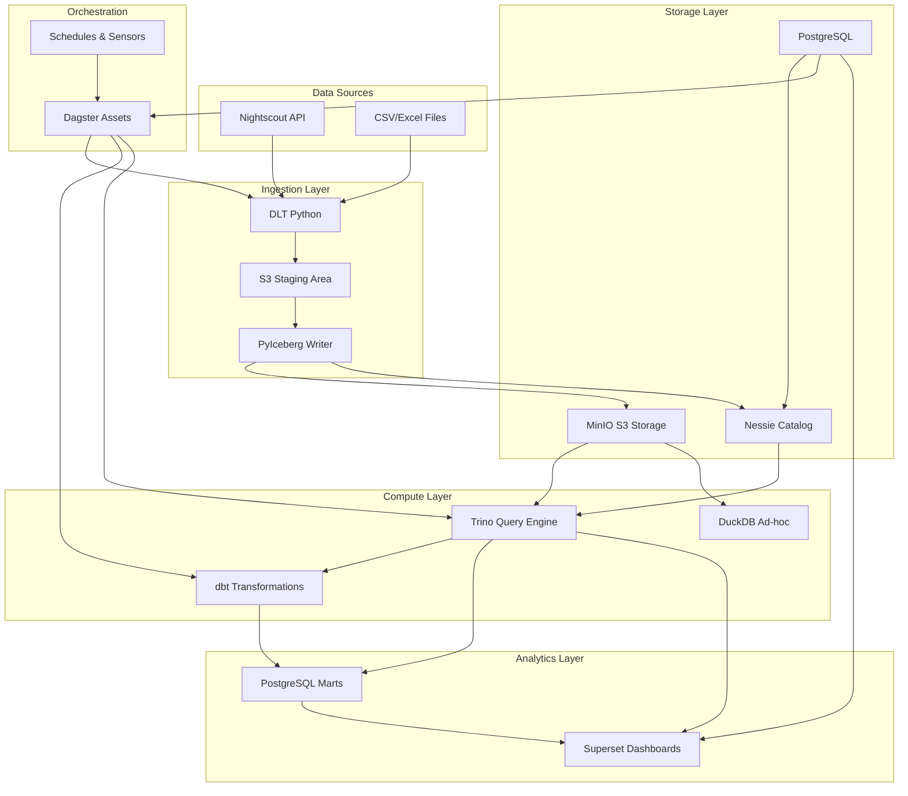

# Architecture Overview

Phlo is built on modern lakehouse principles using Apache Iceberg as the table format and Project Nessie as a Git-like catalog. This architecture provides ACID transactions, schema evolution, time travel, and branch isolation for data engineering workflows.

## Design Principles

### 1. Open Standards
- Apache Iceberg for table format (open spec, multi-engine support)
- S3-compatible storage (portable across cloud providers)
- Standard SQL via Trino
- Open-source components throughout

### 2. Stateless Services
- All state stored in volumes (MinIO, PostgreSQL)
- Services can be restarted without data loss
- Configuration via environment variables
- 12-factor app compliance

### 3. Git-Like Workflows
- Branch isolation (dev/staging/prod)
- Atomic multi-table commits
- Time travel to any point in history
- Tag releases for reproducibility

### 4. Asset-Based Orchestration
- Declarative data assets in Dagster
- Automatic lineage tracking
- Partition-aware dependencies
- Freshness policies for monitoring

## System Architecture

### High-Level Component Diagram

## Key Components

### Storage Layer
- **MinIO**: S3-compatible object storage for data files and Iceberg metadata
- **Nessie**: Git-like catalog for table metadata and branching
- **PostgreSQL**: Relational database for operational metadata and analytics marts

### Compute Layer
- **Trino**: Distributed SQL query engine for analytics
- **dbt**: Data transformation framework with SQL
- **DuckDB**: Embedded analytical database for ad-hoc queries

### Orchestration
- **Dagster**: Asset-based data orchestration platform
- **Schedules & Sensors**: Automated pipeline triggers

### Analytics Layer
- **PostgreSQL Marts**: Curated datasets for BI tools
- **Superset**: Business intelligence and visualization

## Data Flow

1. **Ingestion**: Data sources → DLT → S3 staging → PyIceberg → Iceberg tables
2. **Transformation**: Iceberg tables → dbt → PostgreSQL marts
3. **Querying**: Multiple engines can query Iceberg tables directly
4. **Visualization**: BI tools connect to PostgreSQL marts or query engines

## Branching Strategy

Phlo uses a Git-like branching model for data:

- **main**: Production data (read-only for most users)
- **dev**: Development workspace (read-write)
- **feature branches**: Isolated development environments

See [NESSIE_WORKFLOW.md](../../NESSIE_WORKFLOW.md) for detailed branching workflows.

## For More Details

Read the full [Architecture Guide](../../ARCHITECTURE.md) for complete technical specifications.
