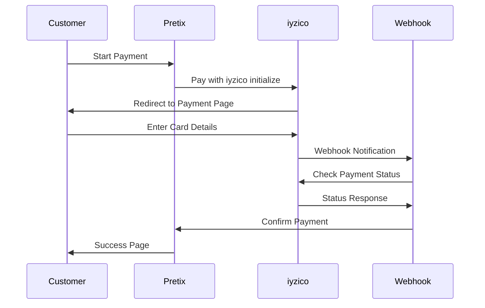

# pretix-iyzico

Pretix payment provider plugin for iyzico integration.

[](https://opensource.org/licenses/Apache-2.0)
[](https://www.python.org/downloads/)
[](https://pretix.eu/)

## About

This plugin integrates the **iyzico** payment gateway with **Pretix**. It was developed by **Fidelio Software** to enable secure online payments for events in Turkey, where global providers like Stripe and PayPal are not available.

We originally built this integration for our own project. Given the robust and flexible nature of Pretix, we wanted to contribute this plugin back to the community. Our goal is to assist other developers and event organizers in the region who face similar payment processing limitations.

## Features

- **Pay with iyzico** full integration
- Support for **Sandbox** (test) and **Production** environments
- Automatic payment confirmation
- Webhook support for reliable status updates
- Installment payment options
- Secure signature verification
- Comprehensive error handling

## Requirements

- Python 3.9+
- Pretix 2.7.0+
- Django 3.2+
- An active iyzico account

## Installation

1.  **Activate your Pretix virtual environment:**

    ```bash
    source /path/to/pretix/venv/bin/activate
    ```

2.  **Install the plugin:**

    ```bash
    pip install pretix-iyzico
    ```

    *Note: If you are installing from source:*

    ```bash
    git clone https://github.com/EmircanKartal/pretix-iyzico.git
    cd pretix-iyzico
    pip install .
    ```

3.  **Restart Pretix:**

    ```bash
    systemctl restart pretix-web pretix-worker
    ```

## Configuration

### 1. Obtain iyzico Credentials

To use this plugin, you must be a registered iyzico merchant.

1.  Log in to your [iyzico Merchant Panel](https://merchant.iyzipay.com/) (or [Sandbox Panel](https://sandbox-merchant.iyzipay.com/) for testing).
2.  Navigate to **Settings** > **Developer Settings**.
3.  Here you will find your **API Key** and **Secret Key**. You will need these for the next step.

### 2. Enable the Plugin in Pretix

1.  Go to your event settings in the Pretix backend.
2.  Navigate to **Settings** > **Plugins**.
3.  Find **iyzico** in the list and click **Enable**.

### 3. Configure Payment Provider

1.  Navigate to **Settings** > **Payment providers**.
2.  Select **iyzico**.
3.  Enter the credentials you obtained from the iyzico panel:
    - **API Key**
    - **Secret Key**
4.  **Sandbox Mode:**
    - Check the **Use Sandbox** box if you are using test credentials from the iyzico Sandbox environment.
    - Uncheck it for live production payments.
5.  Click **Save**.

### 4. Webhook Setup (Optional but Recommended)

Webhooks ensure your orders are marked as paid even if the user closes their browser before returning to your site.

1.  In your iyzico merchant panel, contact iyzico support or check your settings to set the return and webhook URLs.
2.  Your endpoint URLs are:
    - **Return URL:** `https://your-domain.com/iyzico/return/`
    - **Webhook URL:** `https://your-domain.com/iyzico/webhook/`

## Payment Flow



## Development

To set up a local development environment:

```bash
git clone https://github.com/EmircanKartal/pretix-iyzico.git
cd pretix-iyzico
pip install -e ".[dev]"
```

## License

This project is licensed under the Apache License 2.0. See the [LICENSE](LICENSE) file for details.

## Credits

**Fidelio Software**

**Developers:**
- [Emircan Kartal](https://github.com/EmircanKartal)
- [Ata Tan Dağıdır](https://github.com/atadagg)
