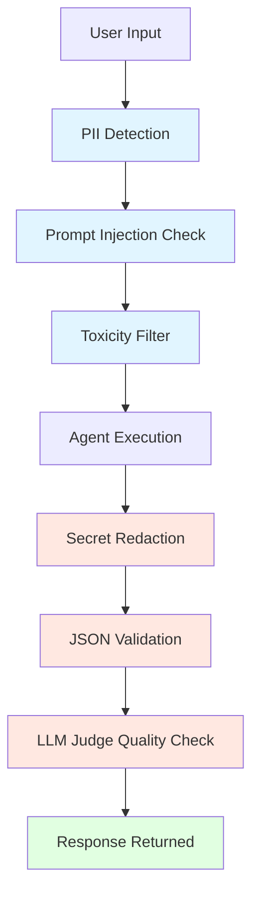
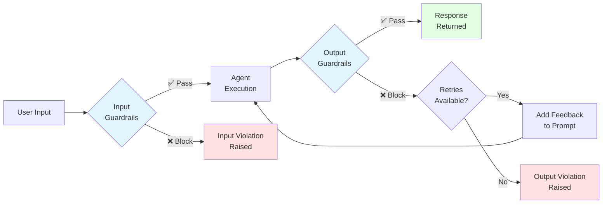
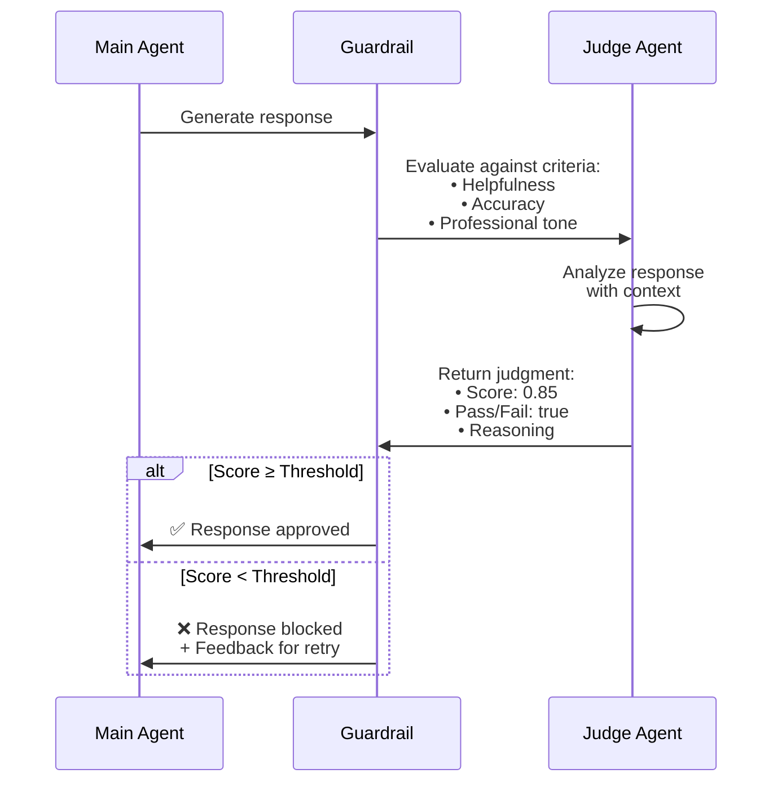
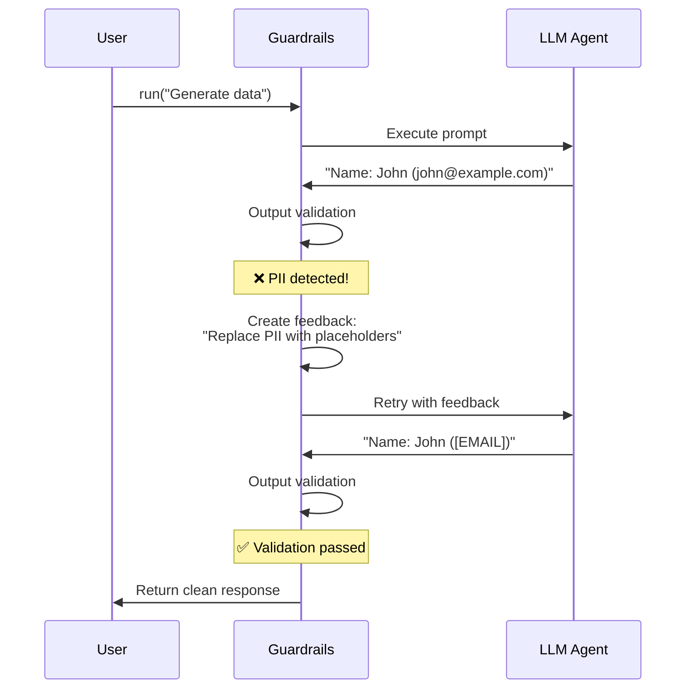

<div align="center">
  <h1>Pydantic AI Guardrails</h1>
  <p><em>Guardrails for <a href="https://ai.pydantic.dev/">Pydantic AI</a> agents</em></p>
</div>

<div align="center">

[](https://pypi.org/project/pydantic-ai-guardrails/)
[](https://pypi.org/project/pydantic-ai-guardrails/)
[](./LICENSE)

</div>

## Installation

```bash
pip install pydantic-ai-guardrails
```

Optional dependencies:
```bash
pip install pydantic-ai-guardrails[telemetry]  # Logfire/OpenTelemetry support
pip install pydantic-ai-guardrails[evals]      # pydantic_evals integration
pip install pydantic-ai-guardrails[all]        # All features
```

## Quick Start

Here's a minimal example using Pydantic AI Guardrails:

```python
from pydantic_ai import Agent
from pydantic_ai_guardrails import GuardedAgent
from pydantic_ai_guardrails.guardrails.input import pii_detector, prompt_injection
from pydantic_ai_guardrails.guardrails.output import secret_redaction

# Create an agent with guardrails
agent = Agent('openai:gpt-4o')
guarded_agent = GuardedAgent(
    agent,
    input_guardrails=[pii_detector(), prompt_injection()],
    output_guardrails=[secret_redaction()],
)

result = await guarded_agent.run('Your prompt here')
```

_(This example is complete, it can be run "as is")_

## Bring Your Own Guardrails

Pydantic AI Guardrails works seamlessly with **built-in guardrails**, **llm-guard**, **autoevals**, and **your own custom guardrails**. Mix and match to build the perfect security stack for your needs.

### Built-in Guardrails

Fast, zero-dependency guardrails that work out of the box:

```python
from pydantic_ai_guardrails.guardrails.input import (
    length_limit,
    pii_detector,
    prompt_injection,
    toxicity_detector,
)
from pydantic_ai_guardrails.guardrails.output import (
    secret_redaction,
    min_length,
    json_validator,
)

guarded_agent = GuardedAgent(
    agent,
    input_guardrails=[
        length_limit(max_chars=1000),
        pii_detector(),
        prompt_injection(),
    ],
    output_guardrails=[
        secret_redaction(),
        min_length(min_chars=20),
    ],
)
```

### llm-guard Integration

Use battle-tested ML models from [llm-guard](https://github.com/laiyer-ai/llm-guard) for advanced threat detection:

```python
from llm_guard.input_scanners import PromptInjection, Toxicity
from llm_guard.output_scanners import Sensitive, Bias
from examples.llm_guard.llm_guard_basic import (
    llm_guard_input_scanner,
    llm_guard_output_scanner,
)

guarded_agent = GuardedAgent(
    agent,
    input_guardrails=[
        llm_guard_input_scanner(
            PromptInjection(threshold=0.7),
            severity="critical"
        ),
        llm_guard_input_scanner(
            Toxicity(threshold=0.5),
            severity="high"
        ),
    ],
    output_guardrails=[
        llm_guard_output_scanner(
            Sensitive(entity_types=["EMAIL", "PHONE", "SSN"]),
            severity="critical"
        ),
    ],
)
```

### autoevals Integration

Use [autoevals](https://www.braintrust.dev/docs/reference/autoevals/python-api) for LLM-powered quality checks:

```python
from examples.autoevals.autoevals_factuality import factuality_guardrail
from examples.autoevals.autoevals_moderation import autoevals_evaluator_guardrail
from autoevals.llm import Moderation

guarded_agent = GuardedAgent(
    agent,
    output_guardrails=[
        factuality_guardrail(threshold=0.7),
        autoevals_evaluator_guardrail(
            Moderation,
            threshold=0.5
        ),
    ],
)
```

### pydantic_evals Integration

Use [pydantic_evals](https://ai.pydantic.dev/evals/) evaluators directly as guardrails:

```bash
pip install pydantic-ai-guardrails[evals]
```

```python
from pydantic_evals.evaluators import Contains
from pydantic_ai_guardrails.evals import evaluator_guardrail, output_contains

# Wrap any evaluator as a guardrail
guard = evaluator_guardrail(
    Contains(value="thank you"),
    kind="output",
)

# Or use convenience functions
guard = output_contains("thank you", case_sensitive=False)

guarded_agent = GuardedAgent(
    agent,
    output_guardrails=[guard],
)
```

Available convenience adapters:
- `output_contains()` - Check if output contains a value
- `output_equals()` - Check exact equality
- `output_is_instance()` - Validate output type
- `output_llm_judge()` - LLM-as-a-judge evaluation (pydantic_evals version)

### Custom Guardrails

Create your own guardrails with full type safety:

```python
from pydantic_ai_guardrails import GuardrailResult, InputGuardrail, OutputGuardrail

async def check_brand_mentions(prompt: str) -> GuardrailResult:
    """Block mentions of competitor brands."""
    competitors = ["competitor_a", "competitor_b"]
    if any(brand.lower() in prompt.lower() for brand in competitors):
        return {
            'tripwire_triggered': True,
            'message': 'Competitor brand mentioned',
            'severity': 'medium',
        }
    return {'tripwire_triggered': False}

custom_guardrail = InputGuardrail(check_brand_mentions)

guarded_agent = GuardedAgent(
    agent,
    input_guardrails=[custom_guardrail],
)
```

### Multi-Layer Enterprise Security

Combine all three approaches for enterprise-grade protection. See [`examples/enterprise_security.py`](examples/enterprise_security.py) for a complete example:

```python
# Layer 1: Native guardrails (fast, zero-dependency)
native_input = [
    length_limit(max_chars=2000),
    blocked_keywords(keywords=["password", "secret"]),
]

# Layer 2: llm-guard (battle-tested ML)
llm_guard_input = [
    llm_guard_input_scanner(PromptInjection(threshold=0.7)),
    llm_guard_input_scanner(Toxicity(threshold=0.5)),
]

# Layer 3: autoevals (LLM-powered quality)
autoevals_output = [
    factuality_guardrail(threshold=0.7),
]

# Combine all layers
guarded_agent = GuardedAgent(
    agent,
    input_guardrails=native_input + llm_guard_input,
    output_guardrails=autoevals_output,
    parallel=True,  # Run guardrails in parallel
)
```

## Why Use This Library?

**"Can't I just use Pydantic AI's `output_type` and output functions?"**

Yes, Pydantic AI has powerful validation built-in. This library is designed for **safety and compliance** where you need:

### 1. **Input Validation**
Pydantic AI validates outputs, but doesn't provide built-in input sanitization:

```python
# ❌ Without guardrails - PII goes to model
agent = Agent('openai:gpt-4')
result = await agent.run('My SSN is 123-45-6789, help me...')
# → Sends sensitive data to LLM → Compliance risk

# ✅ With guardrails - PII blocked before API call
guarded_agent = GuardedAgent(agent, input_guardrails=[pii_detector()])
result = await guarded_agent.run('My SSN is 123-45-6789, help me...')
# → InputGuardrailViolation raised → No API call, no cost, no risk
```

### 2. **Declarative Security Patterns**
Rather than writing custom validation logic in every agent:

```python
# ❌ Without guardrails - custom validation everywhere
@agent.output
def validate_output(ctx: RunContext, output: str) -> str:
    if contains_api_key(output):
        raise ValueError("Output contains API key")
    if contains_pii(output):
        raise ValueError("Output contains PII")
    if is_toxic(output):
        raise ValueError("Output is toxic")
    return output

# ✅ With guardrails - reusable, tested, production-ready
guarded_agent = GuardedAgent(
    agent,
    output_guardrails=[secret_redaction(), pii_detector(), toxicity_filter()],
)
```

### 3. **Auto-Retry with Structured Feedback**
Guardrails automatically retry with detailed feedback to help the LLM self-correct:

```python
# The guardrail detects issues and sends feedback like:
# "Output contains API key at position 45. Replace with [REDACTED] or remove."
# The LLM retries with this context and usually fixes it.

guarded_agent = GuardedAgent(
    agent,
    output_guardrails=[secret_redaction()],
    max_retries=2,  # Auto-retry on violations
)
```

### 4. **Parallel Execution**
Run multiple guardrails concurrently without sequential slowdown:

```python
guarded_agent = GuardedAgent(
    agent,
    input_guardrails=[pii_detector(), prompt_injection(), toxicity_detector()],
    parallel=True,  # All checks run concurrently
)
# → 3 guardrails run in ~same time as 1
```

### 5. **Production Patterns Out-of-the-Box**
Common security/safety patterns that took us months to develop and test:

- **PII detection** across 15+ entity types (emails, SSNs, credit cards, etc.)
- **Prompt injection** detection with multiple attack vectors
- **Secret redaction** for 20+ secret types (API keys, tokens, credentials)
- **LLM-as-a-judge** for quality/compliance evaluation
- **Tool parameter validation** to prevent injection attacks

### 6. **Observability & Telemetry**
Built-in integration with Pydantic Logfire for production monitoring:

```python
configure_telemetry(enabled=True)
# → Every guardrail check is traced, timed, and logged
# → Track violation rates, performance, costs over time
```

**TL;DR**: Use this library when you need production-grade safety, compliance, and security patterns without writing custom validation logic for every agent.

## Features

- **Input guardrails** - Validate prompts before agent execution (prevent PII, injection, etc.)
- **Output guardrails** - Validate responses after execution (detect secrets, hallucinations, etc.)
- **Automatic retry** - Failed outputs retry with structured feedback sent to the LLM for self-correction
- **Parallel execution** - Run multiple guardrails concurrently for better performance
- **OpenTelemetry integration** - Full observability with Logfire/OpenTelemetry spans
- **Flexible blocking modes** - Choose to raise exceptions, log warnings, or silently block
- **OpenAI Guardrails compatibility** - Load configurations from OpenAI Guardrails UI
- **GuardrailContext integration** - Access dependencies, messages, and prompt within guardrails
- **Type-safe** - Full type hints and IDE autocomplete throughout

## Real-World Examples

### LLM-as-a-Judge Quality Evaluation

The `llm_judge()` guardrail uses a separate LLM to evaluate output quality against natural language criteria:

```python
from pydantic_ai_guardrails.guardrails.output import llm_judge

guarded_agent = GuardedAgent(
    agent,
    output_guardrails=[
        llm_judge(
            criteria="Is the response helpful and addresses the user's question?",
            judge_model="openai:gpt-4o-mini",
            threshold=0.7,
        )
    ],
    max_retries=2,
)

result = await guarded_agent.run("How do I reset my password?")
```

**Example output when judge blocks unhelpful response:**
```
❌ Response blocked by judge:
   Reason: LLM judge evaluation failed: score 0.00 below threshold 0.70
   Judge feedback: The response does not address the user's question at all.
   Consider providing step-by-step password reset instructions.
```

### Secret Detection and Redaction

The `secret_redaction()` guardrail detects and redacts API keys, tokens, and other secrets from outputs:

```python
from pydantic_ai_guardrails.guardrails.output import secret_redaction

guarded_agent = GuardedAgent(
    agent,
    output_guardrails=[secret_redaction()],
    max_retries=2,
)

# Automatically redacts secrets if detected
result = await guarded_agent.run("Show me an example API configuration")
```

**Example output when secret is detected:**
```
✅ Response with secrets redacted:
   Here's an example configuration:
   {
     "api_key": "[REDACTED:API_KEY]",
     "github_token": "[REDACTED:GITHUB_TOKEN]",
     "endpoint": "https://api.example.com"
   }
```

### Regex Pattern Validation

The `regex_match()` guardrail ensures outputs contain required patterns:

```python
from pydantic_ai_guardrails.guardrails.output import regex_match

guarded_agent = GuardedAgent(
    agent,
    output_guardrails=[
        regex_match(r"\b[A-Za-z0-9._%+-]+@[A-Za-z0-9.-]+\.[A-Z|a-z]{2,}\b")
    ],
)

result = await guarded_agent.run("Please provide a contact email for support.")
```

**Example output when email pattern missing:**
```
❌ Response blocked - no email found:
   Output must match the required pattern. Ensure the response contains
   the expected format.
```

### Multi-Layer Protection

Combine multiple guardrails for comprehensive protection:



```python
guarded_agent = GuardedAgent(
    agent,
    input_guardrails=[
        pii_detector(),
        prompt_injection(),
        toxicity_detector(),
    ],
    output_guardrails=[
        secret_redaction(),
        json_validator(required_keys=["status", "data"]),
        llm_judge(criteria="Is the response helpful and accurate?"),
    ],
    parallel=True,  # Run guardrails concurrently
    max_retries=2,
)
```

## How It Works

Guardrails run as middleware around agent execution:



**Execution flow:**

1. **Input validation**: Guardrails check the prompt before the agent runs
2. **Agent execution**: If input passes, the agent processes the request
3. **Output validation**: Guardrails check the agent's response
4. **Retry logic** (optional): If output fails, retry with violation feedback

Guardrails are non-invasive - your existing telemetry, logging, and error handling continue to work.

## Usage with GuardrailContext

Guardrails support dependency injection via `GuardrailContext`, which follows pydantic_ai's patterns:

```python
from dataclasses import dataclass
from pydantic_ai import Agent
from pydantic_ai_guardrails import InputGuardrail, GuardrailContext, GuardrailResult

@dataclass
class SecurityDeps:
    blocked_users: set[str]
    user_id: str

async def check_user(ctx: GuardrailContext[SecurityDeps], prompt: str) -> GuardrailResult:
    if ctx.deps.user_id in ctx.deps.blocked_users:
        return {
            'tripwire_triggered': True,
            'message': f'User {ctx.deps.user_id} is blocked',
            'severity': 'critical',
        }
    return {'tripwire_triggered': False}

agent = Agent('openai:gpt-4o', deps_type=SecurityDeps)
guarded_agent = GuardedAgent(
    agent,
    input_guardrails=[InputGuardrail(check_user)],
)

result = await guarded_agent.run(
    'Hello',
    deps=SecurityDeps(blocked_users={'user_123'}, user_id='user_456')
)
```

### GuardrailContext Fields

The `GuardrailContext` provides access to:

| Field | Type | Description |
|-------|------|-------------|
| `deps` | `DepsT` | User-provided dependencies passed to the agent |
| `messages` | `list[ModelMessage] \| None` | Message history (output guardrails only) |
| `prompt` | `str \| None` | The original user prompt |

```python
async def check_with_context(ctx: GuardrailContext[MyDeps], output: str) -> GuardrailResult:
    # Access dependencies
    api_client = ctx.deps.api_client

    # Access message history (output guardrails)
    if ctx.messages:
        for msg in ctx.messages:
            # Inspect conversation history
            pass

    # Access original prompt
    original_prompt = ctx.prompt

    return {'tripwire_triggered': False}
```

## Built-in Guardrails

### Input Guardrails

Run before agent execution to validate prompts:

| Guardrail | Purpose | Use Case |
|-----------|---------|----------|
| `blocked_keywords()` | Block forbidden keywords/phrases | Content policy, brand safety |
| `length_limit()` | Enforce character/token limits | Cost control |
| `pii_detector()` | Detect emails, phones, SSNs, credit cards | Compliance |
| `prompt_injection()` | Detect injection attempts | Security |
| `toxicity_detector()` | Detect harmful content | Safety |
| `rate_limiter()` | Per-user/key rate limiting | Abuse prevention |

```python
from pydantic_ai_guardrails.guardrails.input import (
    blocked_keywords,
    length_limit,
    pii_detector,
    prompt_injection,
    toxicity_detector,
    rate_limiter,
)
```

### Output Guardrails

Run after agent execution to validate responses:

| Guardrail | Purpose | Use Case |
|-----------|---------|----------|
| `secret_redaction()` | Detect/redact API keys, tokens | Security |
| `json_validator()` | Validate JSON structure | Structured output |
| `regex_match()` | Validate output against regex patterns | Structured output, format validation |
| `llm_judge()` | Use LLM to evaluate output quality | Quality assurance, compliance, brand voice |
| `min_length()` | Enforce minimum response length | Quality control |
| `toxicity_filter()` | Filter harmful responses | Safety |
| `hallucination_detector()` | Detect uncertain claims | Accuracy |
| `require_tool_use()` | Ensure specific tools were called | Workflow enforcement |
| `validate_tool_parameters()` | Validate tool arguments with schemas | Security (prevent injection) |
| `tool_allowlist()` | Restrict which tools can be called | Security (least privilege) |
| `no_refusals()` | Detect when LLM refuses to answer | Quality assurance, auto-retry |

**How LLM-as-a-Judge works:**



```python
from pydantic_ai_guardrails.guardrails.output import (
    secret_redaction,
    json_validator,
    regex_match,
    llm_judge,
    min_length,
    toxicity_filter,
    hallucination_detector,
    require_tool_use,
    validate_tool_parameters,
    tool_allowlist,
)
```

## OpenAI Guardrails Compatibility

Load configs generated from the [OpenAI Guardrails UI](https://openai.github.io/openai-guardrails-python/) directly:

```python
from pydantic_ai import Agent
from pydantic_ai_guardrails import create_guarded_agent_from_config

agent = Agent('openai:gpt-4o')
guarded_agent = create_guarded_agent_from_config(
    agent,
    "guardrails_config.json"  # From OpenAI Guardrails UI
)
```

**Config format** (OpenAI Guardrails compatible):
```json
{
  "version": 1,
  "input": {
    "version": 1,
    "guardrails": [
      {"name": "Contains PII", "config": {"entities": ["EMAIL_ADDRESS"], "block": true}},
      {"name": "prompt_injection", "config": {"sensitivity": "high"}}
    ]
  },
  "output": {
    "version": 1,
    "guardrails": [
      {"name": "Hallucination Detection", "config": {}},
      {"name": "secret_redaction", "config": {}}
    ]
  }
}
```

Use either OpenAI names (`"Contains PII"`) or our names (`"pii_detector"`). Parameters are mapped automatically.

## Logfire Integration

Enable observability with [Logfire](https://pydantic.dev/logfire):

```python
import logfire
from pydantic_ai_guardrails import configure_telemetry

logfire.configure()
configure_telemetry(enabled=True)

# All guardrail validations now create spans in Logfire
guarded_agent = GuardedAgent(
    agent,
    input_guardrails=[pii_detector(), prompt_injection()],
)
```

Spans include:
- Guardrail name and type
- Execution duration
- Validation result
- Violation details (if triggered)

## Custom Guardrails

Create custom guardrails by implementing functions that return `GuardrailResult`:

### Input Guardrails

Validate prompts before agent execution:

```python
from pydantic_ai_guardrails import InputGuardrail, GuardrailResult

async def check_business_hours(prompt: str) -> GuardrailResult:
    """Block requests outside business hours."""
    from datetime import datetime
    hour = datetime.now().hour

    if not (9 <= hour < 17):
        return {
            'tripwire_triggered': True,
            'message': f'Requests only allowed during business hours (9AM-5PM), current hour: {hour}',
            'severity': 'medium',
            'suggestion': 'Try again during business hours',
        }
    return {'tripwire_triggered': False}

guarded_agent = GuardedAgent(
    agent,
    input_guardrails=[InputGuardrail(check_business_hours)],
)
```

### Output Guardrails

Validate agent responses:

```python
from pydantic_ai_guardrails import OutputGuardrail, GuardrailResult

async def check_response_completeness(output: str) -> GuardrailResult:
    """Ensure responses are complete and substantial."""
    word_count = len(output.split())

    if word_count < 50:
        return {
            'tripwire_triggered': True,
            'message': f'Response too brief ({word_count} words)',
            'severity': 'low',
            'suggestion': 'Provide a more detailed response with at least 50 words',
            'metadata': {'word_count': word_count, 'min_words': 50},
        }
    return {'tripwire_triggered': False}

guarded_agent = GuardedAgent(
    agent,
    output_guardrails=[OutputGuardrail(check_response_completeness)],
)
```

### Using GuardrailContext

Access dependencies and context within guardrails:

```python
from pydantic_ai_guardrails import GuardrailContext
from dataclasses import dataclass

@dataclass
class AppDeps:
    user_tier: str
    max_tokens: int

async def check_token_limit(ctx: GuardrailContext[AppDeps], prompt: str) -> GuardrailResult:
    """Enforce per-tier token limits."""
    estimated_tokens = len(prompt.split()) * 1.3  # Rough estimate

    if estimated_tokens > ctx.deps.max_tokens:
        return {
            'tripwire_triggered': True,
            'message': f'Prompt exceeds {ctx.deps.user_tier} tier limit',
            'severity': 'high',
            'metadata': {
                'estimated_tokens': int(estimated_tokens),
                'max_tokens': ctx.deps.max_tokens,
                'user_tier': ctx.deps.user_tier,
            },
        }
    return {'tripwire_triggered': False}

agent = Agent('openai:gpt-4', deps_type=AppDeps)
guarded_agent = GuardedAgent(
    agent,
    input_guardrails=[InputGuardrail(check_token_limit)],
)

result = await guarded_agent.run(
    'Your prompt',
    deps=AppDeps(user_tier='free', max_tokens=1000)
)
```

## Error Handling

```python
from pydantic_ai_guardrails import InputGuardrailViolation, OutputGuardrailViolation

try:
    result = await guarded_agent.run('prompt with PII: test@example.com')
except InputGuardrailViolation as e:
    print(f'Blocked by: {e.guardrail_name}')
    print(f'Severity: {e.severity}')
    print(f'Message: {e.result["message"]}')
except OutputGuardrailViolation as e:
    print(f'Output blocked: {e.result["message"]}')
```

Control blocking behavior:
```python
guarded_agent = GuardedAgent(
    agent,
    input_guardrails=[pii_detector()],
    on_block='log',  # 'raise' (default), 'log', or 'silent'
)
```

## Automatic Retry on Violations

When output guardrails detect violations, the agent can automatically retry with structured feedback sent to the LLM. This enables self-correction without manual intervention.

```python
from pydantic_ai import Agent
from pydantic_ai_guardrails import GuardedAgent, OutputGuardrail

async def check_pii(output: str) -> GuardrailResult:
    if '@' in output or re.search(r'\d{3}-\d{2}-\d{4}', output):
        return {
            'tripwire_triggered': True,
            'message': 'PII detected in output',
            'severity': 'high',
            'suggestion': 'Replace personal info with placeholders like [EMAIL], [SSN]',
        }
    return {'tripwire_triggered': False}

agent = Agent('openai:gpt-4o')
guarded_agent = GuardedAgent(
    agent,
    output_guardrails=[OutputGuardrail(check_pii)],
    max_retries=3,  # Retry up to 3 times on violations
    on_block='raise',  # Required for retries
)

# Will automatically retry if PII is detected, with feedback to the LLM
result = await guarded_agent.run('Generate example customer data')
```

**Retry flow visualization:**



**How it works:**
1. Agent generates response
2. Output guardrails check the response
3. If violations occur, structured feedback is created from the violation details
4. Feedback is appended to the prompt as a new message
5. Agent retries with the feedback (up to `max_retries` times)
6. Process repeats until success or retries exhausted

**Features:**
- **Structured feedback**: Includes severity, violation message, and suggestions
- **Multiple violations**: Combines all violations into comprehensive feedback
- **Telemetry**: All retry attempts are tracked and logged
- **Observability**: Retry events appear in telemetry spans
- **Input guardrails**: Always fail immediately (no retry)

**Exception handling with retries:**
```python
from pydantic_ai_guardrails import OutputGuardrailViolation

try:
    result = await guarded_agent.run('Generate example data')
except OutputGuardrailViolation as e:
    print(f'Failed after {e.retry_count} retries')
    print(f'Final violation: {e.result["message"]}')
```

See `examples/retry_auto_fix.py` for complete examples.

## Parallel Execution

Run guardrails concurrently for better performance:

```python
guarded_agent = GuardedAgent(
    agent,
    input_guardrails=[pii_detector(), prompt_injection(), toxicity_detector()],
    parallel=True,  # Run all guardrails concurrently
)
```

## Examples

Browse runnable examples in [`examples/`](./examples/)

### Quick Start Examples

| Example | Description | File |
|---------|-------------|------|
| Basic usage | Simple input/output guardrails | [basic_usage.py](./examples/basic_usage.py) |
| Auto-retry | LLM self-correction on violations | [retry_auto_fix.py](./examples/retry_auto_fix.py) |
| Advanced features | Telemetry and parallel execution | [advanced_features.py](./examples/advanced_features.py) |

### Integration Examples

| Example | Description | File |
|---------|-------------|------|
| Ollama integration | Local models with guardrails | [ollama_integration.py](./examples/ollama_integration.py) |
| Config-based usage | OpenAI Guardrails UI compatibility | [config_based_usage.py](./examples/config_based_usage.py) |
| Production monitoring | Full observability setup | [production_monitoring.py](./examples/production_monitoring.py) |

### Advanced Examples

| Example | Description | File |
|---------|-------------|------|
| Blocked keywords | Block forbidden keywords/phrases | [blocked_keywords_example.py](./examples/blocked_keywords_example.py) |
| Regex validation | Validate outputs match expected patterns | [regex_match_example.py](./examples/regex_match_example.py) |
| LLM-as-a-judge | Use LLM to evaluate output quality | [llm_judge_example.py](./examples/llm_judge_example.py) |
| Tool usage enforcement | Ensure agents use specific tools | [require_tool_use_example.py](./examples/require_tool_use_example.py) |
| Tool parameter validation | Validate tool arguments for security | [tool_parameter_validation_example.py](./examples/tool_parameter_validation_example.py) |
| Tool allowlisting | Restrict which tools can be called (RBAC) | [tool_allowlist_example.py](./examples/tool_allowlist_example.py) |
| Comprehensive example | Multiple guardrails and patterns | [comprehensive_example.py](./examples/comprehensive_example.py) |
| Performance benchmark | Guardrail performance testing | [performance_benchmark.py](./examples/performance_benchmark.py) |
| Refusal detection | Detect and handle LLM refusals | [no_refusals_example.py](./examples/no_refusals_example.py) |

## Testing Utilities

Test custom guardrails:

```python
from pydantic_ai_guardrails import (
    assert_guardrail_passes,
    assert_guardrail_blocks,
    create_test_context,
)

async def test_my_guardrail():
    guardrail = custom_check()

    # Assert it passes with safe input
    await assert_guardrail_passes(guardrail, "safe prompt")

    # Assert it blocks with forbidden input
    await assert_guardrail_blocks(
        guardrail,
        "forbidden prompt",
        expected_severity="high"
    )

    # Test with custom context (for guardrails that use deps)
    ctx = create_test_context(deps={"user_tier": "premium"})
    await assert_guardrail_passes(guardrail, "prompt", ctx=ctx)
```

## API Reference

### Core Types

| Type | Purpose |
|------|---------|
| `InputGuardrail` | Wrapper for input validation functions |
| `OutputGuardrail` | Wrapper for output validation functions |
| `GuardrailContext[DepsT]` | Context passed to guardrail functions with deps, messages, prompt |
| `GuardrailResult` | TypedDict returned by guardrail functions |

### Core Classes and Functions

| Type | Purpose |
|------|---------|
| `GuardedAgent` | Wrap agent with input/output guardrails |
| `create_context()` | Create a GuardrailContext for testing |
| `configure_telemetry()` | Enable global telemetry |
| `create_guarded_agent_from_config()` | Load guardrails from OpenAI config |

### Exception Types

| Exception | When Raised |
|-----------|-------------|
| `InputGuardrailViolation` | Input guardrail blocks request |
| `OutputGuardrailViolation` | Output guardrail blocks response |

### Configuration Options

| Parameter | Type | Default | Description |
|-----------|------|---------|-------------|
| `input_guardrails` | `Sequence[InputGuardrail]` | `()` | Input validation guardrails |
| `output_guardrails` | `Sequence[OutputGuardrail]` | `()` | Output validation guardrails |
| `on_block` | `'raise' \| 'log' \| 'silent'` | `'raise'` | Violation handling mode |
| `parallel` | `bool` | `False` | Run guardrails concurrently |
| `max_retries` | `int` | `0` | Auto-retry on output violations |

See implementation details in:
- [`src/pydantic_ai_guardrails/_context.py`](./src/pydantic_ai_guardrails/_context.py) - GuardrailContext definition
- [`src/pydantic_ai_guardrails/_guardrails.py`](./src/pydantic_ai_guardrails/_guardrails.py) - InputGuardrail/OutputGuardrail classes
- [`src/pydantic_ai_guardrails/_guarded_agent.py`](./src/pydantic_ai_guardrails/_guarded_agent.py) - GuardedAgent class
- [`src/pydantic_ai_guardrails/guardrails/input/`](./src/pydantic_ai_guardrails/guardrails/input/) - Built-in input guardrails
- [`src/pydantic_ai_guardrails/guardrails/output/`](./src/pydantic_ai_guardrails/guardrails/output/) - Built-in output guardrails

## Compatibility

- **Python**: 3.10+
- **Pydantic AI**: Compatible with pydantic-ai 0.1.0+
- **Type checking**: Full type hints for mypy/pyright
- **Models**: Works with any Pydantic AI supported model (OpenAI, Anthropic, Ollama, etc.)

## License

MIT
