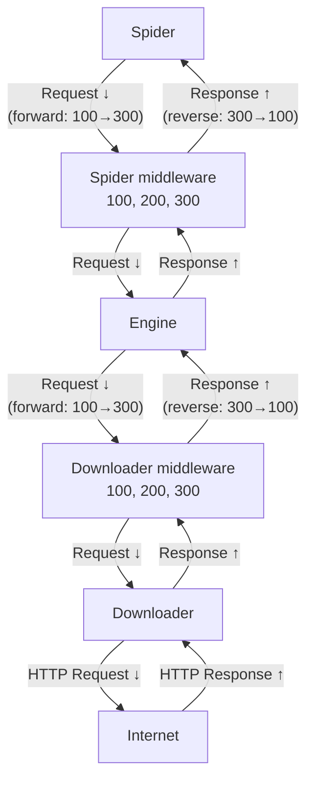

Middleware is a lightweight, low-level system for globally altering:

* **Downloader middleware**: request, response processing
* **Spider middleware**: wrapping, filtering streams in / out of the spider
<br>

## Middleware processing order

Middleware uses so-called *forward order for request, reverse order for response* pattern.

- Requests flow downward through middleware (from spider → downloader)
- Responses flow upward through middleware (from downloader → spider)



## Middleware activation

To activate a middleware component, register middleware before the crawl.

## Default settings

```toml
[DOWNLOADER_MIDDLEWARES]
# Lower number = executed first
"qcrawl.middleware.downloader.RobotsTxtMiddleware"       = 200
"qcrawl.middleware.downloader.HttpAuthMiddleware"        = 300
"qcrawl.middleware.downloader.RetryMiddleware"           = 400
"qcrawl.middleware.downloader.HttpCompressionMiddleware" = 500
"qcrawl.middleware.downloader.RedirectMiddleware"        = 600
"qcrawl.middleware.downloader.DownloadDelayMiddleware"   = 700
"qcrawl.middleware.downloader.ConcurrencyMiddleware"     = 800
"qcrawl.middleware.downloader.CookiesMiddleware"         = 900

[SPIDER_MIDDLEWARES]
# Lower number = executed first
"qcrawl.middleware.spider.OffsiteMiddleware" = 100
"qcrawl.middleware.spider.DepthMiddleware"   = 900
```

### Via settings file (TOML)
```toml title="settings.toml"
[DOWNLOADER_MIDDLEWARES]
"qcrawl.middleware.downloader.RetryMiddleware" = 400

[SPIDER_MIDDLEWARES]
"qcrawl.middleware.spider.DepthMiddleware" = 900
```

See [CLI usage #configuration-file](../concepts/cli.md#configuration-file) for loading settings from a TOML file.

### Via spider custom_settings
```python
class MySpider(Spider):
    custom_settings = {
        "DOWNLOADER_MIDDLEWARES": {
            "qcrawl.middleware.downloader.RetryMiddleware": 400,
        },
        "SPIDER_MIDDLEWARES": {
            "qcrawl.middleware.spider.DepthMiddleware": 900,
        },
    }
```

## Available downloader middleware

| Name                         | Purpose                                                                                                    | Configuration parameters                                                                                                                                                                                                                                                                                                                                                                                                              |
|------------------------------|------------------------------------------------------------------------------------------------------------|---------------------------------------------------------------------------------------------------------------------------------------------------------------------------------------------------------------------------------------------------------------------------------------------------------------------------------------------------------------------------------------------------------------------------------------|
| `ConcurrencyMiddleware`      | Limit concurrent requests per-domain using semaphores.                                                     | `concurrency_per_domain: int` — max concurrent requests per domain (default `2`)                                                                                                                                                                                                                                                                                                                                                      |
| `CookiesMiddleware`          | Manage cookies per-spider and per-domain: send `Cookie` headers and extract `Set-Cookie`.                  | --                                                                                                                                                                                                                                                                                                                                                                                                                                    |
| `DownloadDelayMiddleware`    | Enforce a minimum delay between requests to the same domain.                                               | `delay_per_domain: float` — delay between requests to same domain in seconds (default `0.25`)                                                                                                                                                                                                                                                                                                                                         |
| `HttpAuthMiddleware`         | Handle Basic and Digest HTTP authentication (proactive Basic, reactive Digest with 401).                   | `credentials: dict[str, tuple[str, str]]` — per-domain credentials (optional)<br>`auth_type: 'basic', 'digest'` — default `basic`<br>`digest_qop_auth_int: bool` — enable qop=`auth-int` support (default `False`).                                                                                                                                                                                                                   |
| `HttpCompressionMiddleware`  | Decompress responses with Content-Encoding: gzip, deflate, zstd.                                           | `enable_zstd: bool` — enable zstd decompression support (default `True`)                                                                                                                                                                                                                                                                                                                                                              |
| `HttpProxyMiddleware`        | Route requests via HTTP/HTTPS proxies with IPv6 support and NO_PROXY handling.                             | `http_proxy: str \| None` — HTTP proxy URL (optional)<br>`https_proxy: str \| None` — HTTPS proxy URL (optional)<br>`no_proxy: list[str] \| None` — domains/IPs to exclude from proxying (optional)<br>Per-spider: `HTTP_PROXY`, `HTTPS_PROXY`, `NO_PROXY` attributes<br>Per-request: `request.meta['proxy']` to override                                                                                                             |
| `RedirectMiddleware`         | Follow HTTP 3xx redirects, build new `Request`s and enforce redirect hop limits.                           | `max_redirects: int` — maximum redirect hops (default `10`)                                                                                                                                                                                                                                                                                                                                                                           |
| `RetryMiddleware`            | Retry transient network failures and specified HTTP status codes with exponential backoff.                 | `max_retries: int` — maximum attempts (default `3`)<br>`retry_http_codes: [int]` — HTTP status codes to retry (default `{429,500,502,503,504}`)<br>`priority_adjust: int` — priority delta for retries (default `-1`)<br>`backoff_base: float` — base seconds for exponential backoff (default `1.0`)<br>`backoff_max: float` — cap for backoff (default `60.0`)<br>`backoff_jitter: float` — jitter factor `0.0-1.0` (default `0.3`) |
| `RobotsTxtMiddleware`        | Fetch and parse `robots.txt`, enforce `allow/deny` and apply crawl-delay as `request.meta['retry_delay']`. | `user_agent: str` (default `*`)<br>`obey_robots_txt: bool` (default `True`)<br>`cache_ttl: float` (seconds, default `3600.0`)                                                                                                                                                                                                                                                                                                         |


## Available spider middlewares

| Name                  | Purpose                                                                                   | Configuration parameters                                                                                        |
|-----------------------|-------------------------------------------------------------------------------------------|-----------------------------------------------------------------------------------------------------------------|
| `DepthMiddleware`     | Limit crawl depth, track depth distribution, and adjust request priority.                 | `default_max_depth: int` (default `0`)<br>`default_priority: int` (default `1`)                                 |
| `HttpErrorMiddleware` | Filter responses with disallowed HTTP status codes and emit stats for filtered responses. | `allowed_codes: list[int]` (default `200-399`)<br>Per-spider: `HTTPERROR_ALLOW_ALL`, `HTTPERROR_ALLOWED_CODES`  |
| `OffsiteMiddleware`   | Filter requests to URLs outside configured allowed domains.                               | `enabled: bool` — default `True`<br>Per-spider: `ALLOWED_DOMAINS` (str/list/tuple/set)                          |
