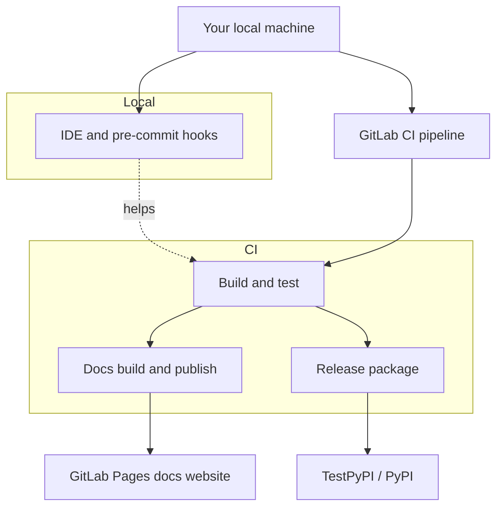
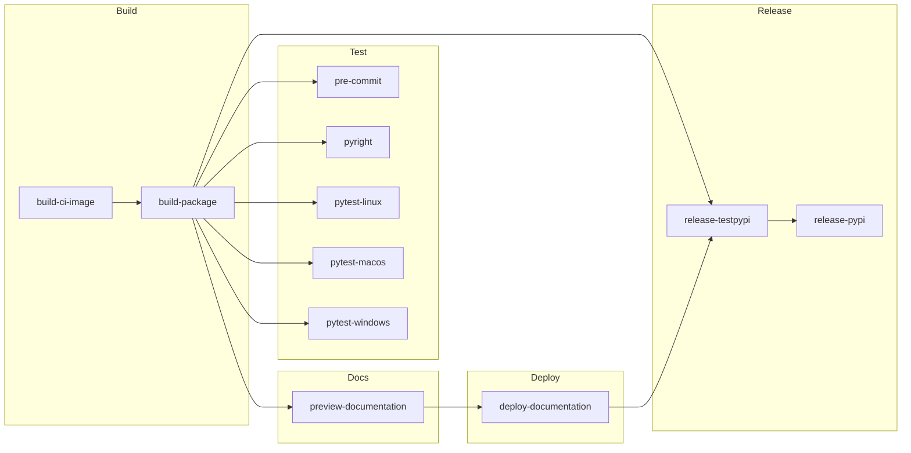
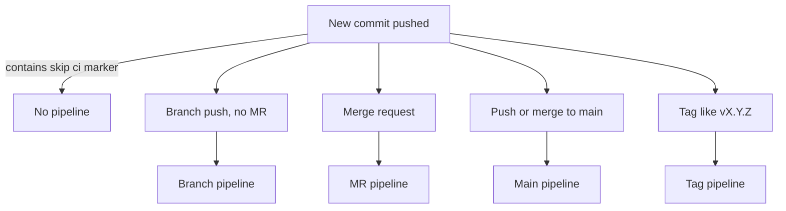

# CI/CD and Developer Tooling Overview

This page explains how continuous integration and delivery (CI/CD) works in this repository:

- GitLab CI pipelines (what runs on GitLab when you push your code to GitLab).
- Pre-commit hooks (what runs locally before you commit your code).
- A few CI-related settings in `pyproject.toml`.

The goal is to help new developers understand **what happens where**.

## 1. Big picture

There are three main layers:



- **Local**: you run pre-commit hooks and tests before pushing.
- **CI**: GitLab runs a pipeline on every push or merge request.
- **Docs**: CI builds documentation and, on main/tags, publishes it to GitLab Pages.
- **Release**: on tags, CI can publish wheels to TestPyPI (automatically) and PyPI (with a manual step).

---

## 2. GitLab CI basics for this repo

The root CI config is `.gitlab-ci.yml`.

It defines **stages** (logical steps):

```yaml
stages:
  - Build
  - Test
  - Docs
  - Deploy
  - Release
```

Roughly:

- **Build**: build a reusable Docker image and the Python package wheel.
- **Test**: run linters and tests on Linux, macOS, and Windows.
- **Docs**: build docs for branches and merge requests.
- **Deploy**: publish docs to GitLab Pages.
- **Release**: upload wheels to TestPyPI and PyPI.

---

### 2.1 High-level pipeline flow



Summary of this pipeline flow:

- We **build once**, then reuse the built wheel and CI image everywhere.
- We **test** on multiple Python versions and OSes.
- We **build docs** for branches/MRs, and **deploy docs** only for main/tags.
- We **release** only from tags, with a manual step to go from TestPyPI → PyPI.

---

### 2.2 When pipelines and jobs run

- **Normal branch pushes (no merge request yet)**
  - Pushing a new or existing branch (for example `feature/my-change`) starts a *branch pipeline*.
  - All usual jobs run: build, tests/linters, and `preview-documentation` (docs as a downloadable artifact only).

- **Merge requests**
  - When you open a merge request, GitLab prefers *merge request pipelines*.
  - New pushes to the branch update the MR pipeline; a separate branch pipeline is skipped.
  - This behavior is configured in `.gitlab-ci.yml` via `workflow: rules` so that each commit has a single pipeline.
  - Jobs are the same as for a normal branch pipeline (build, tests/linters, preview-documentation); we just prefer a single MR pipeline instead of both MR + branch pipelines.

- **Default branch (`main`)**
  - Pipelines on `main` run the same build and test jobs as branches.
  - In addition, `deploy-documentation` runs to publish docs to GitLab Pages.

- **Tags (releases)**
  - Creating a version tag like `vX.Y.Z` triggers a *tag pipeline*.
  - Docs: `deploy-documentation` publishes versioned docs (for example under `/vX.Y.Z/`).
  - Release: `release-testpypi` runs automatically; `release-pypi` is available as a manual follow-up job.

Quick reference table:

| Scenario                        | What triggers it                          | Key jobs / behavior |
|--------------------------------|-------------------------------------------|----------------------|
| Branch push (no MR yet)       | Push to a non-default branch              | Build, tests/linters, preview-documentation artifact |
| Merge request                  | Open/update a merge request               | Same jobs as branch pipeline (build, tests/linters, preview-documentation), runs as MR pipeline; branch pipeline skipped when MR exists. |
| Default branch main         | Push/merge to main                      | Build, tests/linters, deploy-documentation to GitLab Pages |
| Tag vX.Y.Z                   | Push a version tag like v1.2.3          | Versioned docs via deploy-documentation, release-testpypi (auto), release-pypi (manual) |

---



---

### 2.3 Skipping CI explicitly

- If a commit message contains `[skip ci]` or `[ci skip]`, the `workflow: rules` configuration prevents a pipeline from running for that commit.

---

## 3. Key CI files and what they do

### `.gitlab-ci.yml`

- Entry point for GitLab CI.
- Declares the stages and includes all detailed CI config from `.gitlab/ci/*.yaml`.
- Also has `workflow: rules` to avoid running duplicate pipelines when there is an open merge request.

---

### `.gitlab/ci/defaults.yaml`

- Shared defaults and variables:
  - `CI_IMAGE`: Docker image used by many jobs.
  - `PIP_CACHE_DIR`: cache location for Python packages.
- Defines `.pip_cache_template`, a small template used by jobs that need pip caching.

---

### `.gitlab/ci/build_image.yaml`

- Job: `build-ci-image`.
- Builds a Docker image with tools that CI jobs share.
- Uses Docker-in-Docker and pushes the image to GitLab’s container registry.

---

### `.gitlab/ci/build_package.yaml`

- Job: `build-package`.
- Uses `python -m build` to build the project (wheel and sdist) into `dist/`.
- Exposes those artifacts so tests, docs, and release jobs can install the built wheel.

---

### `.gitlab/ci/test_precommit.yaml`

- Job: `pre-commit`.
- Installs the built wheel, then runs `pre-commit run --all-files` using the hooks from `.pre-commit-config.yaml`.
- This is the CI mirror of what you can run locally `pre-commit run --all-files`.

---

### `.gitlab/ci/test_pyright.yaml`

- Job: `pyright`.
- Installs the built wheel and runs the type checker with `pyright --project pyrightconfig.json`.
  - `pyrightconfig.json` is the configuration file for `pyright` and it is one of best practices to have it in the repository at the time of writing this document.

---

### `.gitlab/ci/test_linux.yaml`

- Job: `pytest-linux`.
- Runs tests on Linux for several Python versions (`3.10`, `3.11`, `3.12`, `3.13`) using a matrix.
- Uses `venv` to install the built `quantify` wheel and run `pytest`.
- Produces JUnit XML so GitLab can show test results in the merge request UI.

---

### `.gitlab/ci/test_macos.yaml`

- Job: `pytest-macos`.
- Runs tests on macOS for multiple Python versions.
- Uses `uv` to install the built `quantify` wheel and run `pytest`. (`uv` is used to speed up the process)
- `when: manual` and `allow_failure: true`, so it’s optional and non-blocking.

---

### `.gitlab/ci/test_windows.yaml`

- Job: `pytest-windows`.
- Same idea as macOS, but on Windows.
- Uses `uv` to install the built `quantify` wheel and run `pytest`. (`uv` is used to speed up the process)
- `when: manual` and `allow_failure: true`, so it’s optional and non-blocking.

---

### `.gitlab/ci/docs.yaml`

Two main jobs:

- `preview-documentation` (Docs stage)
  - Runs on branches and merge requests.
  - Builds HTML docs into `docs/_build/html`.
  - Exposes docs as an artifact called **"Documentation preview"**.

- `deploy-documentation` (Deploy stage)
  - Runs on the default branch and on release tags.
  - Builds docs into `public/` (or `public/<tag>` for tags).
  - `pages: true` tells GitLab this job publishes the **GitLab Pages** site.
  - Artifacts under `public/` are used by GitLab Pages.

---

### `.gitlab/ci/release.yaml`

Two jobs that handle releases:

- `release-testpypi`
  - Runs automatically for version tags like `v1.2.3`.
  - Needs:
    - `build-package` (so wheels exist).
    - `deploy-documentation` (so docs are deployed).
  - Uploads wheels to **TestPyPI** using Twine.

- `release-pypi`
  - Also restricted to version tags.
  - `when: manual`, so it only runs when a person presses the `Run ▶` button in GitLab.
  - Depends on `release-testpypi`.
  - Uploads wheels to the real **PyPI**.

---

## 4. Local tooling: pre-commit

### `.pre-commit-config.yaml`

This file controls what runs when you use pre-commit locally.

It currently has two repos:

1. **ruff-pre-commit**
   - `ruff-check` – lints Python files, can auto-fix some issues.
   - `ruff-format` – formats Python code (similar to `black`).

2. **pre-commit-hooks**
   - `trailing-whitespace` – removes trailing spaces.
   - `end-of-file-fixer` – ensures a newline at the end of files.
   - `check-yaml`, `check-json`, `check-toml` – verifies those files are valid.

You can run these locally with:

```bash
pre-commit run --all-files
```

CI runs the same hooks in the `pre-commit` job.

---

## 5. CI-related bits in `pyproject.toml`

### Development dependencies

In `pyproject.toml`, the `[project.optional-dependencies]` section has a `dev` extra that includes tools used in CI and locally, for example:

- `pre-commit`
- `pyright`
- `ruff`
- `mypy`
- other quality tools

These are the tools that jobs like `pre-commit` and `pyright` install.

### Ruff configuration

Under `[tool.ruff]` and `[tool.ruff.lint.*]`, you configure:

- Which [**rules**](https://docs.astral.sh/ruff/rules/) to enable / ignore.
- Which files to [**skip**](https://docs.astral.sh/ruff/rules/).
- [**Formatting preferences**](https://docs.astral.sh/ruff/formatter/).

The `ruff` hooks in pre-commit and any `ruff` commands you run locally use this configuration.

---

## 6. Where to look when something breaks

- **Pipeline fails in Test stage**
  - Look at jobs:
    - `pre-commit` – style / formatting / simple file issues.
    - `pyright` – type errors.
    - `pytest-linux` – test failures.

- **Docs job fails**
  - `preview-documentation` or `deploy-documentation` failed.
  - Check Sphinx errors in the job log.

- **Release job fails**
  - `release-testpypi` or `release-pypi` failed.
  - Most common causes: missing `PYPI_API_TOKEN_*` variables or Twine upload issues.

---

## 7. Summary for new developers

- Keep your code and docs clean locally:
  - Run `pre-commit run --all-files`.
  - Run tests (for example `pytest`) before you push.
- When you push or open a merge request, GitLab:
  - Builds the package and runs tests/linters.
  - Builds docs so reviewers can see them.
- When you create a version tag (`vX.Y.Z`):
  - CI can publish docs to GitLab Pages.
  - CI can upload your wheels to TestPyPI, and then to PyPI (manual approval step).

You don’t have to remember all job names. Think of it as:

- **Build once**, **test on multiple Python versions and OSes**, **build docs**, then **optionally deploy docs and release packages**.
