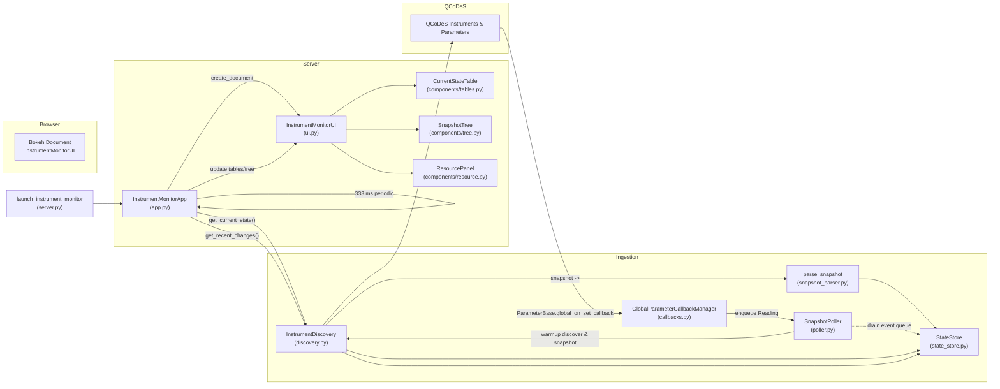

# Instrument Monitor

A lightweight Bokeh-based dashboard for live monitoring of QCoDeS instruments and parameters. It discovers running instruments, performs a short snapshot warmup, then switches to low-latency streaming via QCoDeS global parameter callbacks. UI updates are gated to stay responsive during user interactions.

## TL;DR — How it works

- **Server startup**: `launch_instrument_monitor()` spins up a Bokeh server in a background thread (`server.py`).
- **App init**: `InstrumentMonitorApp.create_document()` (`app.py`) builds the `InstrumentMonitorUI` (`ui.py`), starts periodic UI updates (333 ms), and starts the background `SnapshotPoller`.
- **Warmup snapshots**: `SnapshotPoller` (`poller.py`) runs a few snapshot passes via `InstrumentDiscovery` (`discovery.py`) -> `parse_snapshot()` to seed `StateStore`.
- **Streaming updates**: QCoDeS `ParameterBase.global_on_set_callback` (`callbacks.py`) pushes new `Reading`s into a queue; the poller drains and writes to `StateStore`.
- **UI refresh**: The app reads `StateStore` through discovery (`get_current_state()` / `get_recent_changes()`) and updates `CurrentStateTable` + `SnapshotTree` unless the user is typing/scrolling.

## Architecture at a glance

- **`server.py`**
  - `launch_instrument_monitor()` returns `MonitorHandle` to stop/wait.
  - Creates the Bokeh `Server`, configures port and `IngestionConfig` overrides.
- **`app.py`**
  - `InstrumentMonitorApp` wires UI + ingestion.
  - Periodic callback: pulls current readings and schedules UI updates.
- **`discovery.py`**
  - Finds QCoDeS instruments (Station.default → subclasses → GC fallback).
  - Delegates all state to `StateStore`.
- **`poller.py`**
  - Snapshot warmup (thread pool per instrument) then callback-only mode.
  - Drains callback queue in batches, updates `StateStore`.
- **`callbacks.py`**
  - `GlobalParameterCallbackManager` installs a single global callback on `ParameterBase` to capture all parameter sets.
- **`state_store.py`**
  - Thread-safe `Reading`/`ChangeEvent` store with change detection and a bounded ring buffer for recent events.
- **`snapshot_parser.py`**
  - Pure logic to convert QCoDeS snapshot dicts into `Reading`s (recursive over submodules/parameters).
- **`ui.py` and `components/`**
  - `InstrumentMonitorUI` composes `CurrentStateTable`, `SnapshotTree`, and `ResourcePanel`.
  - Client-side listeners (focus/scroll) to gate refresh while user interacts.

## High-level execution & data flow

The following mermaid diagram shows the high-level execution flow of the instrument monitor.



## Public API

- **Start (non-blocking)**

  ```python
  from quantify.instrument_monitor import launch_instrument_monitor

  handle = launch_instrument_monitor(
      host="localhost",
      port=None,                 # auto-pick free port
      log_level="INFO",
      # Optional ingestion overrides:
      warmup_total_passes=5,
      warmup_interval_s=1.0,
      event_batch_limit=10000,
  )
  print(f"Instrument Monitor at {handle.url}")
  # ... later
  handle.stop()   # or handle.wait()
  ```

## Interaction with InstrumentCoordinator

- The monitor is independent of `instrument_coordinator`, but complementary.
- When you create/configure instruments via `InstrumentCoordinator` components (which are QCoDeS `Instrument`s), they are discovered by `InstrumentDiscovery` and appear in the monitor.
- Parameter sets performed during schedule execution propagate via the global QCoDeS callback and show up live in the UI.

Example side-by-side usage:

```python
from quantify.instrument_coordinator.instrument_coordinator import InstrumentCoordinator
from quantify.visualization.instrument_monitor import launch_instrument_monitor

ic = InstrumentCoordinator("ic")
# ic.add_component(...); ic.prepare(compiled_sched); ic.start()

monitor = launch_instrument_monitor(open_browser=True)
# Interact, then stop when done
# ic.stop(); monitor.stop()
```

## Key design choices (why it’s built this way)

- **Separation of concerns**: Discovery/state (`discovery.py`/`state_store.py`) isolated from polling orchestration (`poller.py`) and UI (`ui.py`).
- **Fast startup, low overhead**: Short snapshot warmup, then stream via QCoDeS global callback; batch-drained queue to avoid unbounded growth.
- **Responsive UI**: Gate refresh while the user is typing/scrolling; hash-based CDS updates to avoid redundant DOM churn.
- **Testability**: `InstrumentMonitorApp` accepts injected `InstrumentDiscovery`/`SnapshotPoller` for fakes/mocks.

## Configuration knobs

- `IngestionConfig` (`config.py`):
  - `warmup_total_passes` (default 5)
  - `warmup_interval_s` (default 1.0)
  - `event_batch_limit` (default 10000)
- Pass overrides directly to `launch_instrument_monitor(...)` (they’re forwarded and applied when building the app).

## Data model

- `Reading` and `ChangeEvent` (`models.py`) are immutable Pydantic models for thread-safety and clarity.

## Logging

- `logging_setup.py` configures the `quantify.instrument_monitor` logger once; use `get_logger(__name__)` across modules.

## File map

- `server.py` — process/thread lifecycle, `MonitorHandle`, public launcher.
- `app.py` — ties UI to ingestion; periodic update loop.
- `discovery.py` — QCoDeS discovery + delegation to `StateStore`.
- `poller.py` — warmup snapshots + callback event ingestion.
- `callbacks.py` — single global QCoDeS on-set callback manager.
- `state_store.py` — thread-safe store, change detection, recent events.
- `snapshot_parser.py` — pure snapshot→reading transformation.
- `ui.py` — layout composition and client listeners.
- `components/` — `tables.py`, `tree.py`, `resource.py`, `plot.py`, `theme.py`.
