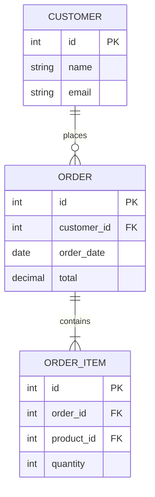

# Research: File Export Functionality for Python CLI Tools

**Date**: 2025-10-25
**Feature**: Export and Save Query Results
**Branch**: `003-export-and-save`

## Executive Summary

This research document covers best practices for implementing robust file export functionality in a Python CLI tool. The focus is on streaming large datasets, proper file handling, format-specific considerations, cross-platform compatibility, and comprehensive error handling.

**Key Decisions Made**:
1. Use Python's standard `csv` module with `QUOTE_MINIMAL` for RFC 4180 compliance
2. Implement custom streaming JSON writer for arrays (no stdlib equivalent)
3. Use `pathlib.Path` for cross-platform path handling
4. Implement timestamp-based auto-rename pattern (YYYYMMDD_HHMMSS)
5. Use generator-based streaming with 10,000 row batch size for progress indicators

---

## 1. Streaming Large Datasets

### 1.1 Memory-Efficient Streaming Patterns

**Problem**: Loading millions of rows into memory causes OOM errors and poor performance.

**Solution**: Generator-based streaming with database cursors.

#### Best Practices

**Pattern 1: Generator-Based Streaming**

```python
def stream_results_to_file(cursor, file_handle, formatter, progress_callback=None):
    """
    Stream database results directly to file without loading all into memory.

    Args:
        cursor: Database cursor (already executed)
        file_handle: Open file handle
        formatter: Formatting function (csv/json/sql)
        progress_callback: Optional callback for progress (rows_exported)
    """
    batch_size = 10000  # Fetch in batches for progress tracking
    rows_exported = 0

    while True:
        # Fetch batch from cursor
        batch = cursor.fetchmany(batch_size)
        if not batch:
            break

        # Write batch to file
        for row in batch:
            formatter.write_row(row)
            rows_exported += 1

        # Progress indicator every 10,000 rows
        if progress_callback and rows_exported % 10000 == 0:
            progress_callback(rows_exported)

    return rows_exported
```

**Pattern 2: Named Server-Side Cursor (PostgreSQL)**

For PostgreSQL, use server-side cursors to avoid loading entire result set:

```python
import psycopg2

# Named cursor = server-side cursor (doesn't load all results)
conn = psycopg2.connect(...)
cursor = conn.cursor(name='export_cursor')  # Named cursor
cursor.itersize = 10000  # Fetch 10k rows at a time

cursor.execute("SELECT * FROM large_table")

for row in cursor:
    # Process one row at a time
    write_to_file(row)
```

**Pattern 3: MySQL Streaming with SSCursor**

```python
import pymysql
from pymysql.cursors import SSCursor  # Server-Side Cursor

conn = pymysql.connect(
    host='localhost',
    user='user',
    password='pass',
    database='db',
    cursorclass=SSCursor  # Unbuffered cursor
)

cursor = conn.cursor()
cursor.execute("SELECT * FROM large_table")

for row in cursor:
    write_to_file(row)
```

**Pattern 4: SQLite Row Factory**

SQLite loads entire result set by default, but can iterate efficiently:

```python
import sqlite3

conn = sqlite3.connect('database.db')
conn.row_factory = sqlite3.Row  # Dict-like access

cursor = conn.cursor()
cursor.execute("SELECT * FROM large_table")

# Fetch in batches
while True:
    batch = cursor.fetchmany(10000)
    if not batch:
        break
    for row in batch:
        write_to_file(dict(row))
```

#### Decision: Use Database-Specific Streaming

**Rationale**: Each database driver has optimal streaming approach:
- PostgreSQL: Named cursors
- MySQL: SSCursor
- SQLite: fetchmany() batches
- MongoDB: cursor iteration (already streaming)

**Implementation**:
```python
def get_streaming_cursor(connection, database_type):
    """Get appropriate streaming cursor for database type."""
    if database_type == "postgresql":
        return connection.cursor(name=f'export_{uuid.uuid4().hex}')
    elif database_type == "mysql":
        return connection.cursor(SSCursor)
    elif database_type == "sqlite":
        return connection.cursor()
    elif database_type == "mongodb":
        return connection  # MongoDB cursors are streaming by default
```

### 1.2 Progress Indicators for Long-Running Operations

**Requirement**: FR-015 - Show progress every 10,000 rows.

#### Best Practices

**Pattern 1: Rich Progress Bar**

```python
from rich.progress import Progress, SpinnerColumn, TextColumn, BarColumn, TaskProgressColumn

def export_with_progress(cursor, file_path, formatter):
    """Export with visual progress bar."""
    with Progress(
        SpinnerColumn(),
        TextColumn("[bold blue]{task.description}"),
        BarColumn(),
        TaskProgressColumn(),
        TextColumn("[green]{task.fields[rows]} rows"),
    ) as progress:

        # Create indeterminate task (we don't know total rows)
        task = progress.add_task(
            f"Exporting to {file_path}",
            total=None,  # Indeterminate
            rows=0
        )

        rows_exported = 0
        batch_size = 10000

        while True:
            batch = cursor.fetchmany(batch_size)
            if not batch:
                break

            for row in batch:
                formatter.write_row(row)
                rows_exported += 1

            # Update progress
            progress.update(task, rows=rows_exported, advance=batch_size)

        progress.update(task, completed=rows_exported)
        return rows_exported
```

**Pattern 2: Simple Text Progress (No Rich Dependency)**

```python
import sys

def print_progress(rows_exported, file=sys.stderr):
    """Print progress every 10,000 rows to stderr."""
    if rows_exported % 10000 == 0:
        print(f"Exported {rows_exported:,} rows...", file=file, flush=True)
```

**Pattern 3: Click Progress Bar**

```python
import click

def export_with_click_progress(cursor, file_path):
    """Export with Click's progress bar."""
    with click.progressbar(
        length=None,  # Unknown length
        label=f'Exporting to {file_path}',
        show_pos=True,
        item_show_func=lambda x: f"{x:,} rows" if x else ""
    ) as bar:
        rows_exported = 0
        for row in cursor:
            write_row(row)
            rows_exported += 1
            if rows_exported % 1000 == 0:  # Update every 1000 rows
                bar.update(1000)
```

#### Decision: Use Rich Progress for Visual Feedback

**Rationale**:
- Rich already in dependencies (rich>=13.0.0)
- Better UX than plain text
- Supports both determinate (if row count known) and indeterminate progress
- Automatically handles terminal width, colors, etc.

**Alternative Considered**: Plain text progress to stderr
- **Rejected**: Less visual feedback, but could be fallback if terminal doesn't support Rich

**Implementation**:
```python
# src/cli/export/streaming.py
from rich.progress import Progress, SpinnerColumn, TextColumn
from rich.console import Console

console = Console(stderr=True)  # Progress to stderr, output to stdout

def stream_export_with_progress(cursor, writer, database_type):
    """Stream export with progress indicator."""
    with Progress(
        SpinnerColumn(),
        TextColumn("[bold blue]Exporting..."),
        TextColumn("[green]{task.fields[rows]:,} rows"),
        console=console,  # To stderr
    ) as progress:
        task = progress.add_task("export", total=None, rows=0)

        rows_exported = 0
        batch_size = 10000

        # Get appropriate cursor iteration
        for batch in fetch_batches(cursor, database_type, batch_size):
            for row in batch:
                writer.write_row(row)
                rows_exported += 1

            progress.update(task, rows=rows_exported)

        return rows_exported
```

---

## 2. File Handling Patterns

### 2.1 Auto-Renaming on Conflicts

**Requirement**: FR-008 - Auto-rename with timestamp suffix on file conflicts.

#### Best Practices

**Pattern 1: Timestamp Suffix (ISO 8601 Style)**

```python
from pathlib import Path
from datetime import datetime

def get_unique_filename(file_path: Path) -> Path:
    """
    Get unique filename by appending timestamp if file exists.

    Args:
        file_path: Desired file path

    Returns:
        Unique file path (original or with timestamp)

    Example:
        results.csv -> results_20251025_143022.csv
    """
    if not file_path.exists():
        return file_path

    # Generate timestamp: YYYYMMDD_HHMMSS
    timestamp = datetime.now().strftime("%Y%m%d_%H%M%S")

    # Split filename and extension
    stem = file_path.stem  # "results"
    suffix = file_path.suffix  # ".csv"

    # Create new filename
    new_name = f"{stem}_{timestamp}{suffix}"
    new_path = file_path.parent / new_name

    # Recursion in case timestamp collision (unlikely but possible)
    if new_path.exists():
        # Add microseconds for collision
        timestamp_precise = datetime.now().strftime("%Y%m%d_%H%M%S_%f")
        new_name = f"{stem}_{timestamp_precise}{suffix}"
        new_path = file_path.parent / new_name

    return new_path
```

**Pattern 2: Incremental Numbering**

```python
def get_unique_filename_incremental(file_path: Path) -> Path:
    """
    Get unique filename with incremental suffix.

    Example:
        results.csv -> results_1.csv -> results_2.csv
    """
    if not file_path.exists():
        return file_path

    stem = file_path.stem
    suffix = file_path.suffix
    counter = 1

    while True:
        new_name = f"{stem}_{counter}{suffix}"
        new_path = file_path.parent / new_name
        if not new_path.exists():
            return new_path
        counter += 1
```

**Pattern 3: UUID Suffix (Random)**

```python
import uuid

def get_unique_filename_uuid(file_path: Path) -> Path:
    """
    Get unique filename with UUID suffix.

    Example:
        results.csv -> results_a3f2b1c4.csv
    """
    if not file_path.exists():
        return file_path

    stem = file_path.stem
    suffix = file_path.suffix
    unique_id = uuid.uuid4().hex[:8]

    new_name = f"{stem}_{unique_id}{suffix}"
    return file_path.parent / new_name
```

#### Decision: Timestamp Suffix (YYYYMMDD_HHMMSS)

**Rationale**:
- Human-readable and sortable
- Indicates when export was created
- Follows specification requirement (FR-008)
- Low collision probability in CLI context

**Alternatives Considered**:
1. **Incremental numbering**: More concise but requires checking multiple files
2. **UUID**: Guarantees uniqueness but not human-readable
3. **Prompt user**: Rejected - blocks automation and violates fail-safe defaults

**Implementation**:
```python
# src/cli/export/file_utils.py
from pathlib import Path
from datetime import datetime
from typing import Tuple

def resolve_export_path(file_path: str) -> Tuple[Path, bool]:
    """
    Resolve export path, auto-renaming if file exists.

    Returns:
        (resolved_path, was_renamed)
    """
    path = Path(file_path).expanduser().resolve()

    if not path.exists():
        return path, False

    # File exists, generate timestamp suffix
    timestamp = datetime.now().strftime("%Y%m%d_%H%M%S")
    new_name = f"{path.stem}_{timestamp}{path.suffix}"
    new_path = path.parent / new_name

    return new_path, True
```

### 2.2 Creating Parent Directories Automatically

**Requirement**: FR-009 - Automatically create parent directories (mkdir -p behavior).

#### Best Practices

**Pattern 1: pathlib.Path.mkdir(parents=True, exist_ok=True)**

```python
from pathlib import Path

def ensure_parent_directory(file_path: Path) -> None:
    """
    Ensure all parent directories exist.

    Args:
        file_path: File path (not directory path)

    Raises:
        PermissionError: If cannot create directory
        OSError: If path is invalid
    """
    parent = file_path.parent

    if not parent.exists():
        try:
            parent.mkdir(parents=True, exist_ok=True)
        except PermissionError as e:
            raise PermissionError(
                f"Cannot create directory '{parent}': Permission denied"
            ) from e
        except OSError as e:
            raise OSError(
                f"Cannot create directory '{parent}': {e}"
            ) from e
```

**Pattern 2: os.makedirs (Older Style)**

```python
import os

def ensure_directory(directory: str) -> None:
    """Create directory if it doesn't exist (legacy approach)."""
    os.makedirs(directory, exist_ok=True)
```

#### Decision: Use pathlib.Path.mkdir(parents=True, exist_ok=True)

**Rationale**:
- Modern Pythonic approach
- Cross-platform path handling built-in
- Better error messages
- Integrates with pathlib ecosystem

**Implementation**:
```python
# src/cli/export/file_utils.py
def prepare_export_path(file_path: Path) -> Path:
    """
    Prepare export path by creating parent directories.

    Raises:
        PermissionError: If cannot create directories
        OSError: If path is invalid
    """
    # Create parent directories
    file_path.parent.mkdir(parents=True, exist_ok=True)
    return file_path
```

### 2.3 Handling File Permission Errors Gracefully

**Requirement**: FR-010 - Provide clear error messages for permission errors.

#### Best Practices

**Pattern 1: Pre-Flight Permission Check**

```python
def check_write_permission(file_path: Path) -> None:
    """
    Check if file is writable before attempting export.

    Raises:
        PermissionError: With actionable message
    """
    # Check parent directory is writable
    parent = file_path.parent

    if parent.exists() and not os.access(parent, os.W_OK):
        raise PermissionError(
            f"Cannot write to directory '{parent}': Permission denied\n"
            f"Suggestion: Check directory permissions or choose a different location"
        )

    # Check if file exists and is writable
    if file_path.exists() and not os.access(file_path, os.W_OK):
        raise PermissionError(
            f"Cannot overwrite '{file_path}': File is read-only\n"
            f"Suggestion: Remove read-only flag or choose a different filename"
        )
```

**Pattern 2: Try-Catch with Helpful Messages**

```python
def safe_open_file(file_path: Path, mode='w'):
    """
    Open file with helpful error messages.

    Raises:
        PermissionError: With actionable message
        OSError: With actionable message
    """
    try:
        return open(file_path, mode, encoding='utf-8', newline='')
    except PermissionError as e:
        raise PermissionError(
            f"Cannot write to '{file_path}': Permission denied\n"
            f"Suggestion: Check file/directory permissions or export to a different location"
        ) from e
    except FileNotFoundError as e:
        raise FileNotFoundError(
            f"Directory '{file_path.parent}' does not exist\n"
            f"Suggestion: Create the directory first or use a different path"
        ) from e
    except OSError as e:
        if "Disk quota exceeded" in str(e) or "No space left" in str(e):
            raise OSError(
                f"Insufficient disk space to write '{file_path}'\n"
                f"Suggestion: Free up disk space or export to a different drive"
            ) from e
        raise OSError(
            f"Cannot write to '{file_path}': {e}\n"
            f"Suggestion: Check path validity and disk space"
        ) from e
```

#### Decision: Combine Pre-Flight Check + Try-Catch

**Rationale**:
- Pre-flight check catches issues early (before query execution)
- Try-catch handles runtime errors (disk full during export)
- Provides actionable error messages per FR-010

**Implementation**:
```python
# src/cli/export/file_utils.py
class ExportError(Exception):
    """Base exception for export errors."""
    pass

class PermissionDeniedError(ExportError):
    """Permission denied when writing file."""
    pass

class DiskFullError(ExportError):
    """Insufficient disk space."""
    pass

def validate_export_path(file_path: Path) -> None:
    """
    Validate export path before starting export.

    Raises:
        PermissionDeniedError: If cannot write
        ValueError: If path is invalid
    """
    # Check for invalid characters (Windows)
    invalid_chars = ['<', '>', ':', '"', '|', '?', '*']
    if any(char in str(file_path) for char in invalid_chars):
        raise ValueError(
            f"Invalid filename '{file_path.name}': Contains invalid characters\n"
            f"Suggestion: Avoid characters: {' '.join(invalid_chars)}"
        )

    # Check parent directory is writable
    if file_path.parent.exists():
        if not os.access(file_path.parent, os.W_OK):
            raise PermissionDeniedError(
                f"Cannot write to directory '{file_path.parent}'\n"
                f"Suggestion: Check directory permissions or choose a different location"
            )
```

---

## 3. Format-Specific Considerations

### 3.1 CSV: RFC 4180 Compliance

**Requirement**: FR-011 - Proper escaping for commas, quotes, newlines, NULL values.

#### RFC 4180 Rules Summary

1. Fields with commas, quotes, or newlines MUST be quoted
2. Quotes inside fields MUST be escaped by doubling ("" for ")
3. Line terminator is CRLF (\r\n) per standard, but \n accepted
4. First row MAY be header row
5. All rows MUST have same number of fields

#### Best Practices

**Pattern 1: Use Python csv Module with QUOTE_MINIMAL**

```python
import csv
from typing import List, Dict, Any

def write_csv_stream(rows: Iterator[Dict[str, Any]], file_handle, null_value: str = ""):
    """
    Write CSV with RFC 4180 compliance.

    Args:
        rows: Iterator of row dictionaries
        file_handle: Open file handle
        null_value: How to represent NULL (default: empty string)
    """
    # Get column names from first row
    first_row = next(rows, None)
    if first_row is None:
        return 0  # No rows

    fieldnames = list(first_row.keys())

    writer = csv.DictWriter(
        file_handle,
        fieldnames=fieldnames,
        quoting=csv.QUOTE_MINIMAL,  # Quote only when necessary
        lineterminator='\n',  # Use \n (not \r\n) for Unix compatibility
        escapechar=None,  # Use quote doubling (RFC 4180)
    )

    # Write header
    writer.writeheader()

    # Write first row
    clean_row = {k: (v if v is not None else null_value) for k, v in first_row.items()}
    writer.writerow(clean_row)

    rows_written = 1

    # Write remaining rows
    for row in rows:
        clean_row = {k: (v if v is not None else null_value) for k, v in row.items()}
        writer.writerow(clean_row)
        rows_written += 1

    return rows_written
```

**Pattern 2: Custom Quoting for Special Cases**

```python
def write_csv_custom_quoting(rows, file_handle):
    """CSV with always-quoted strings (QUOTE_NONNUMERIC)."""
    writer = csv.DictWriter(
        file_handle,
        fieldnames=fieldnames,
        quoting=csv.QUOTE_NONNUMERIC,  # Quote all non-numeric fields
    )
```

#### Handling NULL Values

**Options**:
1. Empty string: `NULL -> ""`
2. Literal NULL: `NULL -> "NULL"`
3. Custom marker: `NULL -> "\\N"` (MySQL LOAD DATA format)

**Decision**: Empty string for CSV exports.

**Rationale**:
- Most compatible with spreadsheet applications
- RFC 4180 doesn't specify NULL handling
- Users can distinguish NULL from empty string in source SQL if needed

#### Handling Special Characters

**Test Cases**:
```python
test_cases = [
    {"name": "Simple", "value": "test"},           # No quotes needed
    {"name": "Comma", "value": "a,b"},            # Quoted: "a,b"
    {"name": "Quote", "value": 'say "hi"'},       # Quoted: "say ""hi"""
    {"name": "Newline", "value": "line1\nline2"}, # Quoted: "line1\nline2"
    {"name": "Mixed", "value": 'a,"b\nc"'},       # Quoted: "a,""b\nc"""
    {"name": "NULL", "value": None},              # Empty: ""
]
```

#### Decision: Use csv.DictWriter with QUOTE_MINIMAL

**Rationale**:
- RFC 4180 compliant
- Handles all edge cases automatically
- Standard library (no dependencies)
- Battle-tested

**Implementation**:
```python
# src/cli/formatting/csv_formatter.py (extend existing)
import csv
from typing import Iterator, Dict, Any, TextIO

class StreamingCSVWriter:
    """Streaming CSV writer for large datasets."""

    def __init__(self, file_handle: TextIO, fieldnames: List[str]):
        self.writer = csv.DictWriter(
            file_handle,
            fieldnames=fieldnames,
            quoting=csv.QUOTE_MINIMAL,
            lineterminator='\n',
        )
        self._header_written = False

    def write_header(self):
        """Write CSV header row."""
        self.writer.writeheader()
        self._header_written = True

    def write_row(self, row: Dict[str, Any]):
        """Write a single row, converting None to empty string."""
        if not self._header_written:
            self.write_header()

        clean_row = {
            key: (value if value is not None else "")
            for key, value in row.items()
        }
        self.writer.writerow(clean_row)
```

### 3.2 JSON: Streaming and Serialization

**Requirement**: FR-012 - Proper serialization for NULL, timestamps, decimals, nested JSON.

#### Streaming JSON Arrays

**Problem**: Python's `json.dump()` loads entire structure into memory.

**Solution**: Manual JSON array streaming.

#### Best Practices

**Pattern 1: Manual JSON Array Streaming**

```python
import json
from typing import Iterator, Dict, Any, TextIO
from decimal import Decimal
from datetime import datetime, date

class StreamingJSONWriter:
    """
    Stream JSON array without loading all data into memory.

    Writes: [{"row": 1}, {"row": 2}, ...]
    """

    def __init__(self, file_handle: TextIO, indent: bool = False):
        self.file = file_handle
        self.indent = indent
        self._first_row = True
        self._started = False

    def start(self):
        """Start JSON array."""
        self.file.write('[')
        if self.indent:
            self.file.write('\n')
        self._started = True

    def write_row(self, row: Dict[str, Any]):
        """Write a single row to JSON array."""
        if not self._started:
            self.start()

        # Add comma separator (except for first row)
        if not self._first_row:
            self.file.write(',')
            if self.indent:
                self.file.write('\n')
        else:
            self._first_row = False

        # Serialize row with custom handler
        if self.indent:
            json_str = json.dumps(row, indent=2, default=self._json_serializer)
            # Indent each line
            lines = json_str.split('\n')
            indented = '\n'.join('  ' + line for line in lines)
            self.file.write(indented)
        else:
            json_str = json.dumps(row, default=self._json_serializer)
            self.file.write(json_str)

    def end(self):
        """End JSON array."""
        if self.indent:
            self.file.write('\n')
        self.file.write(']')
        if self.indent:
            self.file.write('\n')

    @staticmethod
    def _json_serializer(obj: Any) -> Any:
        """
        Custom JSON serializer for non-standard types.

        Handles:
        - datetime/date -> ISO 8601 string
        - Decimal -> float
        - bytes -> base64 string
        - Other -> str()
        """
        if isinstance(obj, (datetime, date)):
            return obj.isoformat()
        elif isinstance(obj, Decimal):
            return float(obj)
        elif isinstance(obj, bytes):
            import base64
            return base64.b64encode(obj).decode('ascii')
        else:
            return str(obj)
```

**Pattern 2: ijson for Streaming (Third-Party)**

```python
# Not recommended for export (ijson is for parsing streaming JSON)
# Include for completeness
import ijson

# ijson is for READING streaming JSON, not writing
# For writing, manual approach above is best
```

#### Handling Special Types

**Datetime Serialization**:
```python
from datetime import datetime, date
import json

# Option 1: ISO 8601 (recommended)
datetime.now().isoformat()  # "2025-10-25T14:30:22.123456"
date.today().isoformat()     # "2025-10-25"

# Option 2: Unix timestamp
datetime.now().timestamp()   # 1729863022.123456

# Decision: ISO 8601 (human-readable, standard)
```

**Decimal Serialization**:
```python
from decimal import Decimal

# Option 1: Convert to float (precision loss possible)
float(Decimal("123.45"))  # 123.45

# Option 2: Convert to string (preserves precision)
str(Decimal("123.45"))    # "123.45"

# Decision: Float (JSON standard, acceptable for database decimals)
```

**NULL Handling**:
```python
# JSON has null primitive
{"value": None}  # -> {"value": null}

# No conversion needed
```

**Nested JSON Columns** (PostgreSQL JSONB, MySQL JSON):
```python
# Already Python dict/list, no conversion needed
row = {"id": 1, "data": {"nested": "value"}}
json.dumps(row)  # Works automatically
```

#### Decision: Custom Streaming JSON Writer

**Rationale**:
- No stdlib streaming JSON array writer
- Avoids loading entire dataset into memory
- Custom serializer handles datetime/decimal
- Pretty-printing optional (useful for debugging)

**Alternatives Considered**:
1. **json.dump()**: Loads entire array into memory - rejected
2. **NDJSON (newline-delimited)**: Each row is separate JSON object
   - More efficient but less standard
   - Consider for future enhancement

**Implementation**:
```python
# src/cli/formatting/json_formatter.py (extend existing)
from typing import TextIO, Dict, Any
import json
from datetime import datetime, date
from decimal import Decimal

class StreamingJSONExporter:
    """Stream JSON array export for large result sets."""

    def __init__(self, file_handle: TextIO, pretty: bool = False):
        self.file = file_handle
        self.pretty = pretty
        self._first_row = True

    def __enter__(self):
        self.file.write('[')
        if self.pretty:
            self.file.write('\n')
        return self

    def __exit__(self, exc_type, exc_val, exc_tb):
        if self.pretty:
            self.file.write('\n')
        self.file.write(']')
        if self.pretty:
            self.file.write('\n')

    def write_row(self, row: Dict[str, Any]):
        """Write single row to JSON array."""
        if not self._first_row:
            self.file.write(',')
            if self.pretty:
                self.file.write('\n')

        json_str = json.dumps(row, default=_serialize_value, ensure_ascii=False)

        if self.pretty:
            self.file.write('  ' + json_str)
        else:
            self.file.write(json_str)

        self._first_row = False

def _serialize_value(obj):
    """Serialize special types for JSON."""
    if isinstance(obj, (datetime, date)):
        return obj.isoformat()
    elif isinstance(obj, Decimal):
        return float(obj)
    elif isinstance(obj, bytes):
        import base64
        return base64.b64encode(obj).decode('ascii')
    else:
        return str(obj)
```

### 3.3 SQL INSERT: Database-Specific Escaping

**Requirement**: FR-013 - Generate valid SQL INSERT statements with proper escaping.

#### Database-Specific Escaping Rules

**PostgreSQL**:
```sql
-- String escaping: single quotes doubled
INSERT INTO users (name) VALUES ('O''Reilly');

-- NULL handling
INSERT INTO users (name) VALUES (NULL);

-- Boolean
INSERT INTO users (active) VALUES (TRUE);

-- Array
INSERT INTO users (tags) VALUES (ARRAY['tag1', 'tag2']);
```

**MySQL**:
```sql
-- String escaping: backslash or doubled quotes
INSERT INTO users (name) VALUES ('O\'Reilly');
-- OR
INSERT INTO users (name) VALUES ('O''Reilly');

-- NULL handling
INSERT INTO users (name) VALUES (NULL);

-- Boolean (no TRUE/FALSE, use 1/0)
INSERT INTO users (active) VALUES (1);
```

**SQLite**:
```sql
-- String escaping: single quotes doubled (like PostgreSQL)
INSERT INTO users (name) VALUES ('O''Reilly');

-- NULL handling
INSERT INTO users (name) VALUES (NULL);

-- Boolean (SQLite has no boolean type, use 0/1)
INSERT INTO users (active) VALUES (1);
```

#### Best Practices

**Pattern 1: Use Database Driver's Parameter Quoting**

```python
# PostgreSQL (psycopg2)
from psycopg2.extensions import adapt

def escape_value_postgres(value):
    """Escape value using psycopg2's adapter."""
    if value is None:
        return 'NULL'
    adapted = adapt(value)
    return adapted.getquoted().decode('utf-8')

# Usage
name = "O'Reilly"
escaped = escape_value_postgres(name)  # 'O''Reilly'
```

**Pattern 2: Manual Escaping (Database-Specific)**

```python
def escape_string_postgres(s: str) -> str:
    """Escape string for PostgreSQL."""
    return "'" + s.replace("'", "''").replace("\\", "\\\\") + "'"

def escape_string_mysql(s: str) -> str:
    """Escape string for MySQL."""
    return "'" + s.replace("\\", "\\\\").replace("'", "\\'") + "'"

def escape_string_sqlite(s: str) -> str:
    """Escape string for SQLite (same as PostgreSQL)."""
    return "'" + s.replace("'", "''") + "'"
```

**Pattern 3: Generate Multi-Row INSERT (Batch Size)**

```python
def generate_insert_statement(
    table_name: str,
    rows: List[Dict[str, Any]],
    database_type: str,
    batch_size: int = 1000
) -> Iterator[str]:
    """
    Generate SQL INSERT statements in batches.

    Yields:
        INSERT INTO table (col1, col2) VALUES (val1, val2), (val3, val4), ...;
    """
    if not rows:
        return

    columns = list(rows[0].keys())
    escaped_columns = [f'"{col}"' for col in columns]  # Quote column names
    column_list = ', '.join(escaped_columns)

    for i in range(0, len(rows), batch_size):
        batch = rows[i:i + batch_size]

        value_groups = []
        for row in batch:
            values = [escape_value(row[col], database_type) for col in columns]
            value_group = '(' + ', '.join(values) + ')'
            value_groups.append(value_group)

        sql = f"INSERT INTO {table_name} ({column_list}) VALUES\n"
        sql += ',\n'.join(value_groups)
        sql += ';'

        yield sql
```

#### Batch Size Considerations

**Recommendation**: 1000 rows per INSERT statement

**Rationale**:
- PostgreSQL: Max parameters ~32,767 (1000 rows = safe)
- MySQL: Max packet size 64MB (1000 rows = safe)
- SQLite: No limit but 1000 is efficient

**Alternatives**:
- 100 rows: More statements, slower
- 10,000 rows: Risk hitting limits, harder to debug

#### Decision: Use Database Driver Escaping + Batched INSERTs

**Rationale**:
- Driver escaping handles all edge cases correctly
- Batched INSERTs much faster than single-row
- 1000 row batch size balances performance and safety

**Implementation**:
```python
# src/cli/formatting/sql_formatter.py (NEW)
from typing import Iterator, Dict, Any, List, TextIO

class StreamingSQLWriter:
    """Generate SQL INSERT statements for database import."""

    def __init__(
        self,
        file_handle: TextIO,
        table_name: str,
        database_type: str,
        batch_size: int = 1000
    ):
        self.file = file_handle
        self.table_name = table_name
        self.database_type = database_type
        self.batch_size = batch_size
        self._batch = []
        self._columns = None

    def write_row(self, row: Dict[str, Any]):
        """Write row to batch, flush when batch full."""
        if self._columns is None:
            self._columns = list(row.keys())

        self._batch.append(row)

        if len(self._batch) >= self.batch_size:
            self._flush_batch()

    def finish(self):
        """Flush remaining rows."""
        if self._batch:
            self._flush_batch()

    def _flush_batch(self):
        """Write batch as INSERT statement."""
        if not self._batch:
            return

        # Generate INSERT statement
        column_list = ', '.join(f'"{col}"' for col in self._columns)

        value_groups = []
        for row in self._batch:
            values = [
                self._escape_value(row.get(col))
                for col in self._columns
            ]
            value_group = '(' + ', '.join(values) + ')'
            value_groups.append(value_group)

        sql = f"INSERT INTO {self.table_name} ({column_list}) VALUES\n"
        sql += ',\n'.join(value_groups)
        sql += ';\n'

        self.file.write(sql)
        self._batch = []

    def _escape_value(self, value: Any) -> str:
        """Escape value for SQL."""
        if value is None:
            return 'NULL'

        if isinstance(value, bool):
            if self.database_type == 'postgresql':
                return 'TRUE' if value else 'FALSE'
            else:  # MySQL, SQLite
                return '1' if value else '0'

        if isinstance(value, (int, float)):
            return str(value)

        # String escaping
        if self.database_type == 'mysql':
            return self._escape_string_mysql(str(value))
        else:  # PostgreSQL, SQLite
            return self._escape_string_postgres(str(value))

    @staticmethod
    def _escape_string_postgres(s: str) -> str:
        """Escape string for PostgreSQL/SQLite."""
        return "'" + s.replace("'", "''").replace("\\", "\\\\") + "'"

    @staticmethod
    def _escape_string_mysql(s: str) -> str:
        """Escape string for MySQL."""
        return "'" + s.replace("\\", "\\\\").replace("'", "\\'") + "'"
```

### 3.4 Mermaid Diagrams: ER Diagram Syntax

**Requirement**: FR-021 - Generate valid Mermaid ER diagram syntax for schema visualization.

#### Mermaid ER Diagram Syntax

**Basic Format**:


**Relationship Notation**:
```
||--||  one to one
||--o{  one to many
}o--o{  many to many
||--|{  one to many (alternative)
```

**Cardinality**:
- `||`: Exactly one
- `o`: Zero or more
- `|`: One or more

#### Best Practices

**Pattern 1: Generate from Database Schema**

```python
from typing import List, Dict, Any

def generate_mermaid_er_diagram(
    tables: List[Dict[str, Any]],
    relationships: List[Dict[str, Any]]
) -> str:
    """
    Generate Mermaid ER diagram from database schema.

    Args:
        tables: List of table metadata
        relationships: List of foreign key relationships

    Returns:
        Mermaid ER diagram as string
    """
    lines = ["erDiagram"]

    # Add relationships first
    for rel in relationships:
        from_table = rel['from_table']
        to_table = rel['to_table']
        relationship_type = rel.get('type', 'one-to-many')
        label = rel.get('label', 'references')

        # Convert relationship type to Mermaid notation
        if relationship_type == 'one-to-one':
            notation = '||--||'
        elif relationship_type == 'one-to-many':
            notation = '||--o{'
        elif relationship_type == 'many-to-many':
            notation = '}o--o{'
        else:
            notation = '||--o{'  # Default

        lines.append(f"    {from_table} {notation} {to_table} : {label}")

    # Add table definitions
    for table in tables:
        table_name = table['name']
        columns = table['columns']

        lines.append(f"    {table_name} {{")

        for col in columns:
            col_name = col['name']
            col_type = _map_type_to_mermaid(col['type'])

            # Add constraints
            constraints = []
            if col.get('primary_key'):
                constraints.append('PK')
            if col.get('foreign_key'):
                constraints.append('FK')
            if col.get('unique'):
                constraints.append('UNIQUE')
            if col.get('not_null'):
                constraints.append('NOT NULL')

            constraint_str = ' '.join(constraints)
            if constraint_str:
                lines.append(f"        {col_type} {col_name} {constraint_str}")
            else:
                lines.append(f"        {col_type} {col_name}")

        lines.append("    }")

    return '\n'.join(lines)

def _map_type_to_mermaid(db_type: str) -> str:
    """Map database type to Mermaid type."""
    # Mermaid supports: int, string, decimal, date, datetime, boolean, etc.
    type_mapping = {
        'integer': 'int',
        'bigint': 'int',
        'smallint': 'int',
        'varchar': 'string',
        'text': 'string',
        'char': 'string',
        'numeric': 'decimal',
        'decimal': 'decimal',
        'real': 'float',
        'double': 'float',
        'timestamp': 'datetime',
        'timestamptz': 'datetime',
        'date': 'date',
        'boolean': 'boolean',
        'json': 'json',
        'jsonb': 'json',
    }

    db_type_lower = db_type.lower().split('(')[0]  # Remove size: varchar(255)
    return type_mapping.get(db_type_lower, 'string')
```

**Pattern 2: Sanitize Names for Mermaid**

```python
def sanitize_mermaid_name(name: str) -> str:
    """
    Sanitize database names for Mermaid.

    Mermaid doesn't handle spaces or special characters well.
    """
    # Replace spaces with underscores
    sanitized = name.replace(' ', '_')

    # Remove special characters
    sanitized = ''.join(c for c in sanitized if c.isalnum() or c == '_')

    return sanitized
```

#### Decision: Generate Mermaid from Schema Introspection

**Rationale**:
- QueryNL already has schema introspection (schema_introspection.py)
- Mermaid widely supported (GitHub, GitLab, Notion, Obsidian)
- Simple text format, easy to generate
- No need for external dependencies

**Implementation**:
```python
# src/cli/formatting/mermaid_formatter.py (NEW)
from typing import List, Dict, Any, TextIO

def export_schema_as_mermaid(
    schema_data: Dict[str, Any],
    file_handle: TextIO
):
    """
    Export database schema as Mermaid ER diagram.

    Args:
        schema_data: Schema from schema_introspection module
        file_handle: Output file
    """
    lines = ["erDiagram"]

    # Extract tables and relationships from schema
    tables = schema_data.get('tables', [])

    # Generate relationships from foreign keys
    for table in tables:
        table_name = sanitize_name(table['name'])

        for column in table.get('columns', []):
            if column.get('foreign_key'):
                fk = column['foreign_key']
                ref_table = sanitize_name(fk['referenced_table'])
                ref_column = fk['referenced_column']

                # One-to-many relationship (common case)
                lines.append(
                    f"    {ref_table} ||--o{{ {table_name} : \"has\""
                )

    # Generate table definitions
    for table in tables:
        table_name = sanitize_name(table['name'])
        lines.append(f"    {table_name} {{")

        for column in table.get('columns', []):
            col_name = sanitize_name(column['name'])
            col_type = map_type_to_mermaid(column['type'])

            markers = []
            if column.get('primary_key'):
                markers.append('PK')
            if column.get('foreign_key'):
                markers.append('FK')

            marker_str = ' '.join(markers)
            if marker_str:
                lines.append(f"        {col_type} {col_name} {marker_str}")
            else:
                lines.append(f"        {col_type} {col_name}")

        lines.append("    }")

    file_handle.write('\n'.join(lines))
    file_handle.write('\n')

def sanitize_name(name: str) -> str:
    """Sanitize identifier for Mermaid."""
    return name.replace(' ', '_').replace('-', '_')

def map_type_to_mermaid(db_type: str) -> str:
    """Map database type to Mermaid type."""
    type_map = {
        'integer': 'int',
        'bigint': 'int',
        'varchar': 'string',
        'text': 'string',
        'numeric': 'decimal',
        'timestamp': 'datetime',
        'date': 'date',
        'boolean': 'boolean',
    }
    base_type = db_type.lower().split('(')[0]
    return type_map.get(base_type, 'string')
```

---

## 4. Cross-Platform Compatibility

### 4.1 Path Handling

**Requirement**: Work on Windows, Linux, macOS.

#### Best Practices

**Pattern 1: Use pathlib.Path for All Path Operations**

```python
from pathlib import Path

# Good: Cross-platform
file_path = Path("exports") / "data.csv"
file_path = Path.home() / "exports" / "data.csv"
file_path = Path(user_input).expanduser().resolve()

# Bad: Platform-specific
file_path = "exports/data.csv"  # Unix-only
file_path = os.path.join("exports", "data.csv")  # Older style
```

**Pattern 2: Expand User Paths and Resolve**

```python
def normalize_path(path_str: str) -> Path:
    """
    Normalize user-provided path.

    Handles:
    - ~ (home directory)
    - Relative paths
    - . and .. components
    """
    path = Path(path_str)
    path = path.expanduser()  # Expand ~ to /home/user
    path = path.resolve()      # Resolve relative paths, remove . and ..
    return path
```

**Platform-Specific Considerations**:

**Windows**:
```python
# Windows path separators: \ or /
Path("C:\\Users\\User\\file.csv")
Path("C:/Users/User/file.csv")  # Also works

# Invalid filename characters: < > : " | ? *
# Also cannot end with . or space
```

**Linux/macOS**:
```python
# Unix path separator: /
Path("/home/user/file.csv")

# Case-sensitive filesystems (macOS can be case-insensitive)
Path("File.csv") != Path("file.csv")  # On Linux
```

#### Decision: Use pathlib.Path Exclusively

**Rationale**:
- Cross-platform by design
- Better API than os.path
- Type safety (Path objects vs strings)

**Implementation**:
```python
# All path handling uses pathlib
from pathlib import Path

def resolve_export_path(path_str: str) -> Path:
    """Resolve user path to absolute path."""
    path = Path(path_str).expanduser().resolve()
    return path
```

### 4.2 File Encoding

**Requirement**: Handle UTF-8 across platforms.

#### Best Practices

**Pattern 1: Always Specify UTF-8 Encoding**

```python
# Good: Explicit UTF-8
with open(file_path, 'w', encoding='utf-8') as f:
    f.write(data)

# Bad: System default encoding (varies by platform)
with open(file_path, 'w') as f:  # Windows: cp1252, Linux: UTF-8
    f.write(data)
```

**Pattern 2: Handle BOM for Windows Excel Compatibility**

```python
# Option 1: UTF-8 with BOM (for Excel)
with open(file_path, 'w', encoding='utf-8-sig') as f:
    writer = csv.writer(f)
    # ...

# Option 2: UTF-8 without BOM (standard)
with open(file_path, 'w', encoding='utf-8') as f:
    writer = csv.writer(f)
    # ...
```

**BOM Decision**:
- CSV exports: UTF-8 with BOM (`utf-8-sig`) for Excel compatibility
- JSON exports: UTF-8 without BOM (JSON standard)
- SQL exports: UTF-8 without BOM (SQL standard)

#### Platform-Specific Default Encodings

**Python 3.10+ Default Encoding**:
```python
import locale

# Windows: cp1252 or cp437
# Linux: UTF-8
# macOS: UTF-8

# Python 3.10+ warning: EncodingWarning if no encoding specified
# Set PYTHONWARNDEFAULTENCODING=1 to catch issues
```

#### Decision: Explicit UTF-8 for All Formats, UTF-8-sig for CSV

**Rationale**:
- UTF-8 is universal standard
- UTF-8-sig makes CSV Excel-compatible
- Explicit encoding prevents platform bugs

**Implementation**:
```python
# src/cli/export/file_utils.py
def open_export_file(file_path: Path, format_type: str):
    """Open file with appropriate encoding."""
    if format_type == 'csv':
        # UTF-8 with BOM for Excel compatibility
        return open(file_path, 'w', encoding='utf-8-sig', newline='')
    else:  # json, sql, mermaid, txt
        # UTF-8 without BOM
        return open(file_path, 'w', encoding='utf-8')
```

### 4.3 Line Endings

**Consideration**: Windows (CRLF) vs Unix (LF).

#### Best Practices

**Pattern 1: Use Universal Newlines**

```python
# CSV: Use newline='' and let csv module handle it
with open(file_path, 'w', encoding='utf-8', newline='') as f:
    writer = csv.writer(f)
    # csv module writes \r\n on Windows, \n on Unix (per csv.lineterminator)

# JSON/SQL/Text: Use \n (Unix style) universally
with open(file_path, 'w', encoding='utf-8') as f:
    f.write("line1\nline2\n")  # Python converts to platform default
```

#### Decision: Platform-Default Line Endings

**Rationale**:
- CSV module handles correctly with `newline=''`
- For other formats, Python's text mode converts \n to platform default
- Users expect native line endings

**Implementation**:
```python
# CSV: newline='' parameter
open(file_path, 'w', encoding='utf-8-sig', newline='')

# JSON/SQL: text mode (automatic conversion)
open(file_path, 'w', encoding='utf-8')
```

---

## 5. Error Handling

### 5.1 Common File I/O Errors

**Requirement**: FR-010 - User-friendly error messages.

#### Error Categories

1. **Permission Errors**
2. **Disk Space Errors**
3. **Invalid Path Errors**
4. **Directory Doesn't Exist**
5. **File System Limits**

#### Best Practices

**Pattern 1: Custom Exception Hierarchy**

```python
class ExportError(Exception):
    """Base exception for export operations."""
    pass

class PermissionDeniedError(ExportError):
    """Cannot write to file/directory."""
    pass

class DiskFullError(ExportError):
    """Insufficient disk space."""
    pass

class InvalidPathError(ExportError):
    """Invalid file path."""
    pass

class DirectoryNotFoundError(ExportError):
    """Parent directory doesn't exist."""
    pass
```

**Pattern 2: User-Friendly Error Messages**

```python
def handle_export_error(error: Exception, file_path: Path) -> str:
    """
    Convert exception to user-friendly message.

    Returns:
        Formatted error message with suggestion
    """
    if isinstance(error, PermissionError):
        return (
            f"Error: Cannot write to '{file_path}'\n"
            f"Reason: Permission denied\n"
            f"Suggestion: Check file/directory permissions or export to a different location"
        )

    elif isinstance(error, FileNotFoundError):
        return (
            f"Error: Directory '{file_path.parent}' does not exist\n"
            f"Suggestion: The directory will be created automatically. "
            f"If this error persists, check the path is valid"
        )

    elif isinstance(error, OSError) as e:
        if "No space left" in str(e) or "Disk quota" in str(e):
            return (
                f"Error: Insufficient disk space\n"
                f"Suggestion: Free up disk space or export to a different drive"
            )
        elif "File name too long" in str(e):
            return (
                f"Error: Filename too long: '{file_path.name}'\n"
                f"Suggestion: Use a shorter filename"
            )
        elif "Read-only file system" in str(e):
            return (
                f"Error: Cannot write to read-only file system\n"
                f"Suggestion: Export to a writable location"
            )
        else:
            return (
                f"Error: Cannot write to '{file_path}'\n"
                f"Reason: {e}\n"
                f"Suggestion: Check the path is valid and you have write permissions"
            )

    else:
        return (
            f"Error: Export failed\n"
            f"Reason: {error}\n"
            f"Suggestion: Check the file path and try again"
        )
```

**Pattern 3: Pre-Flight Validation**

```python
def validate_export_path(file_path: Path) -> None:
    """
    Validate export path before starting export.

    Raises appropriate exception with helpful message.
    """
    # Check for invalid characters (Windows)
    if os.name == 'nt':
        invalid_chars = '<>:"|?*'
        if any(char in file_path.name for char in invalid_chars):
            raise InvalidPathError(
                f"Invalid filename '{file_path.name}': Contains invalid characters\n"
                f"Suggestion: Avoid characters: {invalid_chars}"
            )

    # Check filename length (Windows: 260 char path limit, Unix: 255 char filename)
    if os.name == 'nt' and len(str(file_path)) > 260:
        raise InvalidPathError(
            f"Path too long ({len(str(file_path))} characters, max 260 on Windows)\n"
            f"Suggestion: Use a shorter path or filename"
        )

    if len(file_path.name) > 255:
        raise InvalidPathError(
            f"Filename too long ({len(file_path.name)} characters, max 255)\n"
            f"Suggestion: Use a shorter filename"
        )

    # Check parent directory exists or can be created
    parent = file_path.parent
    if parent.exists() and not os.access(parent, os.W_OK):
        raise PermissionDeniedError(
            f"Cannot write to directory '{parent}'\n"
            f"Suggestion: Check directory permissions or choose a different location"
        )
```

#### Error Message Examples

**Good Error Messages**:
```
Error: Cannot write to '/readonly/exports/data.csv'
Reason: Permission denied
Suggestion: Check directory permissions or export to a different location

Error: Insufficient disk space
Suggestion: Free up disk space or export to a different drive

Error: Invalid filename 'results:data.csv': Contains invalid characters
Suggestion: Avoid characters: <>:"|?*
```

**Bad Error Messages**:
```
PermissionError: [Errno 13] Permission denied: '/readonly/exports/data.csv'

OSError: [Errno 28] No space left on device

ValueError: Invalid character ':' in filename
```

#### Decision: Comprehensive Error Handling with Helpful Messages

**Implementation**:
```python
# src/cli/export/errors.py (NEW)
class ExportError(Exception):
    """Base exception for export operations."""

    def __init__(self, message: str, suggestion: str = ""):
        self.message = message
        self.suggestion = suggestion
        super().__init__(self.format_message())

    def format_message(self) -> str:
        """Format error message with suggestion."""
        if self.suggestion:
            return f"{self.message}\nSuggestion: {self.suggestion}"
        return self.message

class PermissionDeniedError(ExportError):
    """Permission denied when writing file."""
    pass

class DiskFullError(ExportError):
    """Insufficient disk space."""
    pass

class InvalidPathError(ExportError):
    """Invalid file path."""
    pass

# src/cli/export/file_utils.py
def safe_create_export_file(file_path: Path, format_type: str):
    """
    Safely create export file with validation and error handling.

    Returns:
        Open file handle

    Raises:
        ExportError: With user-friendly message
    """
    # Validate path
    validate_export_path(file_path)

    # Create parent directories
    try:
        file_path.parent.mkdir(parents=True, exist_ok=True)
    except PermissionError:
        raise PermissionDeniedError(
            f"Cannot create directory '{file_path.parent}'",
            "Check directory permissions or export to a different location"
        )

    # Open file
    try:
        encoding = 'utf-8-sig' if format_type == 'csv' else 'utf-8'
        newline = '' if format_type == 'csv' else None
        return open(file_path, 'w', encoding=encoding, newline=newline)
    except PermissionError:
        raise PermissionDeniedError(
            f"Cannot write to '{file_path}'",
            "Check file permissions or export to a different location"
        )
    except OSError as e:
        if "No space left" in str(e) or "Disk quota" in str(e):
            raise DiskFullError(
                "Insufficient disk space",
                "Free up disk space or export to a different drive"
            )
        else:
            raise ExportError(
                f"Cannot create file '{file_path}': {e}",
                "Check the path is valid and you have write permissions"
            )
```

---

## 6. Library Recommendations

### 6.1 Standard Library Solutions

**Recommended** (Standard Library):
- `csv` - RFC 4180 compliant CSV handling
- `json` - JSON serialization (with custom encoder for streaming)
- `pathlib` - Cross-platform path handling
- `datetime` - Timestamp generation for auto-rename
- `os` - Permission checks
- `io` - File I/O

**No Third-Party Libraries Required** for core functionality.

### 6.2 Third-Party Libraries (Optional Enhancements)

**Already in Dependencies**:
- `rich>=13.0.0` - Progress bars, console output
- `click>=8.1.0` - CLI framework (file path validation)

**Optional (Not Recommended for MVP)**:
- `pandas` - DataFrame export (heavy dependency, overkill for CLI)
- `ijson` - Streaming JSON parser (for import, not export)
- `orjson` - Fast JSON serialization (marginal benefit, extra dependency)
- `csvkit` - CSV utilities (redundant with stdlib csv)

### 6.3 Decision: Standard Library First

**Rationale**:
- Standard library sufficient for all requirements
- No additional dependencies to maintain
- Better performance (no import overhead)
- Easier to audit for security

**Use Rich for Progress** (already in deps):
- Better UX than plain text progress
- Zero additional dependency

---

## 7. Implementation Recommendations

### 7.1 Module Structure

```
src/cli/export/
├── __init__.py           # Public API
├── exporter.py           # Main export orchestrator
├── streaming.py          # Streaming logic
├── file_utils.py         # File handling (mkdir, rename, validate)
├── errors.py             # Exception classes
└── writers/              # Format-specific writers
    ├── __init__.py
    ├── csv_writer.py     # StreamingCSVWriter
    ├── json_writer.py    # StreamingJSONWriter
    ├── sql_writer.py     # StreamingSQLWriter
    └── mermaid_writer.py # MermaidDiagramWriter
```

### 7.2 Public API Design

```python
# src/cli/export/__init__.py
from .exporter import export_results
from .errors import ExportError

__all__ = ['export_results', 'ExportError']

# Usage:
from cli.export import export_results

export_results(
    cursor=cursor,
    file_path="output.csv",
    format_type="csv",  # Auto-detected if None
    database_type="postgresql",
    table_name=None,  # For SQL exports
    progress=True  # Show progress bar
)
```

### 7.3 Integration Points

**CLI Mode** (`src/cli/commands/query.py`):
```python
@click.option('--export', type=click.Path(), help='Export results to file')
@click.option('--format', type=click.Choice(['csv', 'json', 'sql']), help='Export format')
def query(query_text, export, format):
    result = execute_query(query_text)

    # Display results
    display_results(result)

    # Export if requested
    if export:
        from cli.export import export_results
        export_results(
            cursor=result['cursor'],
            file_path=export,
            format_type=format,  # May be None (auto-detect)
            database_type=connection.database_type
        )
```

**REPL Mode** (`src/cli/repl.py`):
```python
class QueryNLRepl:
    def __init__(self):
        self.last_result = None

    def do_export(self, args):
        """Export last query result: \\export <filepath>"""
        if not self.last_result:
            console.print("[red]No query results to export[/red]")
            return

        file_path = args.strip()
        if not file_path:
            console.print("[red]Usage: \\export <filepath>[/red]")
            return

        from cli.export import export_results
        export_results(
            cursor=self.last_result['cursor'],
            file_path=file_path,
            database_type=self.connection.database_type
        )
```

---

## 8. Testing Strategy

### 8.1 Unit Tests

**Test Coverage Areas**:

1. **File Utilities**:
   - Auto-rename timestamp generation
   - Parent directory creation
   - Path validation (invalid characters)
   - Permission checking

2. **Format Writers**:
   - CSV escaping (commas, quotes, newlines, NULL)
   - JSON serialization (datetime, decimal, NULL)
   - SQL escaping (quotes, database-specific)
   - Mermaid diagram generation

3. **Streaming Logic**:
   - Progress callback invocation
   - Batch size handling
   - Database-specific cursor iteration

**Example Test**:
```python
# tests/unit/export/test_file_utils.py
import pytest
from pathlib import Path
from cli.export.file_utils import resolve_export_path

def test_auto_rename_timestamp_format(tmp_path):
    """Test auto-rename generates correct timestamp format."""
    existing_file = tmp_path / "test.csv"
    existing_file.touch()

    resolved, was_renamed = resolve_export_path(str(existing_file))

    assert was_renamed is True
    assert resolved.name.startswith("test_")
    assert resolved.name.endswith(".csv")
    # Check timestamp format: test_YYYYMMDD_HHMMSS.csv
    assert len(resolved.stem.split('_')) == 3

def test_invalid_filename_characters(tmp_path):
    """Test validation rejects invalid filename characters."""
    from cli.export.errors import InvalidPathError

    with pytest.raises(InvalidPathError):
        validate_export_path(tmp_path / "test:file.csv")
```

### 8.2 Integration Tests

**Test Coverage Areas**:

1. **End-to-End Export**:
   - Query → CSV export → Verify file contents
   - Query → JSON export → Parse JSON and verify
   - Query → SQL export → Re-import and verify

2. **Cross-Database**:
   - Test all formats on PostgreSQL/MySQL/SQLite/MongoDB
   - Verify database-specific escaping

3. **Large Dataset Streaming**:
   - Export 100,000 rows
   - Verify memory usage stays constant
   - Verify progress indicators

**Example Test**:
```python
# tests/integration/export/test_csv_export.py
import pytest
import csv

def test_csv_export_with_special_characters(db_connection):
    """Test CSV export handles special characters correctly."""
    # Insert test data
    cursor = db_connection.cursor()
    cursor.execute("""
        INSERT INTO test_table (name, description) VALUES
        ('O''Reilly', 'Quote test'),
        ('Smith, John', 'Comma test'),
        ('Line\nBreak', 'Newline test')
    """)

    # Export to CSV
    cursor.execute("SELECT * FROM test_table")
    export_path = tmp_path / "test.csv"
    export_results(cursor, str(export_path), format_type='csv')

    # Read and verify
    with open(export_path, 'r', encoding='utf-8-sig') as f:
        reader = csv.DictReader(f)
        rows = list(reader)

    assert rows[0]['name'] == "O'Reilly"
    assert rows[1]['name'] == "Smith, John"
    assert rows[2]['name'] == "Line\nBreak"
```

---

## 9. Summary of Decisions

| Area | Decision | Rationale |
|------|----------|-----------|
| **Streaming** | Generator-based with database-specific cursors | Memory-efficient, works with all databases |
| **Progress** | Rich progress bar with 10,000 row intervals | Better UX, already in dependencies |
| **Auto-rename** | Timestamp suffix (YYYYMMDD_HHMMSS) | Human-readable, sortable, spec requirement |
| **Directories** | Auto-create with mkdir -p behavior | Fail-safe, no user prompts |
| **CSV** | stdlib csv.DictWriter with QUOTE_MINIMAL | RFC 4180 compliant, no dependencies |
| **CSV NULL** | Empty string | Most compatible with spreadsheets |
| **CSV Encoding** | UTF-8 with BOM (utf-8-sig) | Excel compatibility |
| **JSON** | Custom streaming writer | No stdlib streaming JSON array writer |
| **JSON Types** | Datetime→ISO8601, Decimal→float | Standard, human-readable |
| **SQL** | Database driver escaping + 1000 row batches | Correct escaping, good performance |
| **Mermaid** | Generate from schema introspection | Already have schema data, no dependencies |
| **Paths** | pathlib.Path exclusively | Cross-platform, modern Python |
| **Encoding** | UTF-8 explicit for all formats | Universal, prevents platform bugs |
| **Errors** | Custom exception hierarchy + helpful messages | Better UX, actionable suggestions |
| **Dependencies** | Standard library only (+ Rich for progress) | No new dependencies |

---

## 10. References

### Documentation

- **RFC 4180 (CSV)**: https://www.rfc-editor.org/rfc/rfc4180
- **Python csv module**: https://docs.python.org/3/library/csv.html
- **Python json module**: https://docs.python.org/3/library/json.html
- **Python pathlib**: https://docs.python.org/3/library/pathlib.html
- **Mermaid ER Diagrams**: https://mermaid.js.org/syntax/entityRelationshipDiagram.html
- **Rich Progress**: https://rich.readthedocs.io/en/stable/progress.html

### Database Documentation

- **PostgreSQL COPY CSV**: https://www.postgresql.org/docs/current/sql-copy.html
- **MySQL LOAD DATA**: https://dev.mysql.com/doc/refman/8.0/en/load-data.html
- **SQLite CSV Import**: https://www.sqlite.org/csv.html

### Best Practices

- **Click File Paths**: https://click.palletsprojects.com/en/8.1.x/arguments/#file-path-arguments
- **Python Packaging Guide (Encoding)**: https://packaging.python.org/en/latest/guides/writing-unicode-friendly-code/

---

## Appendix A: Code Examples

### Complete CSV Export Example

```python
# src/cli/export/writers/csv_writer.py
import csv
from typing import Dict, Any, List, TextIO
from pathlib import Path

class StreamingCSVWriter:
    """
    Stream CSV export with RFC 4180 compliance.

    Handles:
    - Proper escaping (commas, quotes, newlines)
    - NULL values → empty string
    - Progress tracking
    """

    def __init__(self, file_handle: TextIO):
        self.file = file_handle
        self.writer = None
        self._header_written = False

    def write_header(self, fieldnames: List[str]):
        """Initialize CSV writer with column names."""
        self.writer = csv.DictWriter(
            self.file,
            fieldnames=fieldnames,
            quoting=csv.QUOTE_MINIMAL,
            lineterminator='\n',
        )
        self.writer.writeheader()
        self._header_written = True

    def write_row(self, row: Dict[str, Any]):
        """Write single row, converting None to empty string."""
        if not self._header_written:
            self.write_header(list(row.keys()))

        clean_row = {
            key: (value if value is not None else "")
            for key, value in row.items()
        }
        self.writer.writerow(clean_row)
```

### Complete JSON Export Example

```python
# src/cli/export/writers/json_writer.py
import json
from typing import Dict, Any, TextIO
from datetime import datetime, date
from decimal import Decimal

class StreamingJSONWriter:
    """
    Stream JSON array export without loading all into memory.

    Output format: [{"col": "val"}, {"col": "val"}, ...]
    """

    def __init__(self, file_handle: TextIO, pretty: bool = False):
        self.file = file_handle
        self.pretty = pretty
        self._first_row = True

    def __enter__(self):
        self.file.write('[')
        if self.pretty:
            self.file.write('\n')
        return self

    def __exit__(self, exc_type, exc_val, exc_tb):
        if self.pretty:
            self.file.write('\n')
        self.file.write(']')
        if self.pretty:
            self.file.write('\n')

    def write_row(self, row: Dict[str, Any]):
        """Write single row to JSON array."""
        if not self._first_row:
            self.file.write(',')
            if self.pretty:
                self.file.write('\n')

        json_str = json.dumps(row, default=_serialize_json_value, ensure_ascii=False)

        if self.pretty:
            self.file.write('  ' + json_str)
        else:
            self.file.write(json_str)

        self._first_row = False

def _serialize_json_value(obj: Any) -> Any:
    """Serialize special types for JSON."""
    if isinstance(obj, (datetime, date)):
        return obj.isoformat()
    elif isinstance(obj, Decimal):
        return float(obj)
    elif isinstance(obj, bytes):
        import base64
        return base64.b64encode(obj).decode('ascii')
    else:
        return str(obj)
```

### Complete Export Orchestrator

```python
# src/cli/export/exporter.py
from pathlib import Path
from typing import Optional
from rich.console import Console
from rich.progress import Progress, SpinnerColumn, TextColumn

from .file_utils import resolve_export_path, prepare_export_path, open_export_file
from .streaming import stream_export
from .errors import ExportError

console = Console()

def export_results(
    cursor,
    file_path: str,
    format_type: Optional[str] = None,
    database_type: str = "postgresql",
    table_name: Optional[str] = None,
    show_progress: bool = True
) -> int:
    """
    Export query results to file.

    Args:
        cursor: Database cursor (already executed)
        file_path: Output file path
        format_type: Export format (csv/json/sql) or None to auto-detect
        database_type: Database type for SQL escaping
        table_name: Table name for SQL INSERT (required for SQL format)
        show_progress: Show progress indicator

    Returns:
        Number of rows exported

    Raises:
        ExportError: If export fails
    """
    try:
        # Resolve path (auto-rename if exists)
        resolved_path, was_renamed = resolve_export_path(file_path)

        if was_renamed:
            console.print(
                f"[yellow]File exists, renaming to: {resolved_path.name}[/yellow]"
            )

        # Auto-detect format if not specified
        if format_type is None:
            format_type = _detect_format(resolved_path)

        # Validate format-specific requirements
        if format_type == 'sql' and not table_name:
            raise ExportError(
                "SQL export requires table name",
                "Specify table name with --table option"
            )

        # Prepare path (create parent directories)
        prepare_export_path(resolved_path)

        # Open file with appropriate encoding
        file_handle = open_export_file(resolved_path, format_type)

        # Stream export with progress
        with file_handle:
            rows_exported = stream_export(
                cursor=cursor,
                file_handle=file_handle,
                format_type=format_type,
                database_type=database_type,
                table_name=table_name,
                show_progress=show_progress
            )

        # Success message
        console.print(
            f"[green]✓[/green] Exported {rows_exported:,} rows to {resolved_path}"
        )

        return rows_exported

    except ExportError:
        raise
    except Exception as e:
        raise ExportError(
            f"Export failed: {e}",
            "Check the file path and try again"
        )

def _detect_format(file_path: Path) -> str:
    """Detect export format from file extension."""
    suffix = file_path.suffix.lower()

    format_map = {
        '.csv': 'csv',
        '.json': 'json',
        '.sql': 'sql',
        '.mmd': 'mermaid',
        '.txt': 'text',
    }

    return format_map.get(suffix, 'csv')  # Default to CSV
```

---

**End of Research Document**
