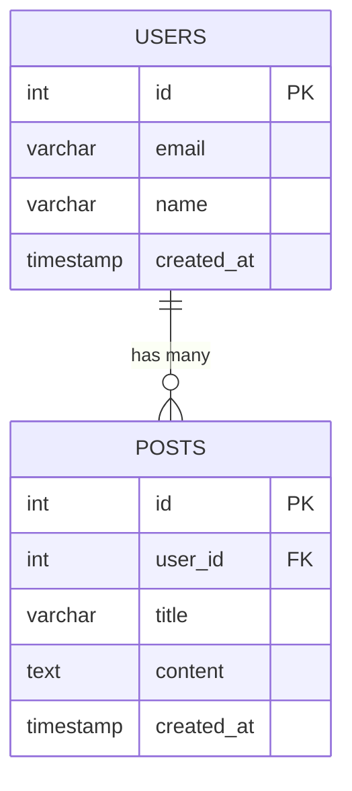

# Quickstart: Export and Save Query Results

**Feature**: Export and Save Query Results
**Branch**: `003-export-and-save`
**Date**: 2025-10-25

## Overview

This quickstart guide demonstrates the export functionality through concrete examples. It covers User Stories 1-3 (P1-P3) which are the primary features. User Story 4 (auto-export mode) is not covered as it's a convenience feature for advanced users.

## Prerequisites

- QueryNL CLI installed (`pip install -e .`)
- At least one database connection configured
- Basic familiarity with QueryNL commands

## User Story 1: Basic CSV Export in CLI Mode (P1)

**Goal**: Export query results to CSV from command line.

### Example 1.1: Simple CSV Export

```bash
# Execute query and export to CSV
$ querynl query "show me all users" --export users.csv

Generating SQL from: show me all users
Generated SQL: SELECT * FROM users;

 Query Results
┏━━━━┳━━━━━━━━━━━━━━━━━━━━┳━━━━━━━━━━━━━━━━━━━━━━━━━━┓
┃ id ┃ email              ┃ created_at               ┃
┡━━━━╇━━━━━━━━━━━━━━━━━━━━╇━━━━━━━━━━━━━━━━━━━━━━━━━━┩
│  1 │ alice@example.com  │ 2025-01-01 00:00:00      │
│  2 │ bob@example.com    │ 2025-01-02 00:00:00      │
│  3 │ charlie@example.com│ 2025-01-03 00:00:00      │
└────┴────────────────────┴──────────────────────────┘

Rows: 3 | Execution time: 45ms

✓ Exported 3 rows to users.csv
```

**Result**: Creates `users.csv`:
```csv
id,email,created_at
1,alice@example.com,2025-01-01 00:00:00
2,bob@example.com,2025-01-02 00:00:00
3,charlie@example.com,2025-01-03 00:00:00
```

---

### Example 1.2: File Already Exists (Auto-Rename)

```bash
# Run same export again - file already exists
$ querynl query "show me all users" --export users.csv

...

File existed, renamed to: users_20251025_143022.csv
✓ Exported 3 rows to users_20251025_143022.csv
```

**Result**: Original `users.csv` untouched, new file created with timestamp.

---

### Example 1.3: Nested Path (Auto-Create Directories)

```bash
# Export to nested path that doesn't exist
$ querynl query "select * from orders" --export exports/2025/october/orders.csv

...

✓ Exported 1523 rows to exports/2025/october/orders.csv

# Directories were created automatically:
$ ls -R exports/
exports/:
2025/

exports/2025:
october/

exports/2025/october:
orders.csv
```

---

### Example 1.4: Empty Result Set

```bash
$ querynl query "select * from users where email = 'nonexistent@example.com'" --export empty.csv

 Query Results
┏━━━━━━━━━━━━━┓
┃ (no results) ┃
┡━━━━━━━━━━━━━┩

Rows: 0 | Execution time: 12ms

✓ Exported 0 rows to empty.csv
```

**Result**: Creates `empty.csv` with headers only:
```csv
id,email,created_at
```

---

### Example 1.5: Special Characters in Data

```bash
$ querynl query "select * from comments" --export comments.csv
```

**Sample Data**:
| id | content | author |
|----|---------|--------|
| 1  | This is great! | Alice |
| 2  | Contains "quotes" | Bob |
| 3  | Multi-line<br/>comment | Charlie |
| 4  | Has, commas, here | Dave |

**Result**: `comments.csv` (properly escaped):
```csv
id,content,author
1,This is great!,Alice
2,"Contains ""quotes""",Bob
3,"Multi-line
comment",Charlie
4,"Has, commas, here",Dave
```

---

## User Story 2: Export in REPL Mode (P2)

**Goal**: Save query results mid-session without leaving REPL.

### Example 2.1: Basic REPL Export

```bash
$ querynl repl

QueryNL REPL v0.1.0
Connected to: my_database
...

querynl (my_database)> show me all active users

 Query Results
┏━━━━┳━━━━━━━━━━━━━━━━━━━━┳━━━━━━━━┓
┃ id ┃ email              ┃ status ┃
┡━━━━╇━━━━━━━━━━━━━━━━━━━━╇━━━━━━━━┩
│  1 │ alice@example.com  │ active │
│  2 │ bob@example.com    │ active │
└────┴────────────────────┴────────┘

Rows: 2

querynl (my_database)> \export active_users.csv
✓ Exported 2 rows to active_users.csv

querynl (my_database)> # Continue working, result is saved
```

---

### Example 2.2: Multiple Queries - Only Last Result Exported

```bash
querynl (my_database)> select * from users

 Query Results
┏━━━━┳━━━━━━━━━━━━━━━━━━━━┓
┃ id ┃ email              ┃
┡━━━━╇━━━━━━━━━━━━━━━━━━━━┩
│  1 │ alice@example.com  │
│  2 │ bob@example.com    │
│  3 │ charlie@example.com│
└────┴────────────────────┘

Rows: 3

querynl (my_database)> select * from posts

 Query Results
┏━━━━┳━━━━━━━┳━━━━━━━━━━━━━━━━━━━┓
┃ id ┃ title ┃ user_id           ┃
┡━━━━╇━━━━━━━╇━━━━━━━━━━━━━━━━━━━┩
│  1 │ Hello │ 1                 │
│  2 │ World │ 2                 │
└────┴───────┴───────────────────┘

Rows: 2

querynl (my_database)> \export results.csv
✓ Exported 2 rows to results.csv

# Note: Only the posts query (most recent) was exported, not users query
```

---

### Example 2.3: Format Auto-Detection from Extension

```bash
querynl (my_database)> show me all users

Rows: 3

querynl (my_database)> \export users.json
✓ Exported 3 rows to users.json

# View the JSON file
$ cat users.json
[
  {
    "id": 1,
    "email": "alice@example.com",
    "created_at": "2025-01-01T00:00:00Z"
  },
  {
    "id": 2,
    "email": "bob@example.com",
    "created_at": "2025-01-02T00:00:00Z"
  },
  {
    "id": 3,
    "email": "charlie@example.com",
    "created_at": "2025-01-03T00:00:00Z"
  }
]
```

---

### Example 2.4: No Results to Export Error

```bash
querynl (my_database)> # Just entered REPL, no query yet

querynl (my_database)> \export results.csv
No query results to export. Run a query first.

querynl (my_database)> show me users

Rows: 3

querynl (my_database)> \export results.csv
✓ Exported 3 rows to results.csv
```

---

## User Story 3: Multiple Format Support (P3)

**Goal**: Export in JSON, SQL INSERT, and Mermaid formats.

### Example 3.1: JSON Export

```bash
$ querynl query "select id, name, email from users limit 2" --export users.json

✓ Exported 2 rows to users.json
```

**Result**: `users.json`:
```json
[
  {
    "id": 1,
    "name": "Alice",
    "email": "alice@example.com"
  },
  {
    "id": 2,
    "name": "Bob",
    "email": "bob@example.com"
  }
]
```

---

### Example 3.2: SQL INSERT Export

```bash
$ querynl query "select * from users limit 3" --export users.sql

✓ Exported 3 rows to users.sql
```

**Result**: `users.sql` (PostgreSQL format):
```sql
-- Table: users (3 columns)
-- Database: postgresql
-- Exported: 2025-10-25T14:30:22

INSERT INTO users (id, name, email, created_at) VALUES
  (1, 'Alice', 'alice@example.com', '2025-01-01 00:00:00'),
  (2, 'Bob', 'bob@example.com', '2025-01-02 00:00:00'),
  (3, 'Charlie', 'charlie@example.com', '2025-01-03 00:00:00');
```

---

### Example 3.3: Mermaid Diagram Export (Schema Visualization)

```bash
$ querynl repl

querynl (my_database)> \schema graph

📊 Database ER Diagram: my_database (postgresql)

╭─────────────────╮  ╭─────────────────╮
│ USERS           │  │ POSTS           │
│ ───────         │  │ ─────           │
│ 🔑 id           │  │ 🔑 id           │
│    email        │  │ 🔗 user_id      │
│    name         │  │    title        │
╰─────────────────╯  │    content      │
                     ╰─────────────────╯

🔗 Relationships (Foreign Keys)
  posts.user_id ──────→ users.id

querynl (my_database)> \export schema.mmd
✓ Exported schema to schema.mmd
```

**Result**: `schema.mmd`:


**Rendering**: This can be rendered in GitHub, GitLab, Notion, or any Mermaid-compatible tool:


---

### Example 3.4: Format Override with --format Flag

```bash
# Export as JSON even though extension is .csv
$ querynl query "select * from users" --export data.csv --format json

Format mismatch: Extension is .csv but --format is json. Using json format.
✓ Exported 3 rows to data.csv

# File contains JSON despite .csv extension
$ cat data.csv
[
  {"id": 1, "email": "alice@example.com"},
  ...
]
```

---

### Example 3.5: Handling NULL and Special Types in JSON

```bash
$ querynl query "select * from events" --export events.json
```

**Sample Data**:
| id | name | occurred_at | metadata | cancelled |
|----|------|-------------|----------|-----------|
| 1  | Launch | 2025-01-01 10:00:00 | {"priority": "high"} | false |
| 2  | Cancelled | NULL | NULL | true |

**Result**: `events.json` (proper type serialization):
```json
[
  {
    "id": 1,
    "name": "Launch",
    "occurred_at": "2025-01-01T10:00:00Z",
    "metadata": "{\"priority\": \"high\"}",
    "cancelled": false
  },
  {
    "id": 2,
    "name": "Cancelled",
    "occurred_at": null,
    "metadata": null,
    "cancelled": true
  }
]
```

---

## Cross-Database Examples

### PostgreSQL Export

```bash
$ querynl query "select * from users" --connection pg_prod --export pg_users.csv
✓ Exported 1523 rows to pg_users.csv
```

### MySQL Export

```bash
$ querynl query "show me all customers" --connection mysql_db --export mysql_customers.json
✓ Exported 2847 rows to mysql_customers.json
```

### SQLite Export

```bash
$ querynl query "select * from logs" --connection local_sqlite --export logs.sql
✓ Exported 5234 rows to logs.sql
```

### MongoDB Export (JSON-only)

```bash
$ querynl query "show me users collection" --connection mongo_db --export mongo_users.json
✓ Exported 3921 documents to mongo_users.json
```

---

## Large Dataset Export with Progress

### Example: Exporting 100,000 Rows

```bash
$ querynl query "select * from large_table" --export large.csv

Generating SQL...
Executing query...

Exported 10,000 rows...
Exported 20,000 rows...
Exported 30,000 rows...
...
Exported 100,000 rows...

✓ Exported 100,000 rows to large.csv (12.5 MB) in 8.3 seconds
```

**Progress Indicators**:
- Displays every 10,000 rows
- Shows final statistics (row count, file size, duration)
- Uses streaming to prevent memory issues

---

## Error Scenarios

### Permission Denied

```bash
$ querynl query "select * from users" --export /root/protected.csv

✗ Export failed: Permission denied: Cannot write to /root/protected.csv
  Suggestion: Check directory permissions or choose a different location.
```

### Invalid Path

```bash
$ querynl query "select * from users" --export "../../../etc/passwd"

✗ Export failed: Invalid path: Path contains directory traversal sequence
  Suggestion: Use absolute paths or paths within the current directory.
```

### Disk Full

```bash
$ querynl query "select * from huge_table" --export data.csv

Exported 10,000 rows...
Exported 20,000 rows...

✗ Export failed: Disk full: No space left on device
  Exported partial data has been removed.
  Suggestion: Free up disk space and try again.
```

---

## Tips and Best Practices

### 1. Choose the Right Format

- **CSV**: For spreadsheet analysis (Excel, Google Sheets)
- **JSON**: For APIs, scripts, data pipelines
- **SQL**: For database migrations or backups
- **Mermaid**: For documentation and schema visualization

### 2. Organize Exports

```bash
# Create organized export structure
$ mkdir -p exports/$(date +%Y/%m/%d)
$ querynl query "..." --export "exports/$(date +%Y/%m/%d)/users.csv"
```

### 3. Large Exports

```bash
# For very large exports, run in background and redirect output
$ nohup querynl query "select * from huge_table" --export huge.csv > export.log 2>&1 &

# Monitor progress
$ tail -f export.log
```

### 4. Verify Exports

```bash
# Check row count matches
$ wc -l users.csv
1524 users.csv  # 1523 data rows + 1 header row

# Preview first few rows
$ head -5 users.csv
```

### 5. Script Multiple Exports

```bash
#!/bin/bash
# export_all_tables.sh

EXPORT_DIR="exports/$(date +%Y%m%d)"
mkdir -p "$EXPORT_DIR"

querynl query "select * from users" --export "$EXPORT_DIR/users.csv"
querynl query "select * from posts" --export "$EXPORT_DIR/posts.csv"
querynl query "select * from comments" --export "$EXPORT_DIR/comments.csv"

echo "All exports complete in $EXPORT_DIR"
```

---

## Acceptance Testing

### Test Scenario 1: Basic CSV Export (US1)
1. Connect to database
2. Run query: `querynl query "select * from users" --export users.csv`
3. Verify CSV file created with correct data
4. Open in Excel/Google Sheets to verify formatting

### Test Scenario 2: REPL Export (US2)
1. Start REPL: `querynl repl`
2. Run query: `show me all users`
3. Export: `\export users.csv`
4. Run another query: `show me all posts`
5. Export: `\export posts.csv`
6. Verify only posts data in posts.csv (not users)

### Test Scenario 3: Multiple Formats (US3)
1. Export same query to CSV, JSON, SQL
2. Verify CSV opens in Excel
3. Verify JSON parses with `jq` or `python -m json.tool`
4. Verify SQL executes on target database
5. Export schema to Mermaid and render in GitHub

### Test Scenario 4: File Conflicts
1. Export to `test.csv`
2. Export again to `test.csv`
3. Verify original file untouched
4. Verify new file has timestamp: `test_YYYYMMDD_HHMMSS.csv`

### Test Scenario 5: Edge Cases
1. Export empty result set (verify headers only)
2. Export data with special characters (quotes, commas, newlines)
3. Export to nested path that doesn't exist
4. Export very large dataset (>10,000 rows) and verify progress indicators

---

## Next Steps

1. **Try it yourself**: Run through examples with your own database
2. **Explore formats**: Export same data to all formats and compare
3. **Test edge cases**: Try empty results, special characters, large datasets
4. **Read contracts**: See [export_api.md](contracts/export_api.md) for API details
5. **Review tasks**: Check [tasks.md](tasks.md) for implementation plan

## Support

- **Documentation**: See main README and feature spec
- **Issues**: Report bugs on GitHub with export logs
- **Examples**: More examples in `examples/` directory
