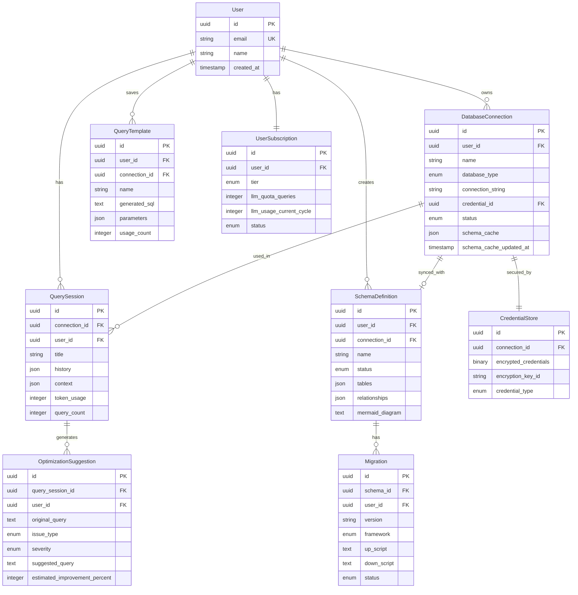

# Data Model: QueryNL

**Date**: 2025-10-11
**Source**: Derived from [spec.md](spec.md) Key Entities section

---

## Core Entities

### DatabaseConnection

Represents a configured connection to a user's database system.

**Attributes:**
- `id` (UUID): Unique identifier
- `name` (string): User-friendly connection name (e.g., "Production PostgreSQL")
- `database_type` (enum): postgresql | mysql | sqlite | mongodb
- `connection_string` (string, encrypted): Database connection URI (encrypted at rest)
- `credential_id` (UUID): Reference to CredentialStore entry
- `status` (enum): connected | disconnected | error | connecting
- `schema_cache` (JSON): Cached database schema metadata
- `schema_cache_updated_at` (timestamp): Last schema introspection time
- `created_at` (timestamp)
- `updated_at` (timestamp)
- `last_connected_at` (timestamp)

**Relationships:**
- Many DatabaseConnections belong to one User (user_id foreign key)
- One DatabaseConnection has many QuerySessions
- One DatabaseConnection references one CredentialStore entry

**Validation Rules:**
- `name` must be unique per user
- `connection_string` must be valid for `database_type`
- `status` transitions: disconnected → connecting → connected/error
- Schema cache expires after 1 hour (configurable)

**State Transitions:**
```
disconnected → connecting (user initiates connection)
connecting → connected (successful authentication)
connecting → error (connection failure)
connected → disconnected (user disconnects or timeout)
error → connecting (user retries)
```

---

### QuerySession

Represents a conversation context where users interact with the AI agent.

**Attributes:**
- `id` (UUID): Unique identifier
- `connection_id` (UUID): Foreign key to DatabaseConnection
- `title` (string): Auto-generated or user-provided session name
- `history` (JSON array): Chronological list of interactions
  - Each entry: `{type, timestamp, natural_language_query, generated_sql, result_preview, token_count}`
- `context` (JSON): Accumulated conversation context for LLM
- `token_usage` (integer): Total LLM tokens consumed in this session
- `query_count` (integer): Number of queries executed
- `created_at` (timestamp)
- `updated_at` (timestamp)
- `last_activity_at` (timestamp)

**Relationships:**
- Many QuerySessions belong to one DatabaseConnection
- Many QuerySessions belong to one User

**Validation Rules:**
- `history` entries are append-only (immutable once created)
- `title` auto-generated from first query if not provided
- Sessions auto-archived after 30 days of inactivity
- Maximum 10,000 history entries per session

**History Entry Schema:**
```json
{
  "type": "query" | "schema_design" | "optimization" | "clarification",
  "timestamp": "ISO8601",
  "user_input": "show me all active users",
  "generated_sql": "SELECT * FROM users WHERE status = 'active'",
  "execution_status": "success" | "error" | "skipped",
  "result_count": 42,
  "execution_time_ms": 123,
  "token_count": 85
}
```

---

### SchemaDefinition

Represents a database schema design (draft or synced with actual database).

**Attributes:**
- `id` (UUID): Unique identifier
- `name` (string): Schema name (e.g., "E-commerce Schema v2")
- `description` (text): User-provided description
- `status` (enum): draft | synced | outdated
- `database_type` (enum): postgresql | mysql | sqlite | mongodb
- `tables` (JSON array): Table definitions
  - Each table: `{name, columns[], constraints[], indexes[]}`
- `relationships` (JSON array): Foreign key relationships
  - Each: `{from_table, from_column, to_table, to_column, type}`
- `connection_id` (UUID, nullable): Linked DatabaseConnection if synced
- `mermaid_diagram` (text): Generated Mermaid ERD syntax
- `created_at` (timestamp)
- `updated_at` (timestamp)
- `synced_at` (timestamp, nullable)

**Relationships:**
- Many SchemaDefinitions belong to one User
- One SchemaDefinition optionally links to one DatabaseConnection
- One SchemaDefinition has many Migrations

**Validation Rules:**
- Table names must be unique within schema
- Column definitions must include: name, data_type, nullable
- Relationships must reference existing tables/columns
- Primary keys required for all tables (enforced by design assistant)

**Table Schema:**
```json
{
  "name": "users",
  "columns": [
    {
      "name": "id",
      "data_type": "integer",
      "nullable": false,
      "primary_key": true,
      "auto_increment": true
    },
    {
      "name": "email",
      "data_type": "varchar(255)",
      "nullable": false,
      "unique": true
    }
  ],
  "constraints": [
    {"type": "unique", "columns": ["email"]},
    {"type": "check", "expression": "LENGTH(email) > 0"}
  ],
  "indexes": [
    {"name": "idx_users_email", "columns": ["email"], "type": "btree"}
  ]
}
```

**State Transitions:**
```
draft → synced (schema applied to database)
synced → outdated (database schema changes detected)
outdated → synced (schema re-synced or updated)
```

---

### Migration

Represents a database migration with up/down scripts.

**Attributes:**
- `id` (UUID): Unique identifier
- `schema_id` (UUID): Foreign key to SchemaDefinition
- `version` (string): Migration version (e.g., "V1.0.0", "20231011_001")
- `framework` (enum): alembic | flyway | django | liquibase | rails
- `description` (string): Human-readable migration description
- `up_script` (text): Forward migration SQL/code
- `down_script` (text): Rollback migration SQL/code
- `status` (enum): pending | applied | failed | rolled_back
- `checksum` (string): SHA-256 hash of up_script (for integrity verification)
- `applied_at` (timestamp, nullable)
- `rolled_back_at` (timestamp, nullable)
- `created_at` (timestamp)

**Relationships:**
- Many Migrations belong to one SchemaDefinition
- Many Migrations belong to one User

**Validation Rules:**
- `version` must be unique per schema_id
- `up_script` and `down_script` must be non-empty
- `checksum` validated before application
- Migrations applied in version order
- Cannot rollback if newer migrations applied (must rollback newer first)

**Framework-Specific Fields:**
- Alembic: `revision_id`, `down_revision` (Python script format)
- Flyway: `version` follows `V{major}_{minor}__{description}.sql` format
- Django: `app_label`, `dependencies` (Python class format)

**State Transitions:**
```
pending → applied (migration executed successfully)
pending → failed (migration execution error)
applied → rolled_back (down script executed)
failed → pending (user retries after fixing)
```

---

### QueryTemplate

Represents saved queries that users frequently execute.

**Attributes:**
- `id` (UUID): Unique identifier
- `name` (string): Template name (e.g., "Monthly Active Users")
- `description` (text): What this query does
- `natural_language_query` (text): Original NL query
- `generated_sql` (text): SQL query with parameter placeholders
- `parameters` (JSON array): Parameter definitions
  - Each: `{name, type, default_value, required}`
- `database_type` (enum): postgresql | mysql | sqlite | mongodb
- `connection_id` (UUID, nullable): Suggested database connection
- `usage_count` (integer): Times this template has been executed
- `last_used_at` (timestamp)
- `created_at` (timestamp)
- `updated_at` (timestamp)

**Relationships:**
- Many QueryTemplates belong to one User
- QueryTemplate optionally references one DatabaseConnection

**Validation Rules:**
- `name` must be unique per user
- `parameters` validated against `generated_sql` placeholders
- Maximum 1,000 templates per user (freemium), unlimited (premium)
- Templates auto-archived if unused for 180 days

**Parameter Schema:**
```json
{
  "name": "start_date",
  "type": "date",
  "default_value": "2024-01-01",
  "required": true,
  "description": "Start date for date range filter"
}
```

**SQL with Parameters (PostgreSQL example):**
```sql
SELECT * FROM users
WHERE created_at >= :start_date
  AND created_at < :end_date
  AND status = :status
```

---

### OptimizationSuggestion

Represents performance improvement recommendations for queries.

**Attributes:**
- `id` (UUID): Unique identifier
- `query_session_id` (UUID): Foreign key to QuerySession
- `original_query` (text): User's original SQL query
- `issue_type` (enum): missing_index | n_plus_one | inefficient_join | full_table_scan | subquery_optimization
- `severity` (enum): low | medium | high | critical
- `explanation` (text): Human-readable explanation of the issue
- `suggested_query` (text): Optimized version of the query
- `suggested_indexes` (JSON array): Index recommendations
- `estimated_improvement_percent` (integer): Expected performance gain (%)
- `implementation_risk` (enum): low | medium | high
- `status` (enum): pending | accepted | rejected | implemented
- `before_execution_time_ms` (integer, nullable): Original query time
- `after_execution_time_ms` (integer, nullable): Optimized query time (if tested)
- `created_at` (timestamp)
- `updated_at` (timestamp)

**Relationships:**
- Many OptimizationSuggestions belong to one QuerySession
- Many OptimizationSuggestions belong to one User

**Validation Rules:**
- `estimated_improvement_percent` between 1-99
- `suggested_query` must be syntactically valid SQL
- Suggestions expire after 30 days if not addressed

**Index Suggestion Schema:**
```json
{
  "table": "users",
  "columns": ["email", "status"],
  "index_type": "btree",
  "estimated_size_mb": 12,
  "creation_sql": "CREATE INDEX idx_users_email_status ON users(email, status)"
}
```

---

### UserSubscription

Tracks user's subscription tier and LLM usage.

**Attributes:**
- `id` (UUID): Unique identifier
- `user_id` (UUID): Foreign key to User
- `tier` (enum): freemium | premium_individual | premium_team | enterprise
- `billing_cycle` (enum): monthly | annual | custom
- `llm_quota_queries` (integer): Query limit per billing cycle
- `llm_usage_current_cycle` (integer): Queries used in current cycle
- `llm_usage_token_count` (bigint): Total tokens consumed
- `cycle_start_date` (timestamp): Current billing cycle start
- `cycle_end_date` (timestamp): Current billing cycle end
- `features_enabled` (JSON array): Enabled features list
- `status` (enum): active | cancelled | suspended | expired
- `created_at` (timestamp)
- `updated_at` (timestamp)

**Relationships:**
- One UserSubscription belongs to one User (1:1 relationship)

**Validation Rules:**
- Quota limits by tier:
  - freemium: unlimited queries (user's own LLM key), 5 connections
  - premium_individual: 1,000 queries/month, 20 connections
  - premium_team: 5,000 queries/user/month, unlimited connections
  - enterprise: unlimited queries, unlimited connections
- Usage reset on `cycle_start_date`
- `status` = suspended if usage exceeds quota

**Features by Tier:**
```json
{
  "freemium": ["query_generation", "basic_schema_design", "csv_export"],
  "premium_individual": ["all_freemium", "migrations", "optimization", "visual_erd", "mongodb"],
  "premium_team": ["all_individual", "collaboration", "team_credentials", "sso"],
  "enterprise": ["all_team", "self_hosted", "custom_llm", "priority_support"]
}
```

---

### CredentialStore

Securely stores encrypted database credentials.

**Attributes:**
- `id` (UUID): Unique identifier
- `connection_id` (UUID): Foreign key to DatabaseConnection (1:1)
- `encrypted_credentials` (binary): AES-256 encrypted credential blob
- `encryption_key_id` (string): Reference to encryption key (OS keychain)
- `credential_type` (enum): password | ssh_key | token | aws_iam
- `created_at` (timestamp)
- `updated_at` (timestamp)
- `last_validated_at` (timestamp, nullable)

**Relationships:**
- One CredentialStore belongs to one DatabaseConnection (1:1)
- Many CredentialStores belong to one User

**Validation Rules:**
- Credentials never logged or transmitted in plain text
- Encryption key stored in OS keychain (not in database)
- Credentials validated on save (test connection)
- Auto-rotation support for enterprise tier

**Encrypted Credential Schema (before encryption):**
```json
{
  "username": "db_user",
  "password": "***",
  "host": "db.example.com",
  "port": 5432,
  "database": "production",
  "ssl_mode": "require",
  "ssh_tunnel": {
    "host": "bastion.example.com",
    "port": 22,
    "user": "ssh_user",
    "private_key": "***"
  }
}
```

**Security Requirements:**
- Encryption: AES-256-GCM
- Key derivation: PBKDF2 with 100,000 iterations
- Unique IV per credential
- Authentication tag for integrity verification

---

## Entity Relationship Diagram



---

## Storage Strategy

### Local Storage (SQLite)

Stored locally on user's machine for user preferences, query history, and metadata:

- User
- DatabaseConnection (connection string encrypted)
- QuerySession
- QueryTemplate
- OptimizationSuggestion

**Location:**
- macOS: `~/Library/Application Support/QueryNL/querynl.db`
- Windows: `%APPDATA%\QueryNL\querynl.db`
- Linux: `~/.config/QueryNL/querynl.db`

### OS Keychain

Secure credential storage using native OS keychain services:

- CredentialStore entries (encrypted credentials)
- Encryption keys for connection strings

**Libraries:**
- Python: `keyring` library
- Fallback: Encrypted file with master password

### Cloud Storage (Premium/Enterprise Only)

Optional cloud sync for team collaboration (Phase 2):

- SchemaDefinition (shared designs)
- QueryTemplate (team templates)
- UserSubscription (billing data)

**Not stored in cloud:**
- Database credentials (always local)
- Query results (privacy)
- Connection strings (security)

---

## Data Retention Policies

| Entity | Retention Period | Rationale |
|--------|------------------|-----------|
| QuerySession history | Last 10,000 queries | Performance + disk space |
| SchemaDefinition | Indefinite (user manages) | User-created content |
| Migration | Indefinite (linked to schema) | Required for version tracking |
| QueryTemplate | Until deleted or 180 days unused | Active templates only |
| OptimizationSuggestion | 30 days | Time-limited relevance |
| CredentialStore | Until connection deleted | Required for access |
| UserSubscription usage data | 24 months | Billing history |

**GDPR Compliance:**
- User can export all data (JSON format)
- User can delete account and all associated data
- Credentials never leave user's machine (local storage only)
- No telemetry unless explicitly opted in

---

## Indexes and Performance

### SQLite Indexes (Local Database)

```sql
-- DatabaseConnection lookups
CREATE INDEX idx_connections_user_id ON database_connection(user_id);
CREATE INDEX idx_connections_status ON database_connection(status);

-- QuerySession chronological queries
CREATE INDEX idx_sessions_connection_id ON query_session(connection_id);
CREATE INDEX idx_sessions_last_activity ON query_session(last_activity_at DESC);

-- QueryTemplate search
CREATE INDEX idx_templates_user_id ON query_template(user_id);
CREATE INDEX idx_templates_name ON query_template(name);
CREATE INDEX idx_templates_usage ON query_template(usage_count DESC);

-- Migration version ordering
CREATE INDEX idx_migrations_schema_id ON migration(schema_id);
CREATE INDEX idx_migrations_version ON migration(version);
```

### Performance Targets

- Connection list load: <100ms
- Query session history load: <200ms (for last 100 queries)
- Template search: <150ms (with 1,000 templates)
- Schema cache retrieval: <50ms

---

## Migration Strategy

### Initial Schema Creation

Use Alembic for local SQLite database schema management:

```bash
alembic init storage/migrations
alembic revision --autogenerate -m "Initial schema"
alembic upgrade head
```

### Schema Evolution

- Backward-compatible changes preferred
- Migration scripts for breaking changes
- Data migration support for schema changes
- Versioning: Semantic versioning for database schema

### Testing

- Unit tests: Validate entity models and relationships
- Integration tests: Test CRUD operations against test database
- Performance tests: Measure query performance against targets
