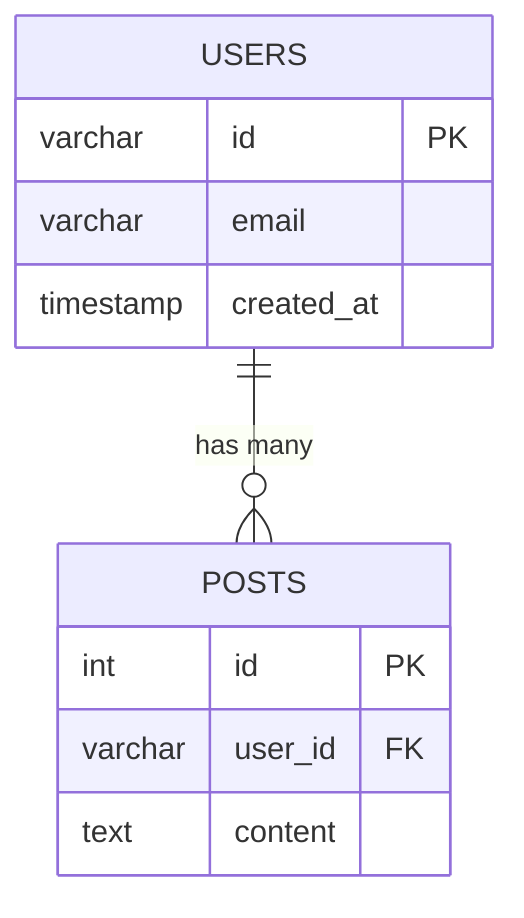

# Data Model: Export and Save Query Results

**Feature**: Export and Save Query Results
**Branch**: `003-export-and-save`
**Date**: 2025-10-25

## Overview

This document defines the data structures used by the export functionality. Since this is a file export feature (not database-backed), the "data model" describes in-memory objects, configuration structures, and file format schemas.

## Entities

### 1. ExportConfiguration

**Purpose**: Encapsulates all settings for an export operation.

**Attributes**:
- `file_path` (Path): Absolute or relative path to output file
- `format` (ExportFormat): Export format (auto-detected from extension or explicit)
- `source_database_type` (str): Database type for SQL INSERT generation ("postgresql", "mysql", "sqlite", "mongodb")
- `overwrite_behavior` (str): "auto_rename" (default) or future options
- `include_headers` (bool): Include column headers in CSV/table formats (default: True)
- `progress_enabled` (bool): Show progress indicators for large exports (default: True)
- `progress_interval` (int): Rows between progress updates (default: 10000)
- `pretty_print` (bool): Pretty-print JSON output (default: False for streaming efficiency)
- `batch_size` (int): Rows per SQL INSERT batch (default: 1000)

**Validation Rules**:
- `file_path` must not contain path traversal sequences (../, ..\)
- `format` must be one of: CSV, JSON, SQL, MERMAID, TXT
- `progress_interval` must be > 0
- `batch_size` must be between 1 and 10000

**Lifecycle**: Created per export operation, not persisted

### 2. ExportResult

**Purpose**: Represents the outcome of an export operation.

**Attributes**:
- `success` (bool): Whether export completed successfully
- `file_path` (Path): Actual path where file was saved (may differ from requested if auto-renamed)
- `original_path` (Path | None): Original requested path if file was renamed
- `row_count` (int): Number of rows exported
- `file_size_bytes` (int): Size of exported file
- `duration_ms` (float): Time taken for export operation
- `format` (ExportFormat): Format used
- `warnings` (List[str]): Non-fatal warnings (e.g., "Binary column skipped in CSV")
- `error` (str | None): Error message if `success` is False

**Relationships**: None (terminal result object)

**State Transitions**: N/A (immutable result)

### 3. ExportFormat (Enum)

**Purpose**: Defines supported export formats.

**Values**:
- `CSV` = "csv" - Comma-separated values (RFC 4180)
- `JSON` = "json" - JSON array of objects
- `SQL` = "sql" - SQL INSERT statements
- `MERMAID` = "mermaid" - Mermaid ER diagram
- `TXT` = "txt" - Plain text

**File Extension Mapping**:
```python
{
    ".csv": ExportFormat.CSV,
    ".json": ExportFormat.JSON,
    ".sql": ExportFormat.SQL,
    ".mmd": ExportFormat.MERMAID,
    ".txt": ExportFormat.TXT
}
```

### 4. StreamingExportState

**Purpose**: Maintains state during streaming export operations.

**Attributes**:
- `rows_exported` (int): Current row count
- `last_progress_update` (int): Row count at last progress message
- `start_time` (datetime): Export start timestamp
- `file_handle` (TextIO): Open file handle (managed by context manager)
- `format_writer` (FormatWriter): Format-specific writer instance

**Lifecycle**: Exists only during active export, destroyed on completion/error

**State Transitions**:
```
INITIALIZING → WRITING → COMPLETED
             ↓
           ERROR
```

## Configuration Schema

### Auto-Export Configuration (Priority P4)

**Purpose**: Settings for automatic export mode.

**Location**: `~/.querynl/config.yaml`

**Schema**:
```yaml
auto_export:
  enabled: false                          # Default: disabled (fail-safe)
  output_directory: "./querynl_exports"   # Default output path
  filename_template: "query_{timestamp}"  # Template for generated filenames
  default_format: "csv"                   # Default format when not specified
  create_subdirectories_by_date: true     # Create YYYY-MM-DD subdirs
```

**Validation Rules**:
- `enabled` must be boolean
- `output_directory` must be valid path string
- `filename_template` must contain `{timestamp}` placeholder
- `default_format` must be valid ExportFormat value

## File Format Schemas

### CSV Format (RFC 4180)

**Structure**:
```csv
column1,column2,column3
value1,value2,value3
"value with, comma","value with ""quote""",normal_value
```

**Encoding**: UTF-8 with BOM (`utf-8-sig`) for Excel compatibility

**Special Value Handling**:
- NULL → empty string
- Newlines in values → preserved, value quoted
- Commas in values → value quoted
- Quotes in values → doubled and value quoted

### JSON Format

**Structure**:
```json
[
  {
    "column1": "value1",
    "column2": 123,
    "column3": null
  },
  {
    "column1": "value2",
    "column2": 456,
    "column3": "2025-10-25T14:30:00Z"
  }
]
```

**Type Serialization**:
- `datetime` → ISO 8601 string (YYYY-MM-DDTHH:MM:SSZ)
- `Decimal` → float
- `bytes` → Base64 string
- `None` → `null`
- `bool` → `true`/`false`

### SQL INSERT Format

**Structure** (PostgreSQL example):
```sql
-- Table: users (3 columns)
-- Exported: 2025-10-25 14:30:00
-- Row count: 2

INSERT INTO users (id, name, created_at) VALUES
  (1, 'Alice', '2025-01-01 00:00:00'),
  (2, 'Bob''s Account', '2025-01-02 00:00:00');
```

**Database-Specific Escaping**:
- **PostgreSQL**: Single quotes → `''`, supports multiple rows per INSERT
- **MySQL**: Single quotes → `\'`, backtick identifiers
- **SQLite**: Single quotes → `''`, no special escaping
- **MongoDB**: N/A (use JSON format instead)

**Batch Size**: Default 1000 rows per INSERT statement

### Mermaid ER Diagram Format

**Structure**:


**Relationship Notation**:
- `||--o{` = one-to-many
- `||--||` = one-to-one
- `}o--o{` = many-to-many

**Type Mapping**:
- `character varying`, `varchar`, `text` → `varchar`
- `integer`, `bigint`, `smallint` → `int`
- `timestamp`, `datetime`, `date` → `timestamp`
- `boolean` → `boolean`
- `jsonb`, `json` → `json`

### Plain Text Format

**Structure**: Human-readable representation (same as console output)
```
Command: \tables
Output:
  - users
  - posts
  - comments

Total: 3 tables
```

## REPL Session State

### Last Query Result Cache

**Purpose**: Store most recent query result for REPL `\export` command.

**Attributes**:
- `query_text` (str): Natural language query that was executed
- `generated_sql` (str): SQL generated from query
- `result_data` (Dict): Raw query result (rows, metadata)
- `database_type` (str): Source database type
- `timestamp` (datetime): When query was executed
- `command_type` (str): "query" | "schema" | "tables" | "help"

**Lifecycle**:
- Created: After each query/command execution in REPL
- Updated: On next query/command (replaces previous)
- Cleared: On REPL exit or explicit clear

**Size Limits**:
- Result data capped at 100MB to prevent memory issues
- For very large results, cache metadata only and warn user

## Relationships Diagram

```
ExportConfiguration
      |
      | uses
      ↓
ExportResult ← produces ← Exporter
      |                      |
      | contains             | uses
      ↓                      ↓
  ExportFormat        FormatWriter
                            |
                            | implements
                            ↓
                    [CSVWriter, JSONWriter,
                     SQLWriter, MermaidWriter]
```

## Validation Rules Summary

### Path Validation
- No path traversal (`../`, `..\`)
- Valid for target OS (Windows: no `<>:"|?*`, max 260 chars)
- Parent directory must be writable (checked before export)

### Data Validation
- Row count < 10,000: In-memory export
- Row count ≥ 10,000: Streaming export with progress
- Binary data: Skip in CSV with warning, Base64 in JSON

### Format Validation
- CSV: Column names must not contain newlines
- JSON: All values must be JSON-serializable
- SQL: Table/column names must be valid identifiers
- Mermaid: Entity names must be valid Mermaid identifiers

## Error Handling

### Export Errors (ExportError hierarchy)

```python
ExportError (base)
├── FilePermissionError  # Permission denied
├── DiskFullError       # Disk space exhausted
├── InvalidPathError    # Invalid/malformed path
├── UnsupportedFormatError  # Format not supported for data type
└── StreamingError      # Error during streaming export
```

### Error Recovery
- **Pre-flight checks**: Validate path/permissions before starting export
- **Atomic writes**: Write to temp file, rename on success
- **Cleanup on error**: Remove partial files
- **User feedback**: Clear error messages with actionable suggestions

## Volume Assumptions

- **Typical export**: 100-10,000 rows (in-memory, <1 second)
- **Large export**: 10,000-1,000,000 rows (streaming, progress indicators)
- **Very large export**: >1,000,000 rows (streaming, may take minutes)
- **File sizes**: Typically 1KB-100MB, up to 1GB for very large exports
- **REPL cache**: Max 100MB per result (prevents memory issues)
