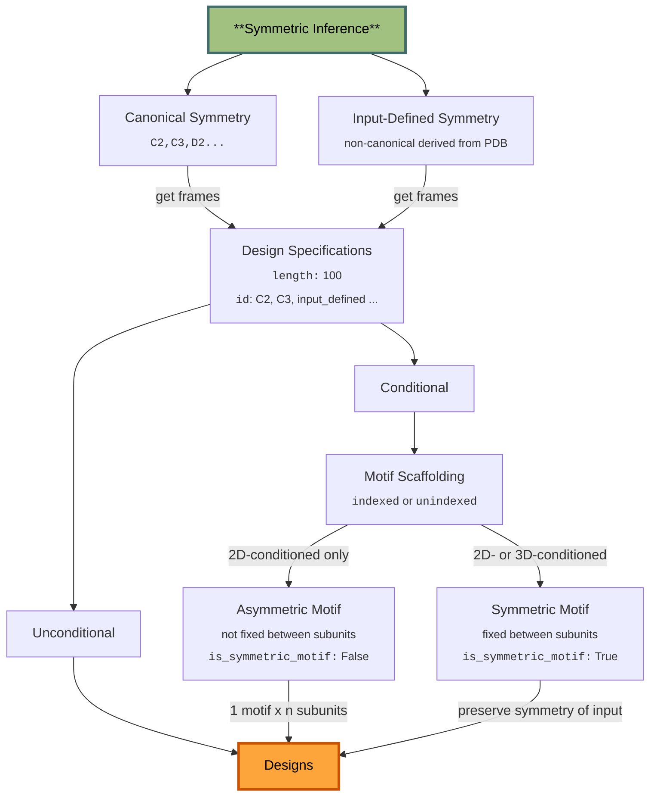

# Overview of Symmetry in RFD3

### Inference pipeline flow chart
Below shows the general capabilities of symmetry in RFD3. In general, inference is always defined with respect to the asymmetric unit, including motif residues to be scaffolded into the ASU. See different examples for how you might use different design specifications depending on your problem.



## Specifying symmetry in your input specifications
Symmetry configurations are specified within the input `json` file, nested under its own specific configuration. The symmetry specific config has the following:
```
symmetry:
    id: null # e.g. "C3", "D2". # NOTE!!! Right now only C and D are supported.
    is_unsym_motif: null # boolean array of which chains are the motif that should NOT be symmetrized (e.g. DNA strands). If not provided, all motifs are assumed to be symmetrized.
    is_symmetric_motif: True # NOTE!!! Currently only symmetrized input motifs are supported
```

## Example command 
You can run the following example command:
```
./src/foundry/inference.py inference_sampler.kind=symmetry inference_sampler.gamma_0=0.6 out_dir=logs/inference_outs/sym_demo/0 ckpt_path=$cur_ckpt inputs=./projects/aa_design/tests/test_data/sym_tests.json diffusion_batch_size=1 
```
`diffusion_batch_size` is 8 by default, but it is recommended to set it to 1 for symmetry due to memory limitations.

The following checkpoint is updated continuously (see channel https://chat.ipd.uw.edu/ipd/channels/rfdiffusion3):
```bash
export cur_ckpt=/projects/ml/aa_design/models/rfd3_latest.ckpt
```

## Example json
You can also find the same JSON at `foundry/projects/aa_design/tests/test_data/sym_tests.json` and the input PDBS can be found at `modelhub/projects/aa_design/tests/test_data/symmetry_examples`.

The tasks that these examples describe are as follows:
- 1j79_C2, 1e3v_C2: 
 Unindexed motif scaffolding for symmetric enzyme active sites.
 Each active site is located within a subunit. 
- 1bfr_C2:
 Unindexed motif scaffolding for a single active site held by a symmetric enzyme. `is_unsym_motif` is used to specify the ligand that shouldn't be symmetrized.
- 6t8h_C3:
 Indexed-unindexed combined motif scafolding for a C3 symmetric DNA binder. The DNA strands are indexed, and the motif residue is unindexed. `is_unsym_motif` is used to specify the DNA strands that shouldn't be symmetrized.
```json
{
    "1j79_C2": {
        "symmetry": {
            "id": "C2",
            "is_symmetric_motif": true
        },
        "input": "symmetry_examples/M0630_1j79_symmedORO.pdb",
        "ligand": "ORO,ZN",
        "unindex": "A250",
        "length": 290,
        "fixed_atoms": {
            "A250": "OD1,CG",
            "ORO": "N3,C2,C4,N1",
            "ZN": "ZN"
        }
    },
    "1e3v_C2": {
        "symmetry": {
            "id": "C2",
            "is_symmetric_motif": true
        },
        "input": "symmetry_examples/M0349_1e3v.pdb",
        "ligand": "DXC",
        "unindex": "A16,A40,A100,A103",
        "length": 130,
        "fixed_atoms": {
            "A16": "OH,CZ,CE1,CE2",
            "A40": "OD2,CG",
            "A100": "N,CA,C,CB",
            "A103": "OD2,CG",
            "DXC": "C23,C22,O3,C21,C19,C17,C24,C12,C16,C11,C13,C20,C15,C9,C14,O1,C8,C10,C7,C4,C3,C5,C18"
        }
    },
    "1bfr_C2": {
        "symmetry": {
            "id": "C2",
            "is_symmetric_motif": true,
            "is_unsym_motif": "HEM"
        },
        "input": "symmetry_examples/1bfr_C2.pdb",
        "ligand": "HEM",
        "unindex": "M52",
        "length": 150,
        "fixed_atoms": {
            "M52": "CG,SD,CE"
        }
    },
    "6t8h_C3": {
        "symmetry": {
            "id": "C3",
            "is_symmetric_motif": true,
            "is_unsym_motif": "Y1-11,Z16-25"
        },
        "input": "symmetry_examples/6t8h_C3.pdb",
        "unindex": "A11",
        "contig": "150-150,/0,Y1-11,/0,Z16-25",
        "length": null,
        "fixed_atoms": {
            "A11": "NZ,CE,CD"
        }
    }
}
```


## TO-DO:
- Implementation of 2D-conditioning for symmetric motifs
  - will require figuring out how to read in motif, make symmetric when atom array is symmetrized, and then make sure that the 2D-cond labels get copied over too. 
- Improve helical symmetry


