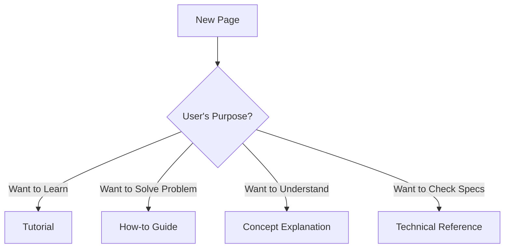

# How to Create Documentation

## Purpose

This guide explains how to create and update documentation for RDEToolKit. It provides a comprehensive documentation creation process including multilingual support, structured writing, and quality assurance procedures.

## Prerequisites

Before starting documentation creation, please ensure the following:

- **Development Environment**: [Development environment setup](index.en.md#development-environment-setup) completed
- **MkDocs Knowledge**: Basic understanding of Markdown and MkDocs
- **Multilingual Support**: Ability to write in both Japanese and English

## Steps

### 1. Understand Documentation Structure

#### Directory Structure

```
docs/
├── index.ja.md, index.en.md
├── installation.ja.md, installation.en.md
├── quick-start.ja.md, quick-start.en.md
├── user-guide/
│   ├── index.ja.md, index.en.md
│   ├── structured-processing.ja.md, structured-processing.en.md
│   ├── config.ja.md, config.en.md
│   └── ...
├── api/
│   ├── index.ja.md, index.en.md
│   └── ...
└── development/
    ├── index.ja.md, index.en.md
    ├── contributing.ja.md, contributing.en.md
    └── docs.ja.md, docs.en.md
```

#### File Naming Convention

- **Japanese Version**: `[filename].ja.md`
- **English Version**: `[filename].en.md`
- **Paired Files**: Create both Japanese and English versions for all pages

### 2. Determine Page Type

#### Four Page Types

| Type | Purpose | Naming Example | Components |
|------|---------|----------------|------------|
| **Tutorial** | Experiential Learning | `quick-start.en.md` | Steps, expected results, achievement |
| **How-to Guide** | Problem Solving | `installation.en.md` | Prerequisites, steps, verification |
| **Concept Explanation** | Understanding | `structured-processing.en.md` | Background, key concepts, summary |
| **Technical Reference** | Specification | `api/workflows.en.md` | Parameters, return values, examples |

#### Page Type Selection Criteria



### 3. Create Japanese Version

#### Basic Template

```markdown title="template.ja.md"
# [Verb-form Title]

## Purpose

Clearly describe the purpose of this page and the value readers will gain.

## [Prerequisites/Challenges and Background]

Explain required knowledge, environment, or challenges to be solved.

## [Key Concepts/Steps]

### Subsection 1

Describe specific content in a structured manner.

```python title="example.py"
# Add comments to important lines
def example_function():
    return "Hello, RDE!"
```

### Subsection 2

!!! tip "Tip"
    Provide additional information useful to readers.

!!! warning "Warning"
    Emphasize important precautions.

## Summary

Summarize key points in bullet points:

- Point 1
- Point 2
- Point 3

## Next Steps

Provide links to related pages:

- [Developer Guide](index.en.md) - Development environment setup
- [Contributing](contributing.en.md) - How to contribute
```

#### Writing Guidelines

**Structured Writing**:
- Actively use bullet points and tables
- Avoid long sentences, prioritize readability
- Set clear purpose for each section

**Code Block Writing**:
```python title="config_example.py"
# Load configuration file
config = load_config("rdeconfig.yaml")

# Get important configuration values
extended_mode = config.system.extended_mode  # Specify processing mode
save_raw = config.system.save_raw  # Enable raw saving
```

**Admonition Usage**:
```markdown
!!! note "Additional Information"
    Provide additional explanations or background information.

!!! tip "Practical Tips"
    Introduce efficient usage methods or convenient features.

!!! warning "Important Precautions"
    Explain warnings or limitations to avoid errors.
```

### 4. Translate to English

#### Translation Principles

- **Natural Technical English**: Avoid literal translation, use natural English expressions
- **Term Consistency**: Consistent translation of technical terms
- **Cultural Adaptation**: Explanation methods suitable for English-speaking readers

#### Term Correspondence Table

| Japanese | English | Notes |
|----------|---------|-------|
| 構造化処理 | Structuring Processing | Core concept |
| 設定ファイル | Configuration File | General term |
| 前提条件 | Prerequisites | Standard expression |
| 手順 | Steps / Instructions | Choose based on context |
| 確認 | Verification | Meaning of result confirmation |

#### Translation Example

**Japanese**:
```markdown
## 手順

### 1. 環境を準備する

以下のコマンドを実行して、必要な依存関係をインストールします：

```bash
pip install rdetoolkit
```
```

**English**:
```markdown
## Steps

### 1. Prepare Environment

Execute the following command to install required dependencies:

```bash
pip install rdetoolkit
```
```

### 5. Set Up Internal Links

#### Types of Links

```markdown
# Links within same language
[設定ファイル](config.ja.md)
[Configuration File](config.en.md)

# Section links
[手順](#手順)
[Steps](#steps)

# External links
[GitHub Issues](https://github.com/nims-mdpf/rdetoolkit/issues)
```

#### Link Verification

```bash title="terminal"
# Check internal links
mkdocs build --strict

# Detect broken links
find docs/ -name "*.md" -exec grep -l "](.*\.md)" {} \;
```

### 6. Build MkDocs Site

#### Local Verification

```bash title="terminal"
# Start development server
mkdocs serve

# Check Japanese version
open http://localhost:8000

# Check English version
open http://localhost:8000/en/
```

#### Handle Build Errors

```bash title="terminal"
# Display detailed error information
mkdocs build --verbose --strict

# Test specific pages only
mkdocs build --config-file mkdocs.yml --site-dir test-site
```

## Verification

### Quality Checklist

#### Content Quality

- [ ] Purpose is clearly described
- [ ] Structured writing is used
- [ ] Code blocks have titles
- [ ] Appropriate admonitions are used
- [ ] Next steps are provided

#### Multilingual Support

- [ ] Both Japanese and English files exist
- [ ] Terms are consistent
- [ ] Internal links are correctly set
- [ ] Language switching functions

#### Technical Quality

- [ ] MkDocs build succeeds
- [ ] No broken links
- [ ] Images display correctly
- [ ] Code blocks are properly highlighted

### Automated Checks

```bash title="terminal"
# Lint documentation
markdownlint docs/**/*.md

# Link check
markdown-link-check docs/**/*.md

# Spell check
cspell "docs/**/*.md"
```

## Troubleshooting

### Common Issues and Solutions

#### MkDocs Build Error

```bash
ERROR - Config value: 'nav'. Error: Page file 'missing-page.md' does not exist.
```

**Solution**: Check nav section in `mkdocs.yml` and remove non-existent files

#### Broken Links

```bash
ERROR - The following pages exist in the docs directory, but are not included in the "nav" configuration: page.md
```

**Solution**: Add page to `mkdocs.yml` or delete unnecessary files

#### Multilingual Display Issues

**Check items**:
1. `extra.alternate` settings in `mkdocs.yml`
2. File naming convention (.ja.md/.en.md)
3. Language-specific nav section settings

## Related Information

Detailed information about documentation creation:

- [Developer Guide](index.en.md) - Development environment setup
- [Contributing](contributing.en.md) - How to contribute
- [MkDocs Official Documentation](https://www.mkdocs.org/) - Detailed MkDocs specifications

!!! tip "Continuous Improvement"
    Documentation should be continuously improved. Actively collect user feedback and conduct regular reviews.
