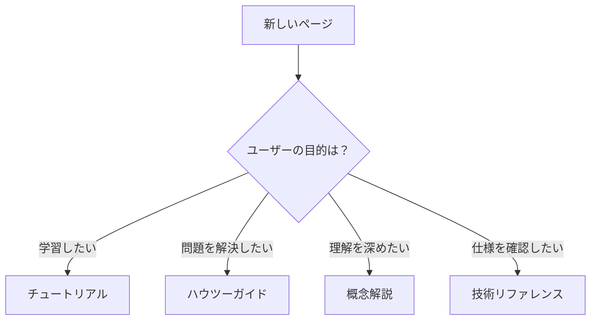

# ドキュメント作成方法

## 目的

このガイドでは、RDEToolKitのドキュメントを作成・更新する方法を説明します。多言語対応、構造化された執筆、品質保証の手順を含む包括的なドキュメント作成プロセスを提供します。

## 前提条件

ドキュメント作成を開始する前に、以下を確認してください：

- **開発環境**: [開発環境の構築](index.ja.md#開発環境の構築)が完了済み
- **MkDocs知識**: 基本的なMarkdownとMkDocsの理解
- **多言語対応**: 日本語と英語での執筆能力

## 手順

### 1. ドキュメント構造を理解する

#### ディレクトリ構成

```
docs/
├── index.ja.md, index.en.md
├── installation.ja.md, installation.en.md
├── quick-start.ja.md, quick-start.en.md
├── user-guide/
│   ├── index.ja.md, index.en.md
│   ├── structured-processing.ja.md, structured-processing.en.md
│   ├── config.ja.md, config.en.md
│   └── ...
├── api/
│   ├── index.ja.md, index.en.md
│   └── ...
└── development/
    ├── index.ja.md, index.en.md
    ├── contributing.ja.md, contributing.en.md
    └── docs.ja.md, docs.en.md
```

#### ファイル命名規則

- **日本語版**: `[filename].ja.md`
- **英語版**: `[filename].en.md`
- **ペアファイル**: 全てのページで日英両方を作成

### 2. ページタイプを決定する

#### 4つのページタイプ

| タイプ | 目的 | 命名例 | 構成要素 |
|--------|------|--------|----------|
| **チュートリアル** | 体験学習 | `quick-start.ja.md` | ステップ、期待結果、達成感 |
| **ハウツーガイド** | 問題解決 | `installation.ja.md` | 前提条件、手順、確認方法 |
| **概念解説** | 理解促進 | `structured-processing.ja.md` | 背景、主要概念、まとめ |
| **技術リファレンス** | 仕様提供 | `api/workflows.ja.md` | パラメータ、返り値、例 |

#### ページタイプの選択基準



### 3. 日本語版を作成する

#### 基本テンプレート

```markdown title="template.ja.md"
# [動詞形のタイトル]

## 目的

このページの目的と読者が得られる価値を明確に記述します。

## [前提条件/課題と背景]

必要な知識や環境、解決すべき課題を説明します。

## [主要コンセプト/手順]

### サブセクション1

具体的な内容を構造化して記述します。

```python title="example.py"
# 重要な行にはコメントを追加
def example_function():
    return "Hello, RDE!"
```

### サブセクション2

!!! tip "ヒント"
    読者に役立つ追加情報を提供します。

!!! warning "注意"
    重要な注意事項を強調します。

## まとめ

主要なポイントを箇条書きでまとめます：

- ポイント1
- ポイント2
- ポイント3

## 次のステップ

関連するページへのリンクを提供します：

- [開発者ガイド](index.ja.md) - 開発環境の構築
- [コントリビューション](contributing.ja.md) - 貢献の方法
```

#### 執筆ガイドライン

**構造化された執筆**:
- 箇条書きとテーブルを積極的に使用
- 長い文章を避け、読みやすさを重視
- セクションごとに明確な目的を設定

**コードブロックの書き方**:
```python title="config_example.py"
# 設定ファイルの読み込み
config = load_config("rdeconfig.yaml")

# 重要な設定値の取得
extended_mode = config.system.extended_mode  # 処理モードの指定
save_raw = config.system.save_raw  # Raw保存の有効化
```

**Admonitionの使用**:
```markdown
!!! note "補足情報"
    追加の説明や背景情報を提供します。

!!! tip "実践的なヒント"
    効率的な使用方法や便利な機能を紹介します。

!!! warning "重要な注意事項"
    エラーを避けるための警告や制限事項を説明します。
```

### 4. 英語版を翻訳する

#### 翻訳の原則

- **自然な技術英語**: 直訳を避け、英語として自然な表現を使用
- **用語の統一**: 専門用語の一貫した翻訳
- **文化的適応**: 英語圏の読者に適した説明方法

#### 用語対照表

| 日本語 | 英語 | 備考 |
|--------|------|------|
| 構造化処理 | Structuring Processing | 中核概念 |
| 設定ファイル | Configuration File | 一般的な用語 |
| 前提条件 | Prerequisites | 標準的な表現 |
| 手順 | Steps / Instructions | 文脈に応じて選択 |
| 確認 | Verification | 結果確認の意味 |

#### 翻訳例

**日本語**:
```markdown
## 手順

### 1. 環境を準備する

以下のコマンドを実行して、必要な依存関係をインストールします：

```bash
pip install rdetoolkit
```
```

**英語**:
```markdown
## Steps

### 1. Prepare Environment

Execute the following command to install required dependencies:

```bash
pip install rdetoolkit
```
```

### 5. 内部リンクを設定する

#### リンクの種類

```markdown
# 同一言語内のリンク
[設定ファイル](config.ja.md)
[Configuration File](config.en.md)

# セクション内リンク
[手順](#手順)
[Steps](#steps)

# 外部リンク
[GitHub Issues](https://github.com/nims-mdpf/rdetoolkit/issues)
```

#### リンク検証

```bash title="terminal"
# 内部リンクの確認
mkdocs build --strict

# リンク切れの検出
find docs/ -name "*.md" -exec grep -l "](.*\.md)" {} \;
```

### 6. MkDocsサイトをビルドする

#### ローカルでの確認

```bash title="terminal"
# 開発サーバーの起動
mkdocs serve

# 日本語版の確認
open http://localhost:8000

# 英語版の確認
open http://localhost:8000/en/
```

#### ビルドエラーの対処

```bash title="terminal"
# 詳細なエラー情報を表示
mkdocs build --verbose --strict

# 特定のページのみテスト
mkdocs build --config-file mkdocs.yml --site-dir test-site
```

## 結果の確認

### 品質チェックリスト

#### 内容の品質

- [ ] 目的が明確に記述されている
- [ ] 構造化された執筆になっている
- [ ] コードブロックにタイトルが付いている
- [ ] 適切なAdmonitionが使用されている
- [ ] 次のステップが提供されている

#### 多言語対応

- [ ] 日英両方のファイルが存在する
- [ ] 用語が統一されている
- [ ] 内部リンクが正しく設定されている
- [ ] 言語切り替えが機能する

#### 技術的品質

- [ ] MkDocsビルドが成功する
- [ ] リンク切れがない
- [ ] 画像が正しく表示される
- [ ] コードブロックが正しくハイライトされる

### 自動チェック

```bash title="terminal"
# ドキュメントのリント
markdownlint docs/**/*.md

# リンクチェック
markdown-link-check docs/**/*.md

# スペルチェック
cspell "docs/**/*.md"
```

## トラブルシューティング

### よくある問題と解決方法

#### MkDocsビルドエラー

```bash
ERROR - Config value: 'nav'. Error: Page file 'missing-page.md' does not exist.
```

**解決方法**: `mkdocs.yml`のnavセクションを確認し、存在しないファイルを削除

#### リンク切れ

```bash
ERROR - The following pages exist in the docs directory, but are not included in the "nav" configuration: page.md
```

**解決方法**: `mkdocs.yml`にページを追加するか、不要なファイルを削除

#### 多言語表示の問題

**確認事項**:
1. `mkdocs.yml`の`extra.alternate`設定
2. ファイル名の命名規則（.ja.md/.en.md）
3. navセクションの言語別設定

## 関連情報

ドキュメント作成の詳細情報：

- [開発者ガイド](index.ja.md) - 開発環境の構築
- [コントリビューション](contributing.ja.md) - 貢献の方法
- [MkDocs公式ドキュメント](https://www.mkdocs.org/) - MkDocsの詳細仕様

!!! tip "継続的改善"
    ドキュメントは継続的に改善していくものです。ユーザーフィードバックを積極的に収集し、定期的な見直しを行いましょう。
