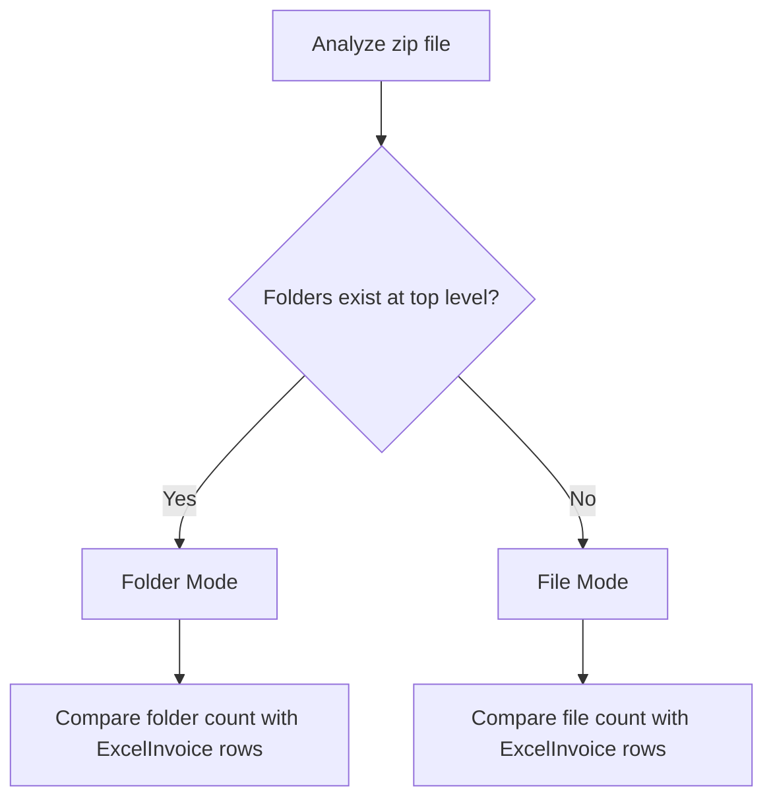

# What are File Mode and Folder Mode

## Purpose

This document explains File Mode and Folder Mode in ExcelInvoice mode. You will understand the differences between these two modes and how to use them according to input data structure.

## Challenges and Background

Batch data registration in ExcelInvoice mode required support for diverse input formats:

- **Individual Files**: Batch registration of multiple independent files
- **Folder Structure**: Registration of related files grouped by folders
- **Mixed Data**: Processing when files and folders are mixed
- **Automatic Detection**: Automatic detection and appropriate processing of input formats

File Mode and Folder Mode were developed to address these needs.

## Key Concepts

### Automatic Mode Detection Mechanism



### Comparison of Two Modes

| Item | File Mode | Folder Mode |
|------|-----------|-------------|
| **Processing Unit** | Individual files | Folder units |
| **Dataset Name** | Filename | Folder name |
| **File Count** | 1 file = 1 dataset | Multiple files = 1 dataset |
| **Use Case** | Independent data files | Related file groups |

## File Mode

### Overview

File Mode processes multiple individual files bundled in a single zip file.

### Features

- Each file is treated as an independent dataset
- Number of files in zip must match number of rows in ExcelInvoice
- Filename is used as dataset name

### Directory Structure Example

```shell title="File Mode Input Structure"
input.zip/
|-- 20100131045801(2s).txt
|-- 20100131052029(2p).txt
```

### ExcelInvoice File Configuration

In the ExcelInvoice file, each row corresponds to each file:


## Folder Mode

### Overview

Folder Mode processes zip files containing folder structures.

### Features

- Each folder is treated as one dataset
- Can contain multiple files within folders
- Folder name is used as dataset name

### Directory Structure Example

```shell title="Folder Mode Input Structure"
input.zip/
|-- sample_folder_1/
|   |-- file1.txt
|   |-- file2.txt
|
|-- sample_folder_2/
|   |-- file3.txt
|   |-- file4.txt
```

### ExcelInvoice File Configuration

In the ExcelInvoice file, each row corresponds to each folder:


## Troubleshooting

### Common Problems and Solutions

| Problem | Cause | Solution |
|---------|-------|----------|
| File count and ExcelInvoice row mismatch | Inconsistency between zip contents and ExcelInvoice | Match file count with row count |
| Invalid filename | Filename contains special characters | Remove special characters from filename |
| Zip file extraction error | Corrupted zip file | Verify zip file integrity |

### Important Notes

- Errors occur when the mode specified in ExcelInvoice differs from the zip file structure
- Zip files created on macOS may contain `.DS_Store` files
- Pay attention to character encoding of zip files created on Windows

## Summary

Key features of File Mode and Folder Mode:

- **Automatic Detection**: Automatic mode detection based on zip file structure
- **Flexible Support**: Support for both individual files and folder structures
- **Batch Processing**: Efficient batch registration via ExcelInvoice
- **Data Integrity**: Consistency check between file count and row count

## Next Steps

To utilize File Mode and Folder Mode, refer to the following documents:

- Check ExcelInvoice mode details in [Data Registration Modes](../mode/mode.en.md)
- Learn related settings in [Configuration Files](config.en.md)
- Understand processing flows in [Structuring Processing Concepts](../structured_process/structured.en.md)
