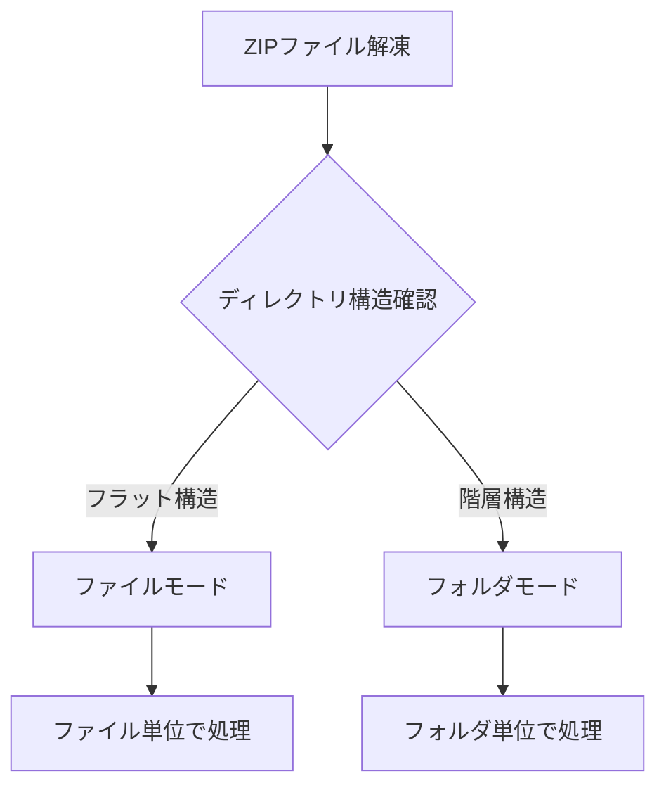

# ファイルモードとフォルダモードとは

## 目的

ExcelInvoice処理におけるファイルモードとフォルダモードの違いと使い分けについて説明します。入力データの形式に応じた最適なモード選択と設定方法を理解できます。

## 課題と背景

ExcelInvoiceを使用した一括データ登録において、以下のような多様な入力形式への対応が必要でした：

- **単一ファイル形式**: 各データセットが1つのファイルで構成される場合
- **複数ファイル形式**: 各データセットが複数のファイルで構成される場合
- **混在形式**: ファイル数が異なる複数のデータセットを同時に処理する場合
- **効率性**: 大量のデータセットを効率的に処理する必要性

これらの課題に対応するため、ファイルモードとフォルダモードが設計されました。

## 主要コンセプト

### モード判定の仕組み



### 2つのモードの比較

| 項目         | ファイルモード                 | フォルダモード            |
| ------------ | ------------------------------ | ------------------------- |
| **入力形式** | 1データセット = 1ファイル      | 1データセット = 1フォルダ |
| **ZIP構造**  | フラット（ファイルが直接配置） | 階層（フォルダで分類）    |
| **適用場面** | 単純なデータファイル           | 複合的なデータセット      |
| **処理単位** | ファイル                       | フォルダ                  |
| **自動判定** | ○                              | ○                         |

## ファイルモード

### 概要

各データセットが単一のファイルで構成される場合に使用されます。

### ZIP構造例

```
experiment_data.zip
├── sample001.csv
├── sample002.csv
├── sample003.csv
└── sample004.csv
```

### 処理結果

```
data/
├── divided/
│   ├── 0001/  # sample001.csv用
│   │   ├── raw/
│   │   │   └── sample001.csv
│   │   ├── structured/
│   │   └── meta/
│   ├── 0002/  # sample002.csv用
│   │   ├── raw/
│   │   │   └── sample002.csv
│   │   ├── structured/
│   │   └── meta/
│   └── ...
```

### 使用場面

- **測定データファイル**: 各実験の結果が1つのCSVファイル
- **画像ファイル**: 各サンプルの顕微鏡画像
- **ログファイル**: 各実験セッションのログ
- **単純なデータセット**: 追加ファイルが不要な場合

### 実装例

```python title="ファイルモード処理例"
def process_file_mode_data(srcpaths, resource_paths):
    # divided/0001, divided/0002, ... の各ディレクトリを処理
    divided_dirs = [d for d in os.listdir("data/divided") if d.startswith("00")]

    for dir_name in divided_dirs:
        divided_path = Path("data/divided") / dir_name
        raw_files = list((divided_path / "raw").glob("*"))

        # 各ディレクトリには1つのファイルが存在
        if len(raw_files) == 1:
            input_file = raw_files[0]
            process_single_file(input_file, divided_path)
```

## フォルダモード

### 概要

各データセットが複数のファイルで構成される場合に使用されます。

### ZIP構造例

```
experiment_data.zip
├── experiment_001/
│   ├── data.csv
│   ├── config.json
│   └── image.png
├── experiment_002/
│   ├── data.csv
│   ├── config.json
│   └── image.png
└── experiment_003/
    ├── data.csv
    ├── config.json
    └── image.png
```

### 処理結果

```
data/
├── divided/
│   ├── 0001/  # experiment_001用
│   │   ├── raw/
│   │   │   ├── data.csv
│   │   │   ├── config.json
│   │   │   └── image.png
│   │   ├── structured/
│   │   └── meta/
│   ├── 0002/  # experiment_002用
│   │   ├── raw/
│   │   │   ├── data.csv
│   │   │   ├── config.json
│   │   │   └── image.png
│   │   ├── structured/
│   │   └── meta/
│   └── ...
```

### 使用場面

- **複合実験データ**: データファイル + 設定ファイル + 画像
- **シミュレーション結果**: 入力ファイル + 出力ファイル + ログ
- **機器データ**: 測定データ + キャリブレーションファイル + メタデータ
- **関連ファイル群**: 主データと補助ファイルのセット

### 実装例

```python title="フォルダモード処理例"
def process_folder_mode_data(srcpaths, resource_paths):
    divided_dirs = [d for d in os.listdir("data/divided") if d.startswith("00")]

    for dir_name in divided_dirs:
        divided_path = Path("data/divided") / dir_name
        raw_files = list((divided_path / "raw").glob("*"))

        # 各ディレクトリには複数のファイルが存在
        if len(raw_files) > 1:
            process_file_group(raw_files, divided_path)
```

## 自動モード判定

### 判定ロジック

RDEToolKitは、ZIPファイルの構造を自動的に分析してモードを決定します：

```python title="モード判定例"
def determine_excel_invoice_mode(zip_path):
    with zipfile.ZipFile(zip_path, 'r') as zip_file:
        file_list = zip_file.namelist()

        # ディレクトリが含まれているかチェック
        has_directories = any('/' in name for name in file_list)

        if has_directories:
            return "フォルダモード"
        else:
            return "ファイルモード"
```

### 判定基準

| 条件                            | 判定結果               |
| ------------------------------- | ---------------------- |
| ZIPファイル直下にファイルのみ   | ファイルモード         |
| ZIPファイル直下にフォルダが存在 | フォルダモード         |
| 混在（ファイルとフォルダ両方）  | フォルダモード（優先） |

## 実践的な使用例

### ファイルモードの活用

```python title="測定データ処理"
def process_measurement_files(srcpaths, resource_paths):
    # ファイルモード: 各CSVファイルを個別処理
    for divided_dir in get_divided_directories():
        csv_file = find_csv_file(divided_dir)

        # データ読み込み
        df = pd.read_csv(csv_file)

        # 統計処理
        stats = calculate_statistics(df)

        # 結果保存
        save_structured_data(stats, divided_dir)
```

### フォルダモードの活用

```python title="複合データ処理"
def process_experiment_folders(srcpaths, resource_paths):
    # フォルダモード: 関連ファイル群を統合処理
    for divided_dir in get_divided_directories():
        files = get_all_files(divided_dir)

        # ファイル種別の識別
        data_file = find_file_by_extension(files, '.csv')
        config_file = find_file_by_extension(files, '.json')
        image_file = find_file_by_extension(files, '.png')

        # 統合処理
        result = process_experiment_set(data_file, config_file, image_file)

        # 結果保存
        save_integrated_result(result, divided_dir)
```

## トラブルシューティング

### よくある問題と解決方法

#### 期待したモードで処理されない

```python title="モード確認"
def check_processing_mode(zip_path):
    with zipfile.ZipFile(zip_path, 'r') as zip_file:
        file_list = zip_file.namelist()

        print("ZIPファイル内容:")
        for name in file_list:
            print(f"  {name}")

        # モード判定結果
        mode = determine_excel_invoice_mode(zip_path)
        print(f"判定されたモード: {mode}")
```

#### ファイルが見つからない

```python title="ファイル存在確認"
def verify_file_structure(divided_dir):
    raw_dir = Path(divided_dir) / "raw"

    if not raw_dir.exists():
        print(f"❌ rawディレクトリが存在しません: {raw_dir}")
        return False

    files = list(raw_dir.glob("*"))
    print(f"rawディレクトリ内のファイル数: {len(files)}")

    for file in files:
        print(f"  - {file.name}")

    return len(files) > 0
```

### デバッグのヒント

| 問題             | 確認項目          | 解決方法                    |
| ---------------- | ----------------- | --------------------------- |
| モード判定エラー | ZIP構造           | ZIPファイル内容を確認       |
| ファイル不足     | divided/00xx/raw/ | ファイル展開を確認          |
| 処理エラー       | ログファイル      | data/logs/rdesys.log を確認 |

## まとめ

ファイルモードとフォルダモードの特徴：

- **自動判定**: ZIP構造に基づく自動モード選択
- **柔軟性**: 多様な入力形式への対応
- **効率性**: 大量データの一括処理
- **透明性**: 明確な処理ルールと予測可能な結果

## 次のステップ

ExcelInvoice処理をさらに活用するために、以下のドキュメントを参照してください：

- [処理モード](../mode/mode.ja.md)でExcelInvoiceモードの詳細を学ぶ
- [構造化処理の概念](../structured_process/structured.ja.md)で処理フローを理解する
- [ディレクトリ構造](../structured_process/directory.ja.md)でdividedディレクトリの仕様を確認する
