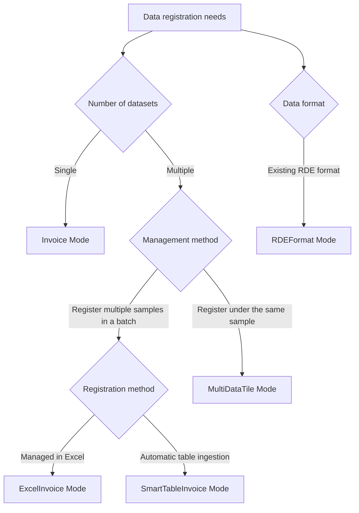

# What Are Data Processing Modes?

## Purpose

This document explains the characteristics and proper use of the five processing modes provided by RDEToolKit (Invoice, ExcelInvoice, SmartTableInvoice, MultiDataTile, and RDEFormat). It helps you understand how to choose the optimal mode according to the data type and the registration method.

## Challenges and Background

In registering research data, there have been diverse needs such as:

* **Single dataset**: Register one experimental result as one dataset
* **Batch registration**: Efficiently register multiple related experiments at once
* **Migration of existing data**: Migrate existing data from other systems

To address these different needs, five processing modes were designed.

## Key Concepts

### Classification of Processing Modes

### Mode Comparison Table

| Mode                  | Use case                                     | Number of datasets | Management method | Configuration method |
| --------------------- | -------------------------------------------- | ------------------ | ----------------- | -------------------- |
| **Invoice**           | Standard single-dataset registration         | 1                  | Individual        | Default              |
| **ExcelInvoice**      | Batch registration of multiple datasets      | Multiple           | Individual        | Excel file           |
| **SmartTableInvoice** | Automatic metadata generation from a table   | Multiple           | Individual        | Table file           |
| **MultiDataTile**     | Integrated management of related data        | Multiple           | Integrated        | Configuration file   |
| **RDEFormat**         | Migration of existing data and mock creation | 1                  | Individual        | Configuration file   |

## Using Each Mode

To use each mode, you must properly configure the structured processing settings file `rdeconfig.yml` that RDEToolKit references.

For details, see [Configuration File and CLI](../../usage/config/config.en.md).

## FAQs and Data Registration Mode Selection Guide

### Q1: I’m using RDEToolKit for the first time. Which mode should I choose?

**A: We recommend the Invoice mode.**

* It is the simplest and easiest to understand.
* You can start with a single dataset.
* It helps you understand the basic concepts used by the other modes.

### Q2: I want to register multiple experimental datasets to RDE in batch

**A: Choose based on the nature of the data.**

* **Independent experiments with no relation, or registration with differing sample information**

  * Choose the **ExcelInvoice** mode.
  * If the data owner, experimental conditions, or sample information differ and fine-grained adjustments are needed while still registering in batch, choose the ExcelInvoice mode.
* **Experiments with the same method and conditions**

  * Choose the **SmartTableInvoice** mode.
  * Select this mode when only partial fine-tuning is required, or when multiple data items are to be registered into a single data tile.
* **Multiple measurements of the same sample**

  * Choose the **MultiDataTile** mode.
  * Select this mode when the same sample is measured under multiple techniques or conditions.

### Q3: We already know the RDE registration format and want to perform a mock registration

**A: Use the RDEFormat mode.**

* You can package existing RDE-format data into a zip and register it.
* Registration is possible without defining structured processing.
* Integration with other systems.
