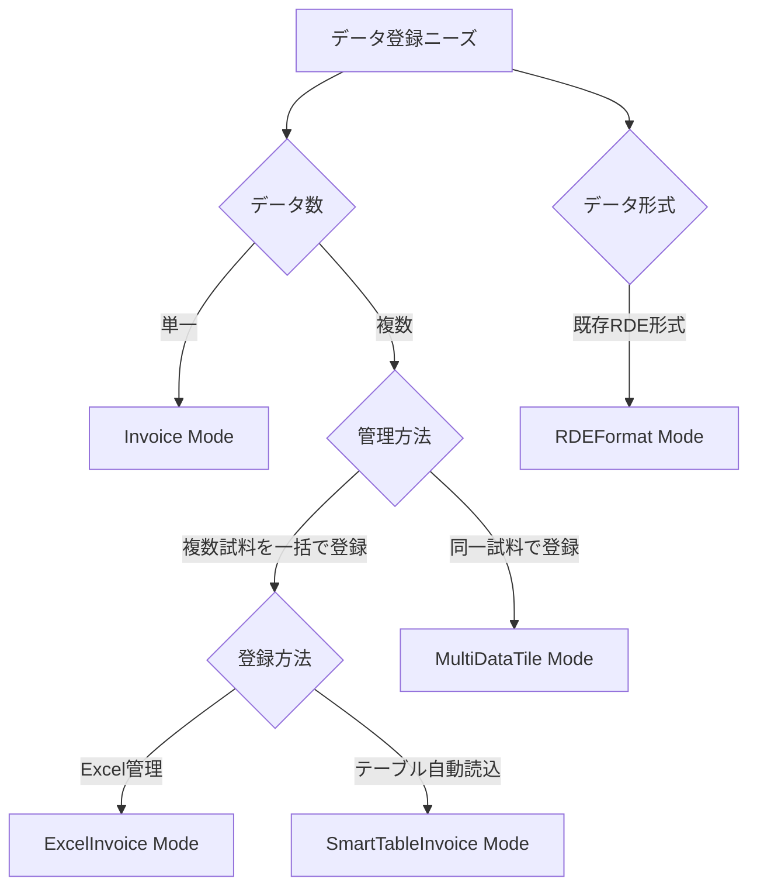

# データ処理モードとは

## 目的

RDEToolKitが提供する5つの処理モード（Invoice、ExcelInvoice、SmartTableInvoice、MultiDataTile、RDEFormat）の特徴と使い分けについて説明します。データの種類と登録方法に応じた最適なモード選択を理解できます。

## 課題と背景

研究データの登録において、以下のような多様なニーズがありました：

- **単一データセット**: 1つの実験結果を1つのデータセットとして登録
- **一括登録**: 複数の関連実験を効率的に一括登録
- **既存データ移行**: 他システムからの既存データの移行

これらの異なるニーズに対応するため、5つの処理モードが設計されました。

## 主要コンセプト

### 処理モードの分類

### モード比較表

| モード                | 用途                             | データ数 | 管理方法 | 設定方法         |
| --------------------- | -------------------------------- | -------- | -------- | ---------------- |
| **Invoice**           | 標準的な単一データセット登録     | 1個      | 個別     | デフォルト       |
| **ExcelInvoice**      | 複数データセットの一括登録       | 複数     | 個別     | Excelファイル    |
| **SmartTableInvoice** | テーブルからの自動メタデータ生成 | 複数     | 個別     | テーブルファイル |
| **MultiDataTile**     | 関連データの統合管理             | 複数     | 統合     | 設定ファイル     |
| **RDEFormat**         | 既存データの移行・モック作成     | 1個      | 個別     | 設定ファイル     |

## 各モードの利用について

各種モードを利用するためには、RDEToolKitが参照する、構造化処理設定ファイル`rdeconfig.yml`を適切に設定する必要があります。

詳細は、[設定ファイルとCLI](../../usage/config/config.ja.md)を参照してください。

## よくある質問とデータ登録モード選択ガイド

### Q1: 初めてRDEToolKitを使います。どのモードを選べば良いですか？

**A: Invoiceモード** を推奨します。

- 最もシンプルで分かりやすい
- 1つのデータセットから始められる
- 他のモードの基本概念を理解できる

### Q2: 複数の実験データを一括でRDEに登録したい

**A: データの性質** により選択

- **関連のない独立した実験や異なる試料情報で登録する場合**
  - ExcelInvoiceモードを選択してください。
  - データ所有者や実験条件、試料情報が異なるなど、細かい調整が必要かつ、一括で登録したい場合はExcelInvoiceモードを選択してください。
- **同じ手法・条件の実験**
  - SmartTableInvoiceモードを選択してください。
  - 細かい調整箇所が部分的な場合や、1データタイルに登録するデータが複数存在する場合、このモードを選択してください。
- **同一試料の複数測定**
  - MultiDataTileモードを選択してください。
  - 同一試料に対して複数の測定手法や条件の場合、このモードを選択してください。

### Q3: すでにRDE登録形式がわかっておりモック的に登録したい

**A: RDEFormatモード** を使用

- 既存のRDE形式データをzip化して登録可能
- 構造化処理を定義せず登録可能
- 別システムとの連携
