## Implementing Structuring Processing with Real Data

This document explains how to build structured processing for registering RAS files output from Rigaku's X-ray diffraction (XRD) equipment to RDE using the RDEToolKit library.

## Data Usage Acknowledgments

The sample data and related technical information used in this document are provided by the "NIMS Materials Data Conversion Tools (M-DaC)" project of the National Institute for Materials Science (NIMS). The M-DaC project is the result of technology development aimed at efficient collection and high value-added processing of experimental data, developed in cooperation with measurement equipment manufacturers.

Acknowledgments:

- Data Provider: National Institute for Materials Science (NIMS)
- Project: NIMS Materials Data Conversion Tools (M-DaC) for XRD
- Joint Development: Rigaku Corporation
- License: MIT License
- Citation: H. Nagao, S. Matsunami, M. Suzuki, and H. Yoshikawa: "NIMS Materials Data Conversion Tools (M-DaC) ver 1.1"

By utilizing the results of this project, practical learning based on data formats used in actual research sites becomes possible. We deeply appreciate NIMS and all related researchers and engineers.

### About RAS Files

#### Data Format Characteristics

RAS files (Rigaku) are standard data formats output from Rigaku's X-ray diffraction equipment such as SmartLab. They have the following characteristics:

- ASCII format: Text-based file format that is human-readable
- Structured metadata: Systematic recording of measurement conditions, equipment settings, sample information, etc.
- 3-column data: Measurement data consisting of three columns: angle, intensity, and attenuation correction coefficient
- Delimiter: Lines starting with asterisk (*) indicate metadata and comments

#### File Structure

```plaintext
*RAS_DATA_START
*FILE_DATETIME 2023-01-15 10:30:00
*SAMPLE_NAME Al2O3_sample
*TARGET_NAME Cu
*TUBE_VOLTAGE 40.0
*TUBE_CURRENT 30.0
*SCAN_MODE continuous
*SCAN_SPEED 2.0
*SCAN_STEP 0.02
*START_ANGLE 10.0
*STOP_ANGLE 90.0
*RAS_HEADER_START
... (detailed metadata)
*RAS_HEADER_END
*RAS_INT_START
10.0000 1200.0000 1.0000
10.0200 1205.0000 1.0000
10.0400 1198.0000 1.0000
... (measurement data)
*RAS_INT_END
*RAS_DATA_END
```

## Building RDE Structuring Processing with rdetoolkit

### RDE Structuring Processing Development Process

The development process shown in this document is an example. Please adjust according to user needs.

```mermaid
flowchart TD
    %% Specify overall direction as vertical (Top→Bottom)
    subgraph RDE Structuring Processing Development Process
        direction TB
        style RDE Structuring Processing Development Process fill:#f0f4f8,stroke:#333,stroke-width:2px,rx:10,ry:10
    end

    %% Common style definition for nodes
    classDef step fill:#cfe2f3,stroke:#333,stroke-width:1.5px,rx:5,ry:5,font-size:14px;

    %% Each step
    A[🔍 Select metadata to extract]:::step --> B[🛠️ Environment setup]:::step
    B --> C[📄 Create necessary template files]:::step
    C --> D[💻 Develop structured processing]:::step
    D --> E[✅ Verify operation]:::step
```



### About Predefined File Groups Required for RDE Data Registration

For reusable data registration in RDE, the following files are mandatory:

- `templates/tasksupport/invoice.schema.json`
- `templates/tasksupport/metadata-def.json`

RDE uses a predefined metadata definition file `metadata-def.json` to extract metadata from files output by measurement equipment and daily experimental data files, and `invoice.schema.json` which allows flexible customization of data input forms for sample information (synthesis conditions, etc.) and measurement conditions that need to be recorded routinely in daily experiments.

- By creating `invoice.schema.json` during data registration, information necessary for daily experiments can be defined as a data input form.
- Predefined files for automatically extracting metadata from files during data registration: `metadata-def.json`

Furthermore, these file groups can be easily created using packages provided by our organization. In addition to the above files, `invoice.json` for building structured processing in personal environments can also be created.

- [nims-mdpf/RDE_datasettemplate-schemafile-make-tool - Github](https://github.com/nims-mdpf/RDE_datasettemplate-schemafile-make-tool)

#### Selecting Metadata to Extract (metadata-def.json)

Decide in advance which metadata to extract from input data. The number of predefined metadata varies depending on users and projects.

This time, from the perspective of measurement conditions, sample information, time, and traceability, we will extract the following metadata:

**A. Measurement Conditions**

```plaintext
*MEAS_COND_XG_VOLTAGE "40"           # Tube voltage (kV)
*MEAS_COND_XG_CURRENT "30"           # Tube current (mA)
*HW_XG_TARGET_NAME "Cu"              # X-ray source (Cu)
*HW_XG_WAVE_LENGTH_ALPHA1 "1.540593" # Wavelength α1 (Å)
*HW_XG_WAVE_LENGTH_ALPHA2 "1.544414" # Wavelength α2 (Å)
*MEAS_SCAN_START "25.0000"           # Measurement start angle
*MEAS_SCAN_STOP "60.0000"            # Measurement end angle
*MEAS_SCAN_STEP "0.0100"             # Measurement step
*MEAS_SCAN_SPEED "8.0000"            # Measurement speed (deg/min)
*MEAS_SCAN_MODE "CONTINUOUS"         # Measurement mode
```

**B. Sample Information**

```plaintext
*FILE_SAMPLE "Test Sample"           # Sample name
*FILE_COMMENT "XRD example"          # Comment
*FILE_MEMO "Rigaku XRD memo"         # Memo
*FILE_OPERATOR "English"             # Operator
*FILE_USERGROUP "Academic"           # User group
```

**C. Temporal & Traceability**

```plaintext
*MEAS_SCAN_START_TIME "11/21/2017 08:32:31" # Measurement start time
*MEAS_SCAN_END_TIME "11/21/2017 08:37:42"   # Measurement end time
*MEAS_DATA_COUNT "3501"                     # Number of data points
*FILE_VERSION "1"                           # File version
```

Based on this information, define the following in `metadata-def.json`.

> Excerpt shown due to length.

```json
{
    "file_sample": {
        "name": {
            "ja": "Sample Name",
            "en": "Sample Name"
        },
        "schema": {
            "type": "string"
        }
    },
    "file_comment": {
        "name": {
            "ja": "Comment",
            "en": "Comment"
        },
        "schema": {
            "type": "string"
        }
    },
    "file_memo": {
        "name": {
            "ja": "Memo",
            "en": "Memo"
        },
        "schema": {
            "type": "string"
        }
    },
    "file_operator": {
        "name": {
            "ja": "Operator",
            "en": "Operator"
        },
        "schema": {
            "type": "string"
        }
    },
    "file_usergroup": {
        "name": {
            "ja": "User Group",
            "en": "User Group"
        },
        "schema": {
            "type": "string"
        }
    },
    "meas_cond_xg_voltage": {
        "name": {
            "ja": "Tube Voltage",
            "en": "Tube Voltage"
        },
        "schema": {
            "type": "number"
        }
    },
    "meas_cond_xg_current": {
        "name": {
            "ja": "Tube Current",
            "en": "Tube Current"
        },
        "schema": {
            "type": "number"
        }
    },
    "hw_xg_target_name": {
        "name": {
            "ja": "X-ray Source",
            "en": "X-ray Source"
        },
        "schema": {
            "type": "string"
        }
    },
    "hw_xg_wave_length_alpha1": {
        "name": {
            "ja": "Wavelength α1",
            "en": "Wavelength α1"
        },
        "schema": {
            "type": "number"
        }
    },
    "hw_xg_wave_length_alpha2": {
        "name": {
            "ja": "Wavelength α2",
            "en": "Wavelength α2"
        },
        "schema": {
            "type": "number"
        }
    },
    "meas_scan_start": {
        "name": {
            "ja": "Measurement Start Angle",
            "en": "Measurement Start Angle"
        },
        "schema": {
            "type": "number"
        }
    },
    "meas_scan_stop": {
        "name": {
            "ja": "Measurement End Angle",
            "en": "Measurement End Angle"
        },
        "schema": {
            "type": "number"
        }
    },
    "meas_scan_step": {
        "name": {
            "ja": "Measurement Step",
            "en": "Measurement Step"
        },
        "schema": {
            "type": "number"
        }
    },
    "meas_scan_speed": {
        "name": {
            "ja": "Measurement Speed",
            "en": "Measurement Speed"
        },
        "schema": {
            "type": "number"
        }
    },
    "meas_scan_mode": {
        "name": {
            "ja": "Measurement Mode",
            "en": "Measurement Mode"
        },
        "schema": {
            "type": "string"
        }
    },
    "meas_scan_start_time": {
        "name": {
            "ja": "Measurement Start Time",
            "en": "Measurement Start Time"
        },
        "schema": {
            "type": "string"
        }
    },
    "meas_scan_end_time": {
        "name": {
            "ja": "Measurement End Time",
            "en": "Measurement End Time"
        },
        "schema": {
            "type": "string"
        }
    },
    "meas_data_count": {
        "name": {
            "ja": "Number of Data Points",
            "en": "Number of Data Points"
        },
        "schema": {
            "type": "number"
        }
    },
    "file_version": {
        "name": {
            "ja": "File Version",
            "en": "File Version"
        },
        "schema": {
            "type": "string"
        }
    }
}
```

#### Creating Input Form Customization (invoice.schema.json)

Create `invoice.schema.json` to customize the input form. This time, we will create a form that allows input of sample information and measurement conditions.

> Excerpt shown due to length.

```json
{
  "$schema": "https://json-schema.org/draft/2019-09/schema",
  "type": "object",
  "properties": {
      "basic": {
        "type": "object",
        "label": {
          "ja": "Basic Information",
          "en": "Basic Information"
        },
        "required": [
          "dataName"
        ],
        "properties": {
          "dataName": {
            "type": "string",
            "label": {
              "ja": "Data Name",
              "en": "Data Name"
            }
          }
        }
      },
      "sample": {
        "type": "object",
        "label": {
          "ja": "Sample Information",
          "en": "Sample Information"
        },
        "required": [
          "names"
        ],
        "properties": {
          "generalAttributes": {
              "type": "array",
              "items": [
                {
                  "type": "object",
                  "required": [
                      "termId"
                  ],
                  "properties": {
                      "termId": {
                        "const": "3adf9874-7bcb-e5f8-99cb-3d6fd9d7b55e"
                      }
                  }
                },
                {
                  "type": "object",
                  "required": [
                      "termId"
                  ],
                  "properties": {
                      "termId": {
                        "const": "e2d20d02-2e38-2cd3-b1b3-66fdb8a11057"
                      }
                  }
                },
                {
                  "type": "object",
                  "required": [
                      "termId"
                  ],
                  "properties": {
                      "termId": {
                        "const": "efcf34e7-4308-c195-6691-6f4d28ffc9bb"
                      }
                  }
                },
                {
                  "type": "object",
                  "required": [
                      "termId"
                  ],
                  "properties": {
                      "termId": {
                        "const": "7cc57dfb-8b70-4b3a-5315-fbce4cbf73d0"
                      }
                  }
                },
                {
                  "type": "object",
                  "required": [
                      "termId"
                  ],
                  "properties": {
                      "termId": {
                        "const": "1e70d11d-cbdd-bfd1-9301-9612c29b4060"
                      }
                  }
                },
                {
                  "type": "object",
                  "required": [
                      "termId"
                  ],
                  "properties": {
                      "termId": {
                        "const": "5e166ac4-bfcd-457a-84bc-8626abe9188f"
                      }
                  }
                },
                {
                  "type": "object",
                  "required": [
                      "termId"
                  ],
                  "properties": {
                      "termId": {
                        "const": "0d0417a3-3c3b-496a-b0fb-5a26f8a74166"
                      }
                  }
                }
              ]
          }
        }
      }
  }
}
```

### Environment Setup

#### Project Initialization

First, create a directory for the structured processing project and initialize the environment.

```bash
mkdir xrd_structured_processing
cd xrd_structured_processing
```

Initialize the project using uv (recommended) or pip.

**Using uv (recommended)**

```bash
uv init --python 3.12
uv add rdetoolkit
```

**Using pip**

```bash
python -m venv .venv
source .venv/bin/activate  # On Windows: .venv\Scripts\activate
pip install rdetoolkit
```

#### Adding Configuration Files

Add the necessary configuration files for RDE structured processing to the `data/tasksupport/rdeconfig.yml` directory.

```yaml
system:
    save_raw: true
    save_nonshared_raw: false
    magic_variable: false
    save_thumbnail_image: true
```

### Basic Structure Recommended by rdetoolkit for Structuring Processing

rdetoolkit recommends the following basic directory structure for structured processing:

```bash
container
├── data
│   ├── inputdata
│   │   └── XRD_RIGAKU.ras
│   ├── invoice
│   │   └── invoice.json
│   └── tasksupport
│       ├── invoice.schema.json
│       └── metadata-def.json
├── Dockerfile
├── main.py
├── modules
│   ├── __init__.py
│   └── mymodule.py
└── requirements.txt
```

| Directory/File | Description |
| -------------- | ----------- |
| main.py | Entry point for structured processing. Calls developed modules. |
| modules | Directory for placing custom modules. |
| requirements.txt | File defining required Python packages. |
| data | Directory for placing data used in structured processing. |

> When rdetoolkit is installed, libraries necessary for data processing such as `pandas`, `numpy`, `matplotlib` are automatically installed. These libraries are useful for data manipulation and visualization in structured processing.

### Implementation of main.py

The default created `main.py` becomes the entry point file for this project. It is a script for calling module groups developed by each project/user.

By passing the developed module as an argument to `rdetoolkit.workflows.run()` as shown below, you can implement structured processing including pre/post processing necessary for RDE structured processing.

The module we will develop this time is `modules.mymodule.my_xrd_func()`. Specify this function in the `custom_dataset_function` argument of `run()`.

```python
import rdetoolkit

from modules.mymodule import my_xrd_func

rdetoolkit.workflows.run(custom_dataset_function=my_xrd_func)
```

### Custom Module Implementation

Place custom modules in the `container/modules/` directory. Here, we will implement a function to process XRD data with the filename `mymodule.py`.

The important point here is to include the following arguments in the function `my_xrd_func` you define:

- `RdeInputDirPaths`: Data class containing path groups of data directories where various input data are stored.
- `RdeOutputResourcePath`: Data class containing directory paths of output resources.

By using the directory paths stored in these classes, you can safely and reliably register data in the RDE system.

Furthermore, input files are stored in the `rawfiles` attribute of the `RdeInputDirPaths` class. Since they are stored in an array called `resource_paths.rawfiles` rather than `srcpaths`, we recommend using this attribute.

> In RDE, data is registered in units called data tiles within datasets. rdetoolkit automatically groups input data in units of these data tiles and passes data to custom structured processing, so we use files stored in the `rawfiles` attribute of `RdeInputDirPaths`.

```python
from rdetoolkit.models.rde2types import RdeInputDirPaths, RdeOutputResourcePath

def my_xrd_func(srcpaths: RdeInputDirPaths, resource_paths: RdeOutputResourcePath):
    pass
```

Next, define the processing to be implemented within the `my_xrd_func` function. RDE structured processing allows users to flexibly define their own processing. The most common case is to implement the following processing system:

- Read input data
- Extract metadata
- Create structured files
- Create plot images (for viewing visualized graphs on RDE)

We will implement according to the following policy:

| Processing Content | Processing Details | Function Name |
| ------------------ | ------------------ | ------------- |
| Read input data | Read `.ras` file and separate measurement data and metadata | `read_ras_file` |
| Extract metadata | Save separated metadata | `save_metadata` |
| Create structured files | Save only measurement data to csv | Use pandas to_csv() |
| Create plot images | Create XRD plot images | `xrd_plot` |

#### Step1: Read Input Data

In the `read_ras_file` function, read input data and separate measurement data and metadata. Implement as follows:

```python
from pathlib import Path
import re
import pandas as pd

def parse_ras_file(filepath: str | Path) -> tuple[dict[str, str], pd.DataFrame]:
    """Parse RAS file and extract metadata and measurement data"""

    filepath = Path(filepath)
    if not filepath.exists():
        raise FileNotFoundError(f"File not found: {filepath}")

    metadata = {}
    measurement_data = []

    with open(filepath, 'r', encoding='utf-8') as file:
        lines = file.readlines()

    in_data_section = False

    for line in lines:
        line = line.strip()

        # Skip empty lines
        if not line:
            continue

        # Start of measurement data section
        if line == "*RAS_INT_START":
            in_data_section = True
            continue

        # End of measurement data section
        if line == "*RAS_INT_END":
            in_data_section = False
            continue

        # Process measurement data
        if in_data_section:
            try:
                values = line.split()
                if len(values) >= 3:
                    two_theta = float(values[0])
                    intensity = float(values[1])
                    correction = float(values[2])
                    measurement_data.append({
                        'two_theta': two_theta,
                        'intensity': intensity,
                        'correction': correction
                    })
            except ValueError:
                continue

        # Process metadata (lines starting with *)
        elif line.startswith("*") and not line.startswith("*RAS_"):
            # Extract metadata using regular expressions
            match = re.match(r'\*(\w+)\s+"?([^"]*)"?', line)
            if match:
                key = match.group(1).lower()
                value = match.group(2).strip()
                metadata[key] = value

    # Convert measurement data to DataFrame
    df = pd.DataFrame(measurement_data)

    return metadata, df
```

#### Step2: Extract Metadata

In the `save_metadata` function, save the extracted metadata. Implement as follows:

```python
import json
from rdetoolkit.rde2util import Meta

def save_metadata(metadata: dict[str, str], metadata_def_json_path: str | Path, save_path: str | Path):
    """Save metadata using rdetoolkit Meta utility"""

    # Load metadata definition
    with open(metadata_def_json_path, 'r', encoding='utf-8') as f:
        metadata_def = json.load(f)

    # Create Meta instance
    meta = Meta(metadata_def)

    # Map metadata to defined schema
    mapped_metadata = {}
    for key, value in metadata.items():
        if key in metadata_def:
            mapped_metadata[key] = value

    # Save metadata
    meta.save_meta_file(mapped_metadata, save_path)
```

#### Step3: Save Measurement Data

Save the measurement data as a CSV file. Add the following to the `my_xrd_func` function:

```python
from pathlib import Path
import re
import pandas as pd
import matplotlib.pyplot as plt

from rdetoolkit.models.rde2types import RdeInputDirPaths, RdeOutputResourcePath
from rdetoolkit.rde2util import Meta

def parse_ras_file(filepath: str | Path) -> tuple[dict[str, str], pd.DataFrame]:
    # ... Omitted: Include the content of the above parse_ras_file function here ...
    return metadata, df

def save_metadata(metadata: dict[str, str], metadata_def_json_path: str | Path, save_path: str | Path):
    # ... Omitted: Include the content of the above save_metadata function here ...

def my_xrd_func(srcpaths: RdeInputDirPaths, resource_paths: RdeOutputResourcePath):
    metadata, dataframe = parse_ras_file(resource_paths.rawfiles[0])

    metadata_def_json_path = srcpaths.tasksupport.joinpath("metadata-def.json")
    save_path = resource_paths.meta.joinpath("metadata.json")
    save_metadata(metadata, metadata_def_json_path, save_path)

    # **Added**: Save measurement data
    dataframe.to_csv(resource_paths.struct.joinpath("mesurement.csv"), index=False)
```

#### Step4: Create Plot Images

In the `xrd_plot` function, create XRD data plot images. Implement as follows:

```python
def parse_ras_file(filepath: str | Path) -> tuple[dict[str, str], pd.DataFrame]:
    # ... Omitted: Include the content of the above parse_ras_file function here ...
    return metadata, df


def save_metadata(metadata: dict[str, str], metadata_def_json_path: str | Path, save_path: str | Path):
    # ... Omitted: Include the content of the above save_metadata function here ...

def xrd_plot(data: pd.DataFrame, output_path: str | Path):
    """Create XRD plot image"""
    plt.figure(figsize=(10, 6))
    plt.plot(data['two_theta'], data['intensity'], label='Intensity')
    plt.xlabel('2Theta (degrees)')
    plt.ylabel('Intensity')
    plt.title('XRD Pattern')
    plt.legend()
    plt.grid()
    plt.savefig(output_path)
    plt.close()

def my_xrd_func(srcpaths: RdeInputDirPaths, resource_paths: RdeOutputResourcePath):
    metadata, dataframe = parse_ras_file(resource_paths.rawfiles[0])

    metadata_def_json_path = srcpaths.tasksupport.joinpath("metadata-def.json")
    save_path = resource_paths.meta.joinpath("metadata.json")
    save_metadata(metadata, metadata_def_json_path, save_path)

    # Save measurement data
    dataframe.to_csv(resource_paths.struct.joinpath("mesurement.csv"), index=False)

    # **Added**: Create plot image
    xrd_plot(dataframe, resource_paths.main_image.joinpath("xrd_graph.png"))
```

#### Step5: Add Exception Handling

`rdetoolkit` defines exceptions that may occur during structured processing as `StructuredError`. By using this, we can display appropriate messages when errors occur.

```python
from pathlib import Path
import re
import pandas as pd
import matplotlib.pyplot as plt

from rdetoolkit.models.rde2types import RdeInputDirPaths, RdeOutputResourcePath
from rdetoolkit.rde2util import Meta
from rdetoolkit.exceptions import StructuredError # **Added**

# ... Omitted: Include the content of the above function groups here ...

def my_xrd_func(srcpaths: RdeInputDirPaths, resource_paths: RdeOutputResourcePath):
    """XRD data processing main function"""
    try:
        # RAS file analysis
        metadata, dataframe = parse_ras_file(resource_paths.rawfiles[0])

        # Save metadata
        try:
            save_metadata(metadata,
                        srcpaths.tasksupport.joinpath("metadata-def.json"),
                        resource_paths.meta.joinpath("metadata.json"))
        except StructuredError as e:
            print(f"Error saving metadata: {e}")
            return None

        # Save measurement data
        dataframe.to_csv(resource_paths.struct.joinpath("mesurement.csv"), index=False)

        # Create plot image
        xrd_plot(dataframe, resource_paths.main_image.joinpath("xrd_graph.png"))
    except Exception as e:
        raise StructuredError(f"An error occurred during XRD processing: {e}") from e
```

#### Step6: Verify Structuring Processing Operation

```bash
cd container
python3 main.py
```

Confirm that the following files are generated. (Empty directories are excluded from display.)

```bash
container/data
├── inputdata
│   └── XRD_RIGAKU.ras
├── invoice
│   └── invoice.json
├── job.failed
├── main_image
│   └── xrd_graph.png
├── meta
│   └── metadata.json
├── nonshared_raw
│   └── XRD_RIGAKU.ras
├── raw
│   └── XRD_RIGAKU.ras
├── structured
│   └── mesurement.csv
├── tasksupport
│   ├── invoice.schema.json
│   ├── metadata-def.json
│   └── rdeconfig.yml
└── thumbnail
    └── xrd_graph.png
```

### When Errors Occur

Logs are output to `rdesys.log` under `container/data/logs`. If errors occur, error messages are recorded here.

## Submit Structuring Processing to RDE

If there are no problems with operation, submit the structured processing to RDE. Execute the following command to generate a zip file, then submit this zip file to RDE.

```bash
uv run python -m rdetoolkit artifact -s . -o rde_submit_files.zip
```

```bash
# Output
📦 Archiving project files...
📌 - Source Directory: .
📌 - Output Archive: rde_submit_files.zip
✅ 🐳 Dockerfile found!: container/Dockerfile
✅ 🐍 requirements.txt found!: container/requirements.txt
🔍 Scanning for external connections...OK
🔍 Scanning for code security vulnerabilities...OK
✅ Archive created successfully: rde_submit_files.zip
✅ Archive and report generation completed successfully.: rde_submit_files.md
```
