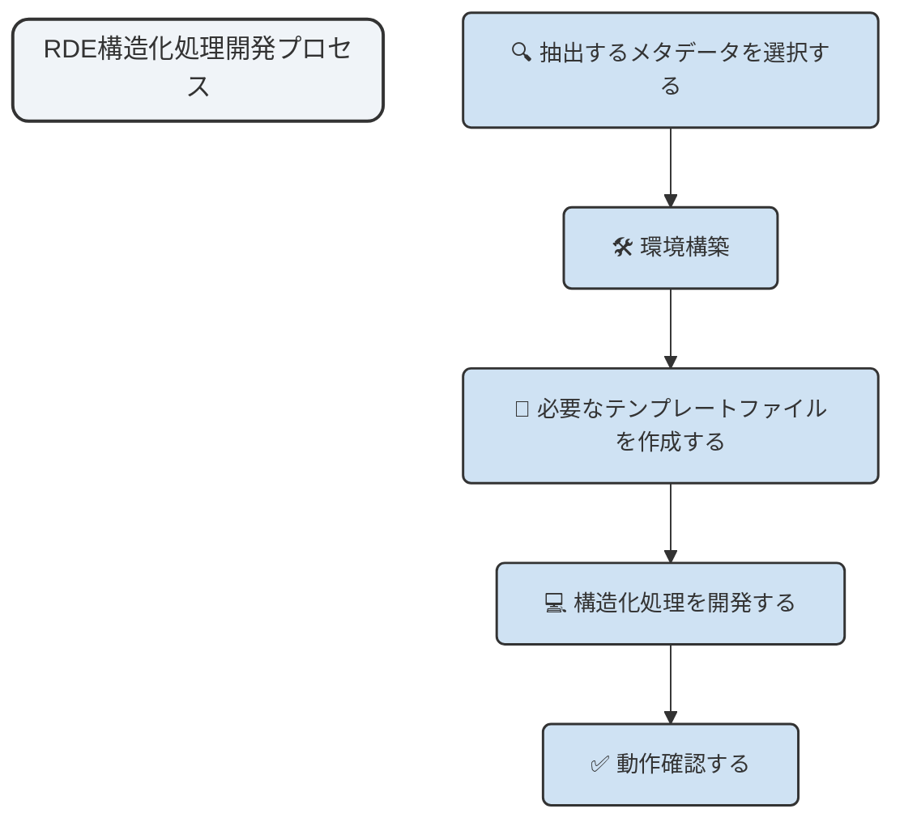

## 実際のデータを用いた構造化処理の実装方法

このドキュメントは、RigakuのX線回折装置（XRD）から出力されるRASファイルを処理し、RDEに登録するための構造化処理を、RDEToolKitライブラリを使用して構築する方法を説明します。

## データ利用に関する謝辞

本ドキュメントで使用するサンプルデータおよび関連する技術情報は、国立研究開発法人物質・材料研究機構（NIMS）の「NIMS Materials Data Conversion Tools (M-DaC)」プロジェクトから提供されています。M-DaCプロジェクトは、計測機器メーカーとの協力により開発された、実験データの効率的な収集と高付加価値化を目的とした技術開発の成果です。

謝辞：

- データ提供: 国立研究開発法人物質・材料研究機構（NIMS）
- プロジェクト: NIMS Materials Data Conversion Tools (M-DaC) for XRD
- 共同開発: 株式会社リガク
- ライセンス: MIT License
- 引用: H. Nagao, S. Matsunami, M. Suzuki, and H. Yoshikawa: "NIMS Materials Data Conversion Tools (M-DaC) ver 1.1"

このプロジェクトの成果を活用することで、実際の研究現場で使用されているデータ形式に基づいた実践的な学習が可能になります。NIMSおよび関連するすべての研究者・技術者の皆様に深く感謝いたします。

### RASファイルについて

#### データ形式の特徴

RASファイル（Rigaku）は、Rigaku社のX線回折装置SmartLabなどから出力される標準的なデータ形式です。以下の特徴があります：

- ASCII形式: テキストベースのファイル形式で、人間が読める形式
- 構造化されたメタデータ: 測定条件、装置設定、サンプル情報などが体系的に記録
- 3列データ: 角度、強度、減衰補正係数の3列で構成される測定データ
- 区切り文字: アスタリスク（*）で始まる行がメタデータとコメントを示す

#### ファイル構造

```plaintext
*RAS_DATA_START
*FILE_DATETIME 2023-01-15 10:30:00
*SAMPLE_NAME Al2O3_sample
*TARGET_NAME Cu
*TUBE_VOLTAGE 40.0
*TUBE_CURRENT 30.0
*SCAN_MODE continuous
*SCAN_SPEED 2.0
*SCAN_STEP 0.02
*START_ANGLE 10.0
*STOP_ANGLE 90.0
*RAS_HEADER_START
... (詳細なメタデータ)
*RAS_HEADER_END
*RAS_INT_START
10.0000 1200.0000 1.0000
10.0200 1205.0000 1.0000
10.0400 1198.0000 1.0000
... (測定データ)
*RAS_INT_END
*RAS_DATA_END
```

## rdetoolkitを使ってRDE構造化処理を構築する

### RDE構造化処理の開発プロセス

本ドキュメントで示す開発プロセスは一例です。利用者のニーズに応じて調整してください。



### RDEデータ登録で必要となる事前定義ファイル群について

RDEは再利用なデータ登録において、下記ファイルは必須となります。

- `templates/tasksupport/invoice.shcema.json`
- `templates/tasksupport/metadata-def.json`

RDEは、計測装置から出力されたファイルや日々の実験データファイルから抽出するべき事前メタデータ定義ファイル`metadata-def.json`と、サンプル情報(合成条件など)や計測条件など日々の実験で定型的に記録が必要な情報を、データ入力フォームを柔軟にカスタマイズできる`invoice.schema.json`。

- データ登録時に、`invoice.schema.json`を作成することで、日々の実験で必要な情報をデータ入力フォームとして定義できます。
- データ登録時に、ファイルからメタデータを自動的に抽出するための事前ファイルを`metadata-def.json`

さらに、これらのファイル群は、当機構が提供するパッケージを利用することで簡易的にファイルを作成することが可能です。また、上記のファイルに加えて、個人の環境で構造化処理を構築するための`invoice.json`も作成可能です。

- [nims-mdpf/RDE_datasettemplate-schemafile-make-tool - Github](https://github.com/nims-mdpf/RDE_datasettemplate-schemafile-make-tool)

#### 抽出するメタデータを選択する(metadata-def.json)

入力データから抽出するメタデータを事前に決めておきます。利用者やプロジェクトによって、事前に定義するメタデータの数は異なります。

今回は、測定条件・試料情報・時間・トレーサビリティという観点から以下のメタデータを抽出するという方針で、

**A. 測定条件**（Measurement Conditions）

```plaintext
*MEAS_COND_XG_VOLTAGE "40"           # 管電圧（kV）
*MEAS_COND_XG_CURRENT "30"           # 管電流（mA）
*HW_XG_TARGET_NAME "Cu"              # X線源（Cu）
*HW_XG_WAVE_LENGTH_ALPHA1 "1.540593" # 波長α1（Å）
*HW_XG_WAVE_LENGTH_ALPHA2 "1.544414" # 波長α2（Å）
*MEAS_SCAN_START "25.0000"           # 測定開始角度
*MEAS_SCAN_STOP "60.0000"            # 測定終了角度
*MEAS_SCAN_STEP "0.0100"             # 測定ステップ
*MEAS_SCAN_SPEED "8.0000"            # 測定速度（deg/min）
*MEAS_SCAN_MODE "CONTINUOUS"         # 測定モード
```

**B. 試料情報**（Sample Information）

```plaintext
*FILE_SAMPLE "Test Sample"           # 試料名
*FILE_COMMENT "XRD example"          # コメント
*FILE_MEMO "Rigaku XRD memo"         # メモ
*FILE_OPERATOR "English"             # 操作者
*FILE_USERGROUP "Academic"           # ユーザーグループ
```

**C. 時間・トレーサビリティ**（Temporal & Traceability）

```plaintext
*MEAS_SCAN_START_TIME "11/21/2017 08:32:31" # 測定開始時刻
*MEAS_SCAN_END_TIME "11/21/2017 08:37:42"   # 測定終了時刻
*MEAS_DATA_COUNT "3501"                     # データ点数
*FILE_VERSION "1"                           # ファイルバージョン
```

これらの情報をもとに、`metadata-def.json`に以下のように定義します。

> 長文のため一文抜粋して表示しています。

```json
{
    "file_sample": {
        "name": {
            "ja": "試料名",
            "en": "Sample Name"
        },
        "schema": {
            "type": "string"
        }
    },
    "file_comment": {
        "name": {
            "ja": "ファイルコメント",
            "en": "File Comment"
        },
        "schema": {
            "type": "string"
        }
    },
    ...
}
```

<details>
<summary>Click to view the full `metadata-def.json`</summary>

```json
{
    "file_sample": {
        "name": {
            "ja": "試料名",
            "en": "Sample Name"
        },
        "schema": {
            "type": "string"
        }
    },
    "file_comment": {
        "name": {
            "ja": "ファイルコメント",
            "en": "File Comment"
        },
        "schema": {
            "type": "string"
        }
    },
    "file_memo": {
        "name": {
            "ja": "ファイルメモ",
            "en": "File Memo"
        },
        "schema": {
            "type": "string"
        }
    },
    "file_operator": {
        "name": {
            "ja": "操作者",
            "en": "Operator"
        },
        "schema": {
            "type": "string"
        }
    },
    "file_usergroup": {
        "name": {
            "ja": "ユーザーグループ",
            "en": "User Group"
        },
        "schema": {
            "type": "string"
        }
    },
    "file_version": {
        "name": {
            "ja": "ファイルバージョン",
            "en": "File Version"
        },
        "schema": {
            "type": "string"
        }
    },
    "hw_xg_target_name": {
        "name": {
            "ja": "X線ターゲット名",
            "en": "X-ray Target Name"
        },
        "schema": {
            "type": "string"
        }
    },
    "hw_xg_target_atomic_number": {
        "name": {
            "ja": "ターゲット原子番号",
            "en": "Target Atomic Number"
        },
        "schema": {
            "type": "integer"
        }
    },
    "hw_xg_wave_length_alpha1": {
        "name": {
            "ja": "波長α1",
            "en": "Wavelength Alpha1"
        },
        "schema": {
            "type": "number"
        }
    },
    "hw_xg_wave_length_alpha2": {
        "name": {
            "ja": "波長α2",
            "en": "Wavelength Alpha2"
        },
        "schema": {
            "type": "number"
        }
    },
    "hw_xg_wave_length_beta": {
        "name": {
            "ja": "波長β",
            "en": "Wavelength Beta"
        },
        "schema": {
            "type": "number"
        }
    },
    "hw_xg_wave_length_unit": {
        "name": {
            "ja": "波長単位",
            "en": "Wavelength Unit"
        },
        "schema": {
            "type": "string"
        }
    },
    "hw_xg_focus": {
        "name": {
            "ja": "X線フォーカス",
            "en": "X-ray Focus"
        },
        "schema": {
            "type": "string"
        }
    },
    "hw_xg_focus_type": {
        "name": {
            "ja": "フォーカスタイプ",
            "en": "Focus Type"
        },
        "schema": {
            "type": "string"
        }
    },
    "meas_cond_xg_voltage": {
        "name": {
            "ja": "管電圧",
            "en": "Tube Voltage"
        },
        "schema": {
            "type": "number"
        }
    },
    "meas_cond_xg_current": {
        "name": {
            "ja": "管電流",
            "en": "Tube Current"
        },
        "schema": {
            "type": "number"
        }
    },
    "hw_xg_voltage_unit": {
        "name": {
            "ja": "電圧単位",
            "en": "Voltage Unit"
        },
        "schema": {
            "type": "string"
        }
    },
    "hw_xg_current_unit": {
        "name": {
            "ja": "電流単位",
            "en": "Current Unit"
        },
        "schema": {
            "type": "string"
        }
    },
    "meas_scan_start": {
        "name": {
            "ja": "測定開始角度",
            "en": "Scan Start Angle"
        },
        "schema": {
            "type": "number"
        }
    },
    "meas_scan_stop": {
        "name": {
            "ja": "測定終了角度",
            "en": "Scan Stop Angle"
        },
        "schema": {
            "type": "number"
        }
    },
    "meas_scan_step": {
        "name": {
            "ja": "測定ステップ",
            "en": "Scan Step"
        },
        "schema": {
            "type": "number"
        }
    },
    "meas_scan_speed": {
        "name": {
            "ja": "測定速度",
            "en": "Scan Speed"
        },
        "schema": {
            "type": "number"
        }
    },
    "meas_scan_speed_unit": {
        "name": {
            "ja": "測定速度単位",
            "en": "Scan Speed Unit"
        },
        "schema": {
            "type": "string"
        }
    },
    "meas_scan_mode": {
        "name": {
            "ja": "測定モード",
            "en": "Scan Mode"
        },
        "schema": {
            "type": "string"
        }
    },
    "meas_scan_unit_x": {
        "name": {
            "ja": "X軸単位",
            "en": "X-axis Unit"
        },
        "schema": {
            "type": "string"
        }
    },
    "meas_scan_unit_y": {
        "name": {
            "ja": "Y軸単位",
            "en": "Y-axis Unit"
        },
        "schema": {
            "type": "string"
        }
    },
    "meas_scan_axis_x": {
        "name": {
            "ja": "測定軸X",
            "en": "Scan Axis X"
        },
        "schema": {
            "type": "string"
        }
    },
    "meas_scan_resolution_x": {
        "name": {
            "ja": "X軸分解能",
            "en": "X-axis Resolution"
        },
        "schema": {
            "type": "number"
        }
    },
    "meas_data_count": {
        "name": {
            "ja": "データ点数",
            "en": "Data Count"
        },
        "schema": {
            "type": "integer"
        }
    },
    "meas_scan_start_time": {
        "name": {
            "ja": "測定開始時刻",
            "en": "Scan Start Time"
        },
        "schema": {
            "type": "string",
            "format": "date-time"
        }
    },
    "meas_scan_end_time": {
        "name": {
            "ja": "測定終了時刻",
            "en": "Scan End Time"
        },
        "schema": {
            "type": "string",
            "format": "date-time"
        }
    },
    "hw_goniometer_name": {
        "name": {
            "ja": "ゴニオメータ名",
            "en": "Goniometer Name"
        },
        "schema": {
            "type": "string"
        }
    },
    "hw_goniometer_id": {
        "name": {
            "ja": "ゴニオメータID",
            "en": "Goniometer ID"
        },
        "schema": {
            "type": "string"
        }
    },
    "hw_counter_select_name": {
        "name": {
            "ja": "検出器名",
            "en": "Detector Name"
        },
        "schema": {
            "type": "string"
        }
    },
    "hw_counter_pixel_size": {
        "name": {
            "ja": "検出器ピクセルサイズ",
            "en": "Detector Pixel Size"
        },
        "schema": {
            "type": "string"
        }
    },
    "hw_attachment_name": {
        "name": {
            "ja": "アタッチメント名",
            "en": "Attachment Name"
        },
        "schema": {
            "type": "string"
        }
    },
    "hw_attachment_id": {
        "name": {
            "ja": "アタッチメントID",
            "en": "Attachment ID"
        },
        "schema": {
            "type": "string"
        }
    },
    "hw_sample_holder_name": {
        "name": {
            "ja": "試料ホルダー名",
            "en": "Sample Holder Name"
        },
        "schema": {
            "type": "string"
        }
    },
    "hw_sample_holder_id": {
        "name": {
            "ja": "試料ホルダーID",
            "en": "Sample Holder ID"
        },
        "schema": {
            "type": "string"
        }
    },
    "meas_cond_axis_position_incident_slit": {
        "name": {
            "ja": "入射スリット",
            "en": "Incident Slit"
        },
        "schema": {
            "type": "string"
        }
    },
    "meas_cond_axis_position_divergence_slit": {
        "name": {
            "ja": "発散スリット",
            "en": "Divergence Slit"
        },
        "schema": {
            "type": "string"
        }
    },
    "meas_cond_axis_position_receiving_slit": {
        "name": {
            "ja": "受光スリット",
            "en": "Receiving Slit"
        },
        "schema": {
            "type": "string"
        }
    },
    "meas_cond_axis_position_soller_slit_incident": {
        "name": {
            "ja": "入射側ソーラースリット",
            "en": "Incident Soller Slit"
        },
        "schema": {
            "type": "string"
        }
    },
    "meas_cond_axis_position_soller_slit_receiving": {
        "name": {
            "ja": "受光側ソーラースリット",
            "en": "Receiving Soller Slit"
        },
        "schema": {
            "type": "string"
        }
    },
    "meas_cond_axis_position_monochromator": {
        "name": {
            "ja": "モノクロメータ",
            "en": "Monochromator"
        },
        "schema": {
            "type": "string"
        }
    },
    "meas_cond_axis_position_attenuator": {
        "name": {
            "ja": "アッテネータ",
            "en": "Attenuator"
        },
        "schema": {
            "type": "string"
        }
    },
    "meas_cond_axis_position_pha": {
        "name": {
            "ja": "波高分析器",
            "en": "Pulse Height Analyzer"
        },
        "schema": {
            "type": "string"
        }
    },
    "meas_cond_axis_offset_theta_s": {
        "name": {
            "ja": "θ試料オフセット",
            "en": "Theta Sample Offset"
        },
        "schema": {
            "type": "number"
        }
    },
    "meas_cond_axis_offset_theta_d": {
        "name": {
            "ja": "θ検出器オフセット",
            "en": "Theta Detector Offset"
        },
        "schema": {
            "type": "number"
        }
    },
    "meas_cond_axis_offset_two_theta": {
        "name": {
            "ja": "2θオフセット",
            "en": "Two Theta Offset"
        },
        "schema": {
            "type": "number"
        }
    },
    "meas_cond_axis_offset_omega": {
        "name": {
            "ja": "ωオフセット",
            "en": "Omega Offset"
        },
        "schema": {
            "type": "number"
        }
    },
    "meas_cond_axis_position_z": {
        "name": {
            "ja": "Z位置",
            "en": "Z Position"
        },
        "schema": {
            "type": "number"
        }
    },
    "meas_cond_axis_position_zs": {
        "name": {
            "ja": "試料Z位置",
            "en": "Sample Z Position"
        },
        "schema": {
            "type": "number"
        }
    },
    "meas_cond_axis_position_zr": {
        "name": {
            "ja": "受光Z位置",
            "en": "Receiving Z Position"
        },
        "schema": {
            "type": "number"
        }
    },
    "meas_cond_axis_position_primary_geometry": {
        "name": {
            "ja": "一次光学系幾何",
            "en": "Primary Geometry"
        },
        "schema": {
            "type": "string"
        }
    },
    "meas_cond_axis_position_incident_primary": {
        "name": {
            "ja": "入射光学系",
            "en": "Incident Primary"
        },
        "schema": {
            "type": "string"
        }
    },
    "meas_cond_axis_position_receiving_optics": {
        "name": {
            "ja": "受光光学系",
            "en": "Receiving Optics"
        },
        "schema": {
            "type": "string"
        }
    },
    "hw_goniometer_radius_0": {
        "name": {
            "ja": "ゴニオ半径0",
            "en": "Goniometer Radius 0"
        },
        "schema": {
            "type": "number"
        }
    },
    "hw_goniometer_radius_1": {
        "name": {
            "ja": "ゴニオ半径1",
            "en": "Goniometer Radius 1"
        },
        "schema": {
            "type": "number"
        }
    },
    "hw_goniometer_radius_2": {
        "name": {
            "ja": "ゴニオ半径2",
            "en": "Goniometer Radius 2"
        },
        "schema": {
            "type": "number"
        }
    },
    "disp_line_color": {
        "name": {
            "ja": "表示線色",
            "en": "Display Line Color"
        },
        "schema": {
            "type": "string"
        }
    },
    "file_type": {
        "name": {
            "ja": "ファイルタイプ",
            "en": "File Type"
        },
        "schema": {
            "type": "string"
        }
    },
    "file_part_id": {
        "name": {
            "ja": "ファイル部品ID",
            "en": "File Part ID"
        },
        "schema": {
            "type": "string"
        }
    },
    "meas_cond_wave_type": {
        "name": {
            "ja": "X線波長タイプ",
            "en": "X-ray Wave Type"
        },
        "schema": {
            "type": "string"
        }
    },
    "meas_scan_unequaly_spaced": {
        "name": {
            "ja": "不等間隔スキャン",
            "en": "Unequally Spaced Scan"
        },
        "schema": {
            "type": "boolean"
        }
    }
}
```

</details>

#### 登録フォームをカスタマイズする(invoice.schema.json)

invoice.schema.jsonを変更することで、登録フォームをカスタマイズできます。今回は、測定温度をデータ登録時に手入力で登録できるようにカスタマイズします。以下は、`invoice.schema.json`の一部例です。

もしローカル環境で、カスタマイズした入力フォームを確認したい場合、以下のドキュメントを参照してください。

- [template_viewer - nims-mdpf/RDE_datasettemplate-schemafile-make-tool](https://github.com/nims-mdpf/RDE_datasettemplate-schemafile-make-tool/tree/main/template_viewer)

```json
{
  "$schema": "https://json-schema.org/draft/2020-12/schema",
  "$id": "myproject/XRD/project",
  "description": "固有情報と試料情報のスキーマ",
  "type": "object",
  "required": [
      "custom",
      "sample"
  ],
  "properties": {
      "custom": {
        "type": "object",
        "label": {
          "ja": "固有情報",
          "en": "Specific Information"
        },
        "required": [],
        "properties": {
          "measurement_temperature": {
              "type": "number",
              "label": {
                "ja": "測定温度",
                "en": "Measurement Temperature"
              },
              "options": {
                "unit": "C"
              }
          }
        }
      },
      "sample": {
        "type": "object",
        "label": {
          "ja": "試料情報",
          "en": "Sample Information"
        },
        "required": [
          "names"
        ],
        "properties": {
          "generalAttributes": {
              "type": "array",
              "items": [
                {
                  "type": "object",
                  "required": [
                      "termId"
                  ],
                  "properties": {
                      "termId": {
                        "const": "3adf9874-7bcb-e5f8-99cb-3d6fd9d7b55e"
                      }
                  }
                },
                {
                  "type": "object",
                  "required": [
                      "termId"
                  ],
                  "properties": {
                      "termId": {
                        "const": "e2d20d02-2e38-2cd3-b1b3-66fdb8a11057"
                      }
                  }
                },
                {
                  "type": "object",
                  "required": [
                      "termId"
                  ],
                  "properties": {
                      "termId": {
                        "const": "efcf34e7-4308-c195-6691-6f4d28ffc9bb"
                      }
                  }
                },
                {
                  "type": "object",
                  "required": [
                      "termId"
                  ],
                  "properties": {
                      "termId": {
                        "const": "7cc57dfb-8b70-4b3a-5315-fbce4cbf73d0"
                      }
                  }
                },
                {
                  "type": "object",
                  "required": [
                      "termId"
                  ],
                  "properties": {
                      "termId": {
                        "const": "1e70d11d-cbdd-bfd1-9301-9612c29b4060"
                      }
                  }
                },
                {
                  "type": "object",
                  "required": [
                      "termId"
                  ],
                  "properties": {
                      "termId": {
                        "const": "5e166ac4-bfcd-457a-84bc-8626abe9188f"
                      }
                  }
                },
                {
                  "type": "object",
                  "required": [
                      "termId"
                  ],
                  "properties": {
                      "termId": {
                        "const": "0d0417a3-3c3b-496a-b0fb-5a26f8a74166"
                      }
                  }
                }
              ]
          }
        }
      }
  }
}
```

### 環境準備

#### プロジェクトの初期化

uvを使用してプロジェクトを初期化します。

```bash
# 新しいプロジェクトを作成する場合
uv init rde-struct-project
cd rde-struct-project
```

pipを利用する場合

```bash
mkdir rde-struct-project
cd rde-struct-project
pyhton3 -m venv .venv
source .venv/bin/activate
```

初期化後、以下のファイルが作成されます。requirements.txtの代わりにpyproject.tomlをご利用ください。

- `pyproject.toml`: プロジェクトの設定とメタデータ
- `src/`: パッケージのソースコード（オプション）
- `README.md`: プロジェクトの説明文書

#### 必要なライブラリをインストール

pipを使用して、RDEToolKitライブラリをインストールします。

```bash
pip install rdetoolkit
```

uvを使う場合

```bash
uv add rdetoolkit
uv sync
```

#### 構造化処理プロジェクトの初期化

rdetoolkitを使用して、構造化処理のプロジェクトを初期化します。

```bash
# pip
python3 -m rdetoolkit init
# uv
uv run python -m rdetoolkit init
```

このコマンドにより、以下のディレクトリとファイルが作成されます：

- continer/: 構造化処理の実行環境を定義するディレクトリ
- container/data/: 構造化処理で使用するデータを配置するディレクトリ
- input/: 入力データを配置するディレクトリ(ローカル開発・デバッグでは利用必須ではありません。)
- templates/: 構造化処理で使用するテンプレートファイルを配置するディレクトリ(ローカル開発・デバッグでは利用必須ではありません。)

```bash
rde-struct-project/
├── container
│   ├── data
│   │   ├── inputdata
│   │   ├── invoice
│   │   │   └── invoice.json
│   │   └── tasksupport
│   │       ├── invoice.schema.json
│   │       └── metadata-def.json
│   ├── modules/ # カスタムモジュール群を配置するディレクトリ
│   ├── Dockerfile
│   ├── main.py # 構造化処理エントリーポイント
│   └── requirements.txt
├── input
│   ├── inputdata
│   └── invoice
│       └── invoice.json
└── templates
    └── tasksupport
        ├── invoice.schema.json
        └── metadata-def.json
```

さきほど作成した、`metadata-def.json`と`invoice.schema.json`、テンプレート生成ツールで作成した`invoice.json`を`container/data/tasksupport/`と、`templates/`に配置します。

```bash
cp metadata-def.json container/data/tasksupport/
cp invoice.schema.json container/data/tasksupport/
cp invoice.json container/data/invoice/
cp metadata-def.json templates/tasksupport
cp invoice.schema.json templates/tasksupport
cp metadata-def.json templates/tasksupport/tasksupport/
cp invoice.schema.json templates/tasksupport/tasksupport/
```

また、ダウンロードしてきた入力データ[XRD_RIGAKU.ras](https://github.com/nims-mdpf/M-DaC_XRD/blob/master/source/XRD_RIGAKU.ras)も`container/data/inputdata/`に配置します。

```bash
cp XRD_RIGAKU.ras container/data/inputdata/
```

#### 設定ファイルの追加

`data/tasksupport/rdeconfig.yml`ディレクトリに、RDE構造化処理で必要な設定ファイルを追加します。

```yaml
system:
    save_raw: true
    save_nonshared_raw: false
    magic_variable: false
    save_thumbnail_image: true
```

### rdetoolkitが推奨する構造化処理の基本構成

rdetoolkitでは、構造化処理の基本的なディレクトリ構成を以下のように推奨しています。

```bash
container
├── data
│   ├── inputdata
│   │   └── XRD_RIGAKU.ras
│   ├── invoice
│   │   └── invoice.json
│   └── tasksupport
│       ├── invoice.schema.json
│       └── metadata-def.json
├── Dockerfile
├── main.py
├── modules
│   ├── __init__.py
│   └── mymodule.py
└── requirements.txt
```

| ディレクトリ/ファイル | 説明                                                               |
| --------------------- | ------------------------------------------------------------------ |
| main.py               | 構造化処理のエントリーポイント。開発したモジュールを呼び出します。 |
| modules               | カスタムモジュールを配置するディレクトリ。                         |
| requirements.txt      | 必要なPythonパッケージを定義するファイル。                         |
| data                  | 構造化処理で使用するデータを配置するディレクトリ。                 |

> rdetoolkitをインストールすると、`pandas`, `numpy`, `matplotlib`などのデータ処理に必要なライブラリが自動的にインストールされます。これらのライブラリは、構造化処理でのデータ操作や可視化に役立ちます。

### main.pyの実装

デフォルトで作成された`main.py`は、今回のエントリーポイントとなるファイルになります。各プロジェクト・ユーザーが開発したモジュール群を呼び出すためのスクリプトです。

以下のように、`rdetoolkit.workflows.run()`に開発したモジュールを引数として渡すことで、RDE構造化処理で必要なpre/post処理を含む構造化処理を実装できます。

今回開発するモジュールを`modules.mymodule.my_xrd_func()`とします。`run()`の引数`custom_dataset_function`にこの関数を指定します。

```python
import rdetoolkit

from modules.mymodule import my_xrd_func

rdetoolkit.workflows.run(custom_dataset_function=my_xrd_func)
```

### カスタムモジュールの実装

`container/modules/`ディレクトリにカスタムモジュールを配置します。ここでは、`mymodule.py`というファイル名で、XRDデータを処理する関数を実装します。

ここで重要なポイントは、定義する関数`my_xrd_func`に以下の引数を含めることです：

- `RdeInputDirPaths`: 入力データ各種が格納されているデータディレクトリのパス群を格納したデータクラス。
- `RdeOutputResourcePath`: 出力リソースのディレクトリパスを格納したデータクラス。

これらのクラスに格納されているディレクトリパスを使うと、RDEシステムに安全・確実にデータを登録できます。

さらに、入力ファイルは、`RdeInputDirPaths`クラスの`rawfiles`属性に格納されます。`srcpaths`ではなく、`resource_paths.rawfiles`という配列に格納されているため、この属性の利用を推奨します。

> RDEにはデータセットの中に、データタイルという単位でデータが登録されます。rdetoolkitでは、このデータタイルの単位で入力データを自動的にグルーピングし、カスタム構造化処理にデータを渡すため、`RdeInputDirPaths`の`rawfiles`属性に格納されているファイルを利用します。

```python
from rdetoolkit.models.rde2types import RdeInputDirPaths, RdeOutputResourcePath

def my_xrd_func(srcpaths: RdeInputDirPaths, resource_paths: RdeOutputResourcePath):
    pass
```

つづいて、`my_xrd_func`関数内で実装する処理を定義します。RDE構造化処理は、ユーザーが自身が柔軟に処理を定義できるようになっています。最も多いケースは、以下の処理系を実装することが多いです。

- 入力データを読み込み
- メタデータを抽出
- 構造化ファイルの作成
- プロット画像の作成(RDE上で可視化したグラフを閲覧するため)

以下の方針で実装します。

| 処理内容             | 処理内容                                               | 関数名                     |
| -------------------- | ------------------------------------------------------ | -------------------------- |
| 入力データを読み込み | `.ras`ファイルを読み込み、計測データとメタデータを分離 | `read_ras_file`            |
| メタデータを抽出     | 分離したメタデータを保存                               | `save_metadata`            |
| 構造化ファイルの作成 | 計測データのみをcsvに保存                              | pandasのto_csv()を利用する |
| プロット画像の作成   | XRDのプロット画像を作成                                | `xrd_plot`                 |

#### Step1: 入力データを読み込む

`read_ras_file`関数では、入力データを読み込み、計測データとメタデータを分離します。以下のように実装します。

```python
from pathlib import Path
import re
import pandas as pd

from rdetoolkit.models.rde2types import RdeInputDirPaths, RdeOutputResourcePath


def parse_ras_file(filepath: str | Path) -> tuple[dict[str, str], pd.DataFrame]:
    """RASファイル解析: メタデータと測定データを抽出"""
    metadata, data_lines = {}, []

    with open(filepath, 'r', encoding='utf-8') as f:
        lines = f.readlines()

    in_data = False
    for line in lines:
        line = line.strip()
        if not line:
            continue

        if line.startswith('*'):
            if line == '*RAS_INT_START':
                in_data = True
            elif line == '*RAS_INT_END':
                break
            elif not in_data:
                parts = line[1:].split(' ', 1)
                if len(parts) == 2 and parts[1].strip():
                    key = re.sub(r'[^a-zA-Z0-9]+', '_', parts[0].lower()).strip('_')
                    metadata[key] = parts[1].strip().strip('"')
        elif in_data:
            parts = line.split()
            if len(parts) == 3:
                try:
                    x, i, a = float(parts[0]), float(parts[1]), float(parts[2])
                    data_lines.append([x, i * a])
                except ValueError:
                    continue

    return metadata, pd.DataFrame(data_lines, columns=['two_theta', 'intensity'])


def my_xrd_func(srcpaths: RdeInputDirPaths, resource_paths: RdeOutputResourcePath):
    # 入力ファイルの読み込み
    # rasファイルが一つしかないため、最初のファイルを対象とする
    metadata, dataframe = parse_ras_file(resource_paths.rawfiles[0])

```

#### Step2: メタデータを保存する

`save_metadata`関数では、抽出したメタデータを`metadata-def.json`に基づいて保存します。以下のように実装します。

```python

from pathlib import Path
import re
import pandas as pd

from rdetoolkit.models.rde2types import RdeInputDirPaths, RdeOutputResourcePath
from rdetoolkit.rde2util import Meta


def parse_ras_file(filepath: str | Path) -> tuple[dict[str, str], pd.DataFrame]:
    """
    RASファイルを解析し、メタデータと測定データを抽出する
    """
    # ... 省略: 上記のparse_ras_file関数の内容をここに含める ...
    return metadata, df

# **追加**
def save_metadata(metadata: dict[str, str], metadata_def_json_path: str | Path, save_path: str | Path):
    """メタデータをmetadata-def.jsonに基づいて保存"""
    meta = Meta(metadata_def_json_path)
    meta.assign_vals(metadata)
    meta.writefile(str(save_path))


def my_xrd_func(srcpaths: RdeInputDirPaths, resource_paths: RdeOutputResourcePath):
    # 入力ファイルの読み込み
    metadata, dataframe = parse_ras_file(resource_paths.rawfiles[0])

    # **追加**: メタデータ保存処理
    metadata_def_json_path = srcpaths.tasksupport.joinpath("metadata-def.json")
    save_path = resource_paths.meta.joinpath("metadata.json")
    save_metadata(metadata, metadata_def_json_path, save_path)

```

#### Step3: 構造化ファイルの作成

`my_xrd_func`関数内で、計測データをCSVファイルとして保存します。以下のように実装します。

```python
def parse_ras_file(filepath: str | Path) -> tuple[dict[str, str], pd.DataFrame]:
    # ... 省略: 上記のparse_ras_file関数の内容をここに含める ...
    return metadata, df


def save_metadata(metadata: dict[str, str], metadata_def_json_path: str | Path, save_path: str | Path):
    # ... 省略: 上記のsave_metadata関数の内容をここに含める ...

def my_xrd_func(srcpaths: RdeInputDirPaths, resource_paths: RdeOutputResourcePath):
    metadata, dataframe = parse_ras_file(resource_paths.rawfiles[0])

    metadata_def_json_path = srcpaths.tasksupport.joinpath("metadata-def.json")
    save_path = resource_paths.meta.joinpath("metadata.json")
    save_metadata(metadata, metadata_def_json_path, save_path)

    # **追加**: 計測データの保存
    dataframe.to_csv(resource_paths.struct.joinpath("mesurement.csv"), index=False)
```

#### Step4: プロット画像の作成

`xrd_plot`関数では、XRDデータのプロット画像を作成します。以下のように実装します。

```python
def parse_ras_file(filepath: str | Path) -> tuple[dict[str, str], pd.DataFrame]:
    # ... 省略: 上記のparse_ras_file関数の内容をここに含める ...
    return metadata, df


def save_metadata(metadata: dict[str, str], metadata_def_json_path: str | Path, save_path: str | Path):
    # ... 省略: 上記のsave_metadata関数の内容をここに含める ...

def xrd_plot(data: pd.DataFrame, output_path: str | Path):
    """XRDプロット画像作成"""
    plt.figure(figsize=(10, 6))
    plt.plot(data['two_theta'], data['intensity'], label='Intensity')
    plt.xlabel('2Theta (degrees)')
    plt.ylabel('Intensity')
    plt.title('XRD Pattern')
    plt.legend()
    plt.grid()
    plt.savefig(output_path)
    plt.close()

def my_xrd_func(srcpaths: RdeInputDirPaths, resource_paths: RdeOutputResourcePath):
        metadata, dataframe = parse_ras_file(resource_paths.rawfiles[0])

    metadata_def_json_path = srcpaths.tasksupport.joinpath("metadata-def.json")
    save_path = resource_paths.meta.joinpath("metadata.json")
    save_metadata(metadata, metadata_def_json_path, save_path)

    # 計測データの保存
    dataframe.to_csv(resource_paths.struct.joinpath("mesurement.csv"), index=False)

    # **追加**: プロット画像作成
    xrd_plot(dataframe, resource_paths.main_image.joinpath("xrd_graph.png"))
```

#### Step5: 例外処理を追加する

`rdetoolkit`では、構造化処理中に発生する可能性のある例外を`StructuredError`として定義しています。これを利用することで、エラー発生時に適切なメッセージを表示するようにします。

```python
from pathlib import Path
import re
import pandas as pd
import matplotlib.pyplot as plt

from rdetoolkit.models.rde2types import RdeInputDirPaths, RdeOutputResourcePath
from rdetoolkit.rde2util import Meta
from rdetoolkit.exceptions import StructuredError # **追加**

# ... 省略: 上記の関数群を内容をここに含める ...

def my_xrd_func(srcpaths: RdeInputDirPaths, resource_paths: RdeOutputResourcePath):
    """XRDデータ処理メイン関数"""
    try:
        # RASファイル解析
        metadata, dataframe = parse_ras_file(resource_paths.rawfiles[0])

        # メタデータ保存
        try:
            save_metadata(metadata,
                        srcpaths.tasksupport.joinpath("metadata-def.json"),
                        resource_paths.meta.joinpath("metadata.json"))
        except StructuredError as e:
            print(f"Error saving metadata: {e}")
            return None

        # 測定データ保存
        dataframe.to_csv(resource_paths.struct.joinpath("mesurement.csv"), index=False)

        # プロット画像作成
        xrd_plot(dataframe, resource_paths.main_image.joinpath("xrd_graph.png"))
    except Exception as e:
        raise StructuredError(f"An error occurred during XRD processing: {e}") from e
```

#### Step6: 構造化処理の動作確認

```bash
cd container
python3 main.py
```

以下のファイルが生成されていることを確認します。(空のディレクトリは表示から除外しています。)

```bash
container/data
├── inputdata
│   └── XRD_RIGAKU.ras
├── invoice
│   └── invoice.json
├── job.failed
├── main_image
│   └── xrd_graph.png
├── meta
│   └── metadata.json
├── nonshared_raw
│   └── XRD_RIGAKU.ras
├── raw
│   └── XRD_RIGAKU.ras
├── structured
│   └── mesurement.csv
├── tasksupport
│   ├── invoice.schema.json
│   ├── metadata-def.json
│   └── rdeconfig.yml
└── thumbnail
    └── xrd_graph.png
```

### エラーが発生したときは

`container/data/logs`以下に、`rdesys.log`にログが出力されます。エラーが発生した場合は、ここにエラーメッセージが記録されます。

## RDEに構造化処理を提出する

もし動作等問題がなければ、RDEに構造化処理を提出します。以下のコマンドを実行しzipが生成されるので、このzipファイルをRDEに提出します。

```bash
uv run python -m rdetoolkit artifact -s . -o rde_submit_files.zip
```

```bash
# 出力
📦 Archiving project files...
📌 - Source Directory: .
📌 - Output Archive: rde_submit_files.zip
✅ 🐳 Dockerfile found!: container/Dockerfile
✅ 🐍 requirements.txt found!: container/requirements.txt
🔍 Scanning for external connections...OK
🔍 Scanning for code security vulnerabilities...OK
✅ Archive created successfully: rde_submit_files.zip
✅ Archive and report generation completed successfully.: rde_submit_files.md
```
