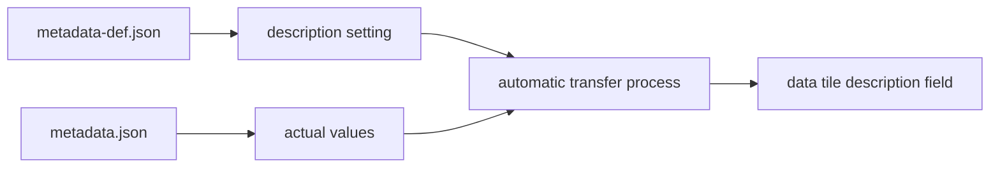

# What is Automatic Transfer to Data Tile Description

## Purpose

This document explains the automatic transfer feature to data tile description fields in RDE structured processing. You will understand the mechanism and configuration methods for automatically displaying metadata items in description fields.

## Challenges and Background

Data set management faced the following challenges:

- **Manual Description Creation**: Need to manually create description text for each dataset
- **Information Consistency**: Important metadata information not reflected in description fields
- **Work Efficiency**: Duplicate work of entering the same information in multiple places
- **Visibility**: Difficulty in grasping dataset overview at a glance

The automatic transfer feature from metadata was developed to solve these challenges.

## Key Concepts

### Automatic Transfer Mechanism



### Configurable Items

| Configuration Item | Description | Required |
|-------------------|-------------|----------|
| `"description": true` | Setting for display in description field | ○ |
| `"title"` | Display name definition | ○ |
| `"type"` | Data type definition | ○ |

### Display Rules

- Only items with `description: true` are displayed
- Items with `null` or empty values are not displayed
- Displayed in definition order
- Supports both Japanese and English

## Configuration Method

### 1. Configuration in metadata-def.json

Add `"description": true` to items you want to display in the description field:

```json title="metadata-def.json"
{
  "title": "Experimental Data Metadata",
  "type": "object",
  "properties": {
    "experiment_name": {
      "type": "string",
      "title": "Experiment Name",
      "description": true
    },
    "temperature": {
      "type": "number",
      "title": "Temperature (°C)",
      "description": true
    },
    "pressure": {
      "type": "number",
      "title": "Pressure (Pa)"
    },
    "sample_count": {
      "type": "integer",
      "title": "Sample Count",
      "description": true
    }
  }
}
```

### 2. Value Setting in Structuring Processing

Set metadata values in custom structured processing:

```python title="Metadata Generation"
def dataset(srcpaths: RdeInputDirPaths, resource_paths: RdeOutputResourcePath):
    # Process experimental data
    experiment_data = process_experiment_data()

    # Generate metadata
    metadata = {
        "experiment_name": "High Temperature Experiment Series A",
        "temperature": 850,
        "pressure": 101325,  # Not displayed in description field
        "sample_count": 25
    }

    # Save as metadata.json
    metadata_file = Path(resource_paths.meta) / "metadata.json"
    with open(metadata_file, 'w', encoding='utf-8') as f:
        json.dump(metadata, f, indent=2, ensure_ascii=False)
```

### 3. Verify Display Results

The data tile description field will display as follows:

```text
Experiment Name: High Temperature Experiment Series A
Temperature (°C): 850
Sample Count: 25
```

## Practical Usage Examples

### Multiple Data Type Configuration

```json title="Various Data Type Configuration Example"
{
  "properties": {
    "project_name": {
      "type": "string",
      "title": "Project Name",
      "description": true
    },
    "completion_rate": {
      "type": "number",
      "title": "Completion Rate (%)",
      "description": true
    },
    "is_validated": {
      "type": "boolean",
      "title": "Validated",
      "description": true
    },
    "tags": {
      "type": "array",
      "title": "Tags",
      "description": true
    }
  }
}
```

### Conditional Metadata Generation

```python title="Conditional Metadata Setting"
def generate_conditional_metadata(data):
    metadata = {
        "project_name": data.get("name", "Not Set"),
        "completion_rate": calculate_completion_rate(data)
    }

    # Add metadata based on conditions
    if data.get("validated"):
        metadata["is_validated"] = True
        metadata["validation_date"] = data["validation_date"]

    # Add tags only if they exist
    if data.get("tags"):
        metadata["tags"] = data["tags"]

    return metadata
```

## Troubleshooting

### When Items Don't Appear in Description Field

#### Configuration Check Checklist

```python title="Configuration Check Script"
def check_description_settings(metadata_def_path, metadata_path):
    # Check metadata-def.json
    with open(metadata_def_path, 'r') as f:
        schema = json.load(f)

    # Check metadata.json
    with open(metadata_path, 'r') as f:
        metadata = json.load(f)

    # Check description settings
    for prop_name, prop_def in schema.get("properties", {}).items():
        if prop_def.get("description") is True:
            if prop_name in metadata and metadata[prop_name] is not None:
                print(f"✅ {prop_name}: Display target")
            else:
                print(f"❌ {prop_name}: Value not set")
        else:
            print(f"⚪ {prop_name}: Not display target")
```

### Common Problems and Solutions

| Problem | Cause | Solution |
|---------|-------|----------|
| Items not displayed | `description: true` not set | Add setting to metadata-def.json |
| Values displayed as blank | No value in metadata.json | Set value in structured processing |
| Display order differs from intention | Definition order issue | Adjust order in metadata-def.json |

## Summary

Key features of the automatic transfer to data tile description field:

- **Automation**: Automatic transfer from metadata to description field
- **Selective Display**: Display only important items selectively
- **Consistency**: Information display in unified format
- **Efficiency**: Reduction of manual work and centralized information management

## Next Steps

To utilize the automatic transfer feature, refer to the following documents:

- Learn schema design in [Metadata Definition Files](../metadata_definition_file.en.md)
- Understand processing flows in [Structuring Processing Concepts](structured.en.md)
- Check file operation methods in [Directory Path Retrieval](rdepath.en.md)
