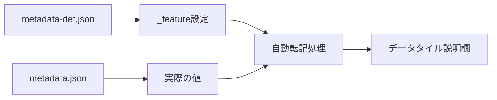

# データタイル説明欄への自動転記とは

## 目的

RDE構造化処理におけるデータタイル説明欄への自動転記機能について説明します。メタデータ項目を自動的に説明欄に表示する仕組みと設定方法を理解できます。

## 課題と背景

データセットの管理において、以下のような課題がありました：

- **説明文の手動作成**: データセットごとに説明文を手動で作成する必要があった
- **情報の一貫性**: 重要なメタデータ情報が説明欄に反映されない
- **作業効率**: 同じ情報を複数箇所に記入する重複作業
- **可視性**: データセットの概要を一目で把握することが困難

これらの課題を解決するために、メタデータからの自動転記機能が開発されました。

## 主要コンセプト

### 自動転記の仕組み



### 設定可能な項目

| 設定項目 | 説明 | 必須 |
|----------|------|------|
| `"_feature": true` | 説明欄に表示するかの設定 | ○ |
| `"name"` | 表示名の定義（日本語・英語） | ○ |
| `"unit"` | 単位の定義 | - |

### 表示ルール

- `_feature: true`が設定された項目のみ表示
- 値が`null`や空文字の場合は非表示
- 定義順序に従って表示
- 単位がある場合は括弧内に表示

## 設定方法

### 1. metadata-def.jsonでの設定

説明欄に表示したい項目に`"_feature": true`を追加します：

```json title="metadata-def.json"
{
    "length": {
        "name": {
            "ja": "長さ",
            "en": "length"
        },
        "schema": {
            "type": "number"
        },
        "unit": "nm",
        "_feature": true
    },
    "weight": {
        "name": {
            "ja": "重さ",
            "en": "weight"
        },
        "schema": {
            "type": "number"
        },
        "unit": "g",
        "_feature": true
    },
    "height": {
        "name": {
            "ja": "高さ",
            "en": "height"
        },
        "schema": {
            "type": "number"
        },
        "unit": "nm"
    }
}
```

### 2. 構造化処理での値設定

カスタム構造化処理でメタデータ値を設定します：

```python title="メタデータ生成"
def dataset(srcpaths: RdeInputDirPaths, resource_paths: RdeOutputResourcePath):
    # 測定データの処理
    measurement_data = process_measurement_data()
    
    # メタデータの生成
    metadata = {
        "length": 100,
        "weight": 250,
        "height": 50  # _featureがfalseなので表示されない
    }
    
    # metadata.jsonとして保存
    metadata_file = Path(resource_paths.meta) / "metadata.json"
    with open(metadata_file, 'w', encoding='utf-8') as f:
        json.dump(metadata, f, indent=2, ensure_ascii=False)
```

### 3. 表示結果の確認

データタイルの説明欄には以下のように表示されます：

```text
長さ(nm):100
重さ(g):250
```

## 実践的な使用例

### 複数データ型の設定

```json title="多様なデータ型の設定例"
{
    "experiment_id": {
        "name": {
            "ja": "実験ID",
            "en": "Experiment ID"
        },
        "schema": {
            "type": "string"
        },
        "_feature": true
    },
    "temperature": {
        "name": {
            "ja": "温度",
            "en": "Temperature"
        },
        "schema": {
            "type": "number"
        },
        "unit": "°C",
        "_feature": true
    },
    "is_validated": {
        "name": {
            "ja": "検証済み",
            "en": "Validated"
        },
        "schema": {
            "type": "boolean"
        },
        "_feature": true
    }
}
```

### 条件付きメタデータ生成

```python title="条件付きメタデータ設定"
def generate_conditional_metadata(data):
    metadata = {
        "experiment_id": data.get("id", "未設定"),
        "temperature": data.get("temp", 25)
    }
    
    # 条件に応じてメタデータを追加
    if data.get("validated"):
        metadata["is_validated"] = True
    
    return metadata
```

## トラブルシューティング

### 説明欄に表示されない場合

#### 設定確認チェックリスト

```python title="設定確認スクリプト"
def check_feature_settings(metadata_def_path, metadata_path):
    # metadata-def.jsonの確認
    with open(metadata_def_path, 'r') as f:
        schema = json.load(f)
    
    # metadata.jsonの確認
    with open(metadata_path, 'r') as f:
        metadata = json.load(f)
    
    # _feature設定の確認
    for prop_name, prop_def in schema.items():
        if prop_def.get("_feature") is True:
            if prop_name in metadata and metadata[prop_name] is not None:
                print(f"✅ {prop_name}: 表示対象")
            else:
                print(f"❌ {prop_name}: 値が設定されていません")
        else:
            print(f"⚪ {prop_name}: 表示対象外")
```

### よくある問題と解決方法

| 問題 | 原因 | 解決方法 |
|------|------|----------|
| 項目が表示されない | `_feature: true`未設定 | metadata-def.jsonに設定を追加 |
| 値が空白で表示される | metadata.jsonに値がない | 構造化処理で値を設定 |
| 単位が表示されない | unitフィールド未設定 | metadata-def.jsonにunit追加 |

## まとめ

データタイル説明欄への自動転記機能の主要な特徴：

- **自動化**: メタデータから説明欄への自動転記
- **選択的表示**: 重要な項目のみを選択して表示
- **多言語対応**: 日本語・英語の表示名に対応
- **単位表示**: 測定値の単位を自動表示

## 次のステップ

自動転記機能を活用するために、以下のドキュメントを参照してください：

- [メタデータ定義ファイル](../metadata_definition_file.ja.md)でスキーマ設計を学ぶ
- [構造化処理の概念](structured.ja.md)で処理フローを理解する
- [ディレクトリパス取得](rdepath.ja.md)でファイル操作方法を確認する
