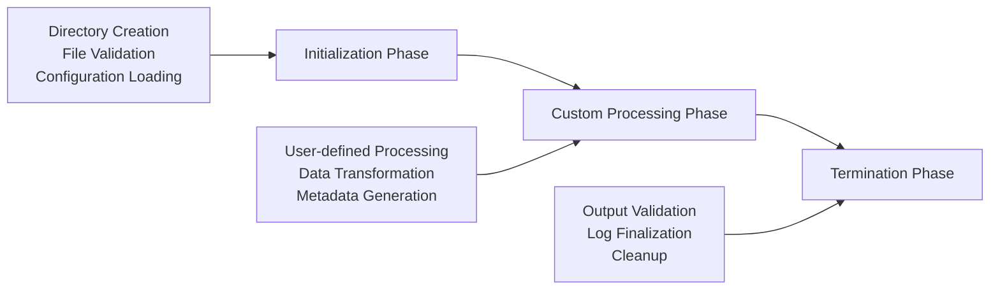
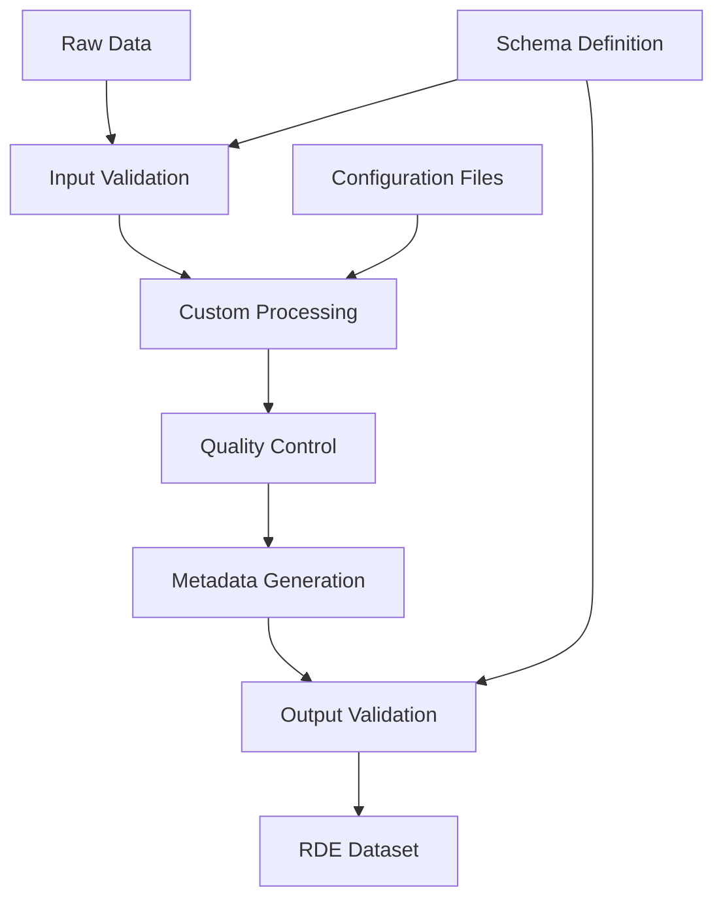

# What is Structuring Processing

## Purpose

This page explains the basic concepts and processing flow of RDE structuring processing. You will understand why structuring processing is necessary and how it works.

## Challenges and Background

Research data management faced the following challenges:

- **Data Format Diversity**: Different data formats across experimental instruments and research fields
- **Inconsistent Metadata**: Varying metadata description methods among researchers
- **Reproducibility Assurance**: Need for standardization and recording of data processing procedures
- **Quality Control**: Requirement for data consistency and validity verification

The concept of RDE structuring processing was created to address these challenges.

## Key Concepts

### Three Phases

RDE structuring processing consists of the following three phases:



#### 1. Initialization Phase

Preparation stage automatically executed by the system:

- **Directory Structure Creation**: Automatic generation of standard output directories
- **Input File Validation**: Format and consistency checking
- **Configuration Loading**: Application of processing modes and configuration parameters
- **Log System Initialization**: Start recording processing history

#### 2. Custom Processing Phase

Core processing stage defined by researchers:

- **Data Transformation**: Processing raw data according to research objectives
- **Quality Control**: Data validity verification and anomaly detection
- **Metadata Generation**: Recording information about processing results
- **Visualization**: Generation of graphs and charts

#### 3. Termination Phase

Completion stage automatically executed by the system:

- **Output Validation**: Consistency verification of generated files
- **Log Finalization**: Recording processing results and statistical information
- **Temporary File Cleanup**: Deletion of unnecessary files
- **Execution Result Reporting**: Success/failure determination and reporting

### Standard Directory Structure

Structured processing uses the following standard directory structure:

```shell
data/
├── inputdata/      # Input data (placed by researchers)
├── invoice/        # Invoice data (metadata)
├── tasksupport/    # Configuration files
├── raw/            # Copy of raw data
├── structured/     # Processed data
├── meta/           # Metadata files
├── main_image/     # Main display images
├── other_image/    # Other images
├── thumbnail/      # Thumbnail images
├── logs/           # Processing logs
└── temp/           # Temporary files
```

### Data Flow



### Processing Modes

RDEToolKit provides four processing modes according to data types and registration methods:

| Mode | Purpose | Features |
|------|---------|----------|
| **Invoice** | Standard single dataset registration | Most basic mode |
| **ExcelInvoice** | Batch registration of multiple datasets | Efficient registration via Excel files |
| **MultiDataTile** | Integrated management of related data | Managing multiple data tiles as one dataset |
| **RDEFormat** | Migration/mock creation of existing data | Registration of pre-structured data |

## Benefits and Effects

### Benefits for Researchers

- **Standardization**: Unified data formats and metadata
- **Reproducibility**: Recording and re-execution of processing procedures
- **Efficiency**: Time savings through automation
- **Quality Improvement**: Reliability assurance through validation features

### Benefits for Organizations

- **Data Management**: Unified data management system
- **Searchability**: Advanced search through structured metadata
- **Sharing**: Efficient sharing of standardized data
- **Long-term Preservation**: Sustainable data storage formats

## Summary

RDE structuring processing is a comprehensive framework for ensuring the quality and reproducibility of research data. Key features include:

- **Three-stage Processing Flow**: Clear separation of initialization, custom processing, and termination
- **Standardized Directory Structure**: Consistent data organization
- **Flexible Processing Modes**: Support for various research needs
- **Automation and Validation**: Reduction of human errors and quality assurance

## Next Steps

After understanding the concepts of structuring processing, refer to the following practical guides:

- Experience structuring processing with [Quick Start](../../quick-start.en.md)
- Learn details of each mode in [Processing Modes](../mode/mode.en.md)
- Check customization methods in [Configuration Files](../config/config.en.md)
- Learn troubleshooting in [Error Handling](errorhandling.en.md)
