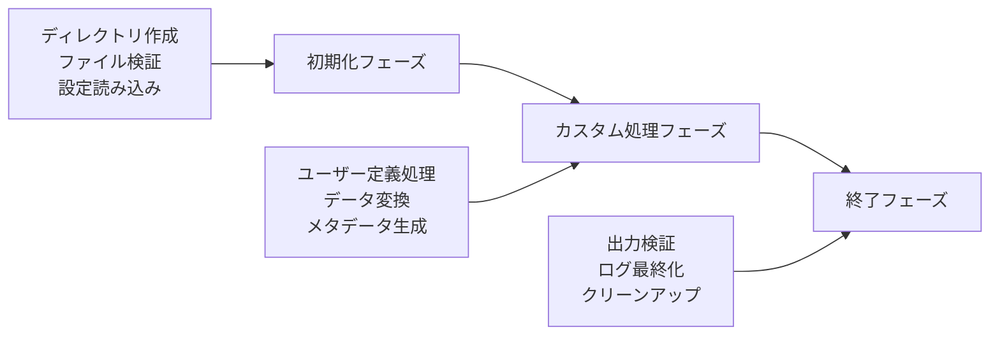
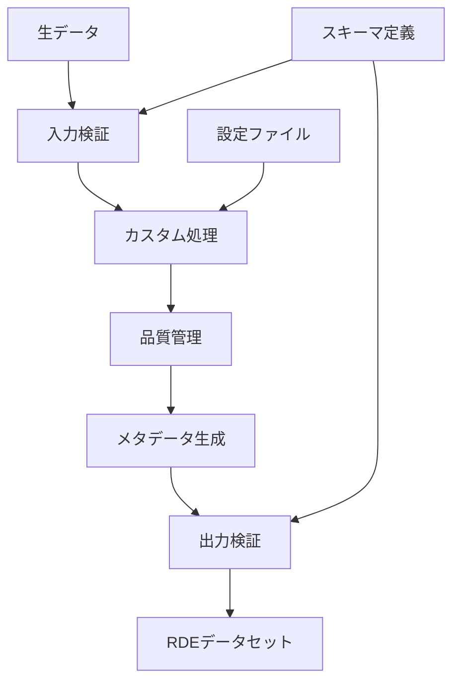

# 構造化処理とは

## 目的

RDE構造化処理の基本概念と処理フローについて説明します。なぜ構造化処理が必要なのか、どのような仕組みで動作するのかを理解できます。

## 課題と背景

研究データの管理において、以下のような課題がありました：

- **データ形式の多様性**: 実験装置や研究分野によって異なるデータ形式
- **メタデータの不統一**: 研究者ごとに異なるメタデータの記述方法
- **再現性の確保**: データ処理手順の標準化と記録の必要性
- **品質管理**: データの整合性と妥当性の検証

これらの課題を解決するために、RDE構造化処理という概念が生まれました。

## 主要コンセプト

### 3つのフェーズ

RDE構造化処理は、以下の3つのフェーズで構成されています：



#### 1. 初期化フェーズ

システムが自動的に実行する準備段階：

- **ディレクトリ構造の作成**: 標準的な出力ディレクトリを自動生成
- **入力ファイルの検証**: ファイル形式と整合性をチェック
- **設定の読み込み**: 処理モードと設定パラメータを適用
- **ログシステムの初期化**: 処理履歴の記録を開始

#### 2. カスタム処理フェーズ

研究者が定義する核心的な処理段階：

- **データ変換**: 生データを研究目的に応じて加工
- **品質管理**: データの妥当性検証と異常値検出
- **メタデータ生成**: 処理結果に関する情報を記録
- **可視化**: グラフや図表の生成

#### 3. 終了フェーズ

システムが自動的に実行する完了段階：

- **出力検証**: 生成されたファイルの整合性確認
- **ログの最終化**: 処理結果と統計情報の記録
- **一時ファイルのクリーンアップ**: 不要なファイルの削除
- **実行結果の報告**: 成功・失敗の判定と報告

### 標準ディレクトリ構造

構造化処理では、以下の標準ディレクトリ構造を使用します：

```shell
data/
├── inputdata/      # 入力データ（研究者が配置）
├── invoice/        # 送り状データ（メタデータ）
├── tasksupport/    # 設定ファイル群
├── raw/            # 生データのコピー
├── structured/     # 処理済みデータ
├── meta/           # メタデータファイル
├── main_image/     # メイン表示画像
├── other_image/    # その他の画像
├── thumbnail/      # サムネイル画像
├── logs/           # 処理ログ
└── temp/           # 一時ファイル
```

### データフロー



### 処理モード

RDEToolKitは、データの種類と登録方法に応じて4つの処理モードを提供します：

| モード | 用途 | 特徴 |
|--------|------|------|
| **Invoice** | 標準的な単一データセット登録 | 最も基本的なモード |
| **ExcelInvoice** | 複数データセットの一括登録 | Excelファイルによる効率的な登録 |
| **MultiDataTile** | 関連データの統合管理 | 複数のデータタイルを一つのデータセットとして管理 |
| **RDEFormat** | 既存データの移行・モック作成 | 事前に構造化されたデータの登録 |

## 利点と効果

### 研究者にとっての利点

- **標準化**: 統一されたデータ形式とメタデータ
- **再現性**: 処理手順の記録と再実行
- **効率性**: 自動化による作業時間の短縮
- **品質向上**: 検証機能による信頼性の確保

### 組織にとっての利点

- **データ管理**: 統一されたデータ管理システム
- **検索性**: 構造化されたメタデータによる高度な検索
- **共有**: 標準化されたデータの効率的な共有
- **長期保存**: 持続可能なデータ保存形式

## まとめ

RDE構造化処理は、研究データの品質と再現性を確保するための包括的なフレームワークです。主要な特徴は以下の通りです：

- **3段階の処理フロー**: 初期化、カスタム処理、終了の明確な分離
- **標準化されたディレクトリ構造**: 一貫したデータ組織化
- **柔軟な処理モード**: 様々な研究ニーズに対応
- **自動化と検証**: 人的エラーの削減と品質保証

## 次のステップ

構造化処理の概念を理解したら、以下の実践的なガイドを参照してください：

- [クイックスタート](../../quick-start.ja.md)で実際に構造化処理を体験する
- [処理モード](../mode/mode.ja.md)で各モードの詳細を学ぶ
- [設定ファイル](../config/config.ja.md)でカスタマイズ方法を確認する
- [エラーハンドリング](errorhandling.ja.md)でトラブルシューティングを学ぶ
