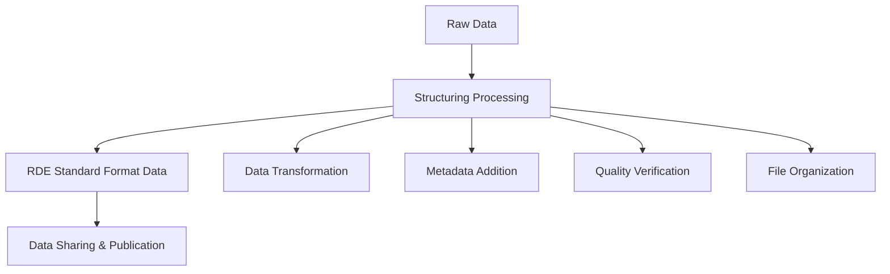
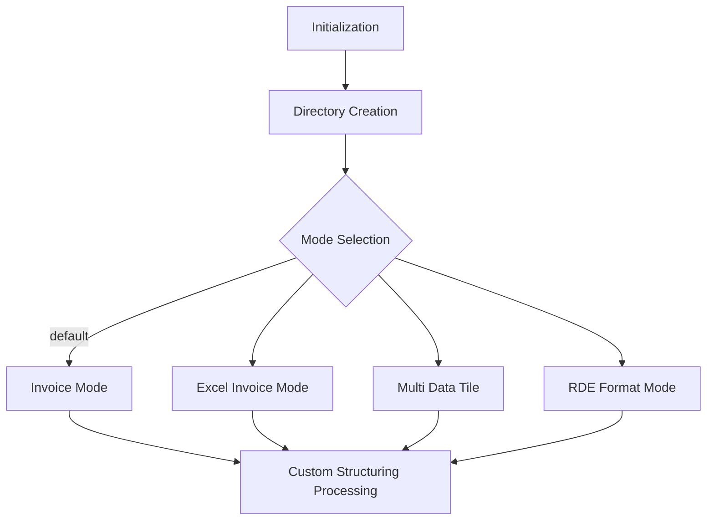
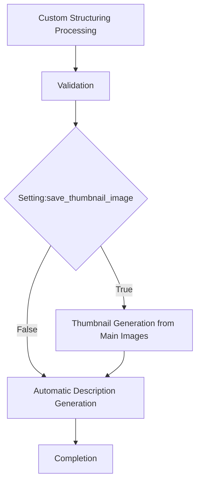

# What is Structuring Processing

## Purpose

This page provides a detailed explanation of "structuring processing," the core concept of RDEToolKit. By understanding the background, mechanisms, and implementation methods of structuring processing, you will be able to build effective data transformation workflows.

## Challenges and Background

### Research Data Management Challenges

Research activities faced several challenges in data management and sharing:

- **Format Diversity**: Different data formats across researchers and research fields
- **Metadata Inconsistency**: Inconsistent description methods and items
- **Process Personalization**: Data conversion procedures dependent on individuals
- **Reproducibility Difficulties**: Poor documentation and sharing of processing procedures

### Need for RDE (Research Data Express)

To solve these challenges, RDE was developed as a platform for managing and sharing research data in standardized formats. However, converting existing diverse data to RDE format was complex and time-consuming.

## Key Concepts

### Definition of Structuring Processing

**Structuring Processing** refers to a series of processes that convert research data to RDE standard format, add appropriate metadata, and make it ready for sharing.



### Three-Phase Workflow

RDEToolKit's structuring processing is executed in the following three phases:

#### 1. Initialization

- **Automatic Directory Structure Generation**: Folder structure compliant with RDE standards
- **Input Data Loading**: Automatic file format detection
- **Processing Mode Determination**: Mode selection based on data characteristics
- **Configuration File Analysis**: Loading of operation parameters



#### 2. Custom Structuring Processing

The stage where user-defined custom processing logic is executed:

- **Data Transformation**: Format conversion of research data
- **Analysis Processing**: Statistical analysis, visualization, machine learning
- **Metadata Extraction**: Automatic extraction from file information
- **Quality Check**: Data consistency verification

```python title="custom_processing_example.py"
def dataset(srcpaths: RdeInputDirPaths, resource_paths: RdeOutputResourcePath):
    # Load data
    data = load_research_data(srcpaths.inputdata)

    # Data transformation and analysis
    processed_data = analyze_data(data)

    # Save results
    save_results(processed_data, resource_paths.data)

    # Generate metadata
    generate_metadata(processed_data, resource_paths.tasksupport)
```

#### 3. Finalization

Verification of processing results and final file organization:

- **Validation**: Structure verification using JSON Schema
- **Thumbnail Generation**: Automatic creation of representative images
- **Metadata Description**: Automatic generation of dataset descriptions
- **File Organization**: Finalization of directory structure



## Directory Structure

Structured processing organizes outputs into a standardized directory tree. Review the [Directory Structure Guide](../usage/structured_process/directory.en.md) for naming conventions and layout details.

### Four Processing Modes

RDEToolKit provides four processing modes based on data characteristics and usage:

| Mode | Activation Condition | Features | Usage |
|------|---------------------|----------|-------|
| **Invoice Mode** | Default | Basic structuring processing | Single data file |
| **Excel Invoice Mode** | `*._excel_invoice.xlsx` file | Automatic Excel invoice processing | Excel format invoices |
| **Multi Data Tile** | `extended_mode: 'MultiDataTile'` | Batch processing, error skip | Multiple data files |
| **RDE Format Mode** | `extended_mode: 'rdeformat'` | Reprocessing of existing RDE data | RDE standard format |

### Custom Processing Function Implementation Patterns

In structuring processing, custom processing is implemented using the following patterns:

```python title="processing_patterns.py"
from rdetoolkit.models.rde2types import RdeInputDirPaths, RdeOutputResourcePath

def dataset(srcpaths: RdeInputDirPaths, resource_paths: RdeOutputResourcePath):
    """
    Standard structuring processing function

    Args:
        srcpaths: Input file path information
        resource_paths: Output resource path information
    """
    # 1. Validate input data
    validate_input_data(srcpaths)

    # 2. Execute data processing
    process_research_data(srcpaths, resource_paths)

    # 3. Save results
    save_processing_results(resource_paths)

    # 4. Generate metadata
    generate_metadata(resource_paths)
```

## Summary

Key values of structuring processing:

- **Automation**: Significant reduction of manual work
- **Standardization**: Unified conversion to RDE format
- **Quality Assurance**: Reliability through validation features
- **Extensibility**: Flexible response through custom processing
- **Reproducibility**: Documentation and sharing of processing procedures

### Important Points

- **Single Responsibility**: Each processing phase has clearly separated responsibilities
- **Configuration-Driven**: Flexible behavior control through configuration files
- **Error Handling**: Robust exception handling and log output
- **Testability**: Structure that enables unit testing

## Next Steps

To deepen your understanding of structuring processing:

1. [Configuration Files](config.en.md) - Details of processing modes and behavior settings
2. [CLI Tools](../usage/cli.en.md) - Detailed command line operations
3. [Validation](../usage/validation.en.md) - Data quality verification methods
4. [API Reference](../api/index.en.md) - Check all available features
