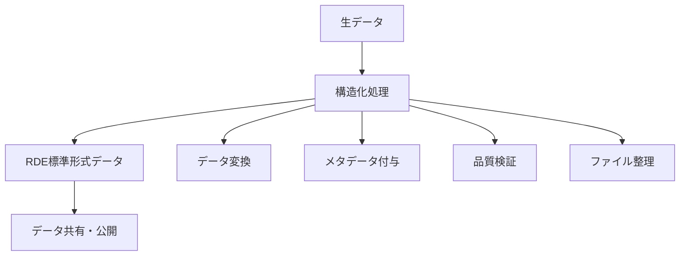
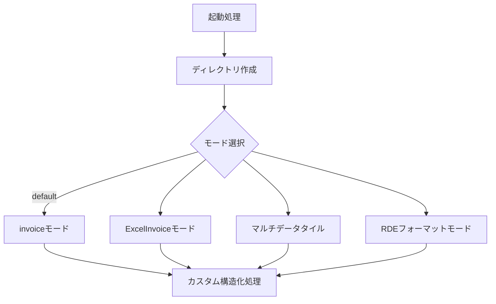
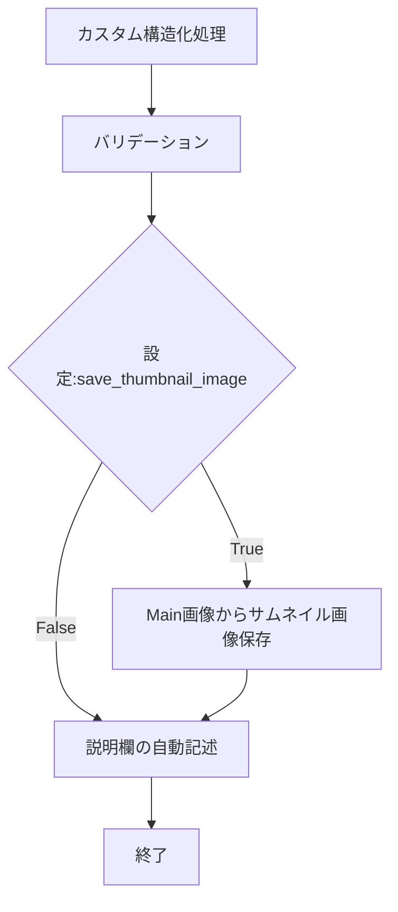

# 構造化処理とは

## 目的

このページでは、RDEToolKitの中核概念である「構造化処理」について詳しく説明します。構造化処理の背景、仕組み、および実装方法を理解することで、効果的なデータ変換ワークフローを構築できるようになります。

## 課題と背景

### 研究データ管理の課題

研究活動において、データの管理と共有には以下のような課題がありました：

- **形式の多様性**: 研究者や研究分野ごとに異なるデータ形式
- **メタデータの不統一**: 一貫性のない記述方法と項目
- **処理の属人化**: 個人に依存したデータ変換手順
- **再現性の困難**: 処理過程の記録と共有の不備

### RDE（Research Data Express）の必要性

これらの課題を解決するため、研究データを標準化された形式で管理・共有するプラットフォームとしてRDEが開発されました。しかし、既存の多様なデータをRDE形式に変換する作業は複雑で時間がかかる問題がありました。

## 主要コンセプト

### 構造化処理の定義

**構造化処理**とは、研究データをRDE標準形式に変換し、適切なメタデータを付与して、共有可能な状態にする一連の処理のことです。



### 3段階のワークフロー

RDEToolKitの構造化処理は、以下の3つのフェーズで実行されます：

#### 1. 起動処理（Initialization）

- **ディレクトリ構造の自動生成**: RDE標準に準拠したフォルダ構成
- **入力データの読み込み**: ファイル形式の自動判定
- **処理モードの決定**: データ特性に応じたモード選択
- **設定ファイルの解析**: 動作パラメータの読み込み



#### 2. カスタム構造化処理（Custom Processing）

ユーザーが定義する独自の処理ロジックが実行される段階です：

- **データ変換**: 研究データの形式変換
- **解析処理**: 統計解析、可視化、機械学習
- **メタデータ抽出**: ファイル情報からの自動抽出
- **品質チェック**: データ整合性の確認

```python title="custom_processing_example.py"
def dataset(srcpaths: RdeInputDirPaths, resource_paths: RdeOutputResourcePath):
    # データ読み込み
    data = load_research_data(srcpaths.inputdata)

    # データ変換・解析
    processed_data = analyze_data(data)

    # 結果保存
    save_results(processed_data, resource_paths.data)

    # メタデータ生成
    generate_metadata(processed_data, resource_paths.tasksupport)
```

#### 3. 終了処理（Finalization）

処理結果の検証と最終的なファイル整理を行います：

- **バリデーション**: JSON Schema による構造検証
- **サムネイル生成**: 代表画像の自動作成
- **メタデータ記述**: データセット説明の自動生成
- **ファイル整理**: 最終的なディレクトリ構成の確定



## ディレクトリ構造

構造化処理は標準化されたディレクトリツリーを前提としています。命名規則や構造の詳細は[ディレクトリ構造ガイド](../usage/structured_process/directory.ja.md)を参照してください。

### 4つの処理モード

RDEToolKitは、データの特性と用途に応じて4つの処理モードを提供します：

| モード | 起動条件 | 特徴 | 用途 |
|--------|----------|------|------|
| **invoiceモード** | デフォルト | 基本的な構造化処理 | 単一データファイル |
| **ExcelInvoiceモード** | `*._excel_invoice.xlsx`ファイル | Excel送り状の自動処理 | Excel形式の送り状 |
| **マルチデータタイル** | `extended_mode: 'MultiDataTile'` | 一括処理、エラースキップ | 複数データファイル |
| **RDEフォーマットモード** | `extended_mode: 'rdeformat'` | 既存RDEデータの再処理 | RDE標準形式 |

### カスタム処理関数の実装パターン

構造化処理では、以下のパターンでカスタム処理を実装します：

```python title="processing_patterns.py"
from rdetoolkit.models.rde2types import RdeInputDirPaths, RdeOutputResourcePath

def dataset(srcpaths: RdeInputDirPaths, resource_paths: RdeOutputResourcePath):
    """
    標準的な構造化処理関数

    Args:
        srcpaths: 入力ファイルのパス情報
        resource_paths: 出力リソースのパス情報
    """
    # 1. 入力データの確認
    validate_input_data(srcpaths)

    # 2. データ処理の実行
    process_research_data(srcpaths, resource_paths)

    # 3. 結果の保存
    save_processing_results(resource_paths)

    # 4. メタデータの生成
    generate_metadata(resource_paths)
```

## まとめ

構造化処理の主要な価値：

- **自動化**: 手動作業の大幅な削減
- **標準化**: RDE形式への統一的な変換
- **品質保証**: バリデーション機能による信頼性確保
- **拡張性**: カスタム処理による柔軟な対応
- **再現性**: 処理手順の文書化と共有

### 重要なポイント

- **1つの責任**: 各処理フェーズは明確に分離された責任を持つ
- **設定駆動**: 設定ファイルによる柔軟な動作制御
- **エラーハンドリング**: 堅牢な例外処理とログ出力
- **テスタビリティ**: 単体テストが可能な構造

## 次のステップ

構造化処理の理解を深めるには：

1. [設定ファイル](config.ja.md) - 処理モードと動作設定の詳細
2. [CLIツール](../usage/cli.ja.md) - コマンドライン操作の詳細
3. [バリデーション](../usage/validation.ja.md) - データ品質の検証方法
4. [API リファレンス](../api/index.ja.md) - 利用可能な全機能の確認
