# Relia

<div align="center">

**The "ESLint" for Cloud Costs.**
Prevent cloud waste before it ships to production.

[](https://opensource.org/licenses/Apache-2.0)
[](https://www.python.org/downloads/)
[](https://github.com/psf/black)

[Features](#-features) • [How It Works](#-how-it-works) • [Quick Start](#-quick-start) • [Roadmap](#-roadmap)

</div>

---

## ⚡ Problem: The "Bill Shock" Loop

Every engineering team knows the ritual:
1.  Engineer deploys a change (e.g., upsizing an RDS instance).
2.  CI/CD passes (tests pass, build succeeds).
3.  **30 days later**: Finance asks why the AWS bill jumped by $5,000.

Existing tools (CloudHealth, Vantage) are **reactive**. They tell you *after* you've wasted the money.

## 🛡️ Solution: Shift Left

**Relia** sits in your Pull Request. It parses your Terraform/Pulumi changes, estimates the monthly cost impact, and blocks the merge if you blow your budget.

> **Tagline**: *"Stop paying the infrastructure tax. Start shipping."*

---

## 🧩 How It Works

Relia runs as a CLI tool in your local environment or CI pipeline to minimize the feedback loop. See [ARCHITECTURE.md](ARCHITECTURE.md) for details.

```mermaid
flowchart LR
    A[Engineer] -->|`git push`| B(Pull Request)
    B --> C{Relia CI Check}

    subgraph "Relia Engine"
    D[Parser] -->|1. Read .tf files| E[Estimator]
    E -->|2. Fetch Prices| F[AWS Pricing API]
    F -->|3. Calculate Delta| G[Budget Policy]
    end

    C -->|Run| D

    G -->|Over Budget ❌| H[Block Merge]
    G -->|Under Budget ✅| I[Allow Merge]

    style H fill:#ffcccb,stroke:#ff0000
    style I fill:#ccffcc,stroke:#00ff00
```



---

## ✨ Features

### 1. Pre-Deploy Cost Estimation
Know exactly what a PR will cost **before** you click merge. Supports EC2, RDS, Lambda, NAT Gateways, and more.
👉 **[See Full List of Supported Resources](docs/supported_resources.md)**

Supports both standard `.tf` files and `terraform plan -json` output:

```bash
# Standard Estimate
$ relia estimate
📊 Relia Cost Estimate ...
```

```bash
# View as JSON for pipeline parsing
relia estimate . --format json | jq .total_cost
```

```text
📊 Relia Cost Estimate ...

# With Visual Topology
$ relia estimate --topology
🌳 Infrastructure Topology
☁️  Project
└── aws_instance
    └── 💻 web  $60.00/mo

# With Cost Diff
$ relia estimate --diff
📉 Cost Diff
+ aws_instance.web  +$60.00/mo
```

### 2. Budget Guardrails
Set clear policies in `.relia.yaml` and enforce them with `relia check`.

```yaml
# .relia.yaml
budget: 500.0
rules:
  aws_instance: 50.0 # Max price per instance
```

```bash
$ relia check --budget 500
✅ Within budget. Total: $450.00, Limit: $500.00
```

### 3. CI/CD Integration
Relia ships with a GitHub Action to block expensive PRs automatically.

---

## 🚀 Quick Start

### 1. Installation

Relia is available via PyPI (and Poetry):
```bash
pip install relia
# or
poetry add relia
```

### 2. Run Locally

Navigate to your Terraform project and run:

1. **Initialize Config** (Optional):
   ```bash
   relia init
   # Creates .relia.yaml (budget/rules) & .relia.usage.yaml (usage overlay)
   ```

2. **Estimate Cost**:
   ```bash
   relia estimate .
   ```

3. **Check Budget**:
   ```bash
   relia check . --budget 1000

   # Or using config rules:
   relia check .

   # Simulate check (exit 0 even if failure):
   relia check . --dry-run
   ```

### 3. Run with Docker

You can also run Relia without installing Python:

```bash
docker run --rm -v $(pwd):/app relia-io/relia estimate .
```

### Advanced Usage

#### Handling Complex Variables & Modules
For complex projects using variables, locals, or modules, Relia supports Terraform Plan JSON output.
1. Generate the plan JSON:
   ```bash
   terraform plan -out=tfplan
   terraform show -json tfplan > plan.json
   ```
2. Estimate costs using the JSON plan:
   ```bash
   relia estimate plan.json
   ```

#### Usage Assumptions (S3, Lambda, etc.)
Some resources (like S3 or Lambda) depend on usage metrics not present in Terraform. You can define these in `.relia.usage.yaml`:

**Example `.relia.usage.yaml`:**
```yaml
usage:
  aws_s3_bucket.my_bucket:
    storage_gb: 500
    monthly_requests: 10000
```

Relia will automatically load this file and apply the usage data (e.g., 500GB of storage) when calculating costs.

### 4. Use as Pre-Commit Hook

Prevent bad commits locally by adding Relia to your `.pre-commit-config.yaml`:

```yaml
repos:
  - repo: https://github.com/davidahmann/relia_oss
    rev: v1.0.1
    hooks:
      - id: relia-estimate # Prints cost table on every commit
      - id: relia-check    # Blocks commit if budget exceeded
```

## Maintenance

### Updating the Bundled Pricing Database
Relia ships with a lightweight, bundled pricing database (SQLite) for offline usage. To update this database with new mocked values or seed data:

1. Ensure you have AWS credentials configured.
2. Run the script to fetch fresh prices from AWS (US/EU regions):
   ```bash
   python scripts/seed_pricing.py
   ```
3. Commit the updated `relia/core/bundled_pricing.db`.

### 5. Add to CI/CD

Add Relia to your GitHub Actions workflow to block expensive PRs.

```yaml
# .github/workflows/cost-check.yml
name: Cost Check
on: [pull_request]
jobs:
  relia:
    runs-on: ubuntu-latest
    steps:
      - uses: actions/checkout@v3
      - uses: relia-io/action@v1
        with:
          path: './infra'
          budget: '1000'
          markdown_report: 'relia_report.md'
```

---

## 🗺️ Roadmap

- [x] **Phase 1 (MVP)**: CLI, Terraform Support, AWS Pricing.
- [x] **Phase 2**: GitHub Action, Budget Policies via `.relia.yml`.
- [x] **Phase 3 (v0.3.0)**: Lambda/NAT/LB Support, Usage Overlays.
- [ ] **Phase 4**: Utilization Scanning ("Fix" Mode).

---

## 🤝 Contributing

We love contributions! Please check out [CONTRIBUTING.md](CONTRIBUTING.md) to get started.

## 📄 License

This project is licensed under the [Apache 2.0 License](LICENSE).
