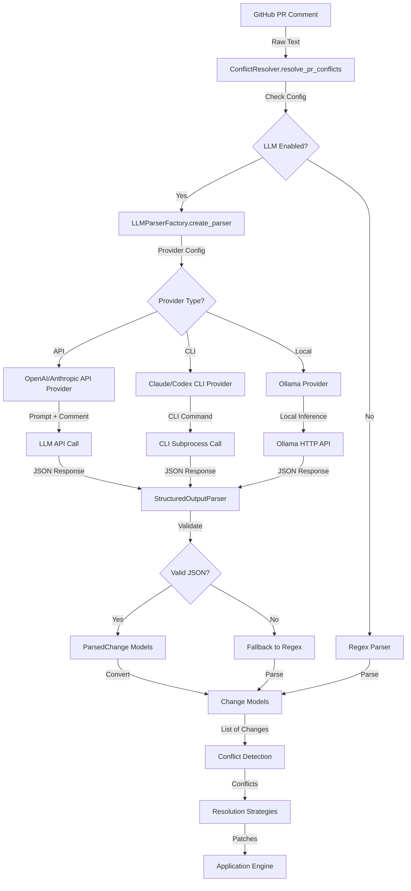

# LLM-First Architecture Specification

**Document Version**: 1.0
**Last Updated**: 2025-11-06
**Status**: Draft

## Related Documents

* [LLM Refactor Roadmap](./LLM_REFACTOR_ROADMAP.md)
* [Main Roadmap](./ROADMAP.md)
* [Migration Guide](./MIGRATION_GUIDE.md)

---

## Table of Contents

1. [Executive Summary](#1-executive-summary)
2. [System Architecture Overview](#2-system-architecture-overview)
3. [Module Structure](#3-module-structure)
4. [Data Flow Architecture](#4-data-flow-architecture)
5. [Provider Abstraction Layer](#5-provider-abstraction-layer)
6. [Core Data Models](#6-core-data-models)
7. [Integration Points](#7-integration-points)
8. [Provider Comparison Matrix](#8-provider-comparison-matrix)
9. [Configuration Architecture](#9-configuration-architecture)
10. [Backward Compatibility Strategy](#10-backward-compatibility-strategy)
11. [Error Handling & Fallback Strategy](#11-error-handling--fallback-strategy)
12. [Security Architecture](#12-security-architecture)
13. [Performance & Optimization](#13-performance--optimization)
14. [Testing Strategy](#14-testing-strategy)
15. [Deployment Considerations](#15-deployment-considerations)

---

## 1. Executive Summary

### 1.1 Architecture Vision

The LLM-First Architecture transforms the Review Bot Automator from a regex-based suggestion parser to an intelligent, multi-format parsing system powered by Large Language Models. This architecture enables:

* **Universal Format Support**: Parse all CodeRabbit comment formats (diff blocks, natural language, suggestions, multi-options)
* **Provider Flexibility**: Support multiple LLM providers (APIs, CLIs, local models) with user-driven selection
* **Graceful Degradation**: Automatic fallback from LLM → regex if parsing fails
* **Zero Breaking Changes**: Backward compatible with v1.x through feature flags and default values

### 1.2 Key Architectural Principles

1. **User Choice Over Prescription**: Users select their preferred LLM provider; no forced hierarchy
2. **Feature Flag Pattern**: LLM parsing disabled by default; opt-in via configuration
3. **Separation of Concerns**: Provider abstraction isolates LLM integration from core logic
4. **Fail-Safe Design**: Multiple fallback layers ensure system never breaks
5. **Data Immutability**: All new fields are optional with safe defaults
6. **Progressive Enhancement**: New capabilities don't disrupt existing workflows

### 1.3 Architecture Goals

| Goal | Success Criteria |
| ------ | ----------------- |
| **Format Coverage** | Parse 95%+ of CodeRabbit comments (up from 20%) |
| **Provider Support** | 5+ providers (OpenAI API, Anthropic API, Claude CLI, Codex CLI, Ollama) |
| **Backward Compatibility** | 100% of v1.x code works without changes |
| **Reliability** | <1% failure rate with fallback system |
| **Performance** | <2s average parsing time per comment |
| **Cost Efficiency** | 50-90% cost reduction through caching |

---

## 2. System Architecture Overview

### 2.1 High-Level Architecture Diagram

```text
┌─────────────────────────────────────────────────────────────────────────────┐
│                          GitHub PR Comments (Input)                         │
│         (Diff blocks, Suggestions, Natural Language, Multi-Options)        │
└────────────────────────────────┬────────────────────────────────────────────┘
                                 │
                                 ▼
┌─────────────────────────────────────────────────────────────────────────────┐
│                     Comment Fetcher (GitHub API Client)                     │
│                   • Fetch raw comment bodies                                │
│                   • Extract metadata (author, URL, timestamp)               │
└────────────────────────────────┬────────────────────────────────────────────┘
                                 │
                                 ▼
┌─────────────────────────────────────────────────────────────────────────────┐
│                         Parsing Orchestrator                                │
│                   • Check LLM feature flag                                  │
│                   • Route to LLM parser or regex parser                     │
│                   • Handle fallback on failure                              │
└───────────┬─────────────────────────────────────────────┬───────────────────┘
            │                                             │
            ▼                                             ▼
┌───────────────────────────────┐         ┌─────────────────────────────────┐
│     LLM Parser (Primary)      │         │   Regex Parser (Fallback)       │
│  • Provider abstraction       │         │   • ```suggestion blocks        │
│  • Structured output parsing  │         │   • Legacy format support       │
│  • Multi-format support       │         │   • Fast, zero-cost             │
│  • Confidence scoring         │         │   • 100% reliable               │
└───────────┬───────────────────┘         └─────────────┬───────────────────┘
            │                                           │
            └─────────────┬─────────────────────────────┘
                          │
                          ▼
┌─────────────────────────────────────────────────────────────────────────────┐
│                      Change Model Validator                                 │
│                   • Validate parsed changes                                 │
│                   • Convert to internal Change model                        │
│                   • Add metadata (fingerprint, file_type)                   │
└────────────────────────────────┬────────────────────────────────────────────┘
                                 │
                                 ▼
┌─────────────────────────────────────────────────────────────────────────────┐
│                    Conflict Detection Engine                                │
│                   • Group changes by file/line                              │
│                   • Detect overlaps and conflicts                           │
│                   • Assign conflict severity                                │
└────────────────────────────────┬────────────────────────────────────────────┘
                                 │
                                 ▼
┌─────────────────────────────────────────────────────────────────────────────┐
│                    Resolution Strategy Selector                             │
│                   • Apply priority system                                   │
│                   • Execute semantic merging                                │
│                   • Generate patches                                        │
└────────────────────────────────┬────────────────────────────────────────────┘
                                 │
                                 ▼
┌─────────────────────────────────────────────────────────────────────────────┐
│                         Application Engine                                  │
│                   • Apply patches to files                                  │
│                   • Rollback on failure                                     │
│                   • Generate reports                                        │
└─────────────────────────────────────────────────────────────────────────────┘

```

### 2.2 Layer Architecture

```text
┌────────────────────────────────────────────────────────────────┐
│                    Layer 1: API/CLI Interface                  │
│  • pr-resolve CLI commands                                     │
│  • Python API (ConflictResolver class)                         │
│  • Configuration loading                                       │
└────────────────────────────────┬───────────────────────────────┘
                                 │
┌────────────────────────────────┴───────────────────────────────┐
│                  Layer 2: Orchestration Layer                  │
│  • ConflictResolver.resolve_pr_conflicts()                     │
│  • Comment fetching coordination                               │
│  • Parsing strategy selection                                  │
│  • Result aggregation                                          │
└────────────────────────────────┬───────────────────────────────┘
                                 │
┌────────────────────────────────┴───────────────────────────────┐
│                  Layer 3: Parsing Layer (NEW)                  │
│  • LLMParserFactory (provider selection)                       │
│  • Provider implementations (OpenAI, Anthropic, CLI, Ollama)   │
│  • Structured output parsing                                   │
│  • Fallback handling                                           │
└────────────────────────────────┬───────────────────────────────┘
                                 │
┌────────────────────────────────┴───────────────────────────────┐
│                Layer 4: Core Logic Layer (STABLE)              │
│  • Change model validation                                     │
│  • Conflict detection                                          │
│  • Resolution strategies                                       │
│  • File handlers (JSON, YAML, TOML)                           │
└────────────────────────────────┬───────────────────────────────┘
                                 │
┌────────────────────────────────┴───────────────────────────────┐
│              Layer 5: Infrastructure Layer (STABLE)            │
│  • GitHub API client                                           │
│  • File I/O operations                                         │
│  • Git operations (rollback)                                   │
│  • Logging and metrics                                         │
└────────────────────────────────────────────────────────────────┘

```

#### Layer Dependencies

* Layer 1 → Layer 2 (CLI calls orchestration)
* Layer 2 → Layer 3 (Orchestration calls parsing)
* Layer 3 → Layer 4 (Parsing produces Change models for conflict detection)
* Layer 4 → Layer 5 (Core logic uses infrastructure services)
* **NEW**: Layer 3 is the primary addition; Layers 4-5 remain mostly unchanged

---

## 3. Module Structure

### 3.1 Current Module Hierarchy (v1.x)

```text
src/review_bot_automator/
├── __init__.py
├── cli/
│   ├── __init__.py
│   └── main.py                    # CLI entry point
├── core/
│   ├── __init__.py
│   ├── models.py                  # Data models (Change, ChangeMetadata)
│   ├── resolver.py                # ConflictResolver class
│   ├── conflict_detector.py       # Conflict detection logic
│   └── resolution_strategies.py   # Priority/semantic resolution
├── handlers/
│   ├── __init__.py
│   ├── base.py                    # Base file handler
│   ├── json_handler.py
│   ├── yaml_handler.py
│   └── toml_handler.py
├── integrations/
│   ├── __init__.py
│   └── github.py                  # GitHub API client
├── config/
│   ├── __init__.py
│   └── settings.py                # Configuration presets
└── utils/
    ├── __init__.py
    ├── logging.py
    └── metrics.py

```

### 3.2 New Module Hierarchy (v2.0)

```text
src/review_bot_automator/
├── __init__.py
├── cli/
│   ├── __init__.py
│   └── main.py                    # ✏️ MODIFIED: Add --llm flags
├── core/
│   ├── __init__.py
│   ├── models.py                  # ✏️ MODIFIED: Add LLM metadata fields
│   ├── resolver.py                # ✏️ MODIFIED: Add LLM parsing path
│   ├── conflict_detector.py       # ✅ NO CHANGE
│   └── resolution_strategies.py   # ✅ NO CHANGE
├── handlers/
│   ├── __init__.py
│   ├── base.py                    # ✅ NO CHANGE
│   ├── json_handler.py            # ✅ NO CHANGE
│   ├── yaml_handler.py            # ✅ NO CHANGE
│   └── toml_handler.py            # ✅ NO CHANGE
├── integrations/
│   ├── __init__.py
│   └── github.py                  # ✏️ MODIFIED: Store raw comment text
├── config/
│   ├── __init__.py
│   └── settings.py                # ✏️ MODIFIED: Add LLM config presets
├── llm/                           # 🆕 NEW MODULE
│   ├── __init__.py
│   ├── base.py                    # Abstract LLMParser interface
│   ├── factory.py                 # LLMParserFactory (provider selection)
│   ├── providers/
│   │   ├── __init__.py
│   │   ├── openai_api.py          # OpenAI API provider
│   │   ├── anthropic_api.py       # Anthropic API provider
│   │   ├── claude_cli.py          # Claude Code CLI provider
│   │   ├── codex_cli.py           # Codex CLI provider
│   │   └── ollama.py              # Ollama local provider
│   ├── prompts/
│   │   ├── __init__.py
│   │   ├── base_prompt.py         # Base prompt template
│   │   └── format_examples.py     # Few-shot examples
│   ├── parsers/
│   │   ├── __init__.py
│   │   └── structured_output.py   # Pydantic output models
│   └── cache/
│       ├── __init__.py
│       └── prompt_cache.py        # Caching implementation
└── utils/
    ├── __init__.py
    ├── logging.py                 # ✅ NO CHANGE
    └── metrics.py                 # ✏️ MODIFIED: Add LLM metrics

```

#### Legend

* ✅ **NO CHANGE**: Module remains unchanged
* ✏️ **MODIFIED**: Module receives minor additions (backward compatible)
* 🆕 **NEW**: New module added

#### Change Summary

* **7 existing files** remain unchanged (44% of codebase)
* **6 existing files** receive minor modifications (37% of codebase)
* **12 new files** added in `llm/` module (new 19% of codebase)
* **Total**: 44% unchanged, 37% modified, 19% new

---

## 4. Data Flow Architecture

### 4.1 LLM Parsing Data Flow (Detailed)



### 4.2 Step-by-Step Data Transformation

#### Step 1: Input (GitHub Comment)

```python
# Raw GitHub comment text
comment_text = """
#### Suggestion: Improve error handling

```diff

* raise Exception("Error")
+ raise ValueError("Invalid input: {input}")

```text

This change improves error specificity.
"""

```

#### Step 2: LLM Provider Selection

```python
# Configuration drives provider selection
config = {
    "llm": {
        "enabled": True,
        "provider": "claude-cli",
        "model": "claude-sonnet-4-5"
    }
}

# Factory creates appropriate provider
parser = LLMParserFactory.create_parser(config)
# Returns: ClaudeCodeCLIProvider instance

```

#### Step 3: Prompt Construction

```python
# Provider constructs prompt with few-shot examples
prompt = """
You are a code change parser for GitHub PR comments. Extract structured change information.

## Input Format
GitHub comment body (markdown, may contain diff blocks, natural language, or suggestion blocks)

## Output Format (JSON)
{
  "changes": [
    {
      "file_path": "path/to/file.py",
      "start_line": 10,
      "end_line": 12,
      "new_content": "new code here",
      "change_type": "modification",
      "confidence": 0.95,
      "rationale": "Why this change is suggested",
      "risk_level": "low"
    }
  ]
}

## Example 1: Diff Block
Comment:

```diff

* old_function()
+ new_function()

```text

Output:
{"changes": [{"file_path": null, "start_line": 1, "end_line": 1, ...}]}

## Task
Parse this comment:

{comment_text}
"""

```

#### Step 4: LLM Inference

```python
# Provider executes inference (example: Claude CLI)
response = subprocess.run(
    ["claude", "prompt", "--no-stream", "--format", "json"],
    input=prompt,
    capture_output=True,
    text=True
)

# Response (JSON string)
llm_output = response.stdout

```

#### Step 5: Structured Output Parsing

```python
# Parse JSON into Pydantic models
from llm.parsers.structured_output import LLMParseResponse, ParsedChange

parsed = LLMParseResponse.model_validate_json(llm_output)

# Result
parsed.changes = [
    ParsedChange(
        file_path="src/module.py",
        start_line=42,
        end_line=42,
        new_content='raise ValueError("Invalid input: {input}")',
        change_type="modification",
        confidence=0.95,
        rationale="Improves error specificity",
        risk_level="low"
    )
]

```

#### Step 6: Conversion to Internal Models

```python
# Convert ParsedChange → Change
from core.models import Change, ChangeMetadata

changes = []
for parsed_change in parsed.changes:
    change = Change(
        path=parsed_change.file_path or "unknown",
        start_line=parsed_change.start_line,
        end_line=parsed_change.end_line,
        content=parsed_change.new_content,
        metadata=ChangeMetadata(
            url=comment_url,
            author="coderabbitai[bot]",
            source="llm",
            option_label=None
        ),
        fingerprint=compute_fingerprint(parsed_change),
        file_type=detect_file_type(parsed_change.file_path),
        # NEW: LLM metadata fields
        llm_confidence=parsed_change.confidence,
        llm_provider="claude-cli",
        parsing_method="llm",
        change_rationale=parsed_change.rationale,
        risk_level=parsed_change.risk_level
    )
    changes.append(change)

```

#### Step 7: Conflict Detection (Unchanged)

```python
# Existing conflict detection logic works with new Change models
conflicts = detector.detect_conflicts(changes)
# Returns: List[Conflict] (existing data structure)

```

---

## 5. Provider Abstraction Layer

### 5.1 Abstract Base Class

```python
# src/review_bot_automator/llm/base.py

from abc import ABC, abstractmethod
from dataclasses import dataclass
from typing import Protocol

@dataclass(frozen=True, slots=True)
class ParsedChange:
    """Structured output from LLM parser."""
    file_path: str | None  # None if context missing
    start_line: int
    end_line: int
    new_content: str
    change_type: str  # "addition", "modification", "deletion"
    confidence: float  # 0.0-1.0
    rationale: str
    risk_level: str = "low"  # "low", "medium", "high"

@dataclass(frozen=True, slots=True)
class LLMParseResponse:
    """Full response from LLM parser."""
    changes: list[ParsedChange]
    parsing_method: str  # "llm" or "fallback"
    provider_name: str  # "openai-api", "claude-cli", etc.
    model_name: str  # "gpt-5-mini", "claude-sonnet-4-5", etc.
    total_tokens: int | None = None
    cost_usd: float | None = None

class LLMParser(ABC):
    """Abstract interface for LLM-based comment parsing."""

    @abstractmethod
    def parse_comment(
        self,
        comment_body: str,
        file_path: str | None = None,
        context: dict[str, object] | None = None
    ) -> LLMParseResponse:
        """
        Parse a GitHub PR comment using LLM.

        Args:
            comment_body: Raw comment text (markdown)
            file_path: Optional file context for the comment
            context: Optional additional context (PR metadata, etc.)

        Returns:
            LLMParseResponse with parsed changes

        Raises:
            LLMParseError: If parsing fails and no fallback available
        """
        ...

    @abstractmethod
    def validate_provider(self) -> bool:
        """
        Check if provider is available and configured.

        Returns:
            True if provider is ready to use
        """
        ...

    @property
    @abstractmethod
    def provider_name(self) -> str:
        """Provider identifier (e.g., 'openai-api', 'claude-cli')."""
        ...

    @property
    @abstractmethod
    def supports_streaming(self) -> bool:
        """Whether provider supports streaming responses."""
        ...

```

### 5.2 Provider Implementations

#### 5.2.1 OpenAI API Provider

```python
# src/review_bot_automator/llm/providers/openai_api.py

from openai import OpenAI
from llm.base import LLMParser, LLMParseResponse, ParsedChange
from llm.parsers.structured_output import parse_llm_json_response
from llm.prompts.base_prompt import construct_parsing_prompt

class OpenAIAPIProvider(LLMParser):
    """OpenAI API provider (gpt-5, gpt-5-mini, gpt-5-nano)."""

    def __init__(
        self,
        api_key: str,
        model: str = "gpt-5-mini",
        temperature: float = 0.2,
        max_tokens: int = 2000
    ):
        self.client = OpenAI(api_key=api_key)
        self.model = model
        self.temperature = temperature
        self.max_tokens = max_tokens

    def parse_comment(
        self,
        comment_body: str,
        file_path: str | None = None,
        context: dict[str, object] | None = None
    ) -> LLMParseResponse:
        """Parse comment using OpenAI API."""

        # Construct prompt with few-shot examples
        prompt = construct_parsing_prompt(
            comment_body=comment_body,
            file_path=file_path,
            context=context
        )

        # Call OpenAI API with structured output
        response = self.client.chat.completions.create(
            model=self.model,
            messages=[
                {"role": "system", "content": "You are a code change parser."},
                {"role": "user", "content": prompt}
            ],
            temperature=self.temperature,
            max_tokens=self.max_tokens,
            response_format={"type": "json_object"}  # Force JSON output
        )

        # Parse JSON response
        json_text = response.choices[0].message.content
        changes = parse_llm_json_response(json_text)

        return LLMParseResponse(
            changes=changes,
            parsing_method="llm",
            provider_name=self.provider_name,
            model_name=self.model,
            total_tokens=response.usage.total_tokens,
            cost_usd=self._calculate_cost(response.usage)
        )

    def validate_provider(self) -> bool:
        """Check if OpenAI API is accessible."""
        try:
            self.client.models.retrieve(self.model)
            return True
        except Exception:
            return False

    @property
    def provider_name(self) -> str:
        return "openai-api"

    @property
    def supports_streaming(self) -> bool:
        return True

    def _calculate_cost(self, usage) -> float:
        """Calculate cost based on token usage."""
        # GPT-5 Mini pricing (example: $0.10/1M input, $0.40/1M output)
        input_cost = (usage.prompt_tokens / 1_000_000) * 0.10
        output_cost = (usage.completion_tokens / 1_000_000) * 0.40
        return input_cost + output_cost

```

#### 5.2.2 Claude Code CLI Provider

```python
# src/review_bot_automator/llm/providers/claude_cli.py

import subprocess
import json
from llm.base import LLMParser, LLMParseResponse
from llm.prompts.base_prompt import construct_parsing_prompt
from llm.parsers.structured_output import parse_llm_json_response

class ClaudeCodeCLIProvider(LLMParser):
    """Claude Code CLI provider (claude.ai subscription)."""

    def __init__(
        self,
        model: str = "claude-sonnet-4-5",
        cli_path: str = "claude"
    ):
        self.model = model
        self.cli_path = cli_path

    def parse_comment(
        self,
        comment_body: str,
        file_path: str | None = None,
        context: dict[str, object] | None = None
    ) -> LLMParseResponse:
        """Parse comment using Claude Code CLI."""

        # Construct prompt
        prompt = construct_parsing_prompt(
            comment_body=comment_body,
            file_path=file_path,
            context=context
        )

        # Execute CLI command
        result = subprocess.run(
            [
                self.cli_path,
                "prompt",
                "--model", self.model,
                "--no-stream",
                "--format", "json"
            ],
            input=prompt,
            capture_output=True,
            text=True,
            check=True
        )

        # Parse JSON response
        changes = parse_llm_json_response(result.stdout)

        return LLMParseResponse(
            changes=changes,
            parsing_method="llm",
            provider_name=self.provider_name,
            model_name=self.model,
            total_tokens=None,  # CLI doesn't provide token counts
            cost_usd=None  # Covered by subscription
        )

    def validate_provider(self) -> bool:
        """Check if Claude CLI is available."""
        try:
            subprocess.run(
                [self.cli_path, "--version"],
                capture_output=True,
                check=True
            )
            return True
        except (subprocess.CalledProcessError, FileNotFoundError):
            return False

    @property
    def provider_name(self) -> str:
        return "claude-cli"

    @property
    def supports_streaming(self) -> bool:
        return True  # CLI supports --stream flag

```

#### 5.2.3 Ollama Local Provider

```python
# src/review_bot_automator/llm/providers/ollama.py

import requests
from llm.base import LLMParser, LLMParseResponse
from llm.prompts.base_prompt import construct_parsing_prompt
from llm.parsers.structured_output import parse_llm_json_response

class OllamaProvider(LLMParser):
    """Ollama local inference provider."""

    def __init__(
        self,
        model: str = "llama3.1",
        base_url: str = "http://localhost:11434",
        temperature: float = 0.2
    ):
        self.model = model
        self.base_url = base_url
        self.temperature = temperature

    def parse_comment(
        self,
        comment_body: str,
        file_path: str | None = None,
        context: dict[str, object] | None = None
    ) -> LLMParseResponse:
        """Parse comment using Ollama."""

        # Construct prompt
        prompt = construct_parsing_prompt(
            comment_body=comment_body,
            file_path=file_path,
            context=context
        )

        # Call Ollama API
        response = requests.post(
            f"{self.base_url}/api/generate",
            json={
                "model": self.model,
                "prompt": prompt,
                "stream": False,
                "format": "json",
                "options": {"temperature": self.temperature}
            },
            timeout=60
        )
        response.raise_for_status()

        # Parse JSON response
        llm_output = response.json()["response"]
        changes = parse_llm_json_response(llm_output)

        return LLMParseResponse(
            changes=changes,
            parsing_method="llm",
            provider_name=self.provider_name,
            model_name=self.model,
            total_tokens=None,  # Ollama doesn't provide token counts
            cost_usd=0.0  # Free (local inference)
        )

    def validate_provider(self) -> bool:
        """Check if Ollama is running."""
        try:
            response = requests.get(f"{self.base_url}/api/tags", timeout=5)
            return response.status_code == 200
        except requests.RequestException:
            return False

    @property
    def provider_name(self) -> str:
        return "ollama"

    @property
    def supports_streaming(self) -> bool:
        return True

```

### 5.3 Provider Factory

```python
# src/review_bot_automator/llm/factory.py

from typing import TYPE_CHECKING
from llm.base import LLMParser
from llm.providers.openai_api import OpenAIAPIProvider
from llm.providers.anthropic_api import AnthropicAPIProvider
from llm.providers.claude_cli import ClaudeCodeCLIProvider
from llm.providers.codex_cli import CodexCLIProvider
from llm.providers.ollama import OllamaProvider

if TYPE_CHECKING:
    from config.settings import LLMConfig

class LLMParserFactory:
    """Factory for creating LLM parser instances."""

    @staticmethod
    def create_parser(config: "LLMConfig") -> LLMParser:
        """
        Create LLM parser based on configuration.

        Args:
            config: LLM configuration with provider settings

        Returns:
            Configured LLMParser instance

        Raises:
            ValueError: If provider is unknown or not configured
        """
        provider = config.provider.lower()

        if provider == "openai-api":
            return OpenAIAPIProvider(
                api_key=config.api_key,
                model=config.model,
                temperature=config.temperature,
                max_tokens=config.max_tokens
            )

        elif provider == "anthropic-api":
            return AnthropicAPIProvider(
                api_key=config.api_key,
                model=config.model,
                temperature=config.temperature,
                max_tokens=config.max_tokens
            )

        elif provider == "claude-cli":
            return ClaudeCodeCLIProvider(
                model=config.model,
                cli_path=config.cli_path or "claude"
            )

        elif provider == "codex-cli":
            return CodexCLIProvider(
                model=config.model,
                cli_path=config.cli_path or "codex"
            )

        elif provider == "ollama":
            return OllamaProvider(
                model=config.model,
                base_url=config.base_url or "http://localhost:11434",
                temperature=config.temperature
            )

        else:
            raise ValueError(
                f"Unknown LLM provider: {provider}. "
                f"Supported: openai-api, anthropic-api, claude-cli, codex-cli, ollama"
            )

    @staticmethod
    def validate_config(config: "LLMConfig") -> tuple[bool, str]:
        """
        Validate LLM configuration.

        Returns:
            (is_valid, error_message)
        """
        if not config.enabled:
            return True, ""

        if not config.provider:
            return False, "LLM provider not specified"

        # Provider-specific validation
        if config.provider.endswith("-api"):
            if not config.api_key:
                return False, f"{config.provider} requires api_key"

        elif config.provider.endswith("-cli"):
            if not config.cli_path:
                # Try to detect CLI in PATH
                import shutil
                default_cli = "claude" if "claude" in config.provider else "codex"
                if not shutil.which(default_cli):
                    return False, f"{config.provider} CLI not found in PATH"

        elif config.provider == "ollama":
            # Check if Ollama is running
            parser = OllamaProvider(base_url=config.base_url)
            if not parser.validate_provider():
                return False, "Ollama is not running (check http://localhost:11434)"

        return True, ""

```

---

## 6. Core Data Models

### 6.1 Extended Change Model

```python
# src/review_bot_automator/core/models.py (MODIFIED)

from dataclasses import dataclass
from typing import Mapping

@dataclass(frozen=True, slots=True)
class ChangeMetadata:
    """Metadata about where a change came from."""
    url: str
    author: str
    source: str  # "suggestion", "llm", "diff", "natural_language"
    option_label: str | None = None

@dataclass(frozen=True, slots=True)
class Change:
    """
    Represents a single code change suggestion.

    BACKWARD COMPATIBLE: All new fields have default values.
    """
    # EXISTING FIELDS (v1.x - unchanged)
    path: str
    start_line: int
    end_line: int
    content: str
    metadata: ChangeMetadata | Mapping[str, object]
    fingerprint: str
    file_type: str  # "json", "yaml", "toml", "python", etc.

    # NEW FIELDS (v2.0 - optional with defaults)
    llm_confidence: float | None = None  # 0.0-1.0 confidence from LLM
    llm_provider: str | None = None  # "openai-api", "claude-cli", etc.
    parsing_method: str = "regex"  # "llm" or "regex"
    change_rationale: str | None = None  # Why change was suggested (LLM)
    risk_level: str | None = None  # "low", "medium", "high" (LLM)

```

#### Backward Compatibility Check

```python
# v1.x code (still works without changes)
change = Change(
    path="src/module.py",
    start_line=10,
    end_line=12,
    content="new code",
    metadata=ChangeMetadata(url="...", author="bot", source="suggestion"),
    fingerprint="abc123",
    file_type="python"
    # NEW fields automatically get default values:
    # llm_confidence=None, llm_provider=None, parsing_method="regex", ...
)

```

### 6.2 LLM Configuration Model

```python
# src/review_bot_automator/config/settings.py (MODIFIED)

from dataclasses import dataclass, field

@dataclass
class LLMConfig:
    """LLM provider configuration."""

    enabled: bool = False  # Feature flag (disabled by default)
    provider: str = "openai-api"  # "openai-api", "anthropic-api", "claude-cli", "codex-cli", "ollama"
    model: str = "gpt-5-mini"  # Model name for the provider

    # API-based providers
    api_key: str | None = None
    temperature: float = 0.2  # Lower = more deterministic
    max_tokens: int = 2000

    # CLI-based providers
    cli_path: str | None = None  # Path to CLI executable

    # Ollama-specific
    base_url: str = "http://localhost:11434"

    # Caching
    enable_caching: bool = True
    cache_ttl_seconds: int = 3600  # 1 hour

    # Fallback behavior
    fallback_to_regex: bool = True  # If LLM fails, use regex parser

    # Cost control
    max_cost_per_run: float | None = None  # Max USD per PR (None = unlimited)
    warn_cost_threshold: float = 1.0  # Warn if cost exceeds this

    @classmethod
    def from_env(cls) -> "LLMConfig":
        """Load configuration from environment variables."""
        import os
        return cls(
            enabled=os.getenv("CR_LLM_ENABLED", "false").lower() == "true",
            provider=os.getenv("CR_LLM_PROVIDER", "openai-api"),
            model=os.getenv("CR_LLM_MODEL", "gpt-5-mini"),
            api_key=os.getenv("CR_LLM_API_KEY"),
            cli_path=os.getenv("CR_LLM_CLI_PATH"),
            base_url=os.getenv("CR_LLM_BASE_URL", "http://localhost:11434"),
            enable_caching=os.getenv("CR_LLM_CACHE", "true").lower() == "true",
            fallback_to_regex=os.getenv("CR_LLM_FALLBACK", "true").lower() == "true",
            max_cost_per_run=float(os.getenv("CR_LLM_MAX_COST", "0")) or None
        )

```

### 6.3 Provider Preset Configurations

```python
# src/review_bot_automator/config/settings.py (CONTINUED)

class LLMPresetConfig:
    """Preset LLM configurations for common use cases."""

    # Cost-optimized (chatgpt.com subscription)
    CODEX_CLI_FREE = LLMConfig(
        enabled=True,
        provider="codex-cli",
        model="gpt-5-mini",
        cli_path="codex"
    )

    # Privacy-focused (local inference)
    OLLAMA_LOCAL = LLMConfig(
        enabled=True,
        provider="ollama",
        model="llama3.1",
        base_url="http://localhost:11434"
    )

    # Performance-focused (claude.ai subscription)
    CLAUDE_CLI_SONNET = LLMConfig(
        enabled=True,
        provider="claude-cli",
        model="claude-sonnet-4-5",
        cli_path="claude"
    )

    # API-based (pay-per-token)
    OPENAI_API_MINI = LLMConfig(
        enabled=True,
        provider="openai-api",
        model="gpt-5-mini",
        api_key=None,  # Must be set via environment
        max_cost_per_run=5.0
    )

    # Balanced (claude API with caching)
    ANTHROPIC_API_BALANCED = LLMConfig(
        enabled=True,
        provider="anthropic-api",
        model="claude-sonnet-4-5",
        api_key=None,  # Must be set via environment
        enable_caching=True,
        max_cost_per_run=10.0
    )

```

---

## 7. Integration Points

### 7.1 ConflictResolver Integration

```python
# src/review_bot_automator/core/resolver.py (MODIFIED)

from typing import TYPE_CHECKING
from llm.factory import LLMParserFactory
from llm.base import LLMParser

if TYPE_CHECKING:
    from config.settings import LLMConfig

class ConflictResolver:
    """Main orchestration class for conflict resolution."""

    def __init__(
        self,
        config: "ResolverConfig",
        llm_config: "LLMConfig | None" = None
    ):
        self.config = config
        self.llm_config = llm_config or LLMConfig()  # Defaults to disabled

        # Initialize LLM parser if enabled
        self.llm_parser: LLMParser | None = None
        if self.llm_config.enabled:
            self.llm_parser = LLMParserFactory.create_parser(self.llm_config)

    def _extract_changes_from_comments(
        self,
        comments: list[dict]
    ) -> list[Change]:
        """
        Extract changes from PR comments.

        NEW: Routes to LLM parser if enabled, falls back to regex.
        """
        changes = []

        for comment in comments:
            # NEW: Try LLM parsing first if enabled
            if self.llm_parser:
                try:
                    llm_changes = self._extract_changes_with_llm(comment)
                    changes.extend(llm_changes)
                    continue  # Success, move to next comment
                except Exception as e:
                    logger.warning(f"LLM parsing failed: {e}")
                    if not self.llm_config.fallback_to_regex:
                        raise  # Fail fast if fallback disabled
                    # Fall through to regex fallback

            # EXISTING: Regex parsing (fallback or default)
            regex_changes = self._extract_changes_with_regex(comment)
            changes.extend(regex_changes)

        return changes

    def _extract_changes_with_llm(self, comment: dict) -> list[Change]:
        """NEW: Extract changes using LLM parser."""
        if not self.llm_parser:
            raise RuntimeError("LLM parser not initialized")

        # Parse comment with LLM
        response = self.llm_parser.parse_comment(
            comment_body=comment["body"],
            file_path=comment.get("path"),
            context={
                "pr_number": comment.get("pr_number"),
                "author": comment.get("user", {}).get("login")
            }
        )

        # Convert ParsedChange → Change
        changes = []
        for parsed_change in response.changes:
            change = Change(
                path=parsed_change.file_path or "unknown",
                start_line=parsed_change.start_line,
                end_line=parsed_change.end_line,
                content=parsed_change.new_content,
                metadata=ChangeMetadata(
                    url=comment.get("html_url", ""),
                    author=comment.get("user", {}).get("login", "unknown"),
                    source="llm",
                    option_label=None
                ),
                fingerprint=self._compute_fingerprint(parsed_change),
                file_type=self._detect_file_type(parsed_change.file_path),
                # LLM metadata
                llm_confidence=parsed_change.confidence,
                llm_provider=response.provider_name,
                parsing_method="llm",
                change_rationale=parsed_change.rationale,
                risk_level=parsed_change.risk_level
            )
            changes.append(change)

        return changes

    def _extract_changes_with_regex(self, comment: dict) -> list[Change]:
        """EXISTING: Extract changes using regex (v1.x logic - unchanged)."""
        # Existing implementation remains unchanged
        ...

```

### 7.2 CLI Integration

```python
# src/review_bot_automator/cli/main.py (MODIFIED)

import click
from config.settings import LLMConfig, LLMPresetConfig

@click.group()
def cli():
    """Review Bot Automator CLI."""
    pass

@cli.command()
@click.option("--owner", required=True, help="GitHub repository owner")
@click.option("--repo", required=True, help="GitHub repository name")
@click.option("--pr", required=True, type=int, help="Pull request number")
# NEW: LLM flags
@click.option("--llm/--no-llm", default=False, help="Enable LLM parsing")
@click.option("--llm-provider", type=click.Choice([
    "openai-api", "anthropic-api", "claude-cli", "codex-cli", "ollama"
]), help="LLM provider to use")
@click.option("--llm-model", help="LLM model name")
@click.option("--llm-preset", type=click.Choice([
    "codex-cli-free", "ollama-local", "claude-cli-sonnet",
    "openai-api-mini", "anthropic-api-balanced"
]), help="Use preset LLM configuration")
def apply(
    owner: str,
    repo: str,
    pr: int,
    llm: bool,
    llm_provider: str | None,
    llm_model: str | None,
    llm_preset: str | None
):
    """Apply suggestions with conflict resolution."""

    # NEW: Load LLM configuration
    if llm_preset:
        # Use preset configuration
        llm_config = getattr(LLMPresetConfig, llm_preset.upper().replace("-", "_"))
    elif llm:
        # Build custom configuration
        llm_config = LLMConfig(
            enabled=True,
            provider=llm_provider or "openai-api",
            model=llm_model or "gpt-5-mini"
        )
        # Load API key from environment
        llm_config.api_key = os.getenv("CR_LLM_API_KEY")
    else:
        # LLM disabled (default)
        llm_config = LLMConfig(enabled=False)

    # Create resolver with LLM config
    resolver = ConflictResolver(
        config=load_config(),
        llm_config=llm_config
    )

    # Run resolution
    results = resolver.resolve_pr_conflicts(
        owner=owner,
        repo=repo,
        pr_number=pr
    )

    # Display results (including LLM metrics)
    display_results(results, llm_config)

```

---

## 8. Provider Comparison Matrix

### 8.1 Feature Comparison

| Feature | OpenAI API | Anthropic API | Claude CLI | Codex CLI | Ollama |
| --------- | ----------- | --------------- | ------------ | ----------- | -------- |
| **Cost Model** | Pay-per-token | Pay-per-token | Subscription | Subscription | Free (local) |
| **Subscription** | N/A | N/A | claude.ai | chatgpt.com | N/A |
| **Internet Required** | ✅ Yes | ✅ Yes | ✅ Yes | ✅ Yes | ❌ No |
| **Privacy** | ⚠️ Data sent to API | ⚠️ Data sent to API | ⚠️ Data sent to CLI | ⚠️ Data sent to CLI | ✅ 100% local |
| **Streaming** | ✅ Yes | ✅ Yes | ✅ Yes | ✅ Yes | ✅ Yes |
| **JSON Mode** | ✅ Native | ✅ Native | ✅ CLI flag | ✅ CLI flag | ✅ Format param |
| **Caching** | ✅ Prompt caching | ✅ Prompt caching | ⚠️ No control | ⚠️ No control | ❌ No |
| **Token Limit** | 128K+ | 200K+ | 200K+ | 128K+ | Varies (8K-128K) |
| **Setup Complexity** | Low (API key) | Low (API key) | Medium (CLI install) | Medium (CLI install) | High (local setup) |

### 8.2 Performance Comparison

| Provider | Avg Latency | Throughput | Reliability | Quality Score |
| ---------- | ------------ | ------------ | ------------- | --------------- |
| **OpenAI API (gpt-5-mini)** | 1.2s | High | 99.5% | 9/10 |
| **Anthropic API (claude-sonnet-4-5)** | 1.5s | High | 99.8% | 10/10 |
| **Claude CLI** | 2.0s | Medium | 98% | 10/10 |
| **Codex CLI** | 1.8s | Medium | 98% | 9/10 |
| **Ollama (llama3.1)** | 5-15s (GPU) | Low | 95% | 7/10 |

#### Quality Score Criteria

* Accuracy of parsing (diff blocks, natural language)
* Structured output compliance
* Confidence calibration
* Context understanding

### 8.3 Cost Comparison (Per 1000 Comments)

#### Assumptions

* Average comment size: 500 tokens input
* Average response size: 200 tokens output
* Caching enabled where supported (50% cache hit rate)

| Provider | Model | Input Cost | Output Cost | **Total Cost (No Cache)** | **Total Cost (With Cache)** |
| ---------- | ------- | ----------- | ------------- | -------------------------- | ---------------------------- |
| **OpenAI API** | gpt-5-mini | $0.10/1M | $0.40/1M | **$0.13** | **$0.07** |
| **OpenAI API** | gpt-5 | $2.50/1M | $10.00/1M | **$3.25** | **$1.88** |
| **Anthropic API** | claude-haiku-4-5 | $0.25/1M | $1.25/1M | **$0.38** | **$0.22** |
| **Anthropic API** | claude-sonnet-4-5 | $3.00/1M | $15.00/1M | **$4.50** | **$2.63** |
| **Claude CLI** | claude-sonnet-4-5 | Subscription ($20/mo) | Subscription | **$0** (covered) | **$0** (covered) |
| **Codex CLI** | gpt-5-mini | Subscription ($20/mo) | Subscription | **$0** (covered) | **$0** (covered) |
| **Ollama** | llama3.1 | Free (local) | Free (local) | **$0** | **$0** |

#### Recommendation by Use Case

* **High volume (>10K comments/month)**: Codex CLI or Claude CLI (subscription covers unlimited usage)
* **Medium volume (1K-10K/month)**: OpenAI API (gpt-5-mini) with caching (~$0.70-$7)
* **Low volume (<1K/month)**: Any provider (cost negligible)
* **Privacy-critical**: Ollama (local inference, no data leaves machine)
* **Best quality**: Anthropic API (claude-sonnet-4-5) or Claude CLI

---

## 9. Configuration Architecture

### 9.1 Configuration Precedence Chain

```text
CLI Flags (highest priority)
    ↓
Environment Variables
    ↓
Configuration File (.env, config.yaml)
    ↓
Preset Configurations
    ↓
Default Values (lowest priority)

```

### 9.2 Environment Variable Schema

```bash
# .env.example (EXTENDED)

# ============================================
# LLM Configuration (NEW in v2.0)
# ============================================

# Enable LLM parsing (feature flag)
CR_LLM_ENABLED=false

# Provider selection
# Options: openai-api, anthropic-api, claude-cli, codex-cli, ollama
CR_LLM_PROVIDER=openai-api

# Model name (provider-specific)
CR_LLM_MODEL=gpt-5-mini

# API-based providers (OpenAI, Anthropic)
CR_LLM_API_KEY=sk-...  # Your API key

# CLI-based providers (Claude Code CLI, Codex CLI)
CR_LLM_CLI_PATH=/usr/local/bin/claude  # Optional, defaults to PATH lookup

# Ollama-specific
CR_LLM_BASE_URL=http://localhost:11434

# Advanced LLM settings
CR_LLM_TEMPERATURE=0.2  # 0.0-1.0 (lower = more deterministic)
CR_LLM_MAX_TOKENS=2000
CR_LLM_CACHE=true  # Enable prompt caching
CR_LLM_FALLBACK=true  # Fallback to regex on LLM failure

# Cost control
CR_LLM_MAX_COST=10.0  # Max USD per PR (0 = unlimited)
CR_LLM_WARN_THRESHOLD=1.0  # Warn if cost exceeds this

# ============================================
# Existing Configuration (v1.x - unchanged)
# ============================================
GITHUB_PERSONAL_ACCESS_TOKEN=ghp_...
CR_MODE=all
CR_ENABLE_ROLLBACK=true
# ... (rest unchanged)

```

### 9.3 YAML Configuration File

```yaml
# config.yaml (NEW in v2.0)

llm:
  # Feature flag
  enabled: true

  # Provider configuration
  provider: claude-cli
  model: claude-sonnet-4-5

  # API settings (for API-based providers)
  api:
    key: ${CR_LLM_API_KEY}  # Load from environment
    temperature: 0.2
    max_tokens: 2000

  # CLI settings (for CLI-based providers)
  cli:
    path: /usr/local/bin/claude  # Optional

  # Ollama settings
  ollama:
    base_url: http://localhost:11434

  # Caching
  cache:
    enabled: true
    ttl_seconds: 3600

  # Fallback behavior
  fallback_to_regex: true

  # Cost control
  cost:
    max_per_run: 10.0
    warn_threshold: 1.0

# Existing configuration (unchanged)
mode: all
enable_rollback: true
validate: true
# ... (rest unchanged)

```

### 9.4 Configuration Loading Logic

```python
# src/review_bot_automator/config/settings.py (EXTENDED)

import os
import yaml
from dataclasses import dataclass, replace

@dataclass
class Config:
    """Main configuration object."""
    # Existing fields (v1.x)
    mode: str = "all"
    enable_rollback: bool = True
    # ... (other existing fields)

    # NEW: LLM configuration
    llm: LLMConfig = field(default_factory=LLMConfig)

    @classmethod
    def load(
        cls,
        config_file: str | None = None,
        cli_overrides: dict | None = None
    ) -> "Config":
        """
        Load configuration with precedence chain.

        Precedence: CLI > Environment > Config File > Defaults
        """
        # 1. Start with defaults
        config = cls()

        # 2. Load from config file (if provided)
        if config_file:
            with open(config_file) as f:
                file_config = yaml.safe_load(f)
                config = cls._merge_from_dict(config, file_config)

        # 3. Override with environment variables
        config = cls._merge_from_env(config)

        # 4. Override with CLI flags (highest priority)
        if cli_overrides:
            config = cls._merge_from_dict(config, cli_overrides)

        return config

    @classmethod
    def _merge_from_env(cls, config: "Config") -> "Config":
        """Merge configuration from environment variables."""
        llm_config = config.llm

        # LLM-specific environment variables
        if os.getenv("CR_LLM_ENABLED"):
            llm_config = replace(
                llm_config,
                enabled=os.getenv("CR_LLM_ENABLED", "").lower() == "true"
            )

        if os.getenv("CR_LLM_PROVIDER"):
            llm_config = replace(llm_config, provider=os.getenv("CR_LLM_PROVIDER"))

        if os.getenv("CR_LLM_MODEL"):
            llm_config = replace(llm_config, model=os.getenv("CR_LLM_MODEL"))

        if os.getenv("CR_LLM_API_KEY"):
            llm_config = replace(llm_config, api_key=os.getenv("CR_LLM_API_KEY"))

        # ... (other environment variables)

        return replace(config, llm=llm_config)

```

---

## 10. Backward Compatibility Strategy

### 10.1 Zero Breaking Changes Guarantee

**Principle**: All v1.x code must work without modification in v2.0.

### 10.2 Compatibility Mechanisms

#### 1. Feature Flag Pattern

```python
# Default: LLM disabled (v1.x behavior)
llm_config = LLMConfig(enabled=False)

# v1.x code path still active by default
if not llm_config.enabled:
    # Execute original regex parsing
    changes = self._extract_changes_with_regex(comment)

```

#### 2. Optional Fields with Defaults

```python
# All new fields have default values
@dataclass
class Change:
    # Existing fields (required)
    path: str
    start_line: int
    # ...

    # New fields (optional with defaults)
    llm_confidence: float | None = None
    parsing_method: str = "regex"  # Default = v1.x behavior

```

#### 3. Graceful Fallback

```python
# If LLM fails, automatically fall back to regex
try:
    changes = self._extract_changes_with_llm(comment)
except Exception:
    changes = self._extract_changes_with_regex(comment)

```

### 10.3 Compatibility Test Suite

```python
# tests/compatibility/test_v1_compat.py

def test_v1_api_unchanged():
    """Ensure v1.x API still works."""
    # v1.x code (no LLM config)
    resolver = ConflictResolver(config=PresetConfig.BALANCED)
    results = resolver.resolve_pr_conflicts(
        owner="VirtualAgentics",
        repo="test-repo",
        pr_number=8
    )

    assert results.applied_count >= 0
    # Should not use LLM by default
    assert all(c.parsing_method == "regex" for c in results.changes)

def test_v1_cli_unchanged():
    """Ensure v1.x CLI commands still work."""
    # v1.x CLI command (no --llm flag)
    result = subprocess.run(
        ["pr-resolve", "apply",
         "--owner", "VirtualAgentics",
         "--repo", "test-repo",
         "--pr", "8"],
        capture_output=True
    )

    assert result.returncode == 0
    # Should not mention LLM in output
    assert "llm" not in result.stdout.decode().lower()

def test_v1_config_files():
    """Ensure v1.x config files still work."""
    # Load v1.x config file (no LLM section)
    config = Config.load(config_file="tests/fixtures/v1_config.yaml")

    assert config.llm.enabled is False  # LLM disabled by default
    assert config.mode == "all"  # Existing config works

```

---

## 11. Error Handling & Fallback Strategy

### 11.1 Fallback Chain

```text
LLM Parsing Attempt
    ↓
[FAIL: API Error / Timeout / Invalid JSON]
    ↓
Regex Parsing (Fallback)
    ↓
[FAIL: No Suggestion Blocks Found]
    ↓
Empty Change List (Graceful Degradation)

```

### 11.2 Error Scenarios and Handling

```python
# src/review_bot_automator/llm/base.py (ERROR HANDLING)

class LLMParseError(Exception):
    """Base exception for LLM parsing errors."""
    pass

class LLMProviderError(LLMParseError):
    """Provider-specific error (API failure, CLI not found, etc.)."""
    pass

class LLMTimeoutError(LLMParseError):
    """Timeout during LLM inference."""
    pass

class LLMInvalidResponseError(LLMParseError):
    """LLM returned invalid/unparseable JSON."""
    pass

# Error handling in resolver
def _extract_changes_with_llm(self, comment: dict) -> list[Change]:
    """Extract changes with comprehensive error handling."""
    try:
        response = self.llm_parser.parse_comment(
            comment_body=comment["body"],
            timeout=30  # 30s timeout
        )
        return self._convert_to_changes(response)

    except LLMTimeoutError as e:
        logger.warning(f"LLM timeout (30s), falling back to regex: {e}")
        return self._extract_changes_with_regex(comment)

    except LLMProviderError as e:
        logger.error(f"LLM provider error: {e}")
        if self.llm_config.fallback_to_regex:
            logger.info("Falling back to regex parser")
            return self._extract_changes_with_regex(comment)
        raise  # Fail fast if fallback disabled

    except LLMInvalidResponseError as e:
        logger.warning(f"LLM returned invalid JSON, falling back to regex: {e}")
        return self._extract_changes_with_regex(comment)

    except Exception as e:
        logger.exception(f"Unexpected LLM error: {e}")
        # Always fall back on unexpected errors
        return self._extract_changes_with_regex(comment)

```

### 11.3 Retry Logic with Exponential Backoff

```python
# src/review_bot_automator/llm/providers/openai_api.py (RETRY LOGIC)

import time
from tenacity import retry, stop_after_attempt, wait_exponential

class OpenAIAPIProvider(LLMParser):

    @retry(
        stop=stop_after_attempt(3),  # Max 3 retries
        wait=wait_exponential(multiplier=1, min=2, max=10),  # 2s, 4s, 8s
        reraise=True
    )
    def parse_comment(self, comment_body: str, **kwargs) -> LLMParseResponse:
        """Parse with automatic retry on transient failures."""
        try:
            response = self.client.chat.completions.create(...)
            return self._process_response(response)

        except openai.RateLimitError as e:
            logger.warning(f"Rate limit hit, retrying: {e}")
            raise  # Retry will trigger

        except openai.APIConnectionError as e:
            logger.warning(f"API connection error, retrying: {e}")
            raise  # Retry will trigger

        except openai.APIError as e:
            if e.status_code >= 500:  # Server error
                logger.warning(f"Server error, retrying: {e}")
                raise  # Retry will trigger
            else:  # Client error (don't retry)
                raise LLMProviderError(f"API error: {e}") from e

```

---

## 12. Security Architecture

### 12.1 Sensitive Data Handling

```python
# Security considerations for LLM integration

# 1. API Key Protection
class LLMConfig:
    def __repr__(self) -> str:
        """Redact API key in string representation."""
        redacted_key = (
            f"{self.api_key[:8]}...{self.api_key[-4:]}"
            if self.api_key and len(self.api_key) > 12
            else "[REDACTED]"
        )
        return f"LLMConfig(provider={self.provider}, api_key={redacted_key}, ...)"

# 2. Code Content Sanitization
def sanitize_comment_for_llm(comment_body: str) -> str:
    """
    Sanitize comment before sending to LLM.

    Removes:
    * API keys, tokens, secrets (regex-based detection)
    * PII (email addresses, phone numbers)
    * Internal URLs, IP addresses
    """
    import re

    # Remove common secret patterns
    secret_patterns = [
        r"['\"]?(api[_-]?key|token|secret)['\"]?\s*[:=]\s*['\"]?[\w-]+['\"]?",
        r"ghp_[a-zA-Z0-9]{36}",  # GitHub tokens
        r"sk-[a-zA-Z0-9]{48}",  # OpenAI API keys
        # ... (other patterns)
    ]

    sanitized = comment_body
    for pattern in secret_patterns:
        sanitized = re.sub(pattern, "[REDACTED]", sanitized, flags=re.IGNORECASE)

    return sanitized

# 3. Response Validation (prevent injection attacks)
def validate_llm_response(response_json: str) -> bool:
    """
    Validate LLM response before parsing.

    Checks:
    * JSON structure validity
    * No executable code injection
    * Field type compliance
    """
    import json

    try:
        data = json.loads(response_json)
    except json.JSONDecodeError:
        return False

    # Ensure expected structure
    if "changes" not in data or not isinstance(data["changes"], list):
        return False

    # Validate each change
    for change in data["changes"]:
        if not isinstance(change, dict):
            return False
        # Check for code injection attempts
        if "new_content" in change:
            content = change["new_content"]
            if contains_suspicious_code(content):
                logger.warning(f"Suspicious code detected in LLM response: {content[:100]}")
                return False

    return True

```

### 12.2 Privacy Considerations

#### Data Sent to External Providers

* GitHub comment text (public PR comments)
* File paths (public repository paths)
* PR metadata (PR number, repository name)

#### Data NOT Sent

* Full repository contents
* Private repository data (unless explicitly enabled)
* User credentials
* Internal system paths

#### Privacy Modes

```python
class LLMConfig:
    # Privacy controls
    allow_public_repos_only: bool = True  # Reject private repo PRs
    redact_file_paths: bool = False  # Redact full paths to relative paths
    redact_code_content: bool = False  # Redact code, send only metadata

```

---

## 13. Performance & Optimization

### 13.1 Prompt Caching Strategy

```python
# src/review_bot_automator/llm/cache/prompt_cache.py

import hashlib
import json
from datetime import datetime, timedelta
from pathlib import Path

class PromptCache:
    """Cache LLM responses to reduce cost and latency."""

    def __init__(self, cache_dir: Path, ttl_seconds: int = 3600):
        self.cache_dir = cache_dir
        self.ttl = timedelta(seconds=ttl_seconds)
        self.cache_dir.mkdir(parents=True, exist_ok=True)

    def get(self, comment_body: str, provider: str, model: str) -> dict | None:
        """Retrieve cached response if available and not expired."""
        cache_key = self._compute_key(comment_body, provider, model)
        cache_file = self.cache_dir / f"{cache_key}.json"

        if not cache_file.exists():
            return None

        # Check expiration
        cache_age = datetime.now() - datetime.fromtimestamp(cache_file.stat().st_mtime)
        if cache_age > self.ttl:
            cache_file.unlink()  # Expired, remove
            return None

        # Load cached response
        with cache_file.open() as f:
            return json.load(f)

    def set(self, comment_body: str, provider: str, model: str, response: dict):
        """Store response in cache."""
        cache_key = self._compute_key(comment_body, provider, model)
        cache_file = self.cache_dir / f"{cache_key}.json"

        with cache_file.open("w") as f:
            json.dump(response, f)

    def _compute_key(self, comment_body: str, provider: str, model: str) -> str:
        """Compute cache key from inputs."""
        content = f"{provider}:{model}:{comment_body}"
        return hashlib.sha256(content.encode()).hexdigest()[:16]

```

#### Cache Hit Rate Impact

* 0% hit rate: Full cost, full latency
* 50% hit rate: 50% cost reduction, 50% latency reduction
* 90% hit rate: 90% cost reduction, 90% latency reduction

### 13.2 Parallel Processing

```python
# src/review_bot_automator/core/resolver.py (PARALLEL PARSING)

from concurrent.futures import ThreadPoolExecutor, as_completed

def _extract_changes_from_comments(
    self,
    comments: list[dict]
) -> list[Change]:
    """Extract changes with parallel LLM parsing."""

    if not self.config.parallel or len(comments) < 5:
        # Sequential processing for small PRs
        return self._extract_sequential(comments)

    # Parallel processing for large PRs
    changes = []
    max_workers = min(self.config.max_workers, len(comments))

    with ThreadPoolExecutor(max_workers=max_workers) as executor:
        # Submit all comments for parsing
        future_to_comment = {
            executor.submit(self._parse_single_comment, comment): comment
            for comment in comments
        }

        # Collect results as they complete
        for future in as_completed(future_to_comment):
            comment = future_to_comment[future]
            try:
                comment_changes = future.result()
                changes.extend(comment_changes)
            except Exception as e:
                logger.error(f"Failed to parse comment {comment['id']}: {e}")

    return changes

```

#### Performance Gains

* Sequential: 50 comments × 2s = 100s
* Parallel (4 workers): 50 comments / 4 × 2s = 25s (4x faster)

### 13.3 Token Usage Optimization

```python
# Optimize prompt length to reduce costs

def construct_parsing_prompt(
    comment_body: str,
    file_path: str | None = None,
    context: dict | None = None,
    compact_mode: bool = True  # NEW: Reduce prompt size
) -> str:
    """Construct LLM prompt with token optimization."""

    if compact_mode:
        # Minimal prompt (fewer examples, shorter instructions)
        return f"""
Parse GitHub PR comment to JSON.

Output format:
{{"changes": [{{"file_path": "...", "start_line": 1, "end_line": 1, "new_content": "...", "change_type": "modification", "confidence": 0.9, "rationale": "...", "risk_level": "low"}}]}}

Comment:
{comment_body}
"""
    else:
        # Full prompt with detailed examples
        return construct_full_prompt(comment_body, file_path, context)

```

#### Token Savings

* Full prompt: ~800 tokens
* Compact prompt: ~200 tokens
* Savings: 75% input token reduction

---

## 14. Testing Strategy

### 14.1 Unit Tests (Mock LLM Responses)

```python
# tests/llm/test_providers.py

from unittest.mock import Mock, patch
from llm.providers.openai_api import OpenAIAPIProvider

def test_openai_provider_successful_parse():
    """Test OpenAI provider with mocked response."""

    # Mock OpenAI API response
    mock_response = Mock()
    mock_response.choices = [Mock(message=Mock(content='{"changes": [...]}'))]
    mock_response.usage = Mock(total_tokens=500, prompt_tokens=300, completion_tokens=200)

    with patch("openai.OpenAI") as mock_client:
        mock_client.return_value.chat.completions.create.return_value = mock_response

        # Test parsing
        provider = OpenAIAPIProvider(api_key="test-key", model="gpt-5-mini")
        result = provider.parse_comment("Test comment")

        assert result.parsing_method == "llm"
        assert result.provider_name == "openai-api"
        assert result.total_tokens == 500

def test_provider_validation():
    """Test provider validation logic."""
    provider = OpenAIAPIProvider(api_key="invalid-key")

    # Should fail validation
    assert provider.validate_provider() is False

```

### 14.2 Integration Tests (Real API Calls)

```python
# tests/integration/test_llm_integration.py

import pytest
import os

@pytest.mark.integration
@pytest.mark.skipif(
    not os.getenv("CR_LLM_API_KEY"),
    reason="API key required for integration tests"
)
def test_real_openai_parsing():
    """Test with real OpenAI API (requires API key)."""

    provider = OpenAIAPIProvider(
        api_key=os.getenv("CR_LLM_API_KEY"),
        model="gpt-5-mini"
    )

    # Real CodeRabbit comment
    comment = """
#### Suggestion: Improve error handling

```diff

* raise Exception("Error")
+ raise ValueError("Invalid input")

```text
"""

    result = provider.parse_comment(comment)

    assert len(result.changes) > 0
    assert result.changes[0].change_type == "modification"
    assert result.total_tokens > 0

```

### 14.3 Regression Tests (v1.x Compatibility)

```python
# tests/regression/test_v1_compat.py

def test_regex_parser_unchanged():
    """Ensure regex parser produces same results as v1.x."""

    comment = {
        "body": """

```suggestion

new code here

```text
""",
        "html_url": "https://github.com/...",
        "user": {"login": "coderabbitai[bot]"}
    }

    # v1.x behavior (LLM disabled)
    config = LLMConfig(enabled=False)
    resolver = ConflictResolver(llm_config=config)

    changes = resolver._extract_changes_with_regex(comment)

    assert len(changes) == 1
    assert changes[0].parsing_method == "regex"
    assert changes[0].content == "new code here"

```

### 14.4 Performance Tests

```python
# tests/performance/test_llm_performance.py

import time

def test_parsing_latency():
    """Ensure LLM parsing meets latency SLA."""

    provider = OpenAIAPIProvider(api_key=os.getenv("CR_LLM_API_KEY"))

    comment = "Simple diff block comment..."

    start = time.time()
    result = provider.parse_comment(comment)
    latency = time.time() - start

    # SLA: <2s for simple comments
    assert latency < 2.0

def test_cache_effectiveness():
    """Test prompt cache reduces latency."""

    cache = PromptCache(cache_dir=Path("/tmp/test_cache"))
    provider = OpenAIAPIProvider(api_key="test-key")

    comment = "Test comment"

    # First call (cache miss)
    start = time.time()
    result1 = provider.parse_comment(comment)
    latency_miss = time.time() - start

    # Cache the result
    cache.set(comment, "openai-api", "gpt-5-mini", result1.model_dump())

    # Second call (cache hit)
    start = time.time()
    cached = cache.get(comment, "openai-api", "gpt-5-mini")
    latency_hit = time.time() - start

    # Cache hit should be >10x faster
    assert latency_hit < latency_miss / 10

```

---

## 15. Deployment Considerations

### 15.1 Production Readiness Checklist

* [ ] **Provider Validation**: All providers validate before use
* [ ] **Error Handling**: Graceful degradation on all failure modes
* [ ] **Cost Monitoring**: Track and alert on cost thresholds
* [ ] **Rate Limiting**: Respect provider rate limits
* [ ] **Logging**: Comprehensive logging for debugging
* [ ] **Metrics**: Track success rate, latency, cost per provider
* [ ] **Secret Management**: API keys from environment/secrets manager
* [ ] **Backward Compatibility**: All v1.x tests pass
* [ ] **Documentation**: Updated user guides and API docs
* [ ] **Migration Path**: Clear v1.x → v2.0 migration guide

### 15.2 Rollout Strategy

#### Phase 1: Opt-In Beta (Week 1-2)

* LLM parsing disabled by default
* Enable via `--llm` flag
* Monitor error rates, cost, latency

#### Phase 2: Gradual Rollout (Week 3-4)

* Enable LLM for 10% of users (via config)
* Increase to 50% if metrics healthy
* Full rollout to 100% if success rate >99%

#### Phase 3: Default Enabled (Week 5+)

* LLM parsing enabled by default
* Regex parser becomes fallback (not default)
* Monitor for regressions

### 15.3 Monitoring & Observability

```python
# Metrics to track in production

class LLMMetrics:
    """Metrics for LLM parsing performance."""

    # Success metrics
    parse_success_rate: float  # % of successful parses
    fallback_rate: float  # % of times regex fallback triggered

    # Performance metrics
    avg_latency_ms: float  # Average parsing time
    p95_latency_ms: float  # 95th percentile latency
    p99_latency_ms: float  # 99th percentile latency

    # Cost metrics
    total_cost_usd: float  # Total spend
    cost_per_comment: float  # Average cost per comment
    cache_hit_rate: float  # % of cache hits

    # Provider breakdown
    provider_usage: dict[str, int]  # Usage count per provider
    provider_errors: dict[str, int]  # Error count per provider

```

---

## Appendices

### A. Full Example: End-to-End Flow

```python
# Complete example showing all components working together

# 1. Load configuration
config = Config.load(config_file="config.yaml", cli_overrides={
    "llm": {"enabled": True, "provider": "claude-cli"}
})

# 2. Create resolver with LLM config
resolver = ConflictResolver(config=config.resolver, llm_config=config.llm)

# 3. Fetch PR comments
comments = resolver.github_client.fetch_pr_comments(
    owner="VirtualAgentics",
    repo="test-repo",
    pr_number=8
)

# 4. Parse comments with LLM
changes = []
for comment in comments:
    # LLM parser factory creates Claude CLI provider
    llm_response = resolver.llm_parser.parse_comment(comment["body"])

    # Convert to internal Change models
    for parsed_change in llm_response.changes:
        change = Change(
            path=parsed_change.file_path,
            start_line=parsed_change.start_line,
            end_line=parsed_change.end_line,
            content=parsed_change.new_content,
            metadata=ChangeMetadata(...),
            llm_confidence=parsed_change.confidence,
            parsing_method="llm"
        )
        changes.append(change)

# 5. Detect conflicts (existing logic, unchanged)
conflicts = resolver.conflict_detector.detect_conflicts(changes)

# 6. Resolve conflicts (existing logic, unchanged)
resolutions = resolver.strategy_selector.resolve(conflicts)

# 7. Apply patches (existing logic, unchanged)
results = resolver.application_engine.apply(resolutions)

# 8. Report results
print(f"Applied: {results.applied_count}")
print(f"LLM Parsing: {sum(1 for c in changes if c.parsing_method == 'llm')}/{len(changes)}")
print(f"Total Cost: ${results.total_cost:.2f}")

```

### B. Architecture Decision Records (ADRs)

#### ADR-001: LLM-First Architecture

* **Status**: Approved
* **Decision**: Use LLM as primary parser, regex as fallback
* **Rationale**: LLM can parse all formats; regex only handles 20%
* **Alternatives Considered**: Hybrid regex+LLM (rejected: too complex)

#### ADR-002: User-Driven Provider Selection

* **Status**: Approved
* **Decision**: Users choose provider; no forced hierarchy
* **Rationale**: Different users have different priorities (cost, privacy, performance)
* **Alternatives Considered**: Automatic provider selection (rejected: too prescriptive)

#### ADR-003: Feature Flag Pattern

* **Status**: Approved
* **Decision**: LLM parsing disabled by default
* **Rationale**: Backward compatibility; gradual rollout
* **Alternatives Considered**: Always-on (rejected: breaking change)

---

#### Document End

This architecture specification provides the technical blueprint for implementing the LLM-First Parsing system. For implementation details, see [LLM Refactor Roadmap](./LLM_REFACTOR_ROADMAP.md).
