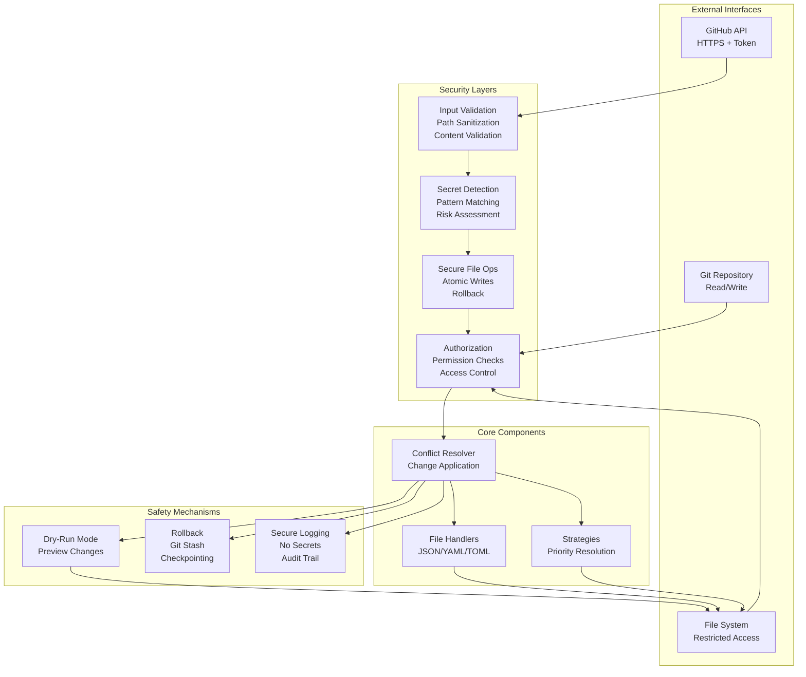

# Security Architecture

## Executive Summary

This document establishes the security architecture for the Review Bot Automator project. The system is designed with security-first principles to ensure safe, automated resolution of code review suggestions from AI tools like CodeRabbit.

### Purpose

This document provides:

* Foundation for secure development practices
* Threat modeling and risk assessment
* Security principles and architectural patterns
* Implementation roadmap for security controls
* Compliance and audit guidelines

### Security-First Approach Rationale

The Review Bot Automator executes privileged operations on behalf of developers:

* Reads from and writes to local file systems
* Modifies source code files
* Interacts with Git repositories
* Calls external APIs (GitHub)

These capabilities require a robust security posture to prevent:

* Accidental damage to codebases
* Unauthorized access to systems
* Injection of malicious code
* Exposure of sensitive data

### Key Stakeholders

* **Developers**: Primary users who trust the system to safely apply code suggestions
* **Security Team**: Ensures compliance with organizational security policies
* **DevOps**: Maintains CI/CD pipelines and infrastructure security
* **Compliance**: Ensures adherence to industry standards and regulations

---

## Security Principles

The following eight security principles form the foundation of our security architecture:

### 1. Zero-Trust Execution Model

**Principle**: Never trust input from external sources without validation.

**Implementation**:

* All GitHub API responses are validated
* Code suggestions are sanitized before parsing
* File paths are validated to prevent traversal
* No assumptions about file content structure

**Rationale**: External APIs and user input are untrusted by default. Every piece of data must be validated before use.

---

### 2. Principle of Least Privilege

**Principle**: Grant only the minimum permissions necessary for operation.

**Implementation**:

* Read-only access to Git by default
* No network access except to authorized APIs
* No execution of arbitrary code from suggestions
* Restricted file system access scope

**Rationale**: Limiting privileges reduces the attack surface and impact of potential security incidents.

---

### 3. Defense in Depth

**Principle**: Multiple security layers provide redundancy when one layer fails.

**Implementation**:

* Input validation (layer 1)
* Path traversal prevention (layer 2)
* Secret scanning (layer 3)
* Atomic file operations (layer 4)
* Rollback mechanisms (layer 5)

**Rationale**: Multiple independent security controls ensure that a single vulnerability cannot compromise the entire system.

---

### 4. Secure Defaults

**Principle**: Default configuration is secure by design.

**Implementation**:

* Dry-run mode enabled by default
* Non-destructive operations as default
* Explicit opt-in for file modifications
* Secure logging (no secrets in logs)

**Rationale**: Users should not need security expertise to use the system safely.

---

### 5. Fail-Secure Behavior

**Principle**: System should fail safely without exposing sensitive data.

**Implementation**:

* Errors do not leak file contents
* Sensitive data is masked in logs
* Failed operations are logged securely
* No stack traces in production output

**Rationale**: Failures are inevitable; they must not introduce new security risks.

---

### 6. Input Validation and Sanitization

**Principle**: All inputs are validated and sanitized before use.

**Implementation**:

* File paths normalized and checked
* YAML/JSON/TOML parsed safely (no code execution)
* Line numbers validated against file bounds
* Content validated against expected structure

**Rationale**: Proper input validation prevents most injection attacks and data corruption.

---

### 7. Secure Communication Protocols

**Principle**: All external communications use secure, authenticated channels.

**Implementation**:

* HTTPS only for API calls
* Certificate pinning for GitHub API
* Token-based authentication
* No credentials in code or logs

**Rationale**: Secure channels protect data in transit and authenticate communicating parties.

---

### 8. Cryptographic Verification Where Applicable

**Principle**: Use cryptographic verification when integrity is critical.

**Implementation**:

* GitHub API response signature verification
* File content checksums
* Secure hash verification for suggestions
* Git commit signing support

**Rationale**: Cryptographic verification ensures data integrity and authenticates sources.

---

## Threat Model

### Threat Categories

#### 1. Unauthorized Code Execution

**Risk Level**: HIGH

**Attack Vectors**:

* Malicious Python code in YAML (`!!python/object`)
* Shell command injection in suggestions
* Template injection attacks
* Dynamic code execution from suggestions

**Potential Impact**:

* Remote code execution (RCE)
* Arbitrary file system access
* Network access
* Data exfiltration

**Mitigations**:

* Prohibit code execution from suggestions
* Use safe YAML/JSON parsers
* Sanitize all dynamic content
* Run in sandboxed environment (future enhancement)

**Implementation Phase**: Phase 0.2 (Input Validation), Phase 0.4 (Secret Detection)

---

#### 2. Path Traversal Attacks

**Risk Level**: HIGH

**Attack Vectors**:

* Suggestions with paths like `../../etc/passwd`
* Windows paths like `..\..\windows\system32`
* URL-encoded paths
* Unicode normalization attacks

**Potential Impact**:

* Reading sensitive system files
* Overwriting critical files
* Accessing files outside repository
* Bypassing access controls

**Mitigations**:

* Path normalization and validation
* Restrict file access to repository root
* Check for directory traversal sequences
* Use relative paths with proper resolution

**Implementation Phase**: Phase 0.2 (Input Validation)

---

#### 3. Code Injection

**Risk Level**: CRITICAL

**Attack Vectors**:

**YAML Injection**:

```yaml
key: !!python/object/apply:os.system
args: ["rm -rf /"]

```

**JSON Injection**:

```json
{
  "code": "eval(malicious_payload)"
}

```

**TOML Injection**:

```toml
[malicious]
value = "exec('rm -rf /')"

```

**Potential Impact**:

* Remote code execution
* File system manipulation
* Data exfiltration
* System compromise

**Mitigations**:

* Use safe parsers that disable code execution
* Validate data structures before processing
* Whitelist allowed data types
* Reject unknown object types

**Implementation Phase**: Phase 0.2 (Input Validation), Phase 0.3 (Secure File Handling)

---

#### 4. Secret Leakage

**Risk Level**: MEDIUM-HIGH

**Attack Vectors**:

* API tokens in code suggestions
* Environment variables in suggestions
* Credentials in commented code
* Secrets in configuration files

**Potential Impact**:

* Unauthorized API access
* Repository access compromise
* Identity theft
* Data breach

**Mitigations**:

* Scan suggestions for secrets before applying
* Detect common secret patterns
* Warn users about potential leaks
* Mask secrets in logs and output

**Implementation Phase**: Phase 0.4 (Secret Detection)

---

#### 5. Race Conditions in File Operations

**Risk Level**: MEDIUM

**Attack Vectors**:

* Time-of-check to time-of-use (TOCTOU) vulnerabilities
* Concurrent file modifications
* Incomplete atomic operations
* File locking issues

**Potential Impact**:

* Data corruption
* Inconsistent file states
* Lost updates
* Incomplete rollbacks

**Mitigations**:

* Use atomic file operations
* Implement proper file locking
* Transactional semantics for multi-file changes
* Idempotent operations

**Implementation Phase**: Phase 0.3 (Secure File Handling)

---

#### 6. Git Manipulation Attacks

**Risk Level**: MEDIUM

**Attack Vectors**:

* Malicious git hooks (pre-commit, post-merge)
* Branch manipulation
* Unsigned commits
* History rewriting

**Potential Impact**:

* Persistent malware installation
* Unauthorized code commits
* Reputation damage
* Supply chain compromise

**Mitigations**:

* Validate git hooks before execution
* Support git commit signing
* Read-only git operations where possible
* Verify branch integrity

**Implementation Phase**: Phase 0.5 (Security Testing), Phase 0.8 (Security Documentation)

---

#### 7. Network-Based Attacks

**Risk Level**: MEDIUM

**Attack Vectors**:

* Man-in-the-middle (MITM) attacks on GitHub API
* DNS poisoning
* Compromised API endpoints
* Malicious proxy servers

**Potential Impact**:

* Credential theft
* Data interception
* Response manipulation
* Unauthorized operations

**Mitigations**:

* Enforce HTTPS for all API calls
* Implement certificate pinning
* Verify SSL certificates
* Use authenticated API tokens

**Implementation Phase**: Phase 0.2 (Input Validation), Phase 0.5 (Security Configuration)

---

#### 8. Supply Chain Attacks

**Risk Level**: MEDIUM-HIGH

**Attack Vectors**:

* Compromised dependencies
* Malicious PyPI packages
* Typosquatting attacks
* Dependency confusion

**Potential Impact**:

* Malware installation
* Backdoor persistence
* Data exfiltration
* Credential theft

**Mitigations**:

* Regular dependency scanning
* Pin dependency versions
* Use lock files
* Generate Software Bill of Materials (SBOM)
* Verify package checksums

**Implementation Phase**: Phase 0.7 (Security Scanning), Phase 0.8 (Security Documentation)

---

## Security Architecture Diagram



---

## Attack Surface Analysis

### Entry Points

1. **GitHub API Integration** (`src/review_bot_automator/integrations/github.py`)
   * Receives code suggestions from GitHub
   * Parses comment bodies
   * Extracts file paths and line ranges

2. **Local File System** (Handlers: JSON, YAML, TOML)
   * Reads current file contents
   * Writes modified content
   * Creates backup files

3. **Git Operations** (Future rollback system)
   * Executes git commands
   * Manages git stash
   * Performs checkpoints

4. **Third-Party Dependencies**
   * PyYAML (YAML parsing)
   * requests (HTTP client)
   * Click (CLI framework)
   * Rich (Console output)

5. **User Configuration**
   * CLI arguments
   * Environment variables
   * Configuration files
   * Command-line flags

### Data Flow

```text
GitHub API → Comment Parsing → Change Extraction → Conflict Detection →
Resolution Strategy → File Modification → Git Commit → Rollback Checkpoint

```

Each stage introduces potential security risks that must be mitigated.

---

## Security Controls Matrix

| Control | Type | Priority | Implementation Phase | Status |
| --------- | ------ | ---------- | --------------------- | -------- |
| Input validation | Preventive | Critical | Phase 0.2 | Planned |
| Path traversal prevention | Preventive | Critical | Phase 0.2 | Planned |
| Code injection prevention | Preventive | Critical | Phase 0.2 | Planned |
| Secret detection | Detective | High | Phase 0.4 | Planned |
| Atomic file operations | Corrective | High | Phase 0.3 | Planned |
| Secure file handling | Preventive | High | Phase 0.3 | Planned |
| Git hook validation | Preventive | Medium | Phase 0.5 | Planned |
| Certificate pinning | Preventive | Medium | Phase 0.2 | Planned |
| Dependency scanning | Detective | Medium | Phase 0.7 | Planned |
| Secure logging | Preventive | Medium | Phase 0.5 | Planned |
| Rollback mechanism | Corrective | High | Phase 1.2 | Planned |
| Dry-run mode | Detective | High | Phase 1.1 | Planned |

---

## Compliance Considerations

### GDPR Compliance

* **No personal data collection**: The tool does not collect or process personal data
* **Data minimization**: Only processes data necessary for conflict resolution
* **Right to deletion**: Users can delete all local data by deleting the repository
* **Transparency**: Logging and audit trails are opt-in

### SOC2 Readiness

* **Access controls**: File system permissions enforced
* **Encryption in transit**: HTTPS for all API communications
* **Audit logging**: Comprehensive logging for security events
* **Incident response**: Defined procedures in SECURITY.md
* **Change management**: Version control and code review processes

### OWASP Top 10 Coverage

| OWASP Top 10 | Coverage | Implementation |
| -------------- | ---------- | ---------------- |
| A01: Broken Access Control | Partial | Phase 0.2, Phase 0.3 |
| A02: Cryptographic Failures | Covered | HTTPS, no secrets in logs |
| A03: Injection | Covered | Phase 0.2, Phase 0.3 |
| A04: Insecure Design | Covered | This document |
| A05: Security Misconfiguration | Covered | Phase 0.5 |
| A06: Vulnerable Components | Covered | Phase 0.7 |
| A07: Authentication Failures | Covered | Phase 0.2 |
| A08: Software and Data Integrity | Covered | Phase 0.4 |
| A09: Security Logging | Covered | Phase 0.5 |
| A10: Server-Side Request Forgery | N/A | No server component |

---

## Security Development Lifecycle

### Secure Coding Standards

1. **Input Validation**: All external inputs validated at entry points
2. **Error Handling**: Fail-secure error handling without information disclosure
3. **Resource Management**: Proper cleanup of file handles and network connections
4. **Cryptography**: Use standard libraries, no custom implementations
5. **Logging**: Security-relevant events logged without sensitive data

### Security Testing Requirements

1. **Unit Tests**: Security controls tested in isolation
2. **Integration Tests**: End-to-end security workflows tested
3. **Penetration Testing**: Regular security audits (future)
4. **Dependency Scanning**: Automated scanning in CI/CD
5. **Code Review**: All code changes reviewed for security issues

### Vulnerability Disclosure Process

See `SECURITY.md` for detailed process:

* Private disclosure through GitHub security tab
* Acknowledgment within 48 hours
* Coordinated public disclosure
* Credit given to researchers (optional)

### Incident Response Plan

1. **Detection**: Monitoring and alerting (future)
2. **Containment**: Immediate mitigation steps
3. **Eradication**: Root cause analysis and fix
4. **Recovery**: Deployment of patches and monitoring
5. **Lessons Learned**: Post-mortem and documentation

---

## References

### Industry Standards

* **OWASP Secure Coding Practices**: <https://owasp.org/www-project-secure-coding-practices-quick-reference-guide/>
* **NIST Cybersecurity Framework**: <https://www.nist.gov/cyberframework>
* **CWE Top 25**: <https://cwe.mitre.org/top25/>
* **PCI DSS**: Payment Card Industry Data Security Standard (if applicable)
* **ISO 27001**: Information Security Management System

### Security Guidelines

* **Python Security**: <https://python.org/community/security/>
* **Git Security**: <https://git-scm.com/docs/git-check-attr>
* **GitHub Security**: <https://docs.github.com/en/code-security>
* **API Security**: OWASP API Security Top 10

### Tools and Resources

* **Bandit**: Python security linter
* **pip-audit**: Python package security scanner
* **Trivy**: SBOM and container scanner
* **TruffleHog**: Secret scanning tool
* **Semgrep**: Static analysis security scanner
* **OpenSSF Scorecard**: Repository security posture assessment

---

## Implementation Roadmap

### Phase 0.1: Security Architecture Design ✅

* **Status**: ✅ COMPLETE
* **Deliverables**: This document
* **Dependencies**: None
* **Completion Date**: 2025-10-26

### Phase 0.2: Input Validation & Sanitization ✅

* **Status**: ✅ COMPLETE
* **Deliverables**: `InputValidator` class, path validation, content sanitization
* **Implementation**: `src/review_bot_automator/security/input_validator.py`
* **Tests**: `tests/security/test_input_validator_security.py`
* **Dependencies**: Phase 0.1
* **Completion Date**: 2025-10-30

### Phase 0.3: Secure File Handling ✅

* **Status**: ✅ COMPLETE
* **Deliverables**: `SecureFileHandler` class, atomic operations, rollback
* **Implementation**: `src/review_bot_automator/security/secure_file_handler.py`
* **Tests**: `tests/security/test_secure_file_handler.py`
* **Dependencies**: Phase 0.1
* **Completion Date**: 2025-10-30

### Phase 0.4: Secret Detection ✅

* **Status**: ✅ COMPLETE
* **Deliverables**: `SecretScanner` class, pattern matching, warnings
* **Implementation**: `src/review_bot_automator/security/secret_scanner.py`
* **Tests**: `tests/security/test_secret_scanner.py`
* **Patterns**: 17 secret types detected
* **Dependencies**: Phase 0.1
* **Completion Date**: 2025-10-31

### Phase 0.5: Security Testing Suite ✅

* **Status**: ✅ COMPLETE
* **Deliverables**: Security test cases, fuzzing, penetration tests
* **Implementation**:
  * Security tests: `tests/security/` (8 test files)
  * Fuzzing: `.clusterfuzzlite/` (ClusterFuzzLite integration)
  * Fuzz targets: `fuzz/` (3 active targets)
* **Coverage**: 95%+ for security modules
* **Dependencies**: Phases 0.2, 0.3, 0.4
* **Completion Date**: 2025-11-02

### Phase 0.6: Security Configuration ✅

* **Status**: ✅ COMPLETE
* **Deliverables**: Security settings, secure defaults, config validation
* **Implementation**: `src/review_bot_automator/security/config.py`
* **Features**: SecurityConfig with feature toggles
* **Dependencies**: Phase 0.1
* **Completion Date**: 2025-10-31

### Phase 0.7: Security Scanning Workflow ✅

* **Status**: ✅ COMPLETE
* **Deliverables**: CI/CD security scanning, automated vulnerability checks
* **Implementation**: `.github/workflows/security.yml`
* **Tools Integrated**:
  * CodeQL (semantic analysis)
  * Trivy (SBOM & CVE scanning)
  * TruffleHog (secret scanning)
  * Bandit (Python security linting)
  * pip-audit (dependency vulnerabilities)
  * OpenSSF Scorecard (best practices)
  * ClusterFuzzLite (continuous fuzzing)
* **Dependencies**: Phase 0.1
* **Completion Date**: 2025-11-03

### Phase 0.8: Security Documentation ✅

* **Status**: ✅ COMPLETE
* **Deliverables**: Threat model documentation, response plan, compliance docs
* **Documentation**:
  * SECURITY.md (enhanced)
  * docs/security-architecture.md (this document)
  * docs/security/threat-model.md
  * docs/security/incident-response.md
  * docs/security/compliance.md
  * docs/security/security-testing.md
* **Dependencies**: Phases 0.1-0.7
* **Completion Date**: 2025-11-03

---

## Related Documentation

For comprehensive security information, see:

* **[Threat Model](security/threat-model.md)**: STRIDE analysis, attack scenarios, risk assessments
* **[Incident Response Plan](security/incident-response.md)**: Detection, triage, containment, recovery procedures
* **[Compliance Guide](security/compliance.md)**: GDPR, OWASP Top 10, SOC2, OpenSSF Best Practices
* **[Security Testing Guide](security/security-testing.md)**: How to run security tests, add new tests, perform reviews

---

## Conclusion

This security architecture established the foundation for secure development of the Review Bot Automator. All planned phases (0.1-0.8) have been successfully completed, implementing comprehensive security controls including:

* **Input validation and sanitization** (path traversal prevention, content validation)
* **Secure file handling** (atomic operations, permission preservation, rollback)
* **Secret detection** (17 pattern types, pre-commit scanning)
* **Security testing** (95%+ coverage, continuous fuzzing, SAST/DAST)
* **Security configuration** (secure defaults, feature toggles)
* **CI/CD security scanning** (7+ integrated tools)
* **Comprehensive documentation** (architecture, threat model, incident response, compliance, testing)

By following these principles, implementing the identified controls, and adhering to security best practices, we ensure that the system can be trusted to safely automate code review suggestions without introducing security risks.

The phased implementation approach allowed for incremental security improvements while maintaining development velocity. Each phase built upon the previous one, ensuring a comprehensive security posture at completion.

---

**Document Version**: 2.0
**Last Updated**: 2025-11-03
**Next Review**: 2026-02-03 (Quarterly)
**Owner**: Security Team
**Status**: All Phases Complete
