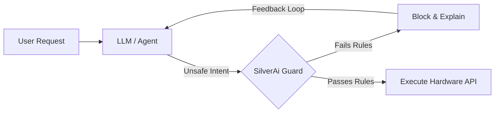
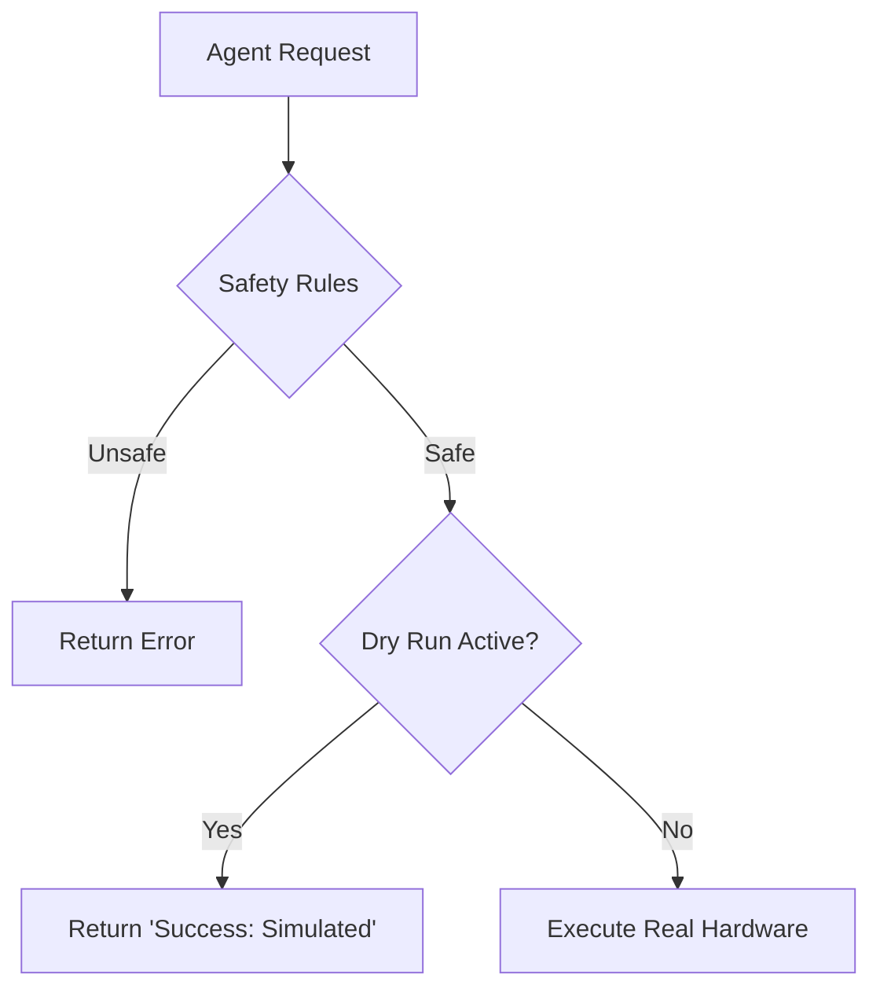

# 🛡️ SilverAi

**Deterministic State-Guardrails for Agentic Hardware & Critical Systems.**

[](https://pypi.org/project/silver-ai/)
[](https://www.python.org/downloads/)
[](https://github.com/gcl-team/SilverAi/blob/main/LICENSE)
[](https://piwheels.org/project/silver-ai/)
[](https://github.com/gcl-team/SilverAi/actions/workflows/ci.yaml)

> **"You wouldn't let a drunk person drive a forklift. Why let a probabilistic LLM drive your physical hardware?"**

## 🚨 The Problem

Large Language Models (LLMs) like GPT-4, DeepSeek, and Claude are **Probabilistic Engines**. They are optimized for creativity, not safety.

When connecting Agents to **Physical Hardware (IoT/Robotics)** or **Financial Systems**, "99% accuracy" is not enough. A single hallucination can cause:
*   **Physical Damage:** Ignoring battery/thermal limits on a device.
*   **Operational Failure:** Attempting to control a disconnected device over BLE/MQTT.
*   **Financial Risk:** Hallucinating discounts or executing unauthorized transactions.

Existing solutions (Bedrock Guardrails, NeMo) focus on **Semantic Safety** (profanity, PII). They are blind to **State Safety**.

## ⚡ The Solution

**SilverAi** is a lightweight, dependency-free Python middleware that enforces **Deterministic Contracts** on your Agent's tools. It sits between the LLM's intent and your system's execution.

### ✨ Key Features
*   **🐍 Pythonic Decorators:** Clean, readable syntax using `@guard`.
*   **🔌 Connectivity Gates:** Prevents Agents from calling APIs when the device is offline (`BLE`, `WiFi`).
*   **🔋 State-Aware:** Validates against real-time telemetry (Battery, Heat) before execution.
*   **🧪 Dry-Run Mode:** Test your safety logic in CI/CD without requiring physical hardware or live APIs.

---

## 🚀 Quick Start

### Installation
```bash
pip install silver-ai
```

### Usage: Protecting a Robot

Prevent an Agent from moving a robot if the battery is critical or the connection is unstable.

```python
from silver_ai import guard, rules

class IndustrialRobot:
    def __init__(self):
        # In production, this state comes from live telemetry
        self.state = {
            "battery": 10, 
            "connection": "offline",
            "is_stuck": False
        }

    @guard(
        rules.BatteryMin(15),
        rules.RequireConnectivity(protocol="BLE")
        # rules.TransactionLimit(amount=50)
    )
    def start_operation(self, zone: str):
        # 🛑 This code NEVER runs because battery (10) < 15
        # AND the device is offline.
        hardware_driver.move_to(zone)
```

The Agent receives this structured rejection (instead of crashing):

```json
{
  "status": "error",
  "reason": "Battery critical: 10%. Required: 15%.",
  "suggestion": "Connect device to charger before proceeding.",
  "dry_run": false
}
```

## 🏛️ Architecture

SilverAi acts as the "Prefrontal Cortex" for your Agent. It is a logical check before impulsive actions.



## 🧪 Simulation & Testing (No Hardware Required)

One of the hardest parts of IoT development is testing failure states (e.g., "What happens if the battery dies halfway?"). SilverAi provides a DryRun harness to test safety logic instantly.



```python
from silver_ai.core import DRY_RUN_FLAG
from my_robot import IndustrialRobot

def test_safety_stops_low_battery():
    # 1. Instantiate the robot
    robot = IndustrialRobot()
    
    # 2. Inject dangerous state
    robot.state = {"battery": 5, "connection": "online"}
    
    # 3. Enable Safety Override (Dry Run)
    # We manually flag this instance for simulation
    setattr(robot, DRY_RUN_FLAG, True)
    
    # 4. Run the function
    result = robot.start_operation("Zone A")
    
    # 5. Assert that SilverAi caught it
    assert result['status'] == 'error'
    assert "Battery" in result['reason']
```

## 🛠️ Development on Local Machine

This project uses **Poetry** for dependency management and **Ruff** for strict code quality.

### 1. Prerequisites
* Python 3.11+;
* [Poetry](https://python-poetry.org/docs/) installed.
  ```bash
  pip install poetry
  ```  

### 2. Setup
Clone the repo and install dependencies (including the virtual environment):
```bash
git clone https://github.com/gcl-team/SilverAi.git
cd SilverAi
poetry install
```

### 3. Running the Demo
We provide a `demo.py` to showcase the behavior (Success, Failure, Dry Run, Exception).
```bash
poetry run python demo.py
```

### 4. Running 
We use pytest for unit testing.
```bash
poetry run pytest
```

### 5. Linting & Security
We use ruff to enforce PEP8, import sorting, and Bandit security rules.
```bash
poetry run ruff check .
```

## 🤝 Contributing
We welcome your contributions! Bug reports and feature suggestions are encouraged. 
Open issues or submit pull requests via [Project Issues](https://github.com/gcl-team/SilverAi/issues).
