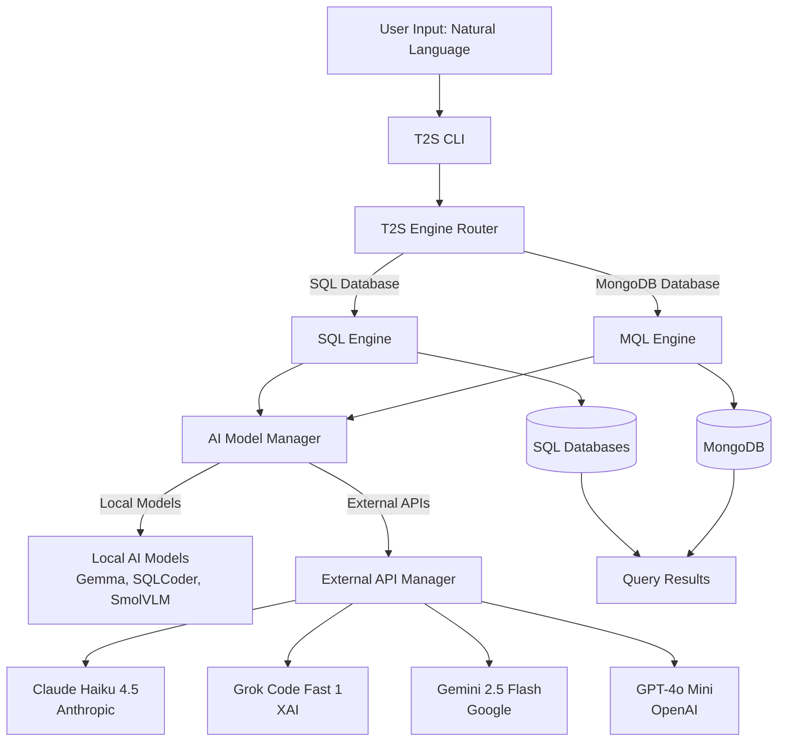
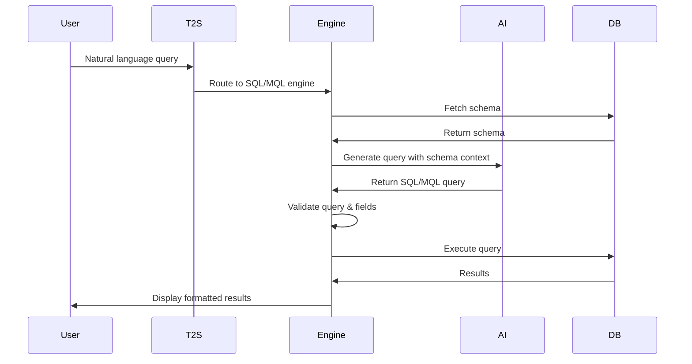
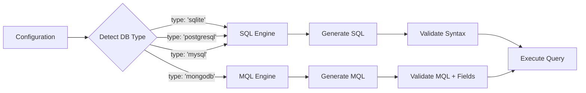
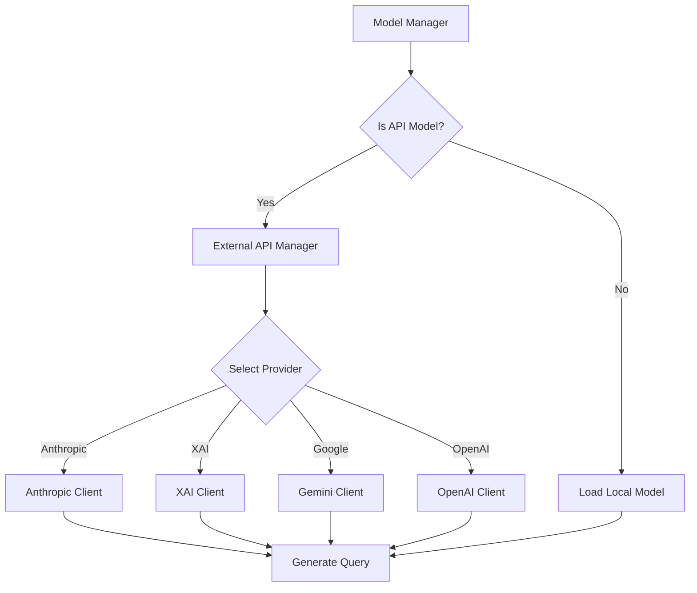

# T2S - Text to SQL & MQL CLI

[](https://pypi.org/project/t2s-cli/)
[](LICENSE)
[](https://pypi.org/project/t2s-cli/)
[](https://pypi.org/project/t2s-cli/)
[](https://www.mongodb.com/)
[](https://www.postgresql.org/)
[](https://pypi.org/project/t2s-cli/)

### SQL Mode with Local AI Model


### MongoDB Mode with External API


A powerful, **privacy-first OR cloud-powered** terminal-based converter that transforms natural language into SQL or MongoDB queries using state-of-the-art AI models—run completely locally for privacy, or leverage cloud APIs for maximum performance.

**Created by Lakshman Turlapati**

## What's New in v0.3.0

- **MongoDB Support** - Full MQL (MongoDB Query Language) generation from natural language
- **External AI APIs** - Claude, Grok, Gemini, and GPT-4o integration for cloud-powered queries
- **Modular Architecture** - Separate SQL and MQL engines for optimal performance
- **24 New Tests** - Comprehensive MongoDB test coverage
- **Aggregation Pipelines** - Complex multi-stage MongoDB operations
- **Schema Validation** - Field-aware query generation

## Architecture

T2S features a modular, extensible architecture that supports both SQL and NoSQL databases, with flexible AI model deployment options.

### Overall System Architecture



### Query Generation Flow



### Database Type Detection & Routing



### External API Integration



## Privacy & Deployment Options

T2S gives you complete control over your data and infrastructure:

### Privacy-First (Local Mode)
Your data stays where it belongs—on your machine. Run AI models completely locally, free from external APIs, delivering uncompromised privacy and security. Perfect for:
- Enterprise databases with sensitive data
- Healthcare and financial applications
- Air-gapped environments
- Privacy-conscious users

### Cloud-Powered (API Mode)
Leverage cutting-edge cloud AI models for maximum performance without local GPU requirements. Ideal for:
- Resource-constrained devices
- Maximum accuracy requirements
- Pay-per-use pricing models
- Latest model capabilities

## Features

T2S is packed with capabilities to streamline your database querying experience:

### Dual Database Support
- **SQL Databases** - SQLite, PostgreSQL, MySQL with intelligent query generation
- **MongoDB** - Full MQL support with aggregation pipelines and field validation
- Auto-detection and seamless switching between database types
- Schema-aware query generation for both SQL and NoSQL

### Flexible AI Deployment
- **Local Models** - Privacy-first, offline operation with Gemma, SQLCoder, SmolVLM
- **External APIs** - Cloud-powered performance with Claude, Grok, Gemini, GPT-4o
- Smart model selection based on hardware and requirements
- Automatic fallback and error handling

### MongoDB-Specific Features
- Natural language to MQL conversion
- Aggregation pipeline generation ($match, $group, $lookup, $project, etc.)
- Direct database operations (listCollections, getCollectionNames, stats)
- JavaScript to JSON query parsing
- Field validation against schema
- Projection optimization (excludes _id by default)

### Advanced AI Workflows
- Multiple specialized AI workflows tailored to diverse use cases
- Intelligent model selection based on your hardware and accuracy requirements
- Automatic schema analysis and query optimization
- Support for complex multi-table joins and aggregations
- Cross-collection references in MongoDB

### Smart Database Integration
- Auto-detection of local databases (SQLite, PostgreSQL, MySQL, MongoDB)
- Real-time schema analysis and intelligent table/collection selection
- Query validation and automatic error correction
- Elegant result visualization in the terminal

### Beautiful Terminal Experience
- Rich ASCII art branding paired with an intuitive interface
- Interactive configuration with memory compatibility warnings
- Real-time loading animations and progress indicators
- Syntax highlighting for SQL/MQL queries and results
- Adaptive UI based on active database type

### Enterprise-Ready
- Fully offline operation—no internet required for local models
- Cloud API support for maximum performance
- Local model storage and management
- Cross-platform support (macOS, Windows, Linux)
- Memory-aware model recommendations
- Comprehensive test coverage (29 tests passing)

## External API Models

T2S integrates with leading cloud AI providers for maximum performance without local GPU requirements.

### Claude Haiku 4.5 (Anthropic)
- **Model ID**: `claude-haiku-4-5`
- **Best For**: Fast, cost-efficient queries with high accuracy
- **Context Window**: 200K tokens
- **Pricing**: $1/M input tokens, $5/M output tokens
- **Strengths**: Excellent SQL/MQL generation, low latency

### Grok Code Fast 1 (XAI)
- **Model ID**: `grok-code-fast-1`
- **Best For**: Code-focused queries with massive context
- **Context Window**: 256K tokens (industry-leading)
- **Pricing**: $0.20/M input tokens, $1.50/M output tokens
- **Strengths**: Exceptional code understanding, very cost-effective

### Gemini 2.5 Flash (Google)
- **Model ID**: `gemini-2.5-flash`
- **Best For**: Large-scale processing with competitive pricing
- **Context Window**: 1M tokens
- **Pricing**: Competitive, usage-based
- **Strengths**: Massive context, multimodal capabilities

### GPT-4o Mini (OpenAI)
- **Model ID**: `gpt-4o-mini`
- **Best For**: Balanced performance and cost
- **Context Window**: 128K tokens
- **Pricing**: Standard OpenAI rates
- **Strengths**: Reliable, well-documented, broad capability

### Setting Up External APIs

1. **Get API Keys**
   - Anthropic: https://console.anthropic.com/
   - XAI: https://x.ai/api
   - Google: https://ai.google.dev/
   - OpenAI: https://platform.openai.com/

2. **Configure in T2S**
   ```bash
   t2s config models
   # Select your preferred API model

   t2s config api-keys
   # Enter your API keys for each provider
   ```

3. **Start Querying**
   ```bash
   t2s
   # Queries now use your selected cloud AI model
   ```

## MongoDB & MQL Support

T2S provides comprehensive MongoDB support with natural language to MQL (MongoDB Query Language) conversion.

### What is MQL?

MQL (MongoDB Query Language) is MongoDB's native query language for document-based operations. Unlike SQL's structured approach, MQL works with flexible JSON-like documents and supports powerful aggregation pipelines.


### MongoDB Connection Setup

```bash
# Interactive setup
t2s databases

# Select "Add new database"
# Choose "MongoDB"
# Enter connection details:
#   - Host: localhost (or your MongoDB server)
#   - Port: 27017 (default)
#   - Database name: your_database
#   - Username: (optional)
#   - Password: (optional)
```


### MQL vs SQL Comparison

| Feature | SQL | MongoDB MQL |
|---------|-----|-------------|
| **Data Model** | Tables with rows | Collections with documents |
| **Schema** | Rigid, predefined | Flexible, dynamic |
| **Joins** | JOIN clauses | $lookup in aggregation |
| **Filtering** | WHERE clause | {field: value} or $match |
| **Grouping** | GROUP BY | $group stage |
| **Selection** | SELECT columns | Projection {field: 1} |
| **Sorting** | ORDER BY | $sort or .sort() |

## AI Model Recommendations

Choosing the right AI model is key to unlocking T2S's full potential:

### For Best Results (95%+ Accuracy)

#### Local Models
- **Gemma 3 (12B)** - Ideal for production environments and complex queries
- **Defog SQLCoder (7B)** - Specialized SQL model, perfect for technical users

#### Cloud APIs (Best Overall)
- **Claude Haiku 4.5** - Fast, accurate, excellent for both SQL and MQL
- **Grok Code Fast 1** - Best value with 256K context window
- **Gemini 2.5 Flash** - Best for complex aggregation pipelines

### For Most Users (80-90% Accuracy)
- **Gemma 3 (4B)** - Recommended for 95% of users, strikes perfect balance
  - Runs efficiently on most modern hardware with impressive results
  - Suitable for both SQL and MongoDB queries

### For Experimentation (40-60% Accuracy)
- **SmolVLM (500M)** - Ultra-lightweight, runs on any computer
  - Great for learning, testing, and resource-limited setups

T2S includes memory compatibility warnings to guide you toward the best model for your system.

## Installation

### Quick Start

```bash
pip install t2s-cli
```

### With All Features (Recommended)

```bash
# Install with all features including MongoDB support
pip install t2s-cli[all]
```

### For Gemma Model Support

Some local models require additional dependencies:

```bash
# Install with Gemma support
pip install t2s-cli[gemma]
```

### Development Installation

```bash
git clone https://github.com/lakshmanturlapati/t2s-cli.git
cd t2s-cli
python -m venv venv
source venv/bin/activate  # On Windows: venv\Scripts\activate
pip install -e ".[dev]"
```

### macOS Users

If you encounter SentencePiece build issues:

```bash
brew install sentencepiece protobuf
pip install t2s-cli
```

## Getting Started

### Launch T2S

```bash
t2s
```

### First-Time Setup (Interactive Wizard)

1. **Select AI Model**
   - Choose local model (privacy-first) OR cloud API (performance)
   - Options: Gemma, SQLCoder, SmolVLM, Claude, Grok, Gemini, GPT-4o

2. **Connect to Databases**
   - Add SQLite, PostgreSQL, MySQL, or MongoDB connections
   - Automatic schema detection for all database types

3. **Configure API Keys** (if using cloud models)
   - Enter API keys for your selected providers
   - Keys stored securely in local config

4. **Start Querying**
   - Type natural language queries
   - Get instant SQL or MQL results

### Quick Query

```bash
# SQL query
t2s query "Show me all customers from New York"

# MongoDB query (auto-detected)
t2s query "Find all products in electronics category"
```

## Usage Examples

### Interactive Mode

```bash
t2s
```

Launches an interactive experience with:
- Model management (local + cloud)
- Database configuration (SQL + MongoDB)
- Real-time query execution
- Schema browsing

### Direct Query Mode

```bash
# SQL queries
t2s query "Find top 5 products by revenue this year"

# MongoDB queries
t2s query "Show collections with more than 1000 documents"
```

### Configuration Management

```bash
t2s config      # Full configuration menu
t2s models      # Manage AI models (local + cloud)
t2s databases   # Manage database connections (SQL + MongoDB)
```

## Supported Databases

### SQL Databases

#### SQLite
- Perfect for local development and small projects
- Zero configuration, file-based database
- Ideal for prototyping and testing

#### PostgreSQL
- Enterprise-grade relational database
- Advanced features and excellent performance
- Production-ready with ACID compliance

#### MySQL
- Popular choice for web applications
- Widely supported and documented
- Great for medium to large-scale applications

### NoSQL Databases

#### MongoDB
- Document-based database with flexible schema
- **Full MQL Support** including:
  - Find operations with complex filters
  - Aggregation pipelines ($match, $group, $lookup, $project, etc.)
  - Direct database operations (listCollections, stats)
  - Cross-collection references
  - Field validation and projection optimization
- Perfect for unstructured or semi-structured data
- Excellent for rapid development and scaling

More database support coming soon!


## Who Is This For?

T2S caters to a broad audience:

- **Database Administrators** - Quickly explore and analyze database contents (SQL + MongoDB)
- **Developers** - Prototype and query databases during development
- **Data Analysts** - Turn business questions into queries without syntax struggles
- **Students & Researchers** - Learn SQL/MQL and experiment with AI models locally
- **Privacy-Conscious Users** - Handle sensitive data without external exposure
- **Cloud-First Teams** - Leverage latest AI models without local GPU infrastructure
- **Hybrid Organizations** - Use local models for sensitive data, cloud APIs for performance

## Development & Contributing

Contributions are welcome! This project reflects significant effort and meticulous care.

### Setup Development Environment

```bash
git clone https://github.com/lakshmanturlapati/t2s-cli.git
cd t2s-cli
python -m venv venv
source venv/bin/activate  # On Windows: venv\Scripts\activate
pip install -e ".[dev]"
```

### Run Tests

```bash
# Run all tests
pytest

# Run specific test files
pytest tests/test_basic.py
pytest tests/test_mongodb.py

# Run with coverage
pytest --cov=t2s tests/
```

### Code Quality

```bash
# Format code
black .

# Lint code
flake8 .

# Sort imports
isort .
```

### Project Structure

```
t2s-cli/
├── t2s/
│   ├── core/
│   │   ├── engine.py         # Main routing engine
│   │   ├── sql_engine.py     # SQL-specific logic
│   │   ├── mql_engine.py     # MongoDB-specific logic
│   │   └── config.py         # Configuration manager
│   ├── database/
│   │   ├── db_manager.py     # Database connection manager
│   │   └── mongodb_manager.py # MongoDB operations
│   ├── models/
│   │   ├── model_manager.py  # Local model manager
│   │   └── external_api_manager.py # Cloud API integration
│   ├── utils/
│   │   ├── sql_validator.py  # SQL validation
│   │   └── mql_validator.py  # MQL validation
│   └── cli.py               # CLI interface
├── tests/
│   ├── test_basic.py        # Basic functionality tests
│   └── test_mongodb.py      # MongoDB-specific tests
└── README.md
```

## Release Notes

### v0.3.0 (November 11, 2025) - MongoDB & External API Support

**Major Features:**
- **MongoDB Support**: Full MQL (MongoDB Query Language) generation from natural language
  - Find operations with filters and projections
  - Aggregation pipelines with all stages ($match, $group, $lookup, $project, etc.)
  - Direct database operations (listCollections, getCollectionNames, stats)
  - Schema-aware field validation
  - JavaScript to JSON query parsing

- **External API Integration**: Cloud-powered AI models
  - Claude Haiku 4.5 (Anthropic)
  - Grok Code Fast 1 (XAI) - 256K context window
  - Gemini 2.5 Flash (Google)
  - GPT-4o Mini (OpenAI)
  - Secure API key management

- **Modular Architecture**: Separate SQL and MQL engines
  - Clean separation of concerns
  - Extensible for future database types
  - Optimized query generation per database type

**Technical Enhancements:**
- 24 MongoDB-specific tests (29 total tests passing)
- JavaScript to JSON conversion for MQL parsing
- Field validation against actual schema
- Automatic _id exclusion in projections
- Support for ES6 shorthand in MQL
- Multi-stage aggregation pipeline support

**Documentation:**
- Comprehensive MongoDB/MQL guide
- External API setup instructions
- Architecture diagrams with Mermaid
- Enhanced examples for both SQL and MongoDB
- Side-by-side SQL vs MQL comparisons

**Breaking Changes:** None - Fully backward compatible with existing SQL functionality

### v0.2.0 - External Model Support

**Features:**
- Added support for external API models (Grok, Claude, Gemini)
- Interactive menu navigation with arrow keys
- Improved model management interface
- API key configuration and validation

### v0.1.0 - Initial Release

**Features:**
- Text to SQL conversion for SQLite, PostgreSQL, MySQL
- Local AI model support (Gemma, SQLCoder, SmolVLM)
- Interactive terminal interface
- Schema analysis and query validation


## Troubleshooting

### MongoDB Connection Issues

```bash
# Check MongoDB is running
mongosh --host localhost --port 27017

# Verify T2S can connect
t2s databases
# Select your MongoDB connection and test it
```

### External API Errors

```bash
# Verify API key is set
t2s config api-keys

# Check API key permissions at provider console
# Ensure sufficient credits/quota available
```

### Local Model Loading Issues

```bash
# Check available disk space (models can be 2-7GB)
df -h

# Clear cache and re-download
rm -rf ~/.t2s/models
t2s models  # Re-download model
```

## License

This project is licensed under the MIT License—see the `LICENSE` file for details.

## Acknowledgments

Developed with support and guidance from the University of Texas at Dallas.

### Special Thanks:

- **Professor Srikanth Kannan** - For invaluable guidance and inspiration
- **The open-source community** - For essential libraries and tools
- **HuggingFace** - For model infrastructure and community
- **Anthropic, XAI, Google, OpenAI** - For providing API access to cutting-edge models
- **MongoDB Inc** - For excellent documentation and driver support
- **Contributors and users** - Who help refine and improve T2S

## Author

**Lakshman Turlapati**

- GitHub: [@lakshmanturlapati](https://github.com/lakshmanturlapati)
- Project Repository: [t2s-cli](https://github.com/lakshmanturlapati/t2s-cli)
- Portfolio: [https://www.audienclature.com](https://www.audienclature.com)
- LinkedIn: [lakshman-turlapati](https://www.linkedin.com/in/lakshman-turlapati-3091aa191/)

## Support

- **Issues**: [GitHub Issues](https://github.com/lakshmanturlapati/t2s-cli/issues)
- **Discussions**: [GitHub Discussions](https://github.com/lakshmanturlapati/t2s-cli/discussions)
- **Email**: lakshmanturlapati@gmail.com

---

"Bringing the power of AI to your database, locally and securely—or in the cloud for maximum performance."

**T2S: Where privacy meets performance. Your data, your choice.**
