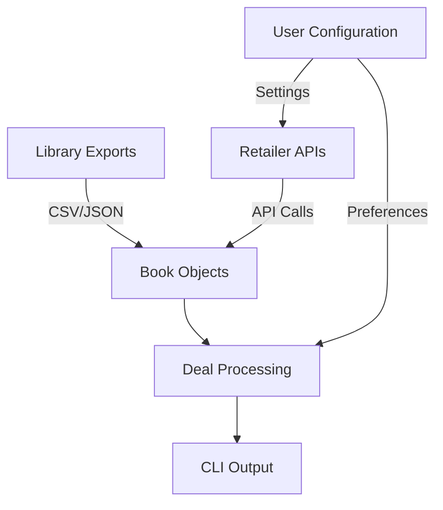

# TBR Deal Finder Design

## Overview
TBR Deal Finder is a CLI application that helps users track price drops and find deals on books in their To-Be-Read (TBR) list across various digital book retailers. The application is built with a modular architecture that separates data ingestion, processing, and output concerns.

## Terms
### Digital Book
A book in electronic format, accessible via digital devices. Includes:
- Audiobooks
- E-books

### Digital Book Retailer
Platforms that sell or distribute digital books, such as:
- Libro.fm (audiobooks)
- Audible (audiobooks)
- Kindle (e-books)
- Chirp (discounted audiobooks)

### Library Export
A data file containing a user's reading list and status. Sources include:
- **Automated Exports**:
  - The StoryGraph
  - Goodreads
  - Hardcover
- **Manual CSVs**: Custom spreadsheets following the required format

### TBR (To Be Read)
A user's personal reading list of books they plan to read in the future.

## Core Components

### 1. Data Ingestion Layer
- **Library Exports**: Handles importing book data from multiple sources:
  - The StoryGraph exports
  - Goodreads exports
  - Custom CSV files
- **Retailer APIs**: Interfaces with various digital book retailers to fetch current pricing and availability

### 2. Core Data Model

#### `Book` Class
The central data structure that represents a book across the application:
- **Purpose**: Serves as a consistent contract between different components
- **Key Attributes**:
  - Title and author information
  - Format (Audiobook, Ebook, etc.)
  - Pricing information (list price, current price)
  - Retailer-specific metadata
  - Timestamp for deal tracking

### 3. Retailer Interface

#### `Retailer` Base Class
Abstract base class that defines the interface for all retailer implementations:
- **Core Methods**:
  - `get_book()`: Fetches book details from the retailer
  - `get_wishlist()`: Retrieves the user's wishlist
  - `get_library()`: Gets the user's purchased/owned books
- **Current Implementations**:
  - Audible
  - Libro.fm
  - Chirp
  - Kindle (planned)

### 4. Processing Pipeline
1. **Data Collection**:
   - Load TBR lists from configured sources
   - Fetch owned books from retailers
   - Retrieve current deals and pricing

2. **Matching Logic**:
   - Matches TBR books with retailer inventory
   - Filters out owned books
   - Identifies price drops and deals

3. **Output Generation**:
   - Formats results for CLI display
   - Highlights best deals
   - Provides purchase links

## Data Flow

## Key Design Decisions

### 1. Extensibility
- Retailer implementations are pluggable through the `Retailer` base class
- Support for multiple export formats and retailer APIs

### 2. Performance
- Asynchronous I/O for API calls
- Caching of retailer responses
- Efficient data structures for book matching

### 3. User Experience
- Clear, concise command-line interface
- Configurable output formats
- Progress indicators for long-running operations

## Future Considerations
- Support for more retailer APIs
- Email notifications for price drops
- Web interface for easier configuration
- Integration with library lending services
- Price history tracking
