<p align="center">
  
  
</p>

<p align="center">
  <strong>Protect your time!</strong>
</p>

<p align="center">
  <a href="https://github.com/brycedrennan/time-guardian/actions/workflows/ci.yaml"></a>
  <a href="https://pypi.org/project/time-guard/"></a>
  <a href="https://github.com/brycedrennan/time-guardian/blob/master/LICENSE"></a>
</p>

Ever wonder how you *really* spent your day? Time Guardian silently captures screenshots and uses AI to tell you exactly what you were doing—so you can finally answer the question: "Where did my afternoon go?"

## Why Time Guardian?

📸 **Automatic tracking** — Set it and forget it. Screenshots every 5 seconds, intelligently filtered.  
🧠 **AI-powered analysis** — AI Vision understands what you're doing, not just which app is open.  
📊 **Honest reports** — See breakdowns by app, activity type, and get AI-generated summaries.  
🔒 **Privacy-first** — Everything runs locally. Your screenshots and data stay on your machine.

## Installation

```bash
pip install time-guard
```

## Quick Start

```bash
# Start tracking (runs until you stop it)
time-guardian track

# Generate a report of your activity
time-guardian summary
```

That's it. Time Guardian will capture screenshots, analyze them with AI, and show you where your time went.

## Usage

### Tracking

```bash
# Track indefinitely (Ctrl+C to stop)
time-guardian track

# Track for 1 hour
time-guardian track --duration 60

# Custom interval (every 10 seconds instead of 5)
time-guardian track --duration 60 --interval 10

# Track without AI analysis (just screenshots)
time-guardian track --no-ai
```

Screenshots are saved to `~/.time-guardian/screenshots` by default.

### Reports & Analysis

```bash
# View activity summary
time-guardian summary

# Analyze a specific screenshot directory
time-guardian analyze-screenshots -s ./my-screenshots

# Check version
time-guardian version
```

### Utility Commands

```bash
# Verify screen recording permissions work
time-guardian check-permissions

# Take a single screenshot
time-guardian screenshot -o snapshot.png

# See connected monitors
time-guardian monitors

# List visible windows
time-guardian windows

# List running processes
time-guardian processes
```

## Example Report

```
Time Guardian Activity Report
=============================
Generated at: 2025-12-04T05:26:42

Activity by Application
-----------------------
[Cursor] - 7 events
  • Coding
  • Code editing and running a script
  ...

[iTerm2] - 4 events
  • Coding
  ...

AI Summary
==========
The computer activities primarily consisted of "Coding," with one 
instance involving "Code editing and running a script."
```

## How It Works

```mermaid
graph LR
    A[📸 Capture] --> B{Changed?}
    B -->|Yes| C[💾 Save]
    B -->|No| D[Skip]
    C --> E[🤖 AI Classify]
    E --> F[📊 Report]
```



1. **Capture** — Screenshots taken every N seconds across all monitors
2. **Compare** — Only saves when screen content actually changes
3. **Classify** — GPT-4 Vision analyzes each window to determine activity
4. **Report** — Aggregates data into human-readable summaries

## Command Reference

| Command | Description |
|---------|-------------|
| `track` | Start tracking screen activity |
| `summary` | Display activity summary |
| `analyze-screenshots` | Analyze a directory of screenshots |
| `check-permissions` | Verify screen recording permissions |
| `screenshot` | Take a single screenshot |
| `monitors` | Show connected monitors |
| `windows` | Show visible windows |
| `processes` | List running processes |

### Track Options

| Option | Default | Description |
|--------|---------|-------------|
| `--duration` | ∞ | Minutes to track |
| `--interval` | 5 | Seconds between captures |
| `--ai/--no-ai` | enabled | AI classification |
| `--min-pixels` | 1000 | Change threshold |

## Requirements

- Python 3.12+
- macOS (Windows/Linux support planned)
- Screen recording permission for your terminal

## Development

```bash
# Clone and setup
git clone https://github.com/brycedrennan/time-guardian
cd time-guardian
make init

# Common commands
make test        # Run tests
make lint        # Run linter
make af          # Auto-format code
make check       # Run all checks
```

## License

MIT

---

**Stop wondering. Start knowing.** → `pip install time-guard`
