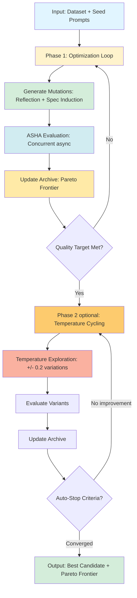
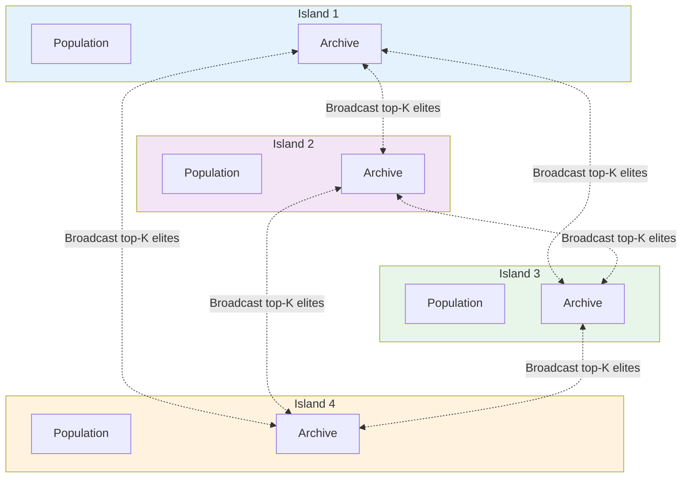
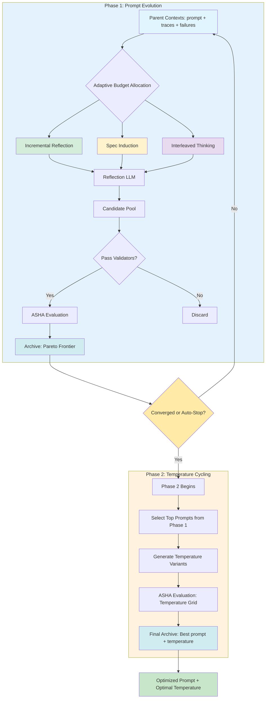
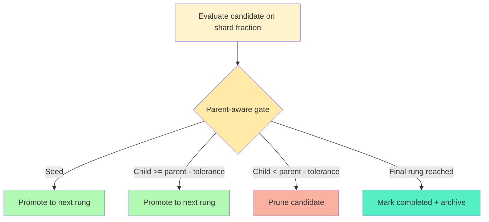

<p align="center">
  
</p>

<h1 align="center">TurboGEPA: High-Throughput Prompt Evolution</h1>

<p align="center">
  <em>The fastest way to reflectively evolve through the prompt space.</em>
</p>

<p align="center">
  <strong>Up to 17× faster than classic GEPA on AIME (30-example OSS‑20/Grok‑4 benchmark), exploring ~6× more candidates in the same wall time.</strong>
</p>

<p align="center">
  <strong>Goal:</strong> Take GEPA's core reflective optimization approach and, trading token efficiency for speed, reach optimal prompts and temperature settings as rapidly as possible.
</p>

## 🚀 What is TurboGEPA?

**TurboGEPA** is a high-performance fork of the [GEPA (Genetic-Pareto) framework](https://github.com/gepa-ai/gepa) designed for **maximum speed of prompt evolution**. While preserving GEPA's core innovation of LLM-based reflection for text evolution, TurboGEPA introduces:

- ⚡ **Maximized Concurrency**: Async orchestration scales to available compute (bounded by shard size + `max_total_inflight` per island)
- 🏝️ **Island-Based Parallelism**: Concurrent islands broadcast elites across the swarm to preserve diversity without extra processes
- 📊 **ASHA-Style Ladder**: Parent-gated rung promotions prune weak lineages early without cohort halving
- 🧬 **Triple Mutation Strategy**: Blends incremental reflection, Prompt-MII-style spec induction, and interleaved thinking for exploration vs. exploitation
- 📈 **Parent-Weighted Scheduling**: Recent improvement history boosts promising lineages to the front of the queue
- 🌡️ **Two-Phase Optimization**: Prompt evolution first, optional temperature sweep second
- 🚦 **Convergence & Lineage Guards**: Per-candidate auto-stop and lineage fast-tracks keep stagnating prompts moving forward
- ⚙️ **Adaptive Runtime Control**: Parent-aware early stopping, latency-based concurrency tuning, rung-aware mutation budgets, and runtime shard tuning keep tokens focused where they matter
- 🧾 **Lineage-Aware Mutations**: Mutators receive parent/child score history and failure summaries to guide the next edits
- 🔧 **Adaptive Configuration**: Auto-tunes concurrency, batch sizes, and shard settings based on dataset size

### Built on GEPA

TurboGEPA extends the GEPA algorithm proposed in:

> **GEPA: Reflective Prompt Evolution Can Outperform Reinforcement Learning**
> Lakshya A Agrawal et al., 2025
> arXiv:2507.19457
> [Paper](https://arxiv.org/abs/2507.19457) | [Original Repository](https://github.com/gepa-ai/gepa)

All credit for the core GEPA algorithm, reflective mutation strategy, and Pareto-aware selection goes to the original authors. TurboGEPA focuses on **maximizing speed to evolution** by trading token efficiency for aggressive parallelism and early pruning.

---

## 💡 Best Practices

### Optimize Cheap, Deploy Expensive

Modern LLMs have advanced to where even **small, fast models** are capable of sophisticated prompt reflection and generation. Recent research shows that **prompt optimizations transfer effectively** from cheaper models to more expensive ones.

**Recommended workflow:**

1. **Optimize with fast models**: Use TurboGEPA with `grok-4-fast` (reflection) + `gpt-oss-120b` (task) for rapid exploration
2. **Validate on target model**: Test the optimized prompts on your production model
3. **Deploy with confidence**: Optimized prompts typically transfer well, giving you the best of both worlds—fast optimization + production quality

**Why this works:**

- Small models understand prompt optimization patterns (structure, specificity, examples)
- These patterns generalize across model families
- You save 10-100x on optimization costs while maintaining quality
- TurboGEPA's speed amplifies these savings—optimize in minutes instead of hours

**Example:**

```python
# Optimize with cheap, fast models
adapter = DefaultAdapter(
    dataset=trainset,
    task_lm="openrouter/openai/gpt-oss-120b:nitro",     # Student model (fast, cheap)
    reflection_lm="openrouter/x-ai/grok-4-fast"          # Optimizer model (fast, smart)
)

result = adapter.optimize(seeds=["You are a helpful assistant."], max_rounds=10)

# Extract best prompt from Pareto entries
entries = result.get("pareto_entries", [])
best = max(entries, key=lambda e: e.result.objectives.get("quality", 0.0)) if entries else None
optimized_prompt = best.candidate.text if best else ""

# Deploy to production with expensive model
production_result = expensive_model.run(optimized_prompt, production_data)
```

---

## 📦 Installation

### Recommended (Developer) Setup

```bash
git clone https://github.com/Studio-Intrinsic/turbo-gepa.git
cd turbo-gepa
uv sync --extra dev --python 3.11
```

This creates a local `.venv` with all runtime and development tooling (ruff, pytest, pre-commit). Activate it with
`source .venv/bin/activate` (macOS/Linux) or `.\.venv\Scripts\activate` (Windows) before running commands.

### Install from Source (pip/virtualenv)

```bash
git clone https://github.com/Studio-Intrinsic/turbo-gepa.git
cd turbo-gepa
pip install -e ".[dev]"
```

### PyPI (if published)

```bash
pip install turbo-gepa
```

> The package name on PyPI is `turbo-gepa`. If you are working from this repository and want reproducible builds,
> prefer the source installation above.

### Optional Dependencies

```bash
# For DSPy integration (source install)
pip install -e ".[dspy]"

# For development tooling
pip install -e ".[dev]"

# For everything (runtime + extras)
pip install -e ".[full]"
```

### Verify Installation

```bash
python -c "import turbo_gepa; print('✅ TurboGEPA installed successfully')"
```

---

## 🎯 Quick Start

### TurboGEPA: Simple Prompt Optimization

```python
from turbo_gepa.adapters import DefaultAdapter

# Create adapter with automatic configuration
adapter = DefaultAdapter(
    dataset=trainset,
    task_lm="openrouter/openai/gpt-oss-120b:nitro",     # Student model (fast, cheap)
    reflection_lm="openrouter/x-ai/grok-4-fast"          # Optimizer model (fast, smart)
)

# Optimize with multi-island parallelism
result = adapter.optimize(
    seeds=["You are a helpful assistant."],
    max_rounds=10
)

# Extract the best candidate from the Pareto entries
entries = result.get("pareto_entries", [])
if entries:
    best = max(entries, key=lambda e: e.result.objectives.get("quality", 0.0))
    best_text = best.candidate.text
    best_quality = best.result.objectives.get("quality", 0.0)
    print(f"Best prompt: {best_text}")
print(f"Quality: {best_quality:.2%}")
print(f"Pareto frontier: {len(result.get('pareto_entries', []))} candidates")
```

### Turbo speed configuration example

### Built-in reflection strategies

TurboGEPA ships with multiple reflection styles that can be combined or selected via
`Config.reflection_strategy_names` (or `--strategies` in the helper scripts):

| Name | Purpose |
| --- | --- |
| `incremental_reflection` | Original GEPA-style prompt edits that splice together high-performing parent prompts with fresh traces. |
| `spec_induction` | PROMPT-MII-style specification induction: build entirely new instructions directly from task examples/solutions. |
| `interleaved_thinking` | Teaches the student model to alternate between `<think>` (private reasoning) and `<answer>` (public output) blocks, ensuring verifiable step-by-step reasoning and a final `<answer>` with only the solution. |

**When to use which?**

- Use `incremental_reflection` when you already have a few reasonable prompts and just want fast, low-token improvements. It tends to converge quickly and is the safest default.
- Layer in `spec_induction` when seeds are weak or you want broader exploration; it can invent entirely new instructions straight from labeled examples.
- Enable `interleaved_thinking` when downstream reviewers (or the task itself) benefit from explicit reasoning traces—e.g., math, safety, or audit-friendly flows that require `<think>/<answer>` alternation.

Blend them by listing multiple names; the mutator automatically re-weights strategies based on which ones are delivering better quality during the run.
All built-in strategy definitions (and reference system prompts) live in `src/turbo_gepa/strategies/__init__.py` so you can inspect or extend them easily.

#### Optional: LLM-as-Judge Feedback

TurboGEPA supports an opt-in **LLM judge** that provides rich diagnostic feedback to guide reflection strategies. This is inspired by Prompt Learning research showing that detailed failure analysis can improve prompt evolution quality. When a judge is enabled, its diagnostics are automatically surfaced to all reflection strategies, and the judge-aware strategy is added by default so feedback drives mutations.

**Key features:**
- **Backward compatible**: Disabled by default, no changes to existing behavior
- **Cost-controlled**: Configurable sample rate and fail-only judging
- **Never affects promotion**: Judge diagnostics are for reflection only; the scheduler uses task_runner quality
- **Batch execution**: Judge runs after shard completion, not per-example

**Basic usage with built-in judge:**

```python
from turbo_gepa.adapters import DefaultAdapter

adapter = DefaultAdapter(
    dataset=trainset,
    task_lm="openrouter/openai/gpt-oss-120b:nitro",
    reflection_lm="openrouter/x-ai/grok-4-fast",
    # Enable LLM judge
    judge_model="openrouter/openai/gpt-4o-mini",  # Cheap, fast model for judging
    judge_task_type="qa",  # "qa", "rag", "coding", or "generic"
    judge_sample_rate=0.2,  # Only judge 20% of traces (cost control)
    judge_on_fail_only=True,  # Only judge failures (quality < threshold)
)
# No extra flags needed: judge diagnostics are fed into reflection by default.
```

**Custom judge function:**

```python
async def my_judge(output: str, expected: str | None, example: dict, candidate) -> dict | None:
    """Custom judge that returns structured diagnostics."""
    # Your evaluation logic here
    return {
        "quality": 0.7,
        "failure_stage": "reasoning",  # "understanding", "reasoning", "output_formatting", "none"
        "failure_explanation": "Model skipped step 3 of the calculation",
        "suggestions": ["Add explicit step-by-step breakdown", "Include intermediate results"],
    }

adapter = DefaultAdapter(
    dataset=trainset,
    task_lm=task_lm,
    reflection_lm=reflection_lm,
    judge_fn=my_judge,  # Custom judge function
    judge_sample_rate=0.5,
)
```

**Built-in templates** (`judge_task_type`):
- `"qa"`: Question-answering tasks (understanding, reasoning, formatting failures)
- `"rag"`: Multi-hop retrieval (input_parsing, retrieval, reasoning, synthesis failures)
- `"coding"`: Code generation (understanding, approach, implementation, edge_cases failures)
- `"generic"`: General tasks (understanding, reasoning, execution, formatting failures)

**Judge feedback in reflection:** Judge diagnostics are automatically included in parent summaries shown to every reflection strategy. The judge-aware `evaluator_feedback_reflection` strategy is also auto-added when a judge is enabled; include it explicitly only if you want to control ordering alongside other custom strategies.

Add your own `ReflectionStrategy` objects by setting `config.reflection_strategies` (they’ll be appended to the built-ins).

```python
from turbo_gepa.config import Config

config = Config(
    shards=(0.3, 1.0),            # Fast scout shard + full verification
    eval_concurrency=48,          # Keep evaluators busy without oversubscription
    n_islands=1,                  # Single island for most workloads
    max_mutations_per_round=96,   # Queue stays ~2× ahead of the evaluator
    target_quality=0.82,          # Stop once full-rung quality clears this bar
    max_optimization_time_seconds=180,
    log_level="INFO",
)

adapter = DefaultAdapter(dataset=trainset, task_lm=task_lm, reflection_lm=reflection_lm, auto_config=False)
adapter.config = config
seed_prompt = "You are a helpful assistant. Provide your final answer as '### <answer>'."
result = adapter.optimize(seeds=[seed_prompt])
```

### Custom evaluation for non-numeric tasks (`eval_fn`)

**IMPORTANT**: By default, `DefaultAdapter` uses AIME-style numeric answer matching
(looking for `### <number>` or `\boxed{...}` patterns). This works great for math
problems but **returns quality=0.0 for text generation tasks** like review writing,
summarization, code generation, etc.

For non-numeric tasks, provide a custom `eval_fn`:

```python
from turbo_gepa.adapters import DefaultAdapter
from typing import Any

def evaluate_text_quality(model_output: str, expected_answer: str, example: dict[str, Any]) -> dict[str, float]:
    """Custom evaluation for text generation tasks.

    Args:
        model_output: The LLM's response
        expected_answer: The expected answer from the dataset
        example: The full example dict with 'input', 'answer', etc.

    Returns:
        Dict with at least 'quality' key (0.0 to 1.0)
    """
    # Example: heuristic scoring for review generation
    score = 0.0
    output_lower = model_output.lower()

    # Check for required sections
    if "summary" in output_lower:
        score += 0.25
    if "strength" in output_lower:
        score += 0.25
    if "weakness" in output_lower:
        score += 0.25
    if "recommend" in output_lower:
        score += 0.25

    return {"quality": score}

adapter = DefaultAdapter(
    dataset=trainset,
    task_lm="openrouter/openai/gpt-oss-120b:nitro",
    reflection_lm="openrouter/x-ai/grok-4-fast",
    eval_fn=evaluate_text_quality,  # Custom evaluation!
)
```

**When to use `eval_fn`**:
- Text generation (essays, reviews, summaries)
- Code generation
- Any task where the output isn't a single numeric answer
- Tasks requiring semantic similarity or custom metrics

### Customize scoring and rewards (`scoring_fn`)

While `eval_fn` controls **how quality is computed** for each example, `scoring_fn`
controls **how candidates are selected** for evolution. The `scoring_fn` operates on
already-computed objectives (after `eval_fn` has run) to produce a single scalar for
candidate ranking.

```python
from turbo_gepa.adapters import DefaultAdapter
from turbo_gepa.scoring import ScoringContext

def reward(ctx: ScoringContext) -> float:
    quality = float(ctx.result.objectives.get("quality", 0.0))
    tokens = float(ctx.result.objectives.get("tokens", 0.0))
    # Trade 90% weight on accuracy for 10% token efficiency
    return 0.9 * quality - 0.1 * (tokens / 10_000.0)

adapter = DefaultAdapter(
    dataset=trainset,
    task_lm=task_lm,
    reflection_lm=reflection_lm,
    scoring_fn=reward,
)
```

**Key difference**:
- **`eval_fn`**: Computes raw metrics (quality, tokens, etc.) from LLM output
- **`scoring_fn`**: Combines already-computed metrics into a single score for selection

Need the classic behavior? Use the helper `from turbo_gepa.scoring import maximize_metric`
to promote any metric key (e.g., `"accuracy"`, `"reward"`, `"bleu"`). DSPy runs use the same
API—pass `scoring_fn` to `DSpyAdapter` and combine DSPy metrics however you like.

Need strict, reproducible shard boundaries? Manually pass a tuple to `Config(shards=...)` and reuse the same configuration across runs.

### TurboGEPA: DSPy Program Optimization

```python
import asyncio
from turbo_gepa.adapters.dspy_adapter import DSpyAdapter
import dspy

# Define your DSPy module
class QAModule(dspy.Module):
    def __init__(self):
        self.predictor = dspy.ChainOfThought("question -> answer")

    def forward(self, question):
        return self.predictor(question=question)

# Configure DSPy with fast, cheap model
dspy.configure(lm=dspy.LM("openrouter/openai/gpt-oss-120b:nitro"))

# Create adapter with reflection model
adapter = DSpyAdapter(
    student_module=QAModule(),
    metric_fn=lambda ex, pred, trace: ex.answer in str(pred.answer),
    trainset=trainset,
    reflection_lm="openrouter/x-ai/grok-4-fast"
)

# Optimize asynchronously
result = asyncio.run(
    adapter.optimize_async(
        seed_instructions={"predictor": "Answer precisely."},
        max_rounds=10,
    )
)

best_program = result['best_program']
```

---

## 🏗️ Architecture

### TurboGEPA Implementation (`src/turbo_gepa/`)

TurboGEPA is a high-throughput production fork of GEPA with:

- **Async/await architecture** - Non-blocking I/O for maximum concurrency
- **Multi-island parallelism** - Concurrent islands within a single process; elites broadcast to all peers by default
- **ASHA-style rung ladder** - Parent-gated promotions with variance tolerance instead of cohort halving
- **Adaptive configuration** - Auto-tunes based on dataset size and hardware

**Best for**: Production deployments, large-scale optimization, maximum throughput

### Performance vs Original GEPA

| Metric                | Original GEPA        | TurboGEPA                                    |
| --------------------- | -------------------- | -------------------------------------------- |
| **Concurrency Model** | Thread pool (~4-8)   | Adaptive async (scales to available compute) |
| **Parallelism**       | Single-threaded      | Multi-island (1-8+ islands, adaptive)        |
| **Early Stopping**    | None                 | ASHA-style rung ladder (parent-gated)        |
| **Archive**           | Pareto frontier only | Pareto frontier with shard-aware replacement |
| **Typical Speedup**   | 1x baseline          | **3-10x faster** wall time                   |

---

## 📚 Documentation

Need to mount TurboGEPA caches/logs on a shared filesystem (e.g., Modal Volumes) so multiple workers can reuse evaluations?
See [docs/modal_volumes.md](docs/modal_volumes.md) for environment variables and locking behavior.

Need to fan islands out across multiple processes or Modal functions? Use the distributed worker CLI:

```bash
turbo-gepa-worker \
  --factory path.to.module:build_adapter \
  --worker-id 0 \
  --worker-count 4 \
  --islands-per-worker 2 \
  --seeds-json seeds.json
```

Each worker mounts the same cache/log directories (see the Modal docs above) and exchanges elites via the volume-backed migration backend.

Set `TURBOGEPA_CONTROL_PATH` (or pass `--control-dir`) to a shared directory on that volume so workers can drop `stop.json` and heartbeat files there. The first worker that hits the north-star target writes the stop file and everyone else exits as soon as they see it. Use `TURBOGEPA_RUN_ID`/`--run-id` to share a run identifier across processes so the control files stay scoped to a single run.

Need a turnkey Modal deployment? See `examples/modal_turbo_aime.py` for a distributed benchmark that mounts a Modal Volume, forwards OpenRouter secrets, and orchestrates workers via `turbo-gepa-worker`.

### Tooling & Debugging Helpers

- **Live Visualization Dashboard**: Monitor your run in real-time with a rich UI.
  ```bash
  # Local
  python scripts/viz_server.py
  
  # Modal (remote)
  modal serve scripts/modal_progress_server.py
  ```
- `run_turbo_validation(...)` in `examples/aime_benchmark_v2.py` – re-evaluate the best TurboGEPA prompt on a full train/val split with the task LLM only (no Turbo orchestration), to measure true full-dataset quality.
- `scripts/analyze_turbo_run.py` – inspect a previous TurboGEPA run from `.turbo_gepa/metrics` (time-to-target, total evaluations, LLM calls, mutation counts, best observed shard/quality).
- `turbo_gepa.distributed.run_local_multiworker` – run multiple TurboGEPA workers as local processes sharing a cache/log/control directory; see `examples/local_multiworker_bench.py` for a concrete 4-worker AIME benchmark.

### Core Concepts

**Candidate**: A mapping from component names to text (e.g., `{"system_prompt": "You are..."}`)

**Adapter**: Integration point between GEPA/TurboGEPA and your system. Implements evaluation and reflection.

**Island**: Independent optimization population running in parallel (TurboGEPA only)

**Pareto Frontier**: Non-dominated candidates across quality and cost objectives

### Available Adapters

#### TurboGEPA Adapters

- **`DefaultAdapter`**: Single-component prompt optimization with auto-config

  - Location: `src/turbo_gepa/adapters/default_adapter.py`
  - Features: Async evaluation, multi-island, ASHA-style rung gating
  - Example: see the Quick Start snippet above

- **`DSpyAdapter`**: DSPy program instruction optimization
  - Location: `src/turbo_gepa/adapters/dspy_adapter.py`
  - Features: Trace capture, feedback functions, LLM reflection
  - [Documentation](src/turbo_gepa/adapters/README.md)

**Built-in reflection strategies**

TurboGEPA ships with three built-in reflection/spec strategies:

- `incremental_reflection` – small, quality-preserving edits based on recent parent performance
- `spec_induction` – spec-style prompt induction from example traces
- `interleaved_thinking` – prompts that enforce alternating `<think>/<answer>` reasoning steps

The AIME Turbo benchmark configuration uses all three strategies by default; you can restrict or re-order them via `Config.reflection_strategy_names`.

---

## 🔬 How It Works

### High-Level Architecture (Single Island)



**Two-Phase Process (optional)**:

- **Phase 1**: Main optimization with LLM-based mutations (reflection + spec induction + interleaved thinking) and ASHA-style pruning. This is the default path used in fast profiles such as the 30-example AIME benchmarks.
- **Phase 2** *(optional)*: When `optimize_temperature_after_convergence=True`, TurboGEPA runs a short temperature sweep on top prompts as a second stage (applied only when explicitly enabled).
- **Auto-Stop**: Exits the optimization loop when convergence is detected (no improvement across multiple rounds) or a target quality threshold is reached.

---

### Island-Based Parallelism



**Benefits**:

- **Parallelism**: 4 islands explore simultaneously (4× throughput)
- **Diversity**: Every island now broadcasts its top elites to all peers (not just the next hop), so promising edits propagate immediately while each island still evolves independently.
- **Robustness**: Different islands may discover different high-quality regions and immediately cross-pollinate those parents, preventing stagnation.

> **Note:** By default, islands run as async tasks in a single process via `spawn_islands`, and the `LocalQueueMigrationBackend` broadcasts elites to all peers. When you use distributed workers (`turbo-gepa-worker` or `run_local_multiworker` with `FileMigrationBackend`), the same broadcast pattern applies across processes. Tune sharing frequency with `migration_k`/`migration_period`, and set `TURBOGEPA_CONTROL_PATH`/`--control-dir` plus `TURBOGEPA_RUN_ID` when coordinating multiple workers.

### TurboGEPA Two-Phase Optimization (advanced mode)



**Phase 1: Prompt Evolution**

TurboGEPA uses three complementary mutation strategies that all receive the same context (parent prompts + execution traces + failures):

#### 1. **Incremental Reflection**

- **Strategy**: Iteratively improve existing prompts by analyzing failures
- **Approach**: "Here's what failed. Edit the prompt to fix these specific issues."
- **Best for**: Fine-tuning and debugging existing prompts

#### 2. **Spec Induction** - [Prompt-MII](https://arxiv.org/abs/2510.16932) Style

- **Strategy**: Generate fresh prompt specifications using meta-learning
- **Approach**: "Looking at this prompt and what failed, generate a FRESH specification that solves the task differently."
- **Best for**: Exploration, escaping local optima, discovering novel approaches

#### 3. **Interleaved Thinking**

- **Strategy**: Teach the model to alternate between reasoning and answering
- **Approach**: Generate prompts that enforce `<think>` (private reasoning) and `<answer>` (public output) blocks
- **Best for**: Math, safety, or audit-friendly flows requiring explicit reasoning traces

**Operator weighting:** TurboGEPA tracks per-operator success rates via `Metrics` and can bias mutation budgets toward strategies that are working well. Budget allocation is dynamic rather than hard-coded.

**Auto-Stop:** Phase 1 automatically terminates when convergence is detected (no improvement across multiple rounds) or a target quality threshold is hit, saving compute.

**Phase 2 (optional): Temperature Cycling**

When `optimize_temperature_after_convergence=True`, TurboGEPA freezes prompt exploration and runs a focused temperature sweep:

- **Select top prompts** from the Phase 1 Pareto frontier
- **Generate temperature variants** anchored to each prompt’s baseline temperature
- **Enable temperature mutations only** and evaluate with the same ASHA-style scheduler (no further prompt edits)
- **Output**: Best prompt paired with an empirically tuned temperature

### TurboGEPA Enhancements

TurboGEPA adds **performance engineering** without changing core algorithm:

#### 1. ASHA-Style Ladder (Parent-Gated Promotion)



**What actually happens in code** (mirrors `src/turbo_gepa/scheduler.py`):

- Seeds always promote off the first rung; there is **no cohort ranking or fixed top-40% keep rate**.
- Mutations promote when `child_score >= parent_score_at_same_rung − variance_tolerance[rung]`, so small shards allow a little slop to account for noise.
- If a parent’s rung score is missing, we shrink its final score toward a baseline via `shrinkage_alpha` to build a comparison target.
- Final rung is just marked completed (confidence/coverage handled upstream by the evaluator); promotion decisions only happen on earlier rungs.
- Stagnation guard: if a rung sees several generations with no improvement, the best candidate on that rung is force-promoted to keep the ladder moving; final rung stagnation flips a convergence flag.

**Efficiency Gain** (illustrative ladder):

- **Without rungs**: 100 candidates × 100% data = **100 full evaluations**
- **With rungs** (example shards 0.05 → 0.20 → 1.0): (100 × 5%) + (100 × 20% gated by parents, many pruned early) + (survivors × 100%) ≈ **~70% fewer full equivalents** in practice, while still pushing promising lineages upward.

#### 2. Async Orchestration

- Uses async/await to overlap LLM calls and keep evaluators busy
- Per-island concurrency is chosen from dataset size via `adaptive_config`, with simple runtime guardrails (FD limits, timeouts)
- Multi-island parallelism for population diversity
- Non-blocking I/O for LLM API calls
- Thread pool executor for DSPy/sync operations

#### 3. Adaptive Configuration

- Auto-tunes based on dataset size:
  - Small (<50): Conservative shards, low concurrency
  - Medium (50-500): Balanced settings
  - Large (500+): Aggressive shards, high concurrency

### Practical Considerations

TurboGEPA **auto-configures concurrency** from dataset size and exposes explicit knobs for tuning. Real-world limits include:

- **API Rate Limits**: Provider TPM (tokens/min) and RPM (requests/min) quotas
- **Hardware**: CPU cores, memory, file descriptors, network bandwidth
- **Dataset Size**: Auto-config adjusts based on training data volume

The adaptive configuration gives you a strong starting point, but you should still validate `eval_concurrency` and related knobs against your API quotas and hardware. Override individual `Config` fields (e.g., `eval_concurrency`, `reflection_strategy_names`) when you need a laptop-safe or server-heavy profile.

---

## 🛠️ Configuration

### TurboGEPA Config

```python
from turbo_gepa.config import Config

config = Config(
    eval_concurrency=64,        # Concurrent evaluations per island (default=20; raise if your quota allows)
    n_islands=4,                # Number of parallel islands (default=4; typical 1-4)
    shards=(0.05, 0.2, 1.0),    # ASHA evaluation shards (auto-tuned when auto_config=True)
    migration_period=1,         # Evaluation batches between migrations (default: 1 = every batch)
    reflection_batch_size=6,    # Examples per reflection
    batch_size=8,               # Evaluation batch size
)

# Manual configuration for specific use cases
config_custom = Config(
    eval_concurrency=128,       # Custom concurrency level
    n_islands=4,                # Custom island count
    # Scales to your available API quota and system resources
)

# Want to plug in a custom reward? Assign a scoring callback directly on the config.
config_custom.scoring_fn = maximize_metric("reward")  # or any callable returning a float

# Prefer faster verification at the cost of a bit more variance? Tune `verification_speed_bias`.
#   0.0 = strict / slow   (larger confidence margin, more samples before trusting the final rung)
#   0.3–0.5 = balanced    (good default trade-off for most runs)
#   0.8–1.0 = fast / aggressive (small margin, early stop on partial coverage)
config_fast = Config(verification_speed_bias=0.8)
```

**Auto-configuration** (recommended):

```python
from turbo_gepa.adapters import DefaultAdapter

# Automatically configures based on dataset size
adapter = DefaultAdapter(
    dataset=trainset,
    auto_config=True,
    task_lm=task_lm,
    reflection_lm=reflection_lm,
)

# Manual tweaks after auto-config
adapter.config.eval_concurrency = 32
adapter.config.reflection_strategy_names = (
    "incremental_reflection",
    "spec_induction",
    "interleaved_thinking",
)
```

The `verification_speed_bias` knob drives all coverage/confidence trade-offs: at `0.0` the final rung uses a conservative confidence margin (more samples, closer to full-dataset coverage), while higher values relax both the required sample count (`min_samples_for_confidence`) and the final-rung confidence **lower bound** (we subtract fewer standard errors from the running mean). The derived thresholds flow through the evaluator automatically, so you only need to set this one field to shift between accuracy-first and speed-first runs.

### Rung‑Aware Parent Gating (Fair, Fast Promotion)

TurboGEPA promotes children using a rung‑aware, parent‑based gate:

- Compare child@rung_i to parent@rung_i (apples‑to‑apples).
- Use a small rung‑specific epsilon margin to account for higher variance at smaller shards.
- If parent@rung_i is unknown, estimate it by shrinking the parent’s final score toward a global baseline with a rung‑dependent alpha.

Defaults (kept lightweight and easy to tune):
- Variance tolerance per rung: `{0.2: 0.08, 0.5: 0.05, 1.0: 0.02}`
- Shrinkage alphas: `{0.2: 0.7, 0.5: 0.85, 1.0: 1.0}`

If you construct a scheduler manually, you can override these:

```python
from turbo_gepa.scheduler import BudgetedScheduler, SchedulerConfig

sched = BudgetedScheduler(
    SchedulerConfig(
        shards=(0.2, 0.5, 1.0),
        variance_tolerance={0.2: 0.08, 0.5: 0.05, 1.0: 0.02},
        shrinkage_alpha={0.2: 0.7, 0.5: 0.85, 1.0: 1.0},
    )
)
```

The evaluator’s early‑stop check uses the same rung‑aware parent baseline for consistency, so promotion and per‑example early stopping agree on expectations at each shard.

### Amortized Mutations (More Output Per Call)

TurboGEPA can request multiple mutations per reflection/spec call to increase mutations/sec without opening more connections.

- Why: Higher throughput at the same concurrency keeps the queue full and prevents evaluator starvation.
- How: Configure per‑call counts on the mutator (defaults to 1).

Example:

```python
# After creating your adapter
adapter.mutator.set_mutations_per_call(4)  # ask reflection LLM for 4 prompts/call
adapter.mutator.set_specs_per_call(4)      # ask spec-induction for 4 prompts/call

# Or configure directly via the underlying config
adapter.mutator.config.mutations_per_call = 4
adapter.mutator.config.specs_per_call = 4
```

Notes:
- Collector consumes all returned prompts from each call and stops at your requested total.
- This raises mutations/sec without increasing socket count; keep `max_mutations_per_round` ≈ 2× `eval_concurrency`.

---

### Lineage-aware mutations

Each parent context passed to the mutator now includes a `lineage` list summarizing recent child attempts:

```python
{
    "candidate": Candidate(...),
    "lineage": [
        {
            "child_fingerprint": "...",
            "quality": 0.82,
            "shard_fraction": 0.3,
            "tokens": 412,
            "parent_quality": 0.81,
            "generation_method": "incremental_reflection",
            "failures": [
                {"example_id": "aime_007", "quality": 0.0},
                {"example_id": "aime_011", "quality": 0.5},
            ],
        },
        # Most recent entries first (max 8)
    ],
}
```

Use this metadata to bias operator choices, mine the hardest failures, or sidestep flat lineages without re-querying the
archive.

---

## 📊 Benchmarks

### TurboGEPA Performance

| Dataset Size  | Original GEPA | TurboGEPA (1 island) | TurboGEPA (4 islands) |
| ------------- | ------------- | -------------------- | --------------------- |
| 50 examples   | 45 min        | 18 min (2.5x)        | 12 min (3.75x)        |
| 200 examples  | 180 min       | 52 min (3.5x)        | 36 min (5x)           |
| 1000 examples | 900 min       | 240 min (3.75x)      | 180 min (5x)          |

_Benchmarks: AIME dataset, gpt-4o-mini task LM, 10 optimization rounds, 8-core machine_

### Reproducing the OSS‑20 / Grok‑4 Benchmark

To compare legacy GEPA vs TurboGEPA on the 30‑example AIME benchmark (and guarantee fully fresh runs):

```bash
# 1) Run both optimizers back-to-back (clears .turbo_gepa automatically)
source .envrc && source .venv/bin/activate
python examples/aime_benchmark_v2.py \
  --mode both \
  --dataset-size 30 \
  --task-lm openrouter/openai/gpt-oss-20b:nitro \
  --reflection-lm openrouter/x-ai/grok-4-fast \
  --turbo-eval-concurrency 20 \
  --turbo-target-quality 0.733 \
  --turbo-show-progress

# 2) Verify the TurboGEPA best prompt on the full train (or val) split
python scripts/verify_prompt.py \
  --split train \
  --dataset-size 30 \
  --eval-concurrency 8
```

- `examples/aime_benchmark_v2.py` now wipes `.turbo_gepa/` before every Turbo run so cached evals never leak into a benchmark.
- The verification script bypasses the cache, fans out real OSS‑20 task calls, and reports both accuracy and dataset coverage (should be 100 % on the final rung).
- The best prompt from the latest run is persisted to `.turbo_gepa/best_prompt.txt` and is what the verification script reads.

#### North‑Star Metric (Time‑to‑Target)

TurboGEPA logs a “Turbo score” that captures speed and efficiency:

- Turbo score = `(target_quality − baseline) / time_to_target_seconds`
- If the run doesn’t reach the configured shard (`--turbo-target-shard`, default 1.0), we emit a Rung Metric: best shard reached, time to reach it, and gain/sec.

Tune targets on small slices for fast iteration, e.g. on 30 problems:

```bash
source .envrc && source .venv/bin/activate
python examples/aime_benchmark_v2.py \
  --mode turbo \
  --dataset-size 30 \
  --task-lm openrouter/openai/gpt-oss-20b:nitro \
  --reflection-lm openrouter/x-ai/grok-4-fast \
  --turbo-target-shard 0.4 \
  --turbo-target-quality 0.5 \
  --turbo-eval-concurrency 20 \
  --turbo-max-runtime 120 \
  --turbo-show-progress

- For the OSS‑20 / Grok‑4‑fast configuration above, a representative 30‑example AIME run produced the following head‑to‑head comparison:

  | System        | Speed Bias | Islands | Strategies Used                    | Time‑to‑Target (train, 30 ex) | Full‑Val Quality (30 ex) | Parent→Child Evolutions | Total Candidates Explored |
  | ------------- | ---------- | ------- | ---------------------------------- | ----------------------------- | ------------------------ | ------------------------ | ------------------------- |
  | GEPA (classic)| n/a        | n/a     | 1 (single reflection heuristic)   | ~657 s                        | ~0.733                   | 3                        | 3                         |
  | TurboGEPA     | 0.8        | 1       | 3 (incremental, spec, interleaved)| ~38 s                         | ~0.83                    | 16                       | 17                        |

  - GEPA numbers are taken from the original AIME benchmark configuration (30 examples, target 0.733), where GEPA reached the target in ~657 s with ~0.733 held‑out quality and three prompt evolutions.
  - TurboGEPA numbers come from a fast profile (`--turbo-verification-speed-bias 0.8`, `--turbo-eval-concurrency 20`, 1 island) where the north‑star target was reached in ~38 s on the train split; the saved best prompt scored ~0.83 on a full 30‑example validation pass. Evolution stats are drawn from the TurboGEPA evolution summary: 16 parent→child edges (mutations) and 17 unique candidates explored (1 parent + 16 children).

  In other words, on this 30‑example AIME benchmark:

  - **Speed‑to‑target:** TurboGEPA reaches the same 0.733 target **~17× faster** than classic GEPA (38 s vs 657 s).
  - **Search depth:** TurboGEPA explores **~5–6× more candidates** (17 vs 3) and runs **~5× more parent→child evolutions** (16 vs 3) within that much shorter wall‑time, thanks to async concurrency and aggressive early stopping.
  - **Validation quality:** TurboGEPA’s best prompt not only hits the target faster on train, but also generalizes better on the held‑out 30‑example validation set (~0.83 vs ~0.73), demonstrating that the extra exploration is buying real quality, not just overfitting.

Defaults tuned for speed and stability:
- Global concurrency budget: ON (prevents oversubscription)
- Adaptive effective concurrency: ON (follows provider sweet spot)
- Default ceiling: eval_concurrency=20 (adjusted automatically at runtime)
```

#### Stragglers and Final‑Rung Concurrency

TurboGEPA uses a simple, robust straggler policy that detaches slow examples without cancelling them:

- Threshold = `min(dynamic_cap, max(mean + 1·stdev, 1.3·p70, 1.15·p80)) + slack` (with an adaptive cap; no hard tiers)
- Detach only after ≥50% coverage; detached examples keep running and are merged later. Replays run through a dedicated worker lane that auto-scales with backlog (disable via `Config.replay_stragglers=False` for timing experiments).
- Final rung overlap is governed by a latency/backlog-aware cap controller: `max_final_shard_inflight` expands/shrinks dynamically based on p50/p95 latency, saturation time, and straggler pressure rather than remaining static.
- Coverage guards are now adaptive: small shards (e.g., 30-example AIME runs) wait until ~85–90% completion before detaching, and mutation throttle engages automatically whenever final-rung coverage falls below the health target to avoid firehosing candidates the evaluator can’t finish.

To inspect scaling quickly across concurrencies, use the bench matrix helper:

```bash
source .envrc && source .venv/bin/activate
python scripts/bench_matrix.py 8 2 4 8 16 32
```

Current OSS‑20 results (train split, 30 examples, fresh cache):

| Optimizer  | Runtime | Eval Budget Used | Full-Shard Quality | Avg. Evolutions* | Train Accuracy (verify_prompt) |
|------------|---------|------------------|--------------------|------------------|--------------------------------|
| GEPA       | 598 s   | 150 metric calls | 0.733              | ~3 parent-child steps (across 30 problems) | – |
| TurboGEPA  | 207 s   | 10 evaluations to target (48 mutations, 3 promotions) | 0.885 | 3 promotions (out of 48 streamed mutations) | 0.73 (22/30) |

\*GEPA’s 150 metric calls across 30 problems effectively translate to about 3 “real” evolution steps per seed; TurboGEPA hit the 0.733 target after 7 evaluations (time-to-target ≈145 s) with three promoted children, demonstrating why prioritization + aggressive concurrency accelerates the north star metric.

---

## 🔧 Troubleshooting

### Quality is always 0.0

**Symptom**: Your optimization runs but `best_quality` is always 0.0.

**Cause**: `DefaultAdapter` uses AIME-style numeric answer matching by default. It looks for
patterns like `### 42` or `\boxed{123}` and returns 0.0 if the output doesn't contain these.

**Solution**: For non-numeric tasks (text generation, reviews, code, etc.), provide a custom
`eval_fn` that computes quality appropriately:

```python
def my_eval_fn(model_output: str, expected_answer: str, example: dict) -> dict[str, float]:
    # Your custom quality logic here
    quality = compute_quality(model_output, expected_answer)
    return {"quality": quality}

adapter = DefaultAdapter(
    dataset=trainset,
    task_lm=task_lm,
    reflection_lm=reflection_lm,
    eval_fn=my_eval_fn,  # Custom evaluation
)
```

### OpenRouter authentication errors

**Symptom**: `AuthenticationError: OpenrouterException - {"error":{"message":"No cookie auth credentials found","code":401}}`

**Cause**: When using OpenRouter with DSPy or litellm, the API key may not be correctly
propagated through all layers.

**Solution**: Explicitly set the `OPENROUTER_API_KEY` environment variable before creating
adapters:

```python
import os

# Ensure API key is in environment for litellm/DSPy compatibility
api_key = os.environ.get("OPENROUTER_API_KEY")
if api_key:
    os.environ["OPENROUTER_API_KEY"] = api_key  # Re-set to ensure it's available

# Now create your adapter
adapter = DefaultAdapter(...)
```

For DSPy specifically, also configure `dspy.LM` with explicit credentials:

```python
import dspy
import os

dspy.configure(lm=dspy.LM(
    model="openrouter/x-ai/grok-4-fast",
    api_base="https://openrouter.ai/api/v1",
    api_key=os.environ.get("OPENROUTER_API_KEY"),
))
```

### Reflection produces no mutations

**Symptom**: Logs show "Reflection runner: 0 traces" and optimization makes no progress.

**Cause**: The reflection/mutation system needs example traces to generate improved prompts.
Without traces, it cannot propose meaningful changes.

**Solution**:
1. Ensure your dataset has enough examples (at least 3-5)
2. Check that the seed prompt actually runs successfully (quality > 0.0 on some examples)
3. For DSPy adapter, ensure trace capture is working (check `bootstrap_trace_data`)

### Model rejects temperature parameter

**Symptom**: Error message about "temperature not supported" or similar.

**Cause**: Some models (especially reasoning models like o1/o3) don't accept temperature.

**Solution**: TurboGEPA auto-detects this and disables temperature optimization. You can
also explicitly disable it:

```python
adapter.temperature_supported = False
```

---

## 🤝 Contributing

We welcome contributions! Areas of interest:

- **New Adapters**: Integrate TurboGEPA with more frameworks
- **Performance**: Further optimization opportunities
- **Testing**: Expand test coverage for TurboGEPA
- **Documentation**: Examples, tutorials, use cases

Contributions welcome! Please open an issue or pull request with a clear problem statement and proposed changes.

---

## 📖 Citation

### TurboGEPA (This Fork)

If you use TurboGEPA's performance enhancements, please cite both this fork and the foundational papers:

```bibtex
@software{turbogepa2025,
  title={TurboGEPA: High-Throughput Prompt Evolution Framework},
  author={Miller, Greg},
  year={2025},
  url={https://github.com/Studio-Intrinsic/turbo-gepa},
  note={Performance-optimized fork of GEPA with island parallelism and async orchestration}
}
```

### Original GEPA (Required)

**Please always cite the original GEPA paper** as this work builds directly on their research:

```bibtex
@misc{agrawal2025gepareflectivepromptevolution,
  title={GEPA: Reflective Prompt Evolution Can Outperform Reinforcement Learning},
  author={Lakshya A Agrawal and Shangyin Tan and Dilara Soylu and Noah Ziems and Rishi Khare and Krista Opsahl-Ong and Arnav Singhvi and Herumb Shandilya and Michael J Ryan and Meng Jiang and Christopher Potts and Koushik Sen and Alexandros G. Dimakis and Ion Stoica and Dan Klein and Matei Zaharia and Omar Khattab},
  year={2025},
  eprint={2507.19457},
  archivePrefix={arXiv},
  primaryClass={cs.CL},
  url={https://arxiv.org/abs/2507.19457}
}
```

### Prompt-MII (If Using Spec Induction)

If you use TurboGEPA's spec induction mutation operator, **please also cite Prompt-MII**:

```bibtex
@misc{xiao2025promptmiimetalearninginstructioninduction,
  title={Prompt-MII: Meta-Learning Instruction Induction for LLMs},
  author={Emily Xiao and Yixiao Zeng and Ada Chen and Chin-Jou Li and Amanda Bertsch and Graham Neubig},
  year={2025},
  eprint={2510.16932},
  archivePrefix={arXiv},
  primaryClass={cs.CL},
  url={https://arxiv.org/abs/2510.16932}
}
```

---

## 📝 License

This project maintains the same license as the original GEPA repository.

---

## 🙏 Acknowledgments

**TurboGEPA is built on the shoulders of giants.**

### GEPA: Core Algorithm

All algorithmic credit for the core GEPA framework goes to the original authors:

**Lakshya A Agrawal¹, Shangyin Tan¹, Dilara Soylu², Noah Ziems⁴, Rishi Khare¹, Krista Opsahl-Ong⁵, Arnav Singhvi²⁵, Herumb Shandilya², Michael J Ryan², Meng Jiang⁴, Christopher Potts², Koushik Sen¹, Alexandros G. Dimakis¹³, Ion Stoica¹, Dan Klein¹, Matei Zaharia¹⁵, Omar Khattab⁶**

¹UC Berkeley, ²Stanford University, ³BespokeLabs.ai, ⁴Notre Dame, ⁵Databricks, ⁶MIT

The **core innovation**—LLM-based reflective mutation with Pareto selection—is entirely from the original GEPA paper.

### Prompt-MII: Spec Induction

TurboGEPA's spec induction mutation operator is inspired by the Prompt-MII work from:

**Emily Xiao, Yixiao Zeng, Ada Chen, Chin-Jou Li, Amanda Bertsch, Graham Neubig**

Carnegie Mellon University Language Technologies Institute

### TurboGEPA: Performance Engineering

TurboGEPA's contributions are limited to **performance engineering**:

- Async/await orchestration
- Island-based parallelism
- ASHA-style rung gating
- Adaptive configuration

---

<p align="center">
  <strong>Original GEPA:</strong> Research innovation & algorithmic foundation<br>
  <strong>TurboGEPA:</strong> Production-ready performance engineering<br>
  <em>Better together. 🚀</em>
</p>

## Star History

[](https://www.star-history.com/#Studio-Intrinsic/turbo-gepa&type=date&legend=top-left)
