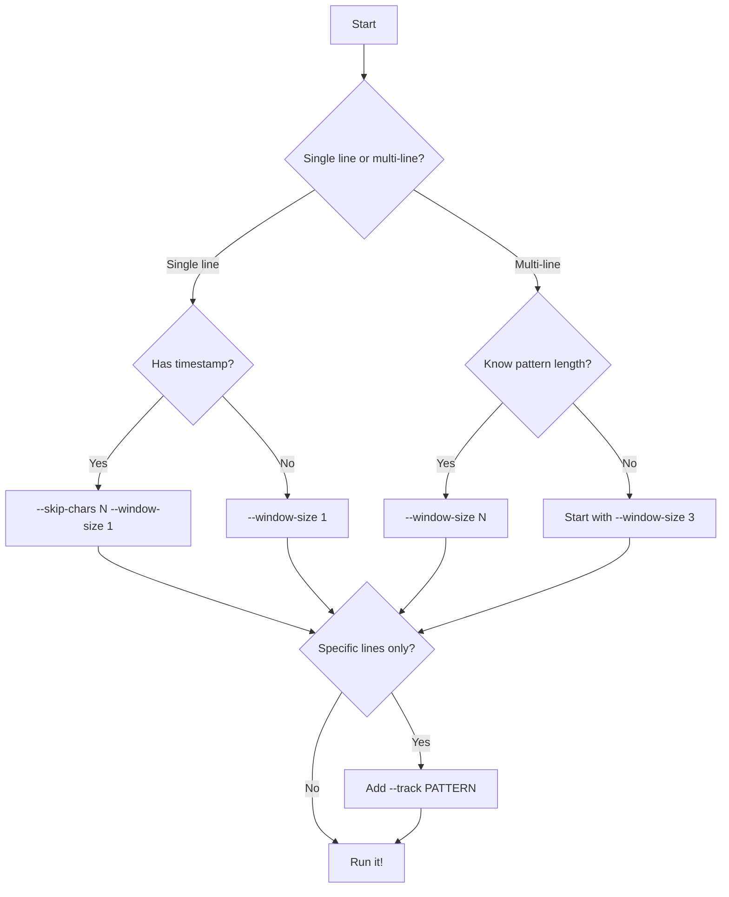

# Common Patterns

Quick reference for common uniqseq use cases and patterns. Each pattern includes copy-paste ready commands.

## Pattern Reference

| Pattern | Command | Use Case |
|---------|---------|----------|
| **Single-line logs** | `uniqseq --window-size 1 app.log` | Deduplicate independent log lines |
| **Timestamped errors** | `uniqseq --skip-chars 24 --window-size 1 app.log` | Ignore timestamps |
| **Stack traces** | `uniqseq --window-size 5 app.log` | Multi-line error patterns |
| **Only ERROR lines** | `uniqseq --track '^ERROR' app.log` | Deduplicate specific lines |
| **Live monitoring** | `tail -f app.log \| uniqseq` | Real-time deduplication |
| **Normalized comparison** | `uniqseq --hash-transform "tr -s ' '" app.log` | Ignore whitespace variations |
| **Field-based** | `uniqseq --hash-transform "awk '{print \$3}'" app.log` | Compare specific fields |
| **Binary data** | `uniqseq --byte-mode --delimiter-hex 00 data.bin` | Deduplicate binary records |

## Log File Patterns

### Pattern 1: Simple Error Log

**Scenario**: Single-line error messages that repeat

```bash
# Input
ERROR: Connection refused
INFO: Retrying...
ERROR: Connection refused  ← Duplicate
WARN: Timeout approaching
ERROR: Connection refused  ← Duplicate

# Command
uniqseq --window-size 1 error.log

# Output (2 duplicates removed)
ERROR: Connection refused
INFO: Retrying...
WARN: Timeout approaching
```

**When to use**: Each log line is independent (no multi-line patterns)

### Pattern 2: Timestamped Logs

**Scenario**: Same message repeats with different timestamps

```bash
# Input
2024-01-15 10:30:01 ERROR: Database timeout
2024-01-15 10:30:05 INFO: Retrying connection
2024-01-15 10:30:10 ERROR: Database timeout  ← Duplicate (different time)

# Command - Skip 20-character timestamp
uniqseq --skip-chars 20 --window-size 1 app.log

# Output (1 duplicate removed)
2024-01-15 10:30:01 ERROR: Database timeout
2024-01-15 10:30:05 INFO: Retrying connection
```

**When to use**: Logs have fixed-width timestamp prefix

**How to determine skip-chars**:
```bash
# Count characters in timestamp prefix
echo "[2024-01-15 10:30:01] " | wc -c
# Result: 22 → use --skip-chars 22
```

### Pattern 3: Stack Traces

**Scenario**: Multi-line error messages with stack traces

```bash
# Input
ERROR: NullPointerException
  at com.app.Service.process(Service.java:42)
  at com.app.Main.run(Main.java:15)
INFO: Retrying...
ERROR: NullPointerException               ← Duplicate 3-line
  at com.app.Service.process(Service.java:42)  ← pattern
  at com.app.Main.run(Main.java:15)

# Command - Match 3-line sequences
uniqseq --window-size 3 --skip-chars 20 app.log

# Output (3 duplicate lines removed)
ERROR: NullPointerException
  at com.app.Service.process(Service.java:42)
  at com.app.Main.run(Main.java:15)
INFO: Retrying...
```

**When to use**: Errors span multiple lines (stack traces, JSON, etc.)

**Choosing window size**: Count lines in typical pattern
- 3-line stack trace → `--window-size 3`
- 5-10 line stack trace → `--window-size 5`
- Variable length → Start with smaller window

### Pattern 4: Selective Deduplication

**Scenario**: Only deduplicate ERROR lines, keep all others

```bash
# Input
INFO: Starting process
ERROR: Validation failed
DEBUG: Processing item 1
ERROR: Validation failed  ← Duplicate
DEBUG: Processing item 2

# Command - Track only ERROR lines
uniqseq --track '^ERROR' --window-size 1 app.log

# Output (1 ERROR duplicate removed, all DEBUG/INFO kept)
INFO: Starting process
ERROR: Validation failed
DEBUG: Processing item 1
DEBUG: Processing item 2
```

**When to use**: Only certain log levels need deduplication

**Pattern variations**:
```bash
# Deduplicate multiple patterns
uniqseq --track '^ERROR' --track '^WARN' app.log

# Never deduplicate certain lines
uniqseq --bypass '^HEALTH_CHECK' app.log

# Load patterns from file
uniqseq --track-file patterns.txt app.log
```

## Real-Time Monitoring Patterns

### Pattern 5: Live Log Tailing

**Scenario**: Monitor live logs with duplicate suppression

```bash
# Watch logs in real-time, remove duplicate errors
tail -f /var/log/app.log | \
    uniqseq --window-size 1 \
            --skip-chars 24 \
            --track '^ERROR'
```

**When to use**: Real-time monitoring dashboards, alerting

**Key options**:
- Small `--max-history` for bounded memory
- `--track` to filter noise
- `--quiet` to suppress statistics

### Pattern 6: Error Alerting

**Scenario**: Alert only on NEW error patterns

```bash
# Store known error patterns
uniqseq app.log \
    --library-dir /var/patterns/errors \
    --track '^ERROR' \
    --quiet > /dev/null

# Alert on new patterns only
tail -f app.log | \
    uniqseq --track '^ERROR' \
            --read-sequences /var/patterns/errors/sequences \
            --inverse | \
    while read line; do
        curl -X POST https://alerts.example.com -d "$line"
    done
```

**When to use**: Alert fatigue reduction, incident detection

## Data Processing Patterns

### Pattern 7: Normalized Comparison

**Scenario**: Lines differ only in whitespace or case

```bash
# Input
ERROR:   Connection    failed     ← Extra spaces
ERROR: Connection failed           ← Normal spacing

# Command - Normalize whitespace before hashing
uniqseq --hash-transform "tr -s ' '" \
        --window-size 1 app.log

# Output (treated as duplicate despite spacing difference)
ERROR:   Connection    failed
```

**Common normalizations**:
```bash
# Case-insensitive
uniqseq --hash-transform "tr '[:upper:]' '[:lower:]'" app.log

# Remove all numbers
uniqseq --hash-transform "sed 's/[0-9]//g'" app.log

# Normalize whitespace + lowercase
uniqseq --hash-transform "tr -s ' ' | tr '[:upper:]' '[:lower:]'" app.log
```

### Pattern 8: Field-Based Deduplication

**Scenario**: Compare only specific fields

```bash
# Input (CSV-like logs)
2024-01-15,user123,ERROR,Connection failed
2024-01-15,user456,ERROR,Connection failed  ← Same error, different user

# Command - Compare only error message (field 4)
uniqseq --hash-transform "awk -F',' '{print \$3, \$4}'" \
        --window-size 1 app.log

# Output (second line removed - same error type and message)
2024-01-15,user123,ERROR,Connection failed
```

**When to use**: Logs with structured fields, want to deduplicate by specific columns

**Field extraction examples**:
```bash
# Compare fields 3-5
uniqseq --hash-transform "awk '{print \$3, \$4, \$5}'" app.log

# CSV field extraction
uniqseq --hash-transform "cut -d',' -f3,4" app.csv

# JSON field extraction (requires jq)
uniqseq --hash-transform "jq -r '.level + .message'" app.json
```

## Build and CI Patterns

### Pattern 9: Compiler Warnings

**Scenario**: Build logs with repeated warnings

```bash
# Input
warning: unused variable 'result'
  --> src/main.rs:42:9
42 |     let result = calculate();
   |         ^^^^^^

# Command - Match 4-line warning blocks
uniqseq --window-size 4 build.log

# Output (only unique warnings)
```

**When to use**: Compiler/linter output with multi-line warnings

### Pattern 10: Test Failures

**Scenario**: Test suite with repeated failures

```bash
# Track only failures, ignore passing tests
uniqseq --track '^FAIL' \
        --track '^ERROR' \
        --window-size 5 \
        test-output.log
```

## Binary and Structured Data Patterns

### Pattern 11: Binary Records

**Scenario**: Binary file with null-delimited records

```bash
# Deduplicate binary records separated by null bytes
uniqseq --byte-mode \
        --delimiter-hex 00 \
        data.bin > unique-records.bin
```

**When to use**: Binary protocols, null-terminated strings

### Pattern 12: CSV Deduplication

**Scenario**: CSV file with duplicate rows

```bash
# Use newline delimiter, deduplicate entire rows
uniqseq --window-size 1 data.csv > unique-rows.csv
```

**When to use**: Deduplicate complete CSV rows

## Pattern Combinations

### Pattern 13: Multi-Stage Pipeline

**Scenario**: Apply multiple transformations

```bash
# Stage 1: Extract ERROR lines
# Stage 2: Remove timestamps
# Stage 3: Deduplicate

grep 'ERROR' app.log | \
    sed 's/^[^ ]* //' | \
    uniqseq --window-size 1
```

### Pattern 14: Progressive Deduplication

**Scenario**: Process multiple log files, track patterns across all

```bash
# Initialize library with first file
uniqseq --library-dir /tmp/patterns log1.log > clean1.log

# Process additional files, inheriting patterns
uniqseq --library-dir /tmp/patterns log2.log > clean2.log
uniqseq --library-dir /tmp/patterns log3.log > clean3.log
```

**When to use**: Log rotation, multiple servers, time-series logs

### Pattern 15: Annotated Analysis

**Scenario**: See what's being deduplicated

```bash
# Add annotations showing which lines are duplicates
uniqseq --annotate app.log | less

# Output format:
# [NEW] First occurrence of pattern
# Line content...
# [DUPLICATE #2] Second occurrence
# Line content...
```

**When to use**: Debugging deduplication, understanding patterns

## Quick Troubleshooting

### "Nothing is being deduplicated"

**Try**:
1. Use `--window-size 1` (simplest case)
2. Check if timestamps differ: use `--skip-chars N`
3. Check if whitespace differs: use `--hash-transform "tr -s ' '"`
4. Use `--annotate` to see what's happening

### "Too much is being removed"

**Try**:
1. Increase `--window-size` (require longer matches)
2. Remove `--skip-chars` (don't ignore prefixes)
3. Use `--track` to limit which lines are deduplicated
4. Check with `--annotate` to see what's being marked

### "Performance is slow"

**Try**:
1. Use smallest `--window-size` that works
2. Replace `--hash-transform` with `--skip-chars` if possible
3. Use `--track` to filter unnecessary lines
4. Use `--max-history 10000` instead of unlimited

## Pattern Selection Guide

**Choose based on your data**:



## Real-World Workflow Examples

### DevOps: Clean CI Logs

```bash
#!/bin/bash
# Clean CI logs for storage

for log in /var/ci/build-*.log; do
    uniqseq "$log" \
        --window-size 3 \
        --skip-chars 24 \
        --track '^ERROR' \
        --track '^WARN' \
        --quiet > "${log}.clean"
done
```

### SRE: Monitor Production Errors

```bash
#!/bin/bash
# Alert on new error patterns

PATTERNS="/var/patterns/known-errors"

tail -f /var/log/production.log | \
    grep 'ERROR' | \
    uniqseq --skip-chars 24 \
            --window-size 1 \
            --read-sequences "${PATTERNS}/sequences" \
            --inverse | \
    while read line; do
        echo "NEW ERROR: $line"
        # Send to Slack, PagerDuty, etc.
    done
```

### QA: Analyze Test Failures

```bash
#!/bin/bash
# Extract unique test failures

uniqseq test-output.log \
    --track '^FAIL' \
    --window-size 5 \
    --annotate | \
    grep -A 5 'NEW'
```

## See Also

- [Choosing Window Size](./choosing-window-size.md) - Detailed window size guidance
- [Performance Guide](./performance.md) - Optimization tips
- [Troubleshooting](./troubleshooting.md) - Solving common issues
- [Use Cases](../use-cases/) - Detailed scenario-specific examples
