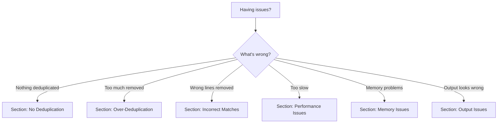

# Troubleshooting Guide

Solutions to common problems when using uniqseq.

## Quick Diagnosis

Use this flowchart to identify your issue:



## Section 1: No Deduplication

### Problem: All lines are kept, nothing removed

**Symptom**: uniqseq outputs the same number of lines as input

**Common causes**:

#### Cause 1: Lines are actually unique

**Diagnosis**:
```bash
# Check if lines actually repeat
sort your-file.log | uniq -c | sort -rn | head -10
```

If all counts are `1`, your lines are truly unique - no deduplication is possible.

**Solution**: This is expected behavior. If you believe lines should match, check other causes below.

#### Cause 2: Timestamps make lines different

**Diagnosis**:
```bash
# Look at first few lines
head -10 your-file.log
```

Do you see timestamps like `2024-01-15 10:30:01` at the start?

**Solution**: Use `--skip-chars` to ignore timestamp prefix

```bash
# Count characters in timestamp
echo "2024-01-15 10:30:01 " | wc -c
# Result: 21

# Use skip-chars
uniqseq --skip-chars 21 --window-size 1 your-file.log
```

**Quick test**:
```bash
# Does this work?
uniqseq --skip-chars 24 --window-size 1 your-file.log | wc -l
```

If line count decreases, timestamps were the issue.

#### Cause 3: Whitespace variations

**Diagnosis**:
```bash
# Check for whitespace differences
head -20 your-file.log | cat -A
```

Look for:
- Multiple spaces: `ERROR:  Connection` vs `ERROR: Connection`
- Tabs vs spaces: `^I` indicates tab character
- Trailing whitespace: `$` at unexpected positions

**Solution**: Normalize whitespace before comparison

```bash
# Squeeze multiple spaces to single space
uniqseq --hash-transform "tr -s ' '" --window-size 1 your-file.log

# Remove all whitespace
uniqseq --hash-transform "tr -d ' \\t'" --window-size 1 your-file.log
```

#### Cause 4: Window size too large

**Diagnosis**:
```bash
# Try with window size 1
uniqseq --window-size 1 your-file.log | wc -l
```

If this removes duplicates but your original command didn't, your window size was too large.

**Solution**: Use smaller window size

```bash
# Instead of this:
uniqseq --window-size 10 your-file.log

# Try this:
uniqseq --window-size 1 your-file.log
```

**Rule**: Window size must be ≤ pattern length. If patterns are 3 lines, window size > 3 won't detect them.

#### Cause 5: History limit reached

**Diagnosis**: Check statistics for history evictions

```bash
uniqseq your-file.log --stats-format json 2>&1 | \
    jq '.statistics.unique_sequences_tracked'
```

If this number equals your `--max-history` value (default 100,000 for stdin, unlimited for files), history may be full.

**Solution**: Use unlimited history

```bash
# For file input (automatic):
uniqseq your-file.log

# For stdin (explicit):
cat your-file.log | uniqseq --unlimited-history
```

#### Debugging: Use --annotate

**See what uniqseq is detecting**:
```bash
uniqseq --annotate your-file.log | head -50
```

Look for `[NEW]` tags. If everything is `[NEW]`, nothing is matching.

## Section 2: Over-Deduplication

### Problem: Too many lines removed

**Symptom**: Important variations are being treated as duplicates

**Common causes**:

#### Cause 1: Window size too small

**Diagnosis**: Small window size can create false matches

```bash
# Example with window-size 1:
Line A   ← Unique
Line B   ← Unique
Line A   ← Treated as duplicate (matches first line)
Line C   ← Unique
```

But you wanted to match multi-line patterns like:
```
Line A
Line B
```

**Solution**: Increase window size

```bash
# If you want to match 3-line patterns:
uniqseq --window-size 3 your-file.log

# Not:
uniqseq --window-size 1 your-file.log
```

#### Cause 2: Skipping too many characters

**Diagnosis**: Are you skipping past important distinguishing features?

```bash
# Example: Skipping 50 characters
ERROR: Connection to database failed
ERROR: Connection to server failed
       └─ If skip-chars skips past "database"/"server", these look identical
```

**Solution**: Skip fewer characters or none

```bash
# Instead of:
uniqseq --skip-chars 50 your-file.log

# Try:
uniqseq --skip-chars 20 your-file.log

# Or remove skip-chars entirely:
uniqseq your-file.log
```

#### Cause 3: Overly aggressive normalization

**Diagnosis**: Is `--hash-transform` removing too much?

```bash
# Example: Removing all numbers
ERROR: Port 8080 connection failed
ERROR: Port 5432 connection failed
       └─ Without numbers, both become "ERROR: Port connection failed"
```

**Solution**: Less aggressive transformation

```bash
# Instead of removing all numbers:
uniqseq --hash-transform "sed 's/[0-9]//g'" your-file.log

# Just normalize timestamps:
uniqseq --hash-transform "sed 's/2024-[0-9-]*//g'" your-file.log

# Or use skip-chars instead:
uniqseq --skip-chars 24 your-file.log
```

#### Cause 4: Not using pattern filtering

**Problem**: Deduplicating lines that should always be kept

**Solution**: Use `--bypass` to never deduplicate certain lines

```bash
# Never deduplicate HEALTH_CHECK lines
uniqseq --bypass 'HEALTH_CHECK' your-file.log

# Only deduplicate ERROR lines
uniqseq --track '^ERROR' your-file.log
```

#### Debugging: Check with --annotate

```bash
uniqseq --annotate your-file.log | grep -A 2 'DUPLICATE'
```

Look at what's being marked as duplicate. Is it actually the same?

## Section 3: Incorrect Matches

### Problem: Wrong lines are being treated as duplicates

**Diagnosis**: Lines that are different are matching

**Common causes**:

#### Cause 1: Skip-chars value is wrong

**Problem**: Skipping past differentiating content

```bash
# Lines differ at position 25, but skip-chars is 30
[2024-01-15 10:30:01] ERROR: Database failed
[2024-01-15 10:30:01] ERROR: Network failed
                             ^─ difference at position 30

# With --skip-chars 35, both look like "failed"
```

**Solution**: Calculate correct skip-chars

```bash
# Count actual timestamp length
head -1 your-file.log | sed 's/\([0-9-: T]*\).*/\1/' | wc -c

# Use that exact value
uniqseq --skip-chars 21 your-file.log
```

#### Cause 2: Hash transformation is too aggressive

**Problem**: Transform removes distinguishing features

**Solution**: Review and refine transformation

```bash
# BAD: Removes too much
uniqseq --hash-transform "sed 's/[a-z]//g'" your-file.log

# GOOD: Removes only timestamps
uniqseq --hash-transform "sed 's/^[0-9: -]* //'" your-file.log
```

#### Debugging: Compare hashed vs original

```bash
# See what the hash transform produces
head -10 your-file.log | while read line; do
    echo "Original: $line"
    echo "Transformed: $(echo "$line" | your-transform-command)"
    echo
done
```

## Section 4: Performance Issues

### Problem: uniqseq is too slow

**Common causes**:

#### Cause 1: Window size too large

**Diagnosis**:
```bash
# Time different window sizes
time uniqseq --window-size 1 your-file.log > /dev/null
time uniqseq --window-size 50 your-file.log > /dev/null
```

Large window size = more comparisons = slower

**Solution**: Use smallest window that works

```bash
# Start small and increase if needed
uniqseq --window-size 1 your-file.log
```

#### Cause 2: Expensive hash transform

**Diagnosis**: Hash transforms spawn subprocess per line

```bash
# Slow: Complex pipeline
uniqseq --hash-transform "sed ... | awk ... | grep ..." your-file.log

# Fast: No transform
uniqseq --skip-chars 20 your-file.log
```

**Solution**: Replace transform with skip-chars or preprocess

```bash
# Option 1: Use skip-chars
uniqseq --skip-chars 24 your-file.log

# Option 2: Preprocess once
sed 's/complex-pattern//g' your-file.log | uniqseq --window-size 3
```

#### Cause 3: Processing unnecessary lines

**Solution**: Filter with --track

```bash
# Before: Process all lines
uniqseq your-file.log

# After: Only process ERROR lines
uniqseq --track '^ERROR' your-file.log
```

**See also**: [Performance Guide](./performance.md) for detailed optimization

## Section 5: Memory Issues

### Problem: uniqseq using too much memory

**Diagnosis**:
```bash
# Monitor memory usage
/usr/bin/time -v uniqseq your-file.log 2>&1 | grep "Maximum resident"
```

**Common causes**:

#### Cause 1: Unlimited history with large input

**Problem**: File mode defaults to unlimited history

**Solution**: Use bounded history

```bash
# Limit history entries
uniqseq --max-history 10000 your-file.log

# For very large files
uniqseq --max-history 50000 your-file.log
```

**Trade-off**: May miss distant duplicates

#### Cause 2: Many unique patterns

**Diagnosis**: Check statistics

```bash
uniqseq your-file.log --stats-format json 2>&1 | \
    jq '.statistics.unique_sequences_tracked'
```

High number (> 100,000) means many unique patterns stored in memory

**Solution**:
1. Use smaller window size (fewer unique patterns)
2. Use pattern filtering to limit what's tracked
3. Increase system memory or process in chunks

#### Cause 3: Large window size

**Problem**: Window buffer scales with window size

**Solution**: Reduce window size

```bash
# Instead of:
uniqseq --window-size 100 your-file.log

# Use:
uniqseq --window-size 10 your-file.log
```

## Section 6: Output Issues

### Problem: Output looks wrong or corrupted

**Common causes**:

#### Cause 1: Incorrect delimiter

**Problem**: Using wrong record delimiter

**Diagnosis**:
```bash
# Check file format
file your-file.log
hexdump -C your-file.log | head -20
```

**Solution**: Specify correct delimiter

```bash
# Null-delimited records
uniqseq --delimiter '\0' your-file.log

# Carriage-return delimited
uniqseq --delimiter '\r' your-file.log

# Custom hex delimiter
uniqseq --byte-mode --delimiter-hex 0a0d your-file.log
```

#### Cause 2: Binary data without byte mode

**Problem**: Processing binary file in text mode

**Symptoms**:
- Garbled output
- Encoding errors
- Unexpected line breaks

**Solution**: Use byte mode

```bash
uniqseq --byte-mode your-file.bin
```

#### Cause 3: Buffering with inverse mode

**Problem**: `--inverse` waits until end of stream to output

**This is expected behavior**:
```bash
# Output appears only after input completes
cat large-file.log | uniqseq --inverse
```

**Solution**: For real-time output, don't use `--inverse`

#### Cause 4: Statistics mixed with output

**Problem**: Statistics appear in output file

**Solution**: Use `--quiet` or redirect stderr

```bash
# Suppress statistics
uniqseq --quiet your-file.log > clean.log

# Or redirect stderr
uniqseq your-file.log > clean.log 2> stats.txt
```

## Section 7: Integration Issues

### Problem: uniqseq doesn't work in my pipeline

**Common causes**:

#### Cause 1: Buffering in pipe

**Problem**: Output delayed due to buffering

**Solution**: Use line buffering

```bash
# For grep before uniqseq
grep --line-buffered 'ERROR' app.log | uniqseq

# For awk
awk '{print} fflush()' data.log | uniqseq
```

#### Cause 2: SIGPIPE when piping to head

**This is normal**:
```bash
uniqseq large-file.log | head -10
# May see: "Broken pipe" error
```

**Solution**: This is expected Unix behavior. Use `|| true` to suppress:

```bash
uniqseq large-file.log | head -10 || true
```

#### Cause 3: Exit code confusion

**Problem**: Checking exit code incorrectly

**Correct usage**:
```bash
# uniqseq returns 0 on success, even if no duplicates found
if uniqseq your-file.log > output.log; then
    echo "Success"
else
    echo "Error occurred"
fi
```

## Debugging Techniques

### Technique 1: Start Simple

```bash
# Step 1: Most basic command
uniqseq --window-size 1 your-file.log

# Step 2: Add skip-chars if needed
uniqseq --window-size 1 --skip-chars 20 your-file.log

# Step 3: Increase window size if needed
uniqseq --window-size 3 --skip-chars 20 your-file.log

# Step 4: Add filters if needed
uniqseq --window-size 3 --skip-chars 20 --track '^ERROR' your-file.log
```

### Technique 2: Use Annotations

```bash
# See what's happening
uniqseq --annotate your-file.log | less
```

Look for:
- `[NEW]` - First occurrence (kept)
- `[DUPLICATE #N]` - Nth occurrence (removed unless --inverse)

### Technique 3: Test on Small Sample

```bash
# Extract first 1000 lines
head -1000 large-file.log > sample.log

# Test on sample
uniqseq --annotate sample.log | less
```

Faster iteration, easier to understand.

### Technique 4: Compare with Oracle

```bash
# For single-line deduplication, compare with sort|uniq
uniqseq --window-size 1 file.log | sort > uniqseq-output.txt
sort file.log | uniq > uniq-output.txt
diff uniqseq-output.txt uniq-output.txt
```

Should be identical (except order).

### Technique 5: Check Statistics

```bash
# Get detailed statistics
uniqseq your-file.log --stats-format json 2>&1 | jq '.statistics'
```

Key metrics:
- `lines.total`: Total lines processed
- `lines.skipped`: Duplicates removed
- `redundancy_pct`: Percentage of duplicates
- `unique_sequences_tracked`: Number of unique patterns

### Technique 6: Verbose Mode (if available)

```bash
# If you need more debugging info
RUST_LOG=debug uniqseq your-file.log
```

## Getting Help

### Before Asking for Help

Gather this information:

1. **uniqseq version**:
   ```bash
   uniqseq --version
   ```

2. **Command used**:
   ```bash
   # Include full command with all options
   uniqseq --window-size 3 --skip-chars 20 file.log
   ```

3. **Sample input** (first 20 lines):
   ```bash
   head -20 your-file.log
   ```

4. **Expected vs actual output**:
   - What you expected to happen
   - What actually happened

5. **Statistics**:
   ```bash
   uniqseq your-file.log --stats-format json 2>&1
   ```

### Where to Get Help

- **GitHub Issues**: https://github.com/crate-ci/uniqseq/issues
- **Documentation**: https://docs.rs/uniqseq
- **Examples**: Check [Common Patterns](./common-patterns.md)

## Common Error Messages

### Error: "Window size must be at least 1"

**Cause**: Invalid window size specified

**Solution**: Use valid window size ≥ 1

```bash
uniqseq --window-size 1 your-file.log
```

### Error: "Skip chars must be non-negative"

**Cause**: Negative skip-chars value

**Solution**: Use valid skip-chars ≥ 0

```bash
uniqseq --skip-chars 0 your-file.log
```

### Error: "Failed to open file"

**Cause**: File doesn't exist or no read permission

**Solution**: Check file path and permissions

```bash
# Check if file exists
ls -l your-file.log

# Check permissions
chmod +r your-file.log
```

### Error: "Invalid regex pattern"

**Cause**: Malformed regex in `--track` or `--bypass`

**Solution**: Test regex separately

```bash
# Test regex with grep first
grep '^ERROR' your-file.log

# Then use in uniqseq
uniqseq --track '^ERROR' your-file.log
```

### Error: "Delimiter must be single character"

**Cause**: Multi-character delimiter in text mode

**Solution**: Use escape sequences or hex mode

```bash
# Use escape sequence
uniqseq --delimiter '\n' your-file.log

# Or use hex mode for multi-byte delimiters
uniqseq --byte-mode --delimiter-hex 0d0a your-file.log
```

## See Also

- [Common Patterns](./common-patterns.md) - Working examples for common use cases
- [Choosing Window Size](./choosing-window-size.md) - Window size selection guide
- [Performance Guide](./performance.md) - Optimization tips
- [CLI Reference](../reference/cli.md) - Complete option documentation
