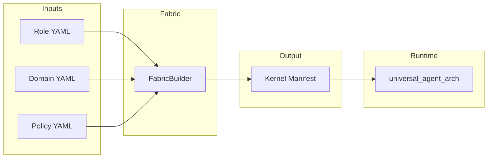

# Universal Agent Fabric

**The Ontology, Governance, and Composition layer for the Agent OS.**

[](https://github.com/mjdevaccount/universal_agent_fabric/actions)
[](https://www.python.org/)
[](LICENSE)
[](https://pypi.org/project/universal-agent-fabric/)

---

## The Problem

You have agents. Dozens of them. Each one is a bespoke snowflake—prompts copy-pasted, tools re-wired, governance bolted on as an afterthought. When you need to update a safety rail, you touch 47 files. When you add a new capability, you forget three agents. Your "fleet" is a fragmented mess of YAML, JSON, and tribal knowledge.

**This does not scale.**

## The Solution

**Fabric** is a library of possibilities. It applies the DRY principle to AI agents.

Instead of defining each agent from scratch, you compose them from reusable fragments:

| Fragment | Purpose |
|----------|---------|
| **Role** | *Who* the agent is (persona, reasoning style, base graph) |
| **Domain** | *What* the agent knows (tools, vocabularies, context) |
| **Policy** | *What* the agent cannot do (governance, guardrails, budgets) |

These fragments are **compiled** into a single, deployable manifest for the [Universal Agent Kernel](https://github.com/mjdevaccount/universal_agent_architecture).

```
┌─────────────────────────────────────────────────────────────────┐
│                         FABRIC                                  │
│   "The Physics, Laws, and Biology of the Agent Universe"        │
└─────────────────────────────────────────────────────────────────┘
                              │
                              ▼
┌─────────────────────────────────────────────────────────────────┐
│                         KERNEL                                  │
│   "The Runtime. Executes what Fabric defines."                  │
└─────────────────────────────────────────────────────────────────┘
```

---

## The Taxonomy

Fabric organizes agent definitions into four core abstractions:

### ◈ ARCHETYPES — `manifests/roles/`

Reusable agent personas. Not instances—*classes*.

An Archetype defines:
- The **base graph template** (planning loop, ReAct, debate)
- The **system prompt skeleton**
- The **default capability set**

```yaml
# manifests/roles/researcher.yaml
name: "Senior Researcher"
base_template: "planning_loop"
system_prompt_template: |
  You are a Senior Researcher. Synthesize information deeply.
  Never provide surface-level answers. Always cite sources.
default_capabilities:
  - "web_search"
  - "read_file"
```

One Archetype. Fifty agents. Zero duplication.

---

### ◈ LAWS — `policy/`

Governance as Code. Applied at build time, not runtime.

Policies are injected into the manifest before deployment. Agents cannot bypass what they never receive.

```yaml
# policy/rules/safety.yaml
- name: "no_trading"
  target_pattern: "execute_trade"
  action: "require_approval"
  conditions:
    risk_level: "high"

- name: "read_only_fs"
  target_pattern: "delete_file"
  action: "deny"
```

Security engineers own this directory. Prompt engineers never touch it.

---

### ◈ MATTER — `ontology/`

The capability definitions. Domain-specific tools and vocabularies.

A Domain bundles:
- **Capabilities**: Abstract tool definitions (protocol, config templates)
- **System Prompt Mixins**: Context injected into routers
- **Vocabularies**: Domain-specific terminology

```yaml
# ontology/domains/finance.yaml
name: "Finance Domain"
description: "Tools and knowledge for financial analysis."

system_prompt_mixin: |
  You have access to real-time market data.
  All monetary values must be formatted as USD.
  Be aware of SEC regulations regarding forward-looking statements.

capabilities:
  - name: "get_stock_price"
    description: "Get current price for a ticker."
    protocol: "mcp"
    config_template:
      command: "mcp-finance"

  - name: "get_company_filings"
    description: "Retrieve 10-K/10-Q filings."
    protocol: "mcp"
    config_template:
      command: "mcp-sec"
```

Define "Web Search" once. Use it in 50 agents.

---

### ◈ GENESIS — `composition/`

The build system. Mixins and templates for stitching fragments together.

```
composition/
├── mixins/          # Injectable behaviors (observability, safety prompts)
└── templates/       # Workflow patterns (fan-out, checkpointing)
```

---

## The Compilation Pipeline



**What happens during compilation:**

1. **Load** — Parse YAML into Pydantic models (`Role`, `Domain`, `GovernanceRule`)
2. **Assemble** — Create `FabricSpec` (the universe definition for one agent)
3. **Compile Policies** — Convert governance rules to kernel `PolicySpec`
4. **Compile Tools** — Aggregate capabilities from domains; attach policy refs
5. **Compile Routers** — Merge role prompts with domain mixins; wire governance
6. **Compile Graph** — Instantiate the base template with router and tool nodes
7. **Emit** — Write kernel-compatible YAML/JSON

---

## Usage

### Installation

```bash
pip install universal-agent-fabric
```

For development (includes kernel for integration tests):

```bash
pip install universal-agent-fabric[dev]
```

### The Build Command

```bash
fabric build \
  --role manifests/roles/researcher.yaml \
  --domain ontology/domains/finance.yaml \
  --policy policy/rules/safety.yaml \
  --name finance-researcher \
  --out dist/finance_agent.manifest.yaml
```

Or via module:

```bash
python -m universal_agent_fabric.cli \
  --role manifests/roles/researcher.yaml \
  --domain ontology/domains/finance.yaml \
  --policy policy/rules/safety.yaml \
  --out dist/finance_agent.manifest.yaml
```

### CLI Reference

| Flag | Required | Description |
|------|----------|-------------|
| `--role` | Yes | Path to Role YAML |
| `--domain` | No | Path to Domain YAML (repeatable) |
| `--policy` | No | Path to Policy YAML (repeatable) |
| `--name` | No | Manifest name (default: `generated-agent`) |
| `--out` | No | Output path (default: `manifest.yaml`) |

### Deploying to the Kernel

```bash
# 1. Compile with Fabric
fabric build \
  --role manifests/roles/researcher.yaml \
  --domain ontology/domains/finance.yaml \
  --out my_agent.yaml

# 2. Install the kernel
pip install universal-agent-arch

# 3. Run the agent
cp my_agent.yaml manifest.yaml
uvicorn universal_agent.runtime.api:app --reload
```

---

## Why Fabric?

### Governance as Code

Policies are not suggestions. They are compiled into the manifest.

An agent built without `policy/rules/safety.yaml` literally cannot call `delete_file`. The capability is never wired. The guardrail is structural, not behavioral.

### Composable Skills

```
ontology/capabilities/web_search.yaml  →  Used by 50 agents
ontology/capabilities/code_exec.yaml   →  Used by 12 agents
ontology/domains/finance.yaml          →  Used by 8 agents
```

Update the capability once. Recompile. Done.

### Separation of Concerns

| Directory | Owner | Responsibility |
|-----------|-------|----------------|
| `manifests/roles/` | Prompt Engineers | Agent personas, reasoning styles |
| `ontology/domains/` | Domain Experts | Tools, vocabularies, context |
| `policy/rules/` | Security Engineers | Governance, guardrails, budgets |
| `composition/` | Platform Engineers | Build patterns, mixins |

No one steps on anyone's toes.

### Fleet Management

This is how you manage 1,000 agents without losing your mind:

1. Define 10 Archetypes
2. Define 15 Domains
3. Define 5 Policy Sets
4. Compose 1,000 unique agents from combinations
5. Update a guardrail in one file
6. Recompile the fleet

---

## Directory Structure

```
universal_agent_fabric/
│
├── manifests/
│   ├── roles/              # Agent archetypes
│   │   └── researcher.yaml
│   ├── graphs/             # Graph topology templates
│   └── examples/           # Reference manifests
│
├── policy/
│   ├── rules/              # Atomic governance rules
│   │   └── safety.yaml
│   ├── templates/          # Parametric policies
│   └── validators/         # Policy validation logic
│
├── ontology/
│   ├── domains/            # Domain-specific bundles
│   │   └── finance.yaml
│   ├── capabilities/       # Abstract tool definitions
│   └── protocols/          # Protocol specifications
│
├── composition/
│   ├── templates/          # Composable workflow patterns
│   └── mixins/             # Reusable behavior fragments
│
├── universal_agent_fabric/ # Python package
│   ├── schemas.py          # Pydantic models (Role, Domain, etc.)
│   ├── builder.py          # Compilation logic
│   └── cli.py              # Command-line interface
│
├── tests/                  # Integration tests against kernel schema
├── pyproject.toml          # Package configuration
└── README.md
```

---

## Schema Reference

### FabricSpec

The root specification for compiling an agent.

```python
class FabricSpec(BaseModel):
    name: str
    role: Role
    domains: List[Domain]
    governance: List[GovernanceRule]
```

### Output Format

Compiled manifests conform to the kernel's `AgentManifest` schema:

| Fabric Concept | Kernel Schema | Notes |
|----------------|---------------|-------|
| `Role.system_prompt_template` | `RouterSpec.system_message` | Merged with domain mixins |
| `Domain.capabilities` | `ToolSpec[]` | Protocol: `mcp`, `http`, `local`, `subprocess` |
| `GovernanceRule` | `PolicySpec.rules[]` | Actions: `allow`, `deny`, `require_approval` |
| `Role.base_template` | `GraphSpec.metadata.extra.template` | Preserved for traceability |

---

## Development

```bash
# Clone
git clone https://github.com/mjdevaccount/universal_agent_fabric.git
cd universal_agent_fabric

# Create venv
python -m venv .venv
.\.venv\Scripts\Activate.ps1  # Windows
source .venv/bin/activate      # Unix

# Install with dev deps
pip install -e ".[dev]"

# Run tests
pytest tests/ -v
```

---

## License

MIT

---

<p align="center">
  <strong>Fabric defines. Kernel executes.</strong><br>
  <em>Separate the universe from its physics.</em>
</p>
