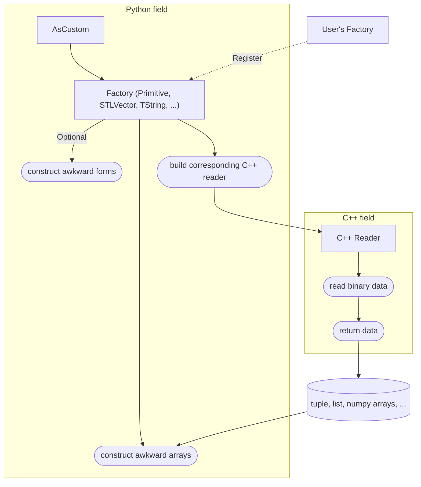

# Introduction

`uproot-custom` is an extension of [`uproot`](https://uproot.readthedocs.io/en/latest/basic.html) that provides an enhanced way to read custom classes stored in `TTree`.

## When to use `uproot-custom`

`uproot-custom` aims to handle cases that classes are too complex for `uproot` to read, such as when their `Streamer` methods are overridden or some specific data members are not supported by `uproot`.

## How `uproot-custom` works

`uproot-custom` uses a `reader`/`factory` mechanism to read classes:

- `reader` is a C++ class that implements the logic to read data from binary buffers.
- `factory` is a Python class that creates, combines `reader`s, and post-processes the data read by `reader`s.

This machanism is implemented basing on `uproot_custom.AsCustom` interpretation. This makes `uproot-custom` well compatible with `uproot`.

> [!TIP]
> Users can implement their own `factory` and `reader`, register them to `uproot-custom`. An example of implementing a custom `factory`/`reader` can be found in [the example repository](https://github.com/mrzimu/uproot-custom-example).

> [!NOTE]
> `uproot-custom` does not provide a full reimplementation of `ROOT`'s I/O system. Users are expected to implement their own `factory`/`reader` for their custom classes that built-in factories cannot handle.

## Documentation

View the [documentation](https://mrzimu.github.io/uproot-custom/) for more details about customizing your own `reader`/`factory`, and the architecture of `uproot-custom`.
