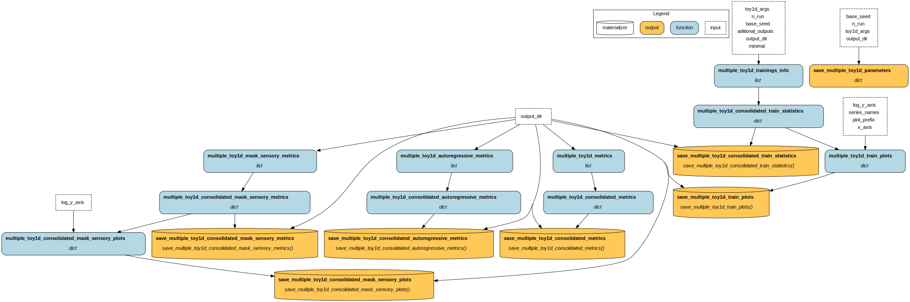
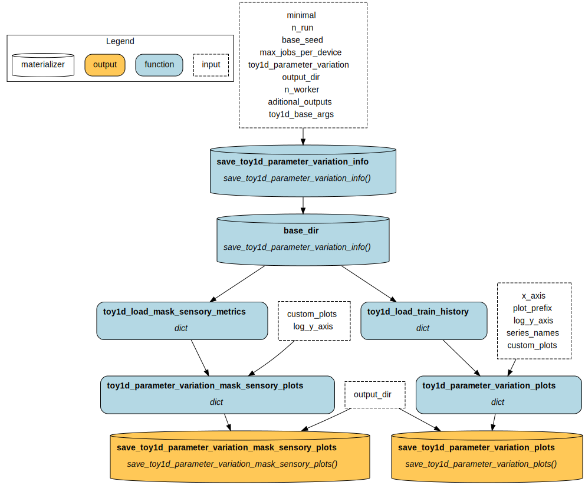
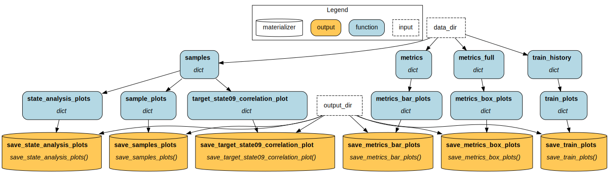

# World Machine - Toy1D - Experiment 0 Protocol Test

In this World Machine experiment, our goal is to perform an initial check of whether the model is trainable using the state-discovery approach. We also assess the potential impact of the training protocol by observing the performance of trained models across the defined tasks.

World Machine is a research project that investigates the concept and creation of computational world models. These AI systems create internal representations to understand and make predictions about the external world. See the [project page](https://h-iaac.github.io/WorldMachine/) for more information. The project is part of the [H.IAAC](https://hiaac.unicamp.br/en/), the Hub for Artificial Intelligence and Cognitive Architecture, located at the Universidade Estadual de Campinas (UNICAMP), Brazil.

## Artifacts 

These are the artifact versions related to this experiment.
If trying to re-run, please use these artifacts (mainly the Docker container).

Also, note that the experiment-generated data is available in the "Experiment Data" artifact.

- Code: [0.1](https://github.com/H-IAAC/WorldMachine/releases/tag/0.1)
- Docker Container: [eltoncn/world-machine:0.1](https://hub.docker.com/repository/docker/eltoncn/world-machine/tags/0.1/sha256-f3645e07e3d5863d12f51955aad0b61c38ce6b3be4ec61aac16ea32ce4420f22)
- Experiment Results: [](https://doi.org/10.5281/zenodo.17352548)

## Concepts

This section briefly presents the key concepts needed to understand this experiment.

### World Model, Computational World Model, State and Sensory Data.

A world model is the cognitive process that models the world in which the agent is and enables predictions about the current state and future of this world. An agent here can be a purely observational entity, that only sees but do not act in the world.

A computational world model is the computational system that makes predictions about the current and future state of a "world" based on the sensory data it receives, but inferring the internal structure of that world.

In this process, the "sensory data" is everything the agent can observe about the external world, and the "state" is the internal model the agent creates to make sense of and predict this sensory data. The "state" of the world model does not correspond to the real state of the external world.

### World Machine Architecture

The proposed architecture and protocol of this project. The architecture is a transform-based model that operates on "latent world states" ($ws$), vectors that encode the world model's state at each instant. At each step, the model predicts the next latent world state using the previous one, conditioned on sensory data.

The core of the model consists of transform blocks. These can be of type "State" for blocks that process only the latent state without sensory data, "\<Sensory Data Channel Name\>" for blocks that use a sensory channel, and "State Input" for blocks that use the state itself at the beginning of the time step as sensory input.

### State Discovery

To ensure that the "latent world state" has its own encoding, as determined by the model, we cannot provide these states in advance. However, as they are necessary for model training, we have the impasse of training a model without all its inputs.

To solve this problem, we randomly initialize the states. At each training step, the predicted states are saved and used for inference in the next step.

This process is called "State Discovery".

### Protocol Steps

We developed a series of steps for the World Machine training protocol.

One of them, "Sensory Masking," involves masking sensory data during training, hiding a random amount of data at each step.

Understanding in depth how other steps of the protocol work is not necessary to understand this experiment. See the [project page](https://h-iaac.github.io/WorldMachine/) for more information.

### Evaluation Tasks

To assess the capabilities of the World Machine, we established tasks to evaluate in the validation dataset after training:

- Normal: is a normal autoregressive inference. Note that this differs from the loss calculated during training, as we do not use states that are updated "in parallel" during training; instead, we estimate states sequentially, starting from the null state.
- Use state: inference on previously encoded states, without sensory data. We can calculate this in a single inference step by processing the sequence elements in parallel, since the model already encoded these states. We only evaluate this task at the first 50% of a sequence. If the model were merely taking sensory data and manipulating it to generate output, its performance on this task would be poor.
- Prediction: inference of future states, using several previous encoded states and without sensory data. We use the first 50% of states to evaluate the task in the final 50% of the sequence. 
- Prediction Shallow: inference of future states, using only one previous encoded state and without sensory data. We evaluate this task in the final 50% of the sequence. Prediction Shallow is the most important task, as it directly assesses the model's ability to perform inference with context truncation, which would otherwise incur a quadratic cost in sequence length and is a significant issue with current transformers.
- Prediction Local: inference using local mode, that is, of the next immediate state, using only one previous encoded state, without sensory data.
- MaskSensory@x: inference in the whole sequence, randomly masking x% of the sensory data.

### Toy1D Dataset

The _Toy1D_ is a synthetic dataset of one-dimensional time series. The series represents a damped physical system, given by:

$$ \vec{x}_{i+1} = F\vec{x}_i+\vec{u}_i $$
$$F =  \begin{bmatrix} 
                1 & \Delta t & \frac{\Delta t^2}{2} \\
                -0.1 \Delta t & 1 & \Delta t \\
                0 & 0 & 1
            \end{bmatrix}$$

with random initial states $\vec{x}_0$. The $\Delta t$ is unitary. The initial $x_0$ of each series is random, and $\vec{u}_i$ is a random sum of square and impulse waves. The data's second and third elements, $x_i^1$, $x_i^2$, are clipped during generation to the range $[-1,1]$ to avoid excessively high values. The final dataset only uses the position ($\vec{x}_i^0$) data in the final sensory channel named _external state_, with size 1. The external state is also referred to as "state decoded" in the experiment code and results. 

We define another sensory channel, measurement_, with size 2, as:

$$\vec{s}_i = \tanh(H \vec{x}_i)$$
$$H \sim Uniform(-1, 1)^{2\times2}$$

Where $H$ is fixed at the start of the dataset generation. Note that, depending on the data scales and the H matrix, the measurement can become very similar to the external state.

Since the dataset is stochastic, we can generate different data by controlling the seed of the random number generator. For each seed, we first generate 10,000 sequences of length 1,000 and then segment them into 40,000 sequences of length 200. Finally, we also scale each sequence to the interval $[-1,1]$. The dataset is split into 60\% for training, 20\% for validation, and 20\% for testing.

A sample of the dataset:


## Experiment Definition

### Hypotheses and Goals

- H1: The proposed architecture is trainable, using the state discovery method and generating a model capable of coherently predicting sequences
- H2: The proposed protocol generates different models, with different performance in the designed tasks
- G1: To observe the tasks' characteristics and differences
- G2: To observe the quality of the model predictions

### Design

We train different model configurations. Each configuration may vary in the number of protocol steps used:

- Base: only state discovery.
- Sensory Mask: state discovery and sensory masking.
- Complete Protocol: all steps developed so far, state discovery, sensory masking, sequence breaker, state-check sensory, fast forward, short time recall, noise adding and local mode.

The training loss is the sensory loss, in this case, the sum of the MSE of the external state $\vec{x}$  and the MSE of the measurement $\vec{s}_i$.

We compute the evaluation metrics using an early-saved model at the epoch with the minimum validation optimizer loss. However, training continues until the last epoch to generate training metrics.

The experiment is organized in a three-level pipeline, plus a final results pipeline: 
- The first **"Base"** level generates the dataset and the initial model, trains the model using the selected stages, evaluates the trained model on the defined tasks, and generates plots.
- **"Multiple Runs"** level executes the "Base" level with the same parameters, varying the utilized seed. Also aggregates all the runs metrics and generates plots.
- The **"Parameter Variation"** level executes "Multiple Runs" for each variation parameter.
- **"Final Results"** runs after the "Parameter Variation" ends. It generates the final visualization plots.
Note that not all the generated plots, available at the "Experiments Results" artifact, are used in this report.

Each pipeline graph showcases the executed functions, named by the outputs they generate:

- Base Pipeline:


- Multiple Runs Pipeline:


- Parameter Variation Pipeline:


- Final Results Pipeline:



### Randomization

At each run, the experiment pipeline randomizes the dataset, the model's initial parameters, and the random values generated and used at each protocol step by changing the RNG seed.

Randomization uses a fixed seed, the same for each run and each variation. So "Base-Run 0" uses the same random generator as "Sensory Mask". Since the values ​​depend on the order they are generated, we guarantee that at least the datasets generated for each run are the same between variations. 

### Sample size

For each variation, we train 15 models on a dataset of 40000 sequences, with 60% for training, 20% for validation, and 20% for test (not used).

### Manipulated variables

Training parameters:

- Batch size: 32
- Epochs: 100
- Optimizer: AdamW
- Learning rate: initial 1E-3
	- Cosine Annealing with Warmup scheduler
	 - T0: 25
	 - T_mult: 1
- Weight Decay: 1E-5

Common model parameters:

- State size: 128
- Positional encoder type: Alibi
- Attention heads: 4
- Block configuration: Measurement -> Measurement
- Sensory encoders and decoders: point-wise feedforwards

Protocol parameters (when used):

- State Discovery
	- Check input masks: True
	- Save state method: replace
- Sensory Masking
	- Uniform distribution masking rate between 0 and 1
- Sequence Breaker
	- N segment: 2
	- Fast Forward: True
- Short Time Recall
	- N (past and future): 5
	- Recall stride (past and future): 3
	- Channels: Measurement and external state
- Local Mode
	- Chance: 25%
- Noise Addition
	- State: $\sim\mathcal{N}(0, 0.1)$
	- Measurement: $\sim\mathcal{N}(0, 0.1)$

### Measured variables

For every model variation+run:

- Training losses
	- MSE and SDTW (Soft Dynamic Time Warping) of the external state and measurement
	- Optimizer loss: sum of MSE of external state and measurement
	- Train and validation losses. However, some protocol steps are not applied to the validation dataset to speed up training and better understand model performance. 
- External State evaluation metrics
	- MSE and SDTW in defined tasks (normal, use state, prediction, prediction shallow, prediction local)
- Inference samples in each task

### Analysis Plan

First, we compute the mean and standard deviation of each loss and metric.

We analyze the loss trend to verify that the training protocol was effective.

We compare the metrics for each variation and task using the mean and standard deviation to assess performance differences.

The samples will be analyzed qualitatively to check the coherence of the model's inferences.

## Ethical Considerations

Given the nature of this experiment, which simulates a synthetic one-dimensional time series, it is not easy to assess the project's potential impacts. However, it is important to emphasize the need to analyze, discuss, and mitigate potential risks during the development of this project and in other experiments, with consideration of its overall objectives.

## Experiment Execution

Inside the experiment Docker, or after installing both `world_machine` and `world_machine_experiments`, the experiment can be executed with:

```python
!python -m world_machine_experiments.toy1d.experiment0_protocol_test 
```

Please note that the experiment may take a few hours to run. The experiment results are available below.

When running the experiment, we used an environment with:
- GPU: 1x NVIDIA A100 80GB PCIe
- RAM: 1.48 TB
- CPU: 2x Intel Xeon Platinum 8358 CPU @ 2.60GHz

Nevertheless, it can run on much less powerful hardware.

## Results

We present the experimental results and observations in this section.

### Train loss


- O1.1: The loss decreases while using the state discovery technique
- O1.2: The use of protocol techniques in training, but not in validation, causes an effect that tends to lead to a false conclusion of underfitting.
- O1.3: The complete protocol can cause divergence later in the training

### Evaluation Metrics

 

- O2.1: All models perform better in the normal task
- O2.2: The Base model cannot perform other tasks, which involve masking sensory data, adequately, since it was not trained in the absence of sensory data.
- O2.3: No model guesses predictions in the absence of sensory data, since the metrics are always lower than in MaskSensory@100 (100% masking of sensory data $\to$ generates a random sequence)
- O2.4: Shallow prediction is the most complex task to perform. No model can perform it well.
- O2.5: Using the full protocol results in worsening of the Normal and Use State tasks, but also results in significant improvements in Prediction Shallow and Prediction Local.
- O2.6: Using multiple pre-coded states (Use state) is considerably easier than using just one state (Local Prediction). The model may be using the trend of the states to predict the sequence.
- O2.7: SDTW captures more differences between the variations. However, it also yields conclusions similar to those of the MSE.

### Inference Samples


- O3.1: The sequences that the model predicts are generally coherent, mainly without masking sensory data.
- O3.2: Complete protocol can better follow the signal format (e.g. seq 2 and 3), but still fails to predict future sequences correctly.
- O3.3: Base model fails to predict coherent sequences in the absence of sensory data
- O3.4: High frequency sequence (ex 4) may be more difficult to predict

## Conclusion

Linking the observations of the results to the stated hypotheses and objectives:

| Hypothese/Goal                                                                                                                                 | Observations                             | Conclusion                                                                                                                                                                                  |
| ---------------------------------------------------------------------------------------------------------------------------------------------- | ---------------------------------------- | ------------------------------------------------------------------------------------------------------------------------------------------------------------------------------------------- |
| H1: The proposed architecture is trainable, using the state discovery method and generating a model capable of coherently predicting sequences | O1.1, O1.2, O1.3, O2.3, O3.1             | True. The model is trainable and capable of coherent sequence prediction.                                                                                                                   |
| H2: The proposed protocol generates different models, with different performance in the designed tasks                                         | O1.3, O2.2, O2.5, O3.2, O3.3             | True. The protocol steps generate differences in model training and predictions.                                                                                                            |
| G1: To observe the tasks' characteristics and differences                                                                                      | O2.1, O2.4, O2.5, O2.6, O3.1, O3.2, O3.4 | Tasks have different performance, both objectively and qualitatively, with some being more difficult than others. Sometimes, an improvement in one task can lead to a worsening in another. |
| G2: To observe the quality of the model predictions                                                                                            | O3.1, O3.2, O3.3, O3.4                   | The model manages to generate coherent predictions, but still fails in several cases.                                                                                                       |
