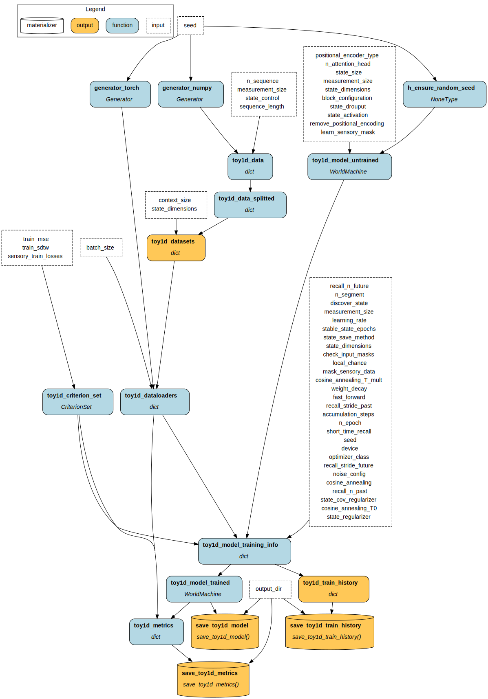
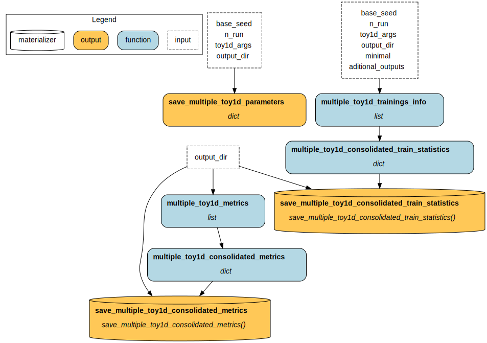
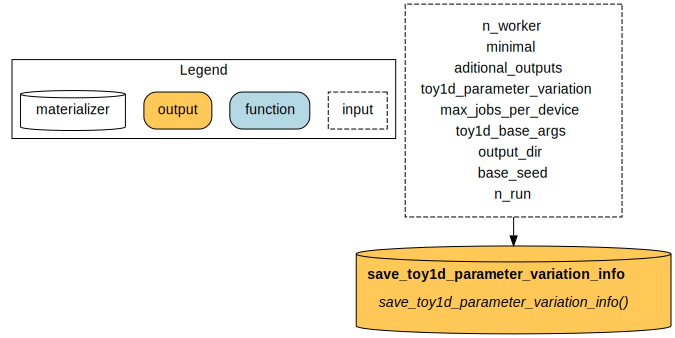
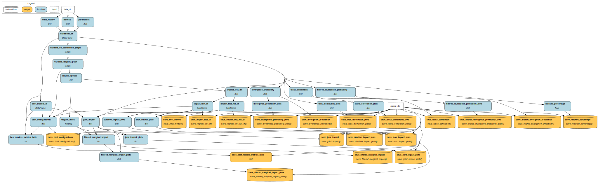

# World Machine - Toy1D - Experiment 1 Configuration Test

Building on the previous experiment, [Experiment 0 Protocol Test](https://doi.org/10.5281/zenodo.17352548), which demonstrated the importance of the training protocol for the model's final performance, we investigate in this experiment the specific impact of each protocol step and several model architecture elements. 

World Machine is a research project that investigates the concept and creation of computational world models. These AI systems create internal representations to understand and make predictions about the external world. See the [project page](https://h-iaac.github.io/WorldMachine/) for more information. The project is part of the [H.IAAC](https://hiaac.unicamp.br/en/), the Hub for Artificial Intelligence and Cognitive Architecture, located at the Universidade Estadual de Campinas (UNICAMP), Brazil.


## Artifacts

These are the artifact versions related to this experiment.
If trying to re-run, please use these artifacts (mainly the Docker container).

Also, note that the experiment-generated data is available in the "Experiment Data" artifact.

- Code: \[version](release GitHub)+LINK
- Doker Container: BADGE+LINK \[eltoncn/world-machine:ver](link zenodo)
- Experiment Results: BADGE+LINK

## Concepts

This section briefly presents the key concepts needed to understand this experiment.

### World Model, Computational World Model, State and Sensory Data.

A world model is the cognitive process that models the world in which the agent is and enables predictions about the current state and future of this world. An agent here can be a purely observational entity, that only sees but do not act in the world.

A computational world model is the computational system that makes predictions about the current and future state of a "world" based on the sensory data it receives, but inferring the internal structure of that world.

In this process, the "sensory data" is everything the agent can observe about the external world, and the "state" is the internal model the agent creates to make sense of and predict this sensory data. The "state" of the world model does not correspond to the real state of the external world.

### World Machine Architecture

The proposed architecture and protocol of this project. The architecture is a transform-based model that operates on "latent world states" ($ws$), vectors that encode the world model's state at each instant. At each step, the model predicts the next latent world state using the previous one, conditioned on sensory data.

The core of the model consists of transform blocks. These can be of type "State" for blocks that process only the latent state without sensory data, "\<Sensory Data Channel Name\>" for blocks that use a sensory channel, and "State Input" for blocks that use the state itself at the beginning of the time step as sensory input. After all the blocks, the model performs state activation using a $tanh$ function to improve model stability.

In this experiment, we propose replacing state activation with MSE regularization.

### Training Protocol

#### State Discovery
To ensure that the "latent world state" has its own encoding, as determined by the model, we cannot provide these states in advance. However, as they are necessary for model training, we have the impasse of training a model without all its inputs.

To solve this problem, we randomly initialize the states. At each training step, the predicted states are saved and used for inference in the next step. This process is called "State Discovery".

In addition to simply replacing the states in each epoch, we also propose using an average between the previous and new states.

#### Other Protocols

In order to improve the model and strengthen its ability to generate useful representations in the latent world states, we propose some parameterized steps:

- **Sensory Masking:** involves masking sensory data during training, hiding a random amount of data at each batch. When masking, we can also verify the sensory masks before replacing the stored $ws$ with the new $ws$, ensuring that data is not replaced when it has been masked. This is particularly important at the beginning of training, when the model has not yet generated good states without sensory data.
	- mask_sensory_data: the percentage, by channel and epoch, that the data will be masked.
	- check_input_masks: if True, verifies the sensory masks before updating the state.
- **Sequence Breaking (SB):** With this protocol, we break each sequence in random places, creating $k$ segments. Each segment is passed through the model individually, and the outputs are concatenated to compute the loss. Therefore, the model needs to handle mid-sequence states without prior data. We can also shift the last state of one segment to the first state of the next, which we call **Fast Forward**. The hypothesis is that this increases the propagation of information from one state to another, helping the model learn to encode a good state, as the gradient propagates from the segment losses through the "bottleneck" generated by this single state. As $k$ increases, the training approaches a sequential autoregressive process.
	- n_segment: number of segments to break a sequence
	- fast_forward: if True, performs state forwarding.
- **Noise Addition: (NA)**  It adds Gaussian noise to the $ws$ and/or sensory channels in each batch, with controllable mean and standard deviation. 
	- noise_config: configuration of Gaussian noise to be applied to each sensory channel and state.
- **Short Time Recall (STR):** This protocol creates new synthetic sensory channels that correspond to past and/or future data relative to the current temporal step. For each new channel, a new decoder must also be added to the model. Up to $n$ channels can be created, each sampled with a stride. Each sampled data point is projected by a random projector fixed at the start of the training.
	- short_time_recall: the channels to perform STR
	- recall_stride_{past/future}: stride to perform when sampling the sensory data.
	- recall_n_{past/future}: number of channels to create.
- **Local Mode (LM):** Randomly, for each segment, it can turn off the model's attention process. The layer output is directly the value matrix after the external projection. This process limits the model's vision to only the current $ws$ and sensory data.
	- local_chance: chance of performance LM, per segment.

### Evaluation Tasks

To assess the capabilities of the World Machine, we established tasks to evaluate in the validation dataset after training:

- Normal: is a normal autoregressive inference. Note that this differs from the loss calculated during training, as we do not use states that are updated "in parallel" during training; instead, we estimate states sequentially, starting from the null state.
- Use state: inference on previously encoded states, without sensory data. We can calculate this in a single inference step by processing the sequence elements in parallel, since the model already encoded these states. We only evaluate this task at the first 50% of a sequence. If the model were merely taking sensory data and manipulating it to generate output, its performance on this task would be poor.
- Prediction: inference of future states, using several previous encoded states and without sensory data. We use the first 50% of states to evaluate the task in the final 50% of the sequence. 
- Prediction Shallow: inference of future states, using only one previous encoded state and without sensory data. We evaluate this task in the final 50% of the sequence. Prediction Shallow is the most important task, as it directly assesses the model's ability to perform inference with context truncation, which would otherwise incur a quadratic cost in sequence length and is a significant issue with current transformers.
- Prediction Local: inference using local mode, that is, of the next immediate state, using only one previous encoded state, without sensory data.
- MaskSensory@x: inference in the whole sequence, randomly masking x% of the sensory data.

### Toy1D Dataset

The _Toy1D_ is a synthetic dataset of one-dimensional time series. The series represents a damped physical system, given by:

$$ \vec{x}_{i+1} = F\vec{x}_i+\vec{u}_i $$
$$F =  \begin{bmatrix} 
                1 & \Delta t & \frac{\Delta t^2}{2} \\
                -0.1 \Delta t & 1 & \Delta t \\
                0 & 0 & 1
            \end{bmatrix}$$

with random initial states $\vec{x}_0$. The $\Delta t$ is unitary. The initial $x_0$ of each series is random, and $\vec{u}_i$ is a random sum of square and impulse waves. The data's second and third elements, $x_i^1$, $x_i^2$, are clipped during generation to the range $[-1,1]$ to avoid excessively high values. The final dataset only uses the position ($\vec{x}_i^0$) data in the final sensory channel named _external state_, with size 1. The external state is also referred to as "state decoded" in the experiment code and results. 

We define another sensory channel, measurement_, with size 2, as:

$$\vec{s}_i = \tanh(H \vec{x}_i)$$
$$H \sim Uniform(-1, 1)^{2\times2}$$

H is fixed at the start of the dataset generation. Note that, depending on the data scales and the H matrix, the measurement can become very similar to the external state.

Since the dataset is stochastic, we can generate different data by controlling the seed of the random number generator. For each seed, we first generate 10,000 sequences of length 1,000 and then segment them into 40,000 sequences of length 200. Finally, we also scale each sequence to the interval $[-1,1]$. We split the dataset into 60\% for training, 20\% for validation, and 20\% for testing.

A sample of the dataset:


### Impact Test

The impact test evaluates the **impact of a training hyperparameter** on a model. Given a metric $M$ and a space of models trained with different binary hyperparameters, with a set A indicating the use of a specific hyperparameter, we define the impact as:

$$ I(M|A) := E[M|A] - E[M|\overline{A}]$$

The **statistical significance** of the Impact can be assessed using a Wilcoxon signed-rank test.

So, in an example with three hyperparameters, A, B, and C. In order to evaluate the impact of A, it is necessary to consider all pairs of combinations

$$\{

(\overline{A} \cup \overline{B} \cup \overline{C}, A \cup \overline{B} \cup \overline{C}), 
(\overline{A} \cup B \cup \overline{C}, A \cup B \cup \overline{C}),
(\overline{A} \cup \overline{B} \cup C, A \cup \overline{B} \cup C),
(\overline{A} \cup B \cup C, A \cup B \cup C)
\}$$

in order to calculate the relevance by testing these pairs. Computing the impact is computationally intensive, as the number of hyperparameters increases, leading to a combinatorial explosion.

In the case of **disjoint variables**, two variables A and B that are mutually exclusive, to assess the impact of A, it is necessary to use only pairs without B:

$$\{

(\overline{A} \cup \overline{B} \cup \overline{C}, A \cup \overline{B} \cup \overline{C}), 
(\overline{A} \cup \overline{B} \cup C, A \cup \overline{B} \cup C),
\}
$$

To find disjoint variables, we use **disjoint groups**, defined as collections of sets of vertices from the complete subgraphs of the complementary graph of hyperparameter co-occurrence. Breaking down the definition into parts:
- Construct the hyperparameter co-occurrence graph. This graph has the hyperparameters as vertices, and for each pair A and B, there is an edge connecting them if these hyperparameters are used together in training any model.
- Compute the complement of the previous graph. Each hyperparameter represented by a vertex is connected to all hyperparameters that are not being used together.
- Find the complete subgraphs. These are all the subgraphs of the previous graph that have all edges connected. Each subgraph contains only disjoint variables with respect to each other variable in the subgraph.
- Extract the vertex sets from the previous subgraphs.
With disjoint groups, it is possible to find the disjoint variables of another variable by obtaining the union of all the sets in which it appears.


Moving on to a more in-depth analysis, we also expand the definition to **Joint Impacts**, the synergistic impact of using two variables simultaneously. In other words, the impact obtained from the interaction of two variables together, in addition to their individual impact:
$$I(M|A,B) := (E[M|A \cup B] - E[M|\overline{A} \cup \overline{B}]) - (E[M|A] - E[M|\overline{A} \cup \overline{B}]) - (E[M|B] - E[M|\overline{A} \cup \overline{B}])$$
Simplifying, we get:
$$I(M|A,B) = E[M|A \cup B] - E[M|A] - E[M|B] +  E[M|\overline{A} \cup \overline{B}])$$

Note that both definitions differ from calculating the impact of a variable on a model trained without any variables ($E[M|\overline{A}] \neq E[M|\varnothing]$). This difference means that both Impact and Joint Impact consider all variables to some extent when indicating the impact of a variable A.
## Experiment Definition

### Hypotheses and Goals

- G1: To assess the impact of the decisions made, making it possible to indicate which proposed approaches are or are not advantageous for future uses of the World Machine.
- H1: The "state activation" architectural element improves the model stability.
- H2: The tasks defined for evaluating the model are correlated.
- G2: Evaluate which of the proposed tasks are relevant.
- G3: To verify whether the defined impact tests assist in the analysis of approaches for creating and training models.

### Design

We defined different training variables that group different hyperparameters of the proposed approaches. We train a model for each combination of non-disjoint variables.

The training loss is the sensory loss, in this case, the sum of the MSEs of the external state $\vec{x}$ and the measurement $\vec{s}_i$.

We compute the evaluation metrics using an early-saved model at the epoch with the minimum validation optimizer loss. However, training continues until the last epoch to generate training metrics.


We organize the experiment in a three-level pipeline, plus a final results pipeline: 
- The first **"Base"** level generates the dataset and the initial model, trains the model using the selected stages, evaluates the trained model on the defined tasks, and generates plots.
- **"Multiple Runs"** level executes the "Base" level with the same parameters, varying the utilized seed. Also aggregates all the runs metrics and generates plots. Even though we only execute one Run per parameter set, this pipeline is used because the code was built with multiple executions in mind, a feature that is used in other experiments.
- The **"Parameter Variation"** level executes "Multiple Runs" for each variation parameter.
- **"Final Results"** runs after the "Parameter Variation" ends. Performs statistical tests and analyses, exporting metrics and final plots.
Note that not all the generated plots, available at the "Experiments Results" artifact, are used in this report.

Each pipeline graph showcases the executed functions, named by the outputs they generate:

- Base Pipeline:

- Multiple Runs Pipeline:

- Parameter Variation Pipeline:

- Final Results Pipeline:

### Randomization

The model's initial parameters and the random values generated and used at each protocol step are generated with a fixed RNG seed shared across all parameter variations.

### Sample Size

For each of the 9600 parameter variations defined by the combination of training variables defined in the next section, we train 1 model on a dataset of 40000 sequences, with 60% for training, 20% for validation, and 20% for test (not used).

### Manipulated Variables

Training parameters:

- Batch size: 32
- Epochs: 100
- Optimizer: AdamW
- Learning rate: initial 1E-3
	- Cosine Annealing with Warmup scheduler
	- T0: 25
	- T_mult: 1
- Weight Decay: 1E-5

Common model parameters:

- State size: 128
- Positional encoder type: Alibi
- Attention heads: 4
- Sensory encoders and decoders: point-wise feedforwards


We varied the training variables in each model. In total, we defined 15 variables, grouped into different domains.

For the "Sequence Breaking", "Short Time Recall - Future" and "Short Time Recall - Past" domains, only one variable can be active, creating disjoint variables. The "BASE" variable refers to a model trained on no variables in a given domain. "M" and "S" refer to the sensory channel "Measurement" and "State on the core input", respectively.

State Discovery:

| Variable | Hyperparameter  1     | Hyperparameter  2     |
| -------- | --------------------- | --------------------- |
|          | **state_save_method** | **check_input_masks** |
| BASE     | REPLACE               | FALSE                 |
| SM_1     | MEAN                  | X                     |
| SM_2     | X                     | TRUE                  |
State Activation:

| Variable | Hyperparameter  1    | Hyperparameter  2     |
| -------- | -------------------- | --------------------- |
|          | **state_activation** | **state_regularizer** |
| BASE     | tanh                 | NONE                  |
| AC_1     | NONE                 | MSE                   |

Model Block Configuration:

| Variable | Hyperparameter  1       |
| -------- | ----------------------- |
|          | **block_configuration** |
| BASE     | [M, M]                  |
| MD_1     | [M, S]                  |

Noise Addition:

| Variable | Hyperparameter  1                               |
| -------- | ----------------------------------------------- |
|          | **noise_config**                                |
| BASE     | None                                            |
| NA_1     | Noise on State, $\sim\mathcal{N}(0, 0.1)$       |
| NA_2     | Noise on Measurement, $\sim\mathcal{N}(0, 0.1)$ |

Short Time Recall - Past:

| Variable | Hyperparameter  1     | Hyperparameter  2      | Hyperparameter  3 |
| -------- | --------------------- | ---------------------- | ----------------- |
|          | **short_time_recall** | **recall_stride_past** | **recall_n_past** |
| BASE     | None                  | X                      | X                 |
| RP_1     | M                     | 1                      | 1                 |
| RP_2     | M                     | 1                      | 5                 |
| RP_3     | M                     | 3                      | 1                 |
| RP_4     | M                     | 3                      | 5                 |

Short Time Recall - Future:

| Variable | Hyperparameter  1     | Hyperparameter  2        | Hyperparameter  3   |
| -------- | --------------------- | ------------------------ | ------------------- |
|          | **short_time_recall** | **recall_stride_future** | **recall_n_future** |
| BASE     | None                  | X                        | X                   |
| RF_1     | M                     | 1                        | 1                   |
| RF_2     | M                     | 1                        | 5                   |
| RF_3     | M                     | 3                        | 1                   |
| RF_4     | M                     | 3                        | 5                   |

Local Mode:

| Variable | Hyperparameter  1 |
| -------- | ----------------- |
|          | **local_chance**  |
| BASE     | None              |
| LM_1     | 0.25              |


### Measured Variables


For every model variation+run:

- Training losses
	- MSE and SDTW (Soft Dynamic Time Warping) of the external state and measurement
	- Optimizer loss: sum of MSE of external state and measurement
	- Train and validation losses. However, some protocol steps are not applied to the validation dataset to speed up training and better understand model performance. 
- External State evaluation metrics
	- MSE and SDTW in defined tasks (Normal, Use State, Prediction, Prediction Shallow, Prediction Local)
- Inference samples in each task

### Analysis Plan

First, we analyze the probability of the model diverging, conditioned on the training variables. We considered a model to diverge when, for any task, its metric is NaN or exceeds 3 times the standard deviation of the metric, computed across all variation metrics excluding NaN values. 
Given an initial observation that the $AC_1$ variable significantly increases the probability of divergence, we also performed analyses that removed this variable.

We analyze the metric distribution across each task to gain insights into their behaviour.
We also analyze the Pearson correlation between the tasks.

We then moved on to impact testing, analyzing both the individual impact of each variable and the combined impact of pairs of variables. For analysis pairs in which one of the elements has diverged, we disregard the entire pair in the test.

We analyzed the impact on both task metrics and the total training epoch duration.

We also analyze the best models for each optimal combination of variables for each task, both empirically and theoretically (based on the best sum of median impacts across disjoint variables).

## Ethical Considerations

Given the nature of this experiment, which simulates a synthetic one-dimensional time series, it is not easy to assess the project's potential impacts. However, it is important to emphasize the need to analyze, discuss, and mitigate potential risks during the development of this project and in other experiments, with consideration of the project's overall objectives. We emphasize at this time the computational and, therefore, environmental costs of conducting impact tests.

## Experiment Execution

Inside the experiment Docker, or after installing both `world_machine` and `world_machine_experiments`, the experiment can be executed with:

```python
!python -m world_machine_experiments.toy1d.experiment1_configuration_test 
```

Please note that the experiment may take a few days to run. The experiment results are available below.

When running the experiment, we used an environment with:
- GPU: 3x NVIDIA A100 80GB PCIe
- RAM: 1.48 TB
- CPU: 2x Intel Xeon Platinum 8358 CPU @ 2.60GHz, using only 36 simultaneous processes (plus the process that submits the training jobs and collects results)
## Results

We present the experimental results and observations in this section.

### Divergence Probability

 

- O1.1: There is a high chance of divergence during training. This chance is primarily due to the $AC_1$ variable, which, when removed, reduces the chance of divergence to almost zero.
### Metrics distribution


- O2.1: Prediction shallow is the most challenging task, with the worst performance.
- O2.2: The metrics distributions are skewed, with a threshold point generating a few models achieving the best observed performance.

### Metrics Correlation


- O3.1: Not all tasks are very highly correlated. This indicates that they actually measure different aspects, and that it may be helpful to evaluate the model across multiple tasks.
- O3.2: There is a very high correlation between Use State and all other tasks, indicating this can be a good task to evaluate models.
- O3.3: Prediction Shallow only has a very high correlation with Use State, indicating this is a highly distinct task and can be a good one to evaluate models.

### Impact on Task Performance


- O4.1: The impact of a variable is different across tasks, and can even vary between improving or worsening the model performance.
- O4.2: Even in models that do not diverge, $AC_1$ significantly worsens model performance in all tasks.
- O4.3: Almost all variables are significant. There is a higher chance of insignificance in the Short Time Recall - Past.
- O4.4: Due to the smaller absolute values, the impact of the variables on the Normal and Use State tasks is less than on the other tasks.
- O4.5: The impact of a variable is often ambiguous, given its high variability, making it not exclusively positive or negative.

### Joint Impact on Task Performance


- O5.1: Joint Impact is often insignificant.
- O5.2: It is difficult to interpret the value of Joint Impact. Because of the difference between the values ​​of individual Impact (diagonal), which by definition already considers the interaction with all variables, and Joint Impact, which attempts to extract specific information from the interaction with a single variable, they are not comparable.
- O5.3: The large amount of data generated by the test makes it difficult to interpret.
- O5.4: $AC_1$  can further worsen the model's performance when interacting with other variables. In particular, $NA_1$ adds noise to the state, reducing confidence in it, which can interact with the lack of control over the state that $AC_1$ generates.
- O5.5: Some variables may have an overall positive or negative impact, but synergistic impacts in other directions.

### Impact on Training Time


- O6.1: Almost all variables showed a negative impact, with only $MD_1$ and $LM_1$ showing a positive and statistically significant impact. The last one is expected, since using local mode in some batches means not using the attention process, the most expensive operation in a transformer.
- O6.2: There is an increase in the impact of $RP_{2,4}$ and $RF_{2,4}$, relative to $RP_{1,3}$ and $RF_{1,3}$. The first group creates five extra dimensions, while the second creates only 1. This shows how the cost is proportional to the number of dimensions created.
- O6.3: The number of outliers indicates high variability. This may be due to the experiment's execution environment, which ran different variations simultaneously. The environment's CPU, RAM, and storage are also shared.

### Best Configurations


<table style="border-collapse:collapse;border-spacing:0" class="tg"><thead>
<tr><th style="border-color:inherit;border-style:solid;border-width:1px;font-family:Arial, sans-serif;font-size:14px;font-weight:bold;overflow:hidden;padding:10px 5px;text-align:left;vertical-align:top;word-break:normal">Best in</th><th style="border-color:inherit;border-style:solid;border-width:1px;font-family:Arial, sans-serif;font-size:14px;font-weight:bold;overflow:hidden;padding:10px 5px;text-align:left;vertical-align:top;word-break:normal">Type</th><th style="border-color:inherit;border-style:solid;border-width:1px;font-family:Arial, sans-serif;font-size:14px;font-weight:bold;overflow:hidden;padding:10px 5px;text-align:left;vertical-align:top;word-break:normal">Variables</th><th style="border-color:inherit;border-style:solid;border-width:1px;font-family:Arial, sans-serif;font-size:14px;font-weight:bold;overflow:hidden;padding:10px 5px;text-align:right;vertical-align:top;word-break:normal">Normal</th>
<th style="border-color:inherit;border-style:solid;border-width:1px;font-family:Arial, sans-serif;font-size:14px;font-weight:bold;overflow:hidden;padding:10px 5px;text-align:right;vertical-align:top;word-break:normal">Use State</th><th style="border-color:inherit;border-style:solid;border-width:1px;font-family:Arial, sans-serif;font-size:14px;font-weight:bold;overflow:hidden;padding:10px 5px;text-align:right;vertical-align:top;word-break:normal">Prediction</th><th style="border-color:inherit;border-style:solid;border-width:1px;font-family:Arial, sans-serif;font-size:14px;font-weight:bold;overflow:hidden;padding:10px 5px;text-align:right;vertical-align:top;word-break:normal">Prediction Shallow</th><th style="border-color:inherit;border-style:solid;border-width:1px;font-family:Arial, sans-serif;font-size:14px;font-weight:bold;overflow:hidden;padding:10px 5px;text-align:right;vertical-align:top;word-break:normal">Prediction Local</th></tr>
</thead>
<tbody>
<tr><td style="background-color:#efefef;border-color:inherit;border-style:solid;border-width:1px;font-family:Arial, sans-serif;font-size:14px;overflow:hidden;padding:10px 5px;text-align:left;vertical-align:top;word-break:normal" rowspan="2">Normal</td><td style="background-color:#efefef;border-color:inherit;border-style:solid;border-width:1px;font-family:Arial, sans-serif;font-size:14px;overflow:hidden;padding:10px 5px;text-align:left;vertical-align:top;word-break:normal">Theoretical</td><td style="background-color:#efefef;border-color:inherit;border-style:solid;border-width:1px;font-family:Arial, sans-serif;font-size:14px;overflow:hidden;padding:10px 5px;text-align:left;vertical-align:top;word-break:normal">SM₂, NA₁, RF₄, RP₄</td><td style="background-color:#efefef;border-color:inherit;border-style:solid;border-width:1px;font-family:Arial, sans-serif;font-size:14px;font-style:italic;overflow:hidden;padding:10px 5px;text-align:right;vertical-align:top;word-break:normal">0.00323</td>
<td style="background-color:#efefef;border-color:inherit;border-style:solid;border-width:1px;font-family:Arial, sans-serif;font-size:14px;overflow:hidden;padding:10px 5px;text-align:right;vertical-align:top;word-break:normal">0.00586</td><td style="background-color:#efefef;border-color:inherit;border-style:solid;border-width:1px;font-family:Arial, sans-serif;font-size:14px;overflow:hidden;padding:10px 5px;text-align:right;vertical-align:top;word-break:normal">0.0403</td><td style="background-color:#efefef;border-color:inherit;border-style:solid;border-width:1px;font-family:Arial, sans-serif;font-size:14px;overflow:hidden;padding:10px 5px;text-align:right;vertical-align:top;word-break:normal">0.118</td><td style="background-color:#efefef;border-color:inherit;border-style:solid;border-width:1px;font-family:Arial, sans-serif;font-size:14px;overflow:hidden;padding:10px 5px;text-align:right;vertical-align:top;word-break:normal">0.0113</td></tr>
<tr><td style="background-color:#efefef;border-color:inherit;border-style:solid;border-width:1px;font-family:Arial, sans-serif;font-size:14px;overflow:hidden;padding:10px 5px;text-align:left;vertical-align:top;word-break:normal">Empirical</td><td style="background-color:#efefef;border-color:inherit;border-style:solid;border-width:1px;font-family:Arial, sans-serif;font-size:14px;overflow:hidden;padding:10px 5px;text-align:left;vertical-align:top;word-break:normal">SM₂, MD₁, NA₁, RP₄</td><td style="background-color:#efefef;border-color:inherit;border-style:solid;border-width:1px;font-family:Arial, sans-serif;font-size:14px;font-style:italic;overflow:hidden;padding:10px 5px;text-align:right;vertical-align:top;word-break:normal">0.00317</td><td style="background-color:#efefef;border-color:inherit;border-style:solid;border-width:1px;font-family:Arial, sans-serif;font-size:14px;overflow:hidden;padding:10px 5px;text-align:right;vertical-align:top;word-break:normal">0.00595</td>
<td style="background-color:#efefef;border-color:inherit;border-style:solid;border-width:1px;font-family:Arial, sans-serif;font-size:14px;overflow:hidden;padding:10px 5px;text-align:right;vertical-align:top;word-break:normal">0.0408</td><td style="background-color:#efefef;border-color:inherit;border-style:solid;border-width:1px;font-family:Arial, sans-serif;font-size:14px;overflow:hidden;padding:10px 5px;text-align:right;vertical-align:top;word-break:normal">0.143</td><td style="background-color:#efefef;border-color:inherit;border-style:solid;border-width:1px;font-family:Arial, sans-serif;font-size:14px;overflow:hidden;padding:10px 5px;text-align:right;vertical-align:top;word-break:normal">0.0121</td></tr>
<tr><td style="border-color:inherit;border-style:solid;border-width:1px;font-family:Arial, sans-serif;font-size:14px;overflow:hidden;padding:10px 5px;text-align:left;vertical-align:top;word-break:normal" rowspan="2">Use State</td><td style="border-color:inherit;border-style:solid;border-width:1px;font-family:Arial, sans-serif;font-size:14px;overflow:hidden;padding:10px 5px;text-align:left;vertical-align:top;word-break:normal">Theoretical</td><td style="border-color:inherit;border-style:solid;border-width:1px;font-family:Arial, sans-serif;font-size:14px;overflow:hidden;padding:10px 5px;text-align:left;vertical-align:top;word-break:normal">SM₂, NA₁, RP₄, RF₄</td><td style="border-color:inherit;border-style:solid;border-width:1px;font-family:Arial, sans-serif;font-size:14px;overflow:hidden;padding:10px 5px;text-align:right;vertical-align:top;word-break:normal">0.00323</td>
<td style="border-color:inherit;border-style:solid;border-width:1px;font-family:Arial, sans-serif;font-size:14px;font-style:italic;overflow:hidden;padding:10px 5px;text-align:right;vertical-align:top;word-break:normal">0.00586</td><td style="border-color:inherit;border-style:solid;border-width:1px;font-family:Arial, sans-serif;font-size:14px;overflow:hidden;padding:10px 5px;text-align:right;vertical-align:top;word-break:normal">0.0403</td><td style="border-color:inherit;border-style:solid;border-width:1px;font-family:Arial, sans-serif;font-size:14px;overflow:hidden;padding:10px 5px;text-align:right;vertical-align:top;word-break:normal">0.118</td><td style="border-color:inherit;border-style:solid;border-width:1px;font-family:Arial, sans-serif;font-size:14px;overflow:hidden;padding:10px 5px;text-align:right;vertical-align:top;word-break:normal">0.0113</td></tr>
<tr><td style="border-color:inherit;border-style:solid;border-width:1px;font-family:Arial, sans-serif;font-size:14px;overflow:hidden;padding:10px 5px;text-align:left;vertical-align:top;word-break:normal">Empirical</td><td style="border-color:inherit;border-style:solid;border-width:1px;font-family:Arial, sans-serif;font-size:14px;overflow:hidden;padding:10px 5px;text-align:left;vertical-align:top;word-break:normal">SM₂, NA₁, RP₄, RF₂</td><td style="border-color:inherit;border-style:solid;border-width:1px;font-family:Arial, sans-serif;font-size:14px;overflow:hidden;padding:10px 5px;text-align:right;vertical-align:top;word-break:normal">0.00317</td><td style="border-color:inherit;border-style:solid;border-width:1px;font-family:Arial, sans-serif;font-size:14px;font-style:italic;overflow:hidden;padding:10px 5px;text-align:right;vertical-align:top;word-break:normal">0.00572</td>
<td style="border-color:inherit;border-style:solid;border-width:1px;font-family:Arial, sans-serif;font-size:14px;overflow:hidden;padding:10px 5px;text-align:right;vertical-align:top;word-break:normal">0.0407</td><td style="border-color:inherit;border-style:solid;border-width:1px;font-family:Arial, sans-serif;font-size:14px;overflow:hidden;padding:10px 5px;text-align:right;vertical-align:top;word-break:normal">0.142</td><td style="border-color:inherit;border-style:solid;border-width:1px;font-family:Arial, sans-serif;font-size:14px;overflow:hidden;padding:10px 5px;text-align:right;vertical-align:top;word-break:normal">0.0109</td></tr>
<tr><td style="background-color:#efefef;border-color:inherit;border-style:solid;border-width:1px;font-family:Arial, sans-serif;font-size:14px;overflow:hidden;padding:10px 5px;text-align:left;vertical-align:top;word-break:normal" rowspan="2">Prediction</td><td style="background-color:#efefef;border-color:inherit;border-style:solid;border-width:1px;font-family:Arial, sans-serif;font-size:14px;overflow:hidden;padding:10px 5px;text-align:left;vertical-align:top;word-break:normal">Theoretical</td><td style="background-color:#efefef;border-color:inherit;border-style:solid;border-width:1px;font-family:Arial, sans-serif;font-size:14px;overflow:hidden;padding:10px 5px;text-align:left;vertical-align:top;word-break:normal">MD₁, NA₁, NA₂, RP₄, RF₄</td><td style="background-color:#efefef;border-color:inherit;border-style:solid;border-width:1px;font-family:Arial, sans-serif;font-size:14px;overflow:hidden;padding:10px 5px;text-align:right;vertical-align:top;word-break:normal">0.00379</td>
<td style="background-color:#efefef;border-color:inherit;border-style:solid;border-width:1px;font-family:Arial, sans-serif;font-size:14px;overflow:hidden;padding:10px 5px;text-align:right;vertical-align:top;word-break:normal">0.00672</td><td style="background-color:#efefef;border-color:inherit;border-style:solid;border-width:1px;font-family:Arial, sans-serif;font-size:14px;font-style:italic;overflow:hidden;padding:10px 5px;text-align:right;vertical-align:top;word-break:normal">0.0267</td><td style="background-color:#efefef;border-color:inherit;border-style:solid;border-width:1px;font-family:Arial, sans-serif;font-size:14px;overflow:hidden;padding:10px 5px;text-align:right;vertical-align:top;word-break:normal">0.132</td><td style="background-color:#efefef;border-color:inherit;border-style:solid;border-width:1px;font-family:Arial, sans-serif;font-size:14px;overflow:hidden;padding:10px 5px;text-align:right;vertical-align:top;word-break:normal">0.0130</td></tr>
<tr><td style="background-color:#efefef;border-color:inherit;border-style:solid;border-width:1px;font-family:Arial, sans-serif;font-size:14px;overflow:hidden;padding:10px 5px;text-align:left;vertical-align:top;word-break:normal">Empirical</td><td style="background-color:#efefef;border-color:inherit;border-style:solid;border-width:1px;font-family:Arial, sans-serif;font-size:14px;overflow:hidden;padding:10px 5px;text-align:left;vertical-align:top;word-break:normal">MD₁, NA₁, NA₂, RP₄, RF₄</td><td style="background-color:#efefef;border-color:inherit;border-style:solid;border-width:1px;font-family:Arial, sans-serif;font-size:14px;overflow:hidden;padding:10px 5px;text-align:right;vertical-align:top;word-break:normal">0.00379</td><td style="background-color:#efefef;border-color:inherit;border-style:solid;border-width:1px;font-family:Arial, sans-serif;font-size:14px;overflow:hidden;padding:10px 5px;text-align:right;vertical-align:top;word-break:normal">0.00672</td>
<td style="background-color:#efefef;border-color:inherit;border-style:solid;border-width:1px;font-family:Arial, sans-serif;font-size:14px;font-style:italic;overflow:hidden;padding:10px 5px;text-align:right;vertical-align:top;word-break:normal">0.0267</td><td style="background-color:#efefef;border-color:inherit;border-style:solid;border-width:1px;font-family:Arial, sans-serif;font-size:14px;overflow:hidden;padding:10px 5px;text-align:right;vertical-align:top;word-break:normal">0.132</td><td style="background-color:#efefef;border-color:inherit;border-style:solid;border-width:1px;font-family:Arial, sans-serif;font-size:14px;overflow:hidden;padding:10px 5px;text-align:right;vertical-align:top;word-break:normal">0.0130</td></tr>
<tr><td style="border-color:inherit;border-style:solid;border-width:1px;font-family:Arial, sans-serif;font-size:14px;overflow:hidden;padding:10px 5px;text-align:left;vertical-align:top;word-break:normal" rowspan="2">Prediction Shallow</td><td style="border-color:inherit;border-style:solid;border-width:1px;font-family:Arial, sans-serif;font-size:14px;overflow:hidden;padding:10px 5px;text-align:left;vertical-align:top;word-break:normal">Theoretical</td><td style="border-color:inherit;border-style:solid;border-width:1px;font-family:Arial, sans-serif;font-size:14px;overflow:hidden;padding:10px 5px;text-align:left;vertical-align:top;word-break:normal">MD₁, SB₂, NA₂, RP₄, RF₄, LM₁</td><td style="border-color:inherit;border-style:solid;border-width:1px;font-family:Arial, sans-serif;font-size:14px;overflow:hidden;padding:10px 5px;text-align:right;vertical-align:top;word-break:normal">0.00454</td>
<td style="border-color:inherit;border-style:solid;border-width:1px;font-family:Arial, sans-serif;font-size:14px;overflow:hidden;padding:10px 5px;text-align:right;vertical-align:top;word-break:normal">0.00772</td><td style="border-color:inherit;border-style:solid;border-width:1px;font-family:Arial, sans-serif;font-size:14px;overflow:hidden;padding:10px 5px;text-align:right;vertical-align:top;word-break:normal">0.0430</td><td style="border-color:inherit;border-style:solid;border-width:1px;font-family:Arial, sans-serif;font-size:14px;font-style:italic;overflow:hidden;padding:10px 5px;text-align:right;vertical-align:top;word-break:normal">0.0832</td><td style="border-color:inherit;border-style:solid;border-width:1px;font-family:Arial, sans-serif;font-size:14px;overflow:hidden;padding:10px 5px;text-align:right;vertical-align:top;word-break:normal">0.00658</td></tr>
<tr><td style="border-color:inherit;border-style:solid;border-width:1px;font-family:Arial, sans-serif;font-size:14px;overflow:hidden;padding:10px 5px;text-align:left;vertical-align:top;word-break:normal">Empirical</td><td style="border-color:inherit;border-style:solid;border-width:1px;font-family:Arial, sans-serif;font-size:14px;overflow:hidden;padding:10px 5px;text-align:left;vertical-align:top;word-break:normal">SB₂, MD₁, NA₂, RP₄, RF₄</td><td style="border-color:inherit;border-style:solid;border-width:1px;font-family:Arial, sans-serif;font-size:14px;overflow:hidden;padding:10px 5px;text-align:right;vertical-align:top;word-break:normal">0.00420</td><td style="border-color:inherit;border-style:solid;border-width:1px;font-family:Arial, sans-serif;font-size:14px;overflow:hidden;padding:10px 5px;text-align:right;vertical-align:top;word-break:normal">0.00723</td>
<td style="border-color:inherit;border-style:solid;border-width:1px;font-family:Arial, sans-serif;font-size:14px;overflow:hidden;padding:10px 5px;text-align:right;vertical-align:top;word-break:normal">0.0319</td><td style="border-color:inherit;border-style:solid;border-width:1px;font-family:Arial, sans-serif;font-size:14px;font-style:italic;overflow:hidden;padding:10px 5px;text-align:right;vertical-align:top;word-break:normal">0.0761</td><td style="border-color:inherit;border-style:solid;border-width:1px;font-family:Arial, sans-serif;font-size:14px;overflow:hidden;padding:10px 5px;text-align:right;vertical-align:top;word-break:normal">0.00603</td></tr>
<tr><td style="background-color:#efefef;border-color:inherit;border-style:solid;border-width:1px;font-family:Arial, sans-serif;font-size:14px;overflow:hidden;padding:10px 5px;text-align:left;vertical-align:top;word-break:normal" rowspan="2">Prediction Local</td><td style="background-color:#efefef;border-color:inherit;border-style:solid;border-width:1px;font-family:Arial, sans-serif;font-size:14px;overflow:hidden;padding:10px 5px;text-align:left;vertical-align:top;word-break:normal">Theoretical</td><td style="background-color:#efefef;border-color:inherit;border-style:solid;border-width:1px;font-family:Arial, sans-serif;font-size:14px;overflow:hidden;padding:10px 5px;text-align:left;vertical-align:top;word-break:normal">SB₂, SM₂, NA₁, RP₄, RF₂</td><td style="background-color:#efefef;border-color:inherit;border-style:solid;border-width:1px;font-family:Arial, sans-serif;font-size:14px;overflow:hidden;padding:10px 5px;text-align:right;vertical-align:top;word-break:normal">0.00335</td>
<td style="background-color:#efefef;border-color:inherit;border-style:solid;border-width:1px;font-family:Arial, sans-serif;font-size:14px;overflow:hidden;padding:10px 5px;text-align:right;vertical-align:top;word-break:normal">0.00584</td><td style="background-color:#efefef;border-color:inherit;border-style:solid;border-width:1px;font-family:Arial, sans-serif;font-size:14px;overflow:hidden;padding:10px 5px;text-align:right;vertical-align:top;word-break:normal">0.0485</td><td style="background-color:#efefef;border-color:inherit;border-style:solid;border-width:1px;font-family:Arial, sans-serif;font-size:14px;overflow:hidden;padding:10px 5px;text-align:right;vertical-align:top;word-break:normal">0.121</td><td style="background-color:#efefef;border-color:inherit;border-style:solid;border-width:1px;font-family:Arial, sans-serif;font-size:14px;font-style:italic;overflow:hidden;padding:10px 5px;text-align:right;vertical-align:top;word-break:normal">0.00516</td></tr>
<tr><td style="background-color:#efefef;border-color:inherit;border-style:solid;border-width:1px;font-family:Arial, sans-serif;font-size:14px;overflow:hidden;padding:10px 5px;text-align:left;vertical-align:top;word-break:normal">Empirical</td><td style="background-color:#efefef;border-color:inherit;border-style:solid;border-width:1px;font-family:Arial, sans-serif;font-size:14px;overflow:hidden;padding:10px 5px;text-align:left;vertical-align:top;word-break:normal">SM₂, NA₁, RP₂, RF₄, LM₁</td><td style="background-color:#efefef;border-color:inherit;border-style:solid;border-width:1px;font-family:Arial, sans-serif;font-size:14px;overflow:hidden;padding:10px 5px;text-align:right;vertical-align:top;word-break:normal">0.00346</td><td style="background-color:#efefef;border-color:inherit;border-style:solid;border-width:1px;font-family:Arial, sans-serif;font-size:14px;overflow:hidden;padding:10px 5px;text-align:right;vertical-align:top;word-break:normal">0.00605</td>
<td style="background-color:#efefef;border-color:inherit;border-style:solid;border-width:1px;font-family:Arial, sans-serif;font-size:14px;overflow:hidden;padding:10px 5px;text-align:right;vertical-align:top;word-break:normal">0.0468</td><td style="background-color:#efefef;border-color:inherit;border-style:solid;border-width:1px;font-family:Arial, sans-serif;font-size:14px;overflow:hidden;padding:10px 5px;text-align:right;vertical-align:top;word-break:normal">0.124</td><td style="background-color:#efefef;border-color:inherit;border-style:solid;border-width:1px;font-family:Arial, sans-serif;font-size:14px;font-style:italic;overflow:hidden;padding:10px 5px;text-align:right;vertical-align:top;word-break:normal">0.00510</td></tr>
</tbody></table>

- O7.1: Many of the variables that were indicated as good choices in the theoretical settings are present in the empirical ones. However, the sets were identical only once.
- O7.2: The metrics for the best theoretical and empirical configurations are very close, indicating a good choice of variables.
- O7.3: The list of variables varies depending on the tasks one wishes to specialize in.

## Conclusion

| Hypothese/Goal                                                                                                                                                             | Observations                                                                             | Conclusion                                                                                                                                                                                                                                                                                                           |
| -------------------------------------------------------------------------------------------------------------------------------------------------------------------------- | ---------------------------------------------------------------------------------------- | -------------------------------------------------------------------------------------------------------------------------------------------------------------------------------------------------------------------------------------------------------------------------------------------------------------------- |
| G1: To assess the impact of the decisions made, making it possible to indicate which proposed approaches are or are not advantageous for future uses of the World Machine. | O1.1, O4.1, O4.3, O4.2, O4.4, O4.5, O5.4, O5.5, O6.1, O7.1, O7.2, O7.3                   | We can gain insights into the importance of each variable for each task. Given that Prediction Shallow is the most difficult task, with performance orders of magnitude far exceeding other tasks, we can recommend which variables are most relevant for a model as MD₁, SB₂, NA₂, RP₄, RF₄ and LM₁                 |
| H1: The "state activation" architectural element improves the model stability.                                                                                             | O1.1, O4.2, O5.4                                                                         | True. Without "state activation," it becomes considerably more difficult to train the model, and its performance is worse in all tasks.                                                                                                                                                                              |
| H2: The tasks defined for evaluating the model are correlated.                                                                                                             | O2.1, O3.1, O3.2, O3.3                                                                   | Partially true. There are correlations; however, the tasks do not appear to assess the same aspects.                                                                                                                                                                                                                 |
| G2: Evaluate which of the proposed tasks are relevant.                                                                                                                     | O2.1, O2.2, O3.1, O3.2, O3.3, O7.3                                                       | We were able to indicate the Use State and Prediction Shallow tasks as good indicators of the model's performance. Due to its difficulty, the Prediction Shallow task seems especially important for future work.                                                                                                    |
| G3: To verify whether the defined impact tests assist in the analysis of approaches for creating and training models.                                                      | O4.1, O4.2, O4.3, O4.4, O4.5, O5.1, O5.2, O5.3, O5.4, O5.5, O6.1, O6.2, O7.1, O7.2, O7.3 | We were able to obtain a great deal of information by analyzing the individual Impact, more than a simple ablation test would provide. However, while information can be obtained from the Joint Impact, the analysis becomes more complex, requiring further development to utilise this more in-depth test better. |
