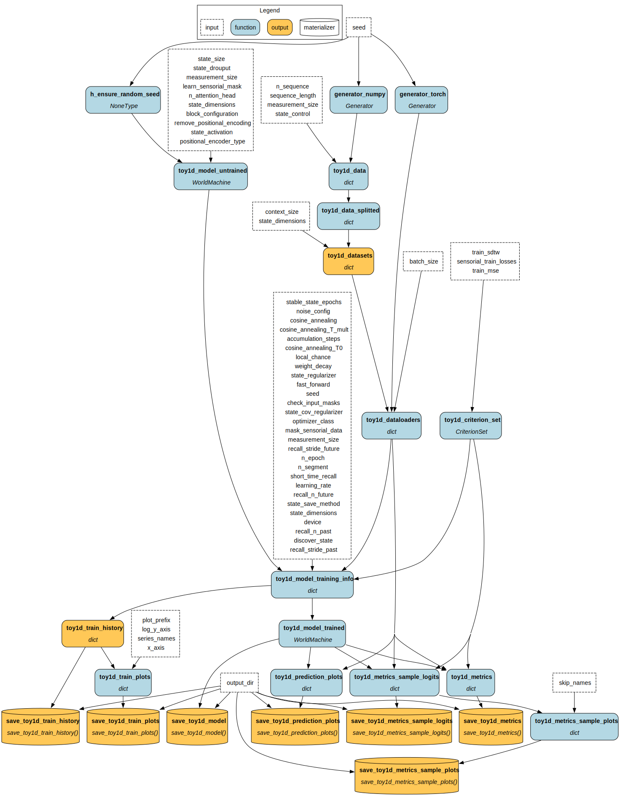
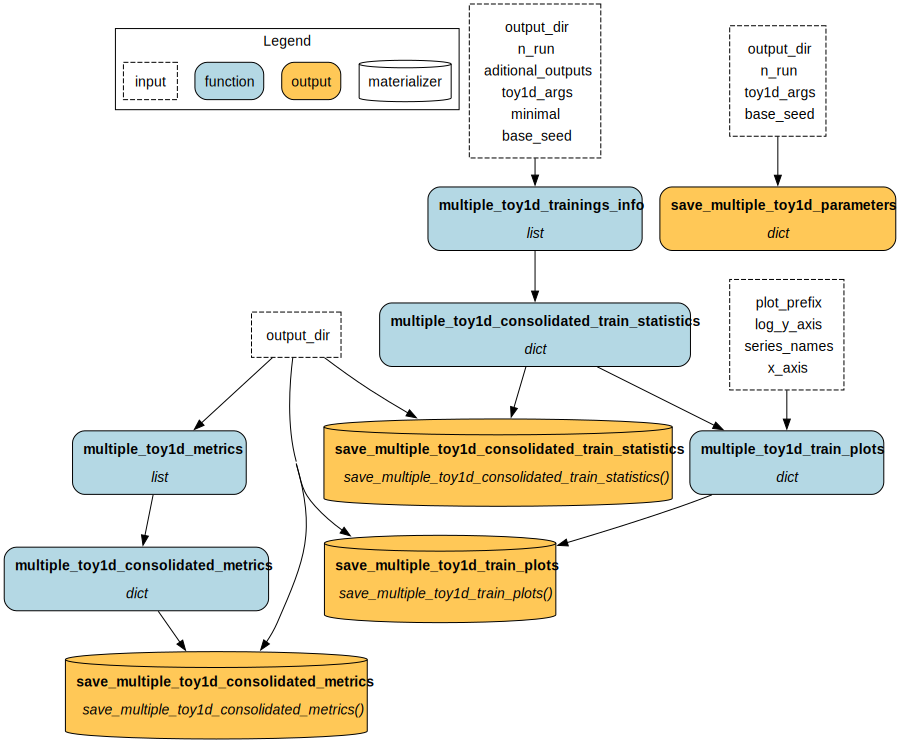
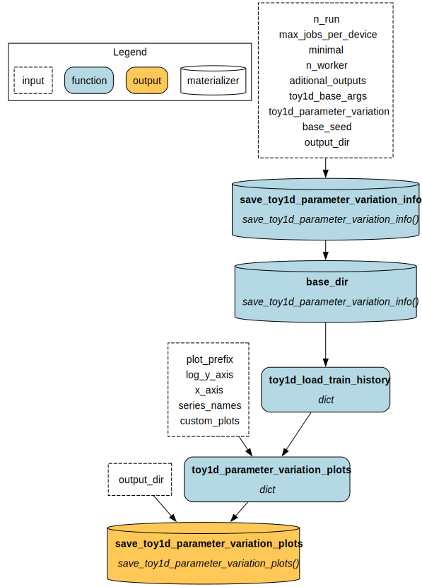
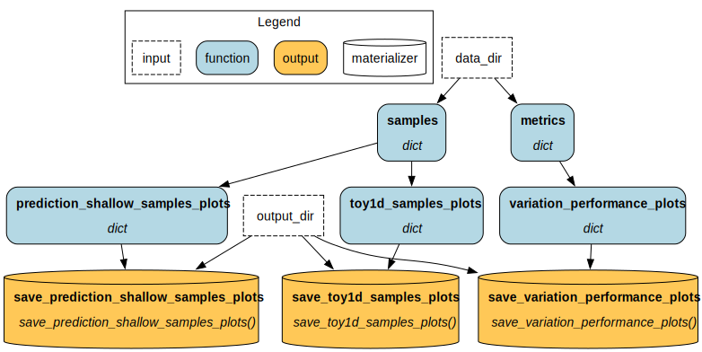

# World Machine - Toy1D - Experiment 2 Best Long

In the previous experiment, [Experiment 1 Configuration Test](https://doi.org/10.5281/zenodo.17661654), we found the best model configuration for a World Machine trained on the Toy1D dataset. However, a question that arises after that is: what is the maximum performance we can achieve with this configuration? In this experiment, we investigate what happens when we train the model for longer. Also, we took this opportunity to explore the effect of the learning rate scheduler used, Cosine Annealing with Warmup.

World Machine is a research project that investigates the concept and creation of computational world models. These AI systems create internal representations to understand and make predictions about the external world. See the [project page](https://h-iaac.github.io/WorldMachine/) for more information. The project is part of the [H.IAAC](https://hiaac.unicamp.br/en/), the Hub for Artificial Intelligence and Cognitive Architecture, located at the Universidade Estadual de Campinas (UNICAMP), Brazil.

## Artifacts

These are the artifact versions related to this experiment.
If trying to re-run, please use these artifacts (mainly the Docker container).

Also, note that the experiment-generated data is available in the "Experiment Data" artifact.

- Code: \[version](release GitHub)+LINK
- Doker Container: BADGE+LINK \[eltoncn/world-machine:ver](link zenodo)
- Experiment Results: BADGE+LINK

## Concepts

This section briefly presents the key concepts needed to understand this experiment.

### World Model and World Machine Architecture

A world model is the cognitive process that models the world in which the agent is and enables predictions about the current state and future of this world. An agent here can be a purely observational entity, that only sees but do not act in the world.

A computational world model is the computational system that makes predictions about the current and future state of a "world" based on the sensory data it receives, but inferring the internal structure of that world.

"World Machine" is the proposed architecture and protocol of this project. It is a transform-based model that operates on "latent world states" ($ws$), vectors that encode the world model's state at each instant. At each step, the model predicts the next latent world state using the previous one, conditioned on sensory data. 

Understanding the architecture and training protocol in depth is not necessary to understand this experiment. See the [project page](https://h-iaac.github.io/WorldMachine/) for more information.

### Evaluation Tasks

To assess the capabilities of the World Machine, we established tasks to evaluate in the validation dataset after training:

- Normal: is a normal autoregressive inference. Note that this differs from the loss calculated during training, as we do not use states that are updated "in parallel" during training; instead, we estimate states sequentially, starting from the null state.
- Use state: inference on previously encoded states, without sensory data. We can calculate this in a single inference step by processing the sequence elements in parallel, since the model already encoded these states. We only evaluate this task at the first 50% of a sequence. If the model were merely taking sensory data and manipulating it to generate output, its performance on this task would be poor.
- Prediction: inference of future states, using several previous encoded states and without sensory data. We use the first 50% of states to evaluate the task in the final 50% of the sequence. 
- Prediction Shallow: inference of future states, using only one previous encoded state and without sensory data. We evaluate this task in the final 50% of the sequence. Prediction Shallow is the most important task, as it directly assesses the model's ability to perform inference with context truncation, which would otherwise incur a quadratic cost in sequence length and is a significant issue with current transformers.
- Prediction Local: inference using local mode, that is, of the next immediate state, using only one previous encoded state, without sensory data.

### Toy1D Experiment 1 Configuration Test

The previous experiment, [Configuration Test](https://doi.org/10.5281/zenodo.17661654), evaluated the impact of several design decisions and approaches by training models with different combinations of elements. We bring from this experiment the best model configuration that we found. We also previously concluded that the "Prediction Shallow" task is the most challenging and requires the most attention.

### Toy1D Dataset

The _Toy1D_ is a synthetic dataset of one-dimensional time series. The series represents a damped physical system, given by:

$$ \vec{x}_{i+1} = F\vec{x}_i+\vec{u}_i $$
$$F =  \begin{bmatrix} 
                1 & \Delta t & \frac{\Delta t^2}{2} \\
                -0.1 \Delta t & 1 & \Delta t \\
                0 & 0 & 1
            \end{bmatrix}$$

with random initial states $\vec{x}_0$. The $\Delta t$ is unitary. The initial $x_0$ of each series is random, and $\vec{u}_i$ is a random sum of square and impulse waves. The data's second and third elements, $x_i^1$, $x_i^2$, are clipped during generation to the range $[-1,1]$ to avoid excessively high values. The final dataset only uses the position ($\vec{x}_i^0$) data in the final sensory channel named _external state_, with size 1. The external state is also referred to as "state decoded" in the experiment code and results. 

We define another sensory channel, measurement_, with size 2, as:

$$\vec{s}_i = \tanh(H \vec{x}_i)$$
$$H \sim Uniform(-1, 1)^{2\times2}$$

H is fixed at the start of the dataset generation. Note that, depending on the data scales and the H matrix, the measurement can become very similar to the external state.

Since the dataset is stochastic, we can generate different data by controlling the seed of the random number generator. For each seed, we first generate 10,000 sequences of length 1,000 and then segment them into 40,000 sequences of length 200. Finally, we also scale each sequence to the interval $[-1,1]$. We split the dataset into 60\% for training, 20\% for validation, and 20\% for testing.

A sample of the dataset:


## Experiment Definition

### Hypotheses and Goals

- H1: The model performance can be improved further with more training
- G1: To evaluate the importance of the learning rate scheduler

### Design

We train the best configuration we found, but this time with 10x the number of epochs.

We defined three variations of the learning rate scheduler: default, which used cosine annealing with warmup using the same parameters as the previous experiment; doubling the time between warmups; and with a fixed learning rate. We train each variation once.

The training loss is the sensory loss, in this case, the sum of the MSEs of the external state $\vec{x}$ and the measurement $\vec{s}_i$.

We compute the evaluation metrics using an early-saved model at the epoch with the minimum validation optimizer loss. However, training continues until the last epoch to generate training metrics.

We organize the experiment in a three-level pipeline, plus a final results pipeline: 
- The first **"Base"** level generates the dataset and the initial model, trains the model using the selected stages, evaluates the trained model on the defined tasks, and generates plots.
- **"Multiple Runs"** level executes the "Base" level with the same parameters, varying the utilized seed. Also aggregates all the runs metrics and generates plots. Even though we only execute one Run per parameter set, this pipeline is used because the code was built with multiple executions in mind, a feature that is used in other experiments.
- The **"Parameter Variation"** level executes "Multiple Runs" for each variation parameter.
- **"Final Results"** runs after the "Parameter Variation" ends. It exports final plots.
Note that not all the generated plots, available at the "Experiments Results" artifact, are used in this report.

- Base Pipeline:

- Multiple Runs Pipeline:

- Parameter Variation Pipeline:

- Final Results Pipeline:

### Randomization

The model's initial parameters and the random values generated and used at each protocol step are generated with a fixed RNG seed shared across all parameter variations.

### Sample Size

For each learning rate scheduler variation, we train 1 model on a dataset of 40000 sequences, with 60% for training, 20% for validation, and 20% for test (not used).

### Manipulated Variables

#### Training parameters

- Batch size: 32
- Epochs: 1000 (10x previous experiment with 100 epochs)
- Optimizer: AdamW
- Weight Decay: 1E-5

#### Common model parameters

- State size: 128
- Positional encoder type: Alibi
- Attention heads: 4
- Sensory encoders and decoders: point-wise feedforwards

#### Previous found Best Configuration

- State Discovery
	- REPLACE state save method
	- Check input masks OFF
- State Activation: $tanh$
- Model block configuration: \[Measurement sensory block, State Input sensory block\]
- Noise Addition: noise on Measurement, $\sim\mathcal{N}(0, 0.1)$
- Short Time Recall: on Measurement channel
	- Past: 5 dimensions with stride 3
	- Future: 5 dimensions with stride 3
- Local Mode: OFF

#### Learning rate


Three variations
- Cosine Annealing with Warmup (Default)
	- Cosine Annealing with Warmup scheduler
	- Initial Learning Rate: 1E-3
	- T0: 25
	- T_mult: 1
- Cosine Annealing with Warmup 2x
	- Cosine Annealing with Warmup scheduler
	- Initial Learning Rate: 1E-3
	- T0: 25
	- T_mult: 2
- Static LR
	- Learning rate: 5E-4
### Measured Variables

For every model variation+run:

- Training losses
	- MSE and SDTW (Soft Dynamic Time Warping) of the external state and measurement
	- Optimizer loss: sum of MSE of external state and measurement
	- Train and validation losses. However, some protocol steps are not applied to the validation dataset to speed up training and better understand model performance. 
- External State evaluation metrics
	- MSE and SDTW in defined tasks (Normal, Use State, Prediction, Prediction Shallow, Prediction Local)
- Inference samples in each task

### Analysis Plan

We begin by analyzing the training curve for the default configuration to verify its behavior, especially at epoch 100, where we stopped the previous training.

We performed two performance comparisons: between the variations in this experiment, and with the previously trained model with 10 times fewer epochs.

To ensure the model performs well on the Prediction Shallow task, we also qualitatively analyzed inference samples from the validation set.

## Ethical Considerations

Given the nature of this experiment, which simulates a synthetic one-dimensional time series, it is not easy to assess the project's potential impacts. However, it is important to emphasize the need to analyze, discuss, and mitigate potential risks during the development of this project and in other experiments, with consideration of the project's overall objectives. 

## Experiment Execution

Inside the experiment Docker, or after installing both `world_machine` and `world_machine_experiments`, the experiment can be executed with:

```python
!python -m world_machine_experiments.toy1d.experiment2_best_long 
```

Please note that the experiment may take a few hours to run. The experiment results are available below.

When running the experiment, we used an environment with:
- GPU: 1x NVIDIA A100 80GB PCIe
- RAM: 1.48 TB
- CPU: 2x Intel Xeon Platinum 8358 CPU @ 2.60GHz, using only three simultaneous processes (plus the process that submits the training jobs and collects results)

## Results

We present the experimental results and observations in this section.

### Optimizer loss of the default configuration 


O1.1: The model training continues to reduce the loss considerably after epoch 100.
O1.2: There is a plateau that begins between epochs 400-600.
O1.3: Overfitting does not occur (the apparent underfitting is due to different protocols applied during training and validation).

### Variation Performance Across Tasks


O2.1: In the "Prediction Shallow" task, the Default model performs best.
O2.2: The optimal learning rate setting varies depending on the desired task.
O2.3: Training with a Static Learning Rate performs worse in all tasks
### Default Variation Performance

| Total Train Epochs           | Normal  | Use State | Prediction | Prediction Shallow | Prediction Local |
| ---------------------------- | ------- | --------- | ---------- | ------------------ | ---------------- |
| 10 <br>(previous experiment) | 0.00420 | 0.00723   | 0.0319     | 0.0761             | 0.00603          |
| 100                          | 0.00397 | 0.00683   | 0.0272     | 0.0687             | 0.00555          |

O3.1: Increasing the number of epochs improved the model's performance in all defined tasks. However, the variations are no greater than an order of magnitude.

### Prediction Shallow Samples


O4.1: The model, trained over multiple epochs, can perform Shallow Prediction, replicating behaviors from the previous signal. However, improvements are still needed to replicate with quality.

## Conclusion

| Hyphotese/Goal                                                       | Observations                     | Conclusion                                                                                                                                                                                                                                       |
| -------------------------------------------------------------------- | -------------------------------- | ------------------------------------------------------------------------------------------------------------------------------------------------------------------------------------------------------------------------------------------------ |
| H1: The model performance can be improved further with more training | O1.1, O1.2, <br>O1.3, O3.1, O4.1 | True. We improved the model's performance by training it for more epochs. However, the improvement is not particularly significant and then plateaus. For experiments, training the model for longer than ~400 epochs might not be as important. |
| G1: To evaluate the importance of the learning rate scheduler        | O2.1, O2.2, O2.3                 | Cosine Annealing with Warmup scheduler is important for achieving better model performance. However, the exact scheduler parameters depend on which task is most important for each use case.                                                    |
